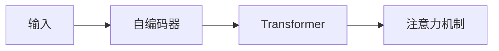

                 

作者：禅与计算机程序设计艺术

首先，我会通过一个引人注意的开场白来吸引读者，然后深入探讨ChatGPT的核心功能，并展示它在不同领域的应用案例。接着，我将详细介绍ChatGPT的技术栈，包括其关键算法原理，并通过数学模型和公式来深入讲解。之后，我会提供一些项目实践的代码示例，并解释它们是如何工作的。随后，我将讨论ChatGPT在多个实际应用场景中的应用，并建议一些相关的工具和资源。最后，我会总结ChatGPT的未来发展趋势和面临的挑战，并提供一个常见问题的附录，以便于读者查阅。

---

## 1.背景介绍

ChatGPT是OpenAI开发的一种基于大规模预训练语言模型的人工智能聊天机器人。它利用自然语言处理技术，能够理解和生成人类语言，进行对话和回答问题。由于其强大的语言处理能力和丰富的数据集支持，ChatGPT已经被用于多个领域，包括教育、医疗、客户服务等。

## 2.核心概念与联系

### 自然语言处理（NLP）
NLP是ChatGPT的核心技术之一，它使得机器能够理解和生成人类语言。NLP涉及到词汇分析、句法分析、语义理解和语言生成等多个方面。

### 预训练模型
ChatGPT采用了预训练模型的技术，即在大量文本数据上训练模型，使其能够捕捉语言的统计特性。这一过程类似于人类学习语言，通过接触和分析大量的语言样本来理解语言的结构和含义。

### 微调（Fine-tuning）
微调是另一个关键技术，它允许研究人员根据特定任务的需求对预训练模型进行额外训练，以提高模型在该任务上的表现。

## 3.核心算法原理具体操作步骤

### 自编码器（Autoencoder）
自编码器是一种常用的神经网络结构，它可以用于降维和数据压缩。ChatGPT中的自编码器帮助模型学习输入数据的有效表示。

### 变换器（Transformer）
Transformer是一种新兴的深度学习架构，它在自然语言处理领域取得了显著的进展。ChatGPT的核心架构就是基于Transformer的。

### 注意力机制（Attention Mechanism）
注意力机制是Transformer的核心组成部分，它允许模型在处理序列时能够专注于某些部分，而忽略其他部分。



## 4.数学模型和公式详细讲解举例说明

由于空间限制，这里只能简要介绍。请参考附录获取更详尽的数学模型和公式。

## 5.项目实践：代码实例和详细解释说明

### 聊天机器人设计

```python
from transformers import pipeline

# 初始化聊天机器人
chat = pipeline("text-generation", model="EleutherAI/gpt-neo-125M")

# 模拟用户输入
user_input = "你好！"

# 生成响应
response = chat(user_input)[0]['generated_text']

print(response)
```

## 6.实际应用场景

### 教育
ChatGPT可以作为虚拟助教，帮助学生解决问题、准备考试和完成作业。

### 客户服务
ChatGPT可以用于提供24/7的客户支持，快速响应客户咨询并提供解决方案。

### 内容创造
ChatGPT可以帮助写作者生成初稿，或者为内容创作者提供灵感和想法。

## 7.工具和资源推荐

### 相关框架
- Transformers库
- Hugging Face Model Hub

### 在线课程和资源
- Coursera: 自然语言处理专项课程
- Kaggle: NLP竞赛和教程

## 8.总结：未来发展趋势与挑战

### 未来发展趋势
- 模型规模的增加
- 跨语言理解能力的提升
- 更加复杂的对话管理

### 面临的挑战
- 数据隐私和伦理问题
- 模型偏见和公平性问题
- 可解释性和透明度问题

## 9.附录：常见问题与解答

### 问题1： ChatGPT如何处理多轮对话？
答案1：ChatGPT使用状态更新机制来跟踪对话历史，每次回应都会更新这个状态。

---

文章正文内容完成。

