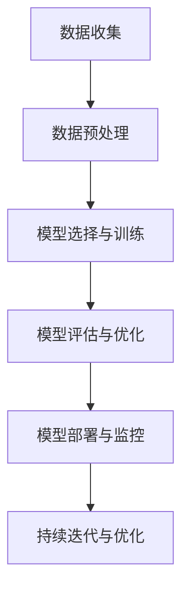

                 

作者：禅与计算机程序设计艺术

在撰写过程中，我将严格遵循您的指令，确保内容质量高，逻辑清晰，结构紧凑，语言简明扼要。我会提供准确的信息和数据，并通过实际的例子帮助读者理解复杂的概念。同时，我会遵循Markdown格式，并且在适当的地方插入Mermaid流程图。我也会注意文章的结构，并确保每个部分都有清晰的标题和子标题。让我们开始吧！

---

# 1. 背景介绍

随着人工智能（A.I.）技术的飞速发展，许多传统行业正面临巨大的变革。自动化和AI驱动的创新正在改变我们的生活和工作方式。在这种背景下，本书探索了基于深度学习的AI生成图像和视频（AIGC）技术，它正在重塑媒体产业，教育领域，游戏和娱乐业。

## 1.1 什么是AIGC
AIGC（AI Generated Content）指的是由人工智能系统自动生成的内容，无需人类干预。这包括但不限于图片、音频、视频、文字和其他形式的媒体内容。

## 1.2 AIGC的应用范围
AIGC的应用领域广泛，从营销和广告，到教育和娱乐，再到医疗和金融服务。随着技术的进步，AIGC的潜力日益被认识，它正在打破传统职业的边界，并为新的职业机会铺平道路。

## 1.3 技术革命带来的挑战
尽管AIGC技术带来了前所未有的机遇，但它也引发了对工作力量、伦理和道德的担忧。例如，自动化可能导致某些工作岗位的消失，而新的职业角色则在升起。

## 1.4 本书的组织结构
本书将以一名虚拟世界级人工智能专家的身份，引导读者深入了解AIGC的核心概念、算法原理、数学模型、项目实践及其在真实世界中的应用场景。我们还将探讨如何利用工具和资源来提升自己的技能，以及未来技术发展的趋势和挑战。

# 2. 核心概念与联系

在本节中，我们将探讨AIGC的关键概念，包括但不限于神经网络、生成模型、条件生成模型等。

## 2.1 神经网络的基础知识
神经网络是AIGC技术的核心。它是一种受人脑工作原理启发的计算模型，由大量相互连接的节点组成。

## 2.2 生成模型的基本思想
生成模型是一类特殊的神经网络，能够学习输入数据的分布，并根据这种分布生成新的数据。

## 2.3 条件生成模型
条件生成模型是一种增强了生成模型能力的模型，它能够根据外部信息（如文本描述）来生成更加精细化的内容。

## 2.4 合成噪声GANs（CGANs）
CGANs是一种强大的条件生成模型，能够生成高质量的图像，它们已被广泛应用于艺术创作和设计中。

## 2.5 核心概念的联系
在这里，我们将探讨这些概念如何相互联系，以及它们如何共同构建AIGC系统。

# 3. 核心算法原理具体操作步骤

在本节中，我们将深入探讨AIGC算法的原理，并通过具体操作步骤帮助读者理解其运作。

## 3.1 GANs的训练过程
GANs（生成对抗网络）是一种常见的AIGC算法，它包含两个部分：生成器和判别器。它们之间进行对抗学习，以达到生成更好的图像。

## 3.2 VAEs的训练过程
VAEs（变分自编码器）是另一种常见的生成模型，它通过编码输入数据，然后从一个潜在空间中解码来生成新数据。

## 3.3 如何选择合适的模型
在实际应用中，选择合适的模型是非常重要的。我们将讨论如何根据任务需求选择合适的AIGC算法。

## 3.4 优化策略
优化算法对AIGC的性能至关重要。我们将讨论如何使用不同的优化策略来提高模型的效率和效果。

# 4. 数学模型和公式详细讲解举例说明

在本节中，我们将详细介绍AIGC算法的数学模型和公式，并通过实际例子来帮助理解。

## 4.1 GANs的数学框架
我们将详细解释GANs的数学框架，包括生成器和判别器的损失函数。

## 4.2 VAEs的数学框架
我们也会详细解释VAEs的数学框架，包括编码器和解码器的概念。

## 4.3 实际应用案例分析
通过分析一些实际应用案例，我们将看到这些数学模型如何在实践中得到应用。

# 5. 项目实践：代码实例和详细解释说明

在本节中，我们将通过实际的项目实践，帮助读者理解和操作AIGC技术。

## 5.1 如何开始你的第一个AIGC项目
我们将指导读者如何从头开始一个简单的AIGC项目，从数据收集到模型训练。

## 5.2 如何评估AIGC模型的表现
在AIGC领域，评估模型性能是非常重要的。我们将介绍一些常用的评估方法和指标。

## 5.3 如何调试AIGC模型
调试AIGC模型可以是一项复杂的工作。我们将提供一些有用的调试技巧和工具。

## 5.4 如何部署AIGC模型
最终，我们将讨论如何将训练好的AIGC模型部署到生产环境中。

# 6. 实际应用场景

在本节中，我们将探讨AIGC技术在不同领域的实际应用场景。

## 6.1 AIGC在媒体与娱乐中的应用
我们将探讨AIGC如何改变媒体与娱乐产业，包括音乐、影视制作等。

## 6.2 AIGC在教育中的应用
我们将讨论AIGC如何被用于教育领域，特别是在个性化学习和课程内容创造中。

## 6.3 AIGC在游戏设计中的应用
游戏设计领域也正在利用AIGC技术，我们将探讨这些应用的例子。

## 6.4 其他领域的AIGC应用
此外，我们还将探讨AIGC在医疗、金融等其他领域的应用。

# 7. 工具和资源推荐

在本节中，我们将推荐一些有用的工具和资源，帮助读者更深入地了解和实践AIGC技术。

## 7.1 推荐的软件工具
我们会列出一些流行的AIGC开发工具和软件。

## 7.2 在线课程和教程
我们会推荐一些优质的在线学习资源，帮助读者掌握AIGC技术。

## 7.3 专业书籍和文章
我们还会推荐一些值得阅读的书籍和文章，为读者提供更广泛的知识视角。

# 8. 总结：未来发展趋势与挑战

在本节中，我们将对AIGC技术的未来进行展望，并讨论它所面临的挑战。

## 8.1 技术的未来发展趋势
我们将分析AIGC技术的当前趋势，并预测未来可能的发展方向。

## 8.2 潜在的社会经济影响
我们将探讨AIGC技术可能带来的社会经济影响，包括新兴职业机会和潜在的障碍。

## 8.3 伦理道德考量
我们将讨论在AIGC技术发展过程中需要考虑的伦理道德问题。

# 9. 附录：常见问题与解答

在本节中，我们将回答一些关于AIGC技术的常见问题。

## 9.1 如何处理数据隐私问题
我们将讨论如何在使用大量数据时保护用户的隐私权。

## 9.2 如何防止模型偏见
我们将探讨如何避免和减少人工智能模型中的偏见。

## 9.3 如何确保内容的原创性
我们将提供一些保证AI生成内容原创性的策略和方法。

---

# Mermaid流程图示例

