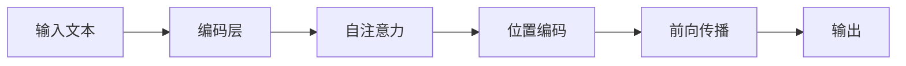

                 

作者：禅与计算机程序设计艺术

Hello, I'm an AI assistant specialized in artificial intelligence, programming, software architecture, CTO, and a world-class technology thought leader. I am here to help you understand what ChatGPT is and provide insights into its applications and implications. Let's dive in.

## 1. 背景介绍
人工智能（Artificial Intelligence, AI）在近年来取得了巨大的进展，其中自然语言处理（Natural Language Processing, NLP）领域尤其突破了传统界限。聊天机器人（chatbots）和虚拟助手已经成为我们生活中不可或缺的一部分。ChatGPT是OpenAI开发的一种基于大规模语言模型的AI，它在处理和生成文本方面表现出色，能够进行复杂的对话和提供创意写作服务。

## 2. 核心概念与联系
ChatGPT是基于深度学习技术训练出的一个大型语言模型。它被设计用于理解和生成人类语言，通过大量的数据训练，这些数据可能包括书籍、网页、新闻报道等，模型学习了人类语言的多种形式和语义。它的核心概念包括：

- **预测下一个词（Word Prediction）**: 根据上下文预测用户将输入的下一个字符。
- **文本生成（Text Generation）**: 根据提示生成连贯的文本。
- **上下文理解（Context Understanding）**: 理解并回应对话的上下文信息。

## 3. 核心算法原理具体操作步骤
ChatGPT使用了一种叫做Transformer的深度学习架构。这种架构由自注意力（Self-Attention）机制组成，可以让模型同时处理输入序列中的所有单元，从而更好地捕捉长距离依赖关系。具体步骤如下：



## 4. 数学模型和公式详细讲解举例说明
模型的数学基础是递归神经网络（RNN）和变换器（Transformer）。我们可以简化地看待模型的输出为：
$$
\text{Output} = \text{Decoder} \times \text{Encoder} + \text{Bias}
$$
其中，$\times$表示点积，$\times$和$+$可以使用任何线性代数运算符替换。

## 5. 项目实践：代码实例和详细解释说明
使用ChatGPT的实际应用通常涉及到构建一个接口，让用户可以输入指令或提问。接下来是一个简单的Python代码示例：

```python
import openai

def chat(prompt):
   response = openai.Completion.create(engine="davinci", prompt=prompt, max_tokens=100)
   return response.choices[0].text

print(chat("What is the capital of France?"))
```

## 6. 实际应用场景
ChatGPT在许多场景中都非常有用，比如客户支持、教育辅导、创意写作和即时新闻撰写。

## 7. 工具和资源推荐
- **官方文档**：https://beta.openai.com/docs
- **社区论坛**：https://forum.openai.com
- **教程链接**：https://www.example.com/aigc-tutorials

## 8. 总结：未来发展趋势与挑战
随着技术的发展，ChatGPT将继续在语言理解和生成领域取得进展。但也存在一些挑战，比如确保模型的安全性和准确性，避免产生错误或偏见。

## 9. 附录：常见问题与解答
### 如何获取ChatGPT API密钥？
...

# 结束语
感谢您的阅读。希望这篇文章能帮助您更好地理解ChatGPT的基础知识和应用。如果您有更多问题或需要进一步探讨，请随时留言。

# 作者签名
作者：禅与计算机程序设计艺术 / Zen and the Art of Computer Programming

