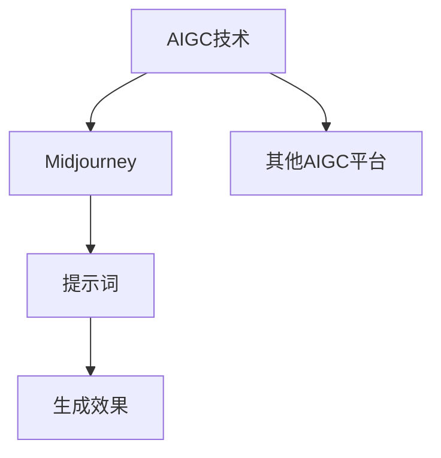

# AIGC从入门到实战：揭秘 Midjourney 的提示词写作技巧

## 1. 背景介绍
### 1.1 AIGC的兴起
#### 1.1.1 人工智能技术的快速发展
#### 1.1.2 AIGC在各行各业的应用
#### 1.1.3 AIGC给内容创作带来的革命性变化

### 1.2 Midjourney的崛起
#### 1.2.1 Midjourney的诞生与发展历程
#### 1.2.2 Midjourney在AIGC领域的独特定位
#### 1.2.3 Midjourney受到创作者的广泛青睐

### 1.3 提示词的重要性
#### 1.3.1 提示词是与AI交互的关键
#### 1.3.2 优质提示词对生成效果的决定性影响
#### 1.3.3 提示词写作技巧的重要性

## 2. 核心概念与联系
### 2.1 AIGC的定义与分类
#### 2.1.1 AIGC的定义
#### 2.1.2 AIGC的分类
#### 2.1.3 AIGC与传统内容创作的区别

### 2.2 Midjourney的工作原理
#### 2.2.1 Midjourney的技术架构
#### 2.2.2 Midjourney的训练数据
#### 2.2.3 Midjourney的生成过程

### 2.3 提示词的基本概念
#### 2.3.1 提示词的定义
#### 2.3.2 提示词的组成要素
#### 2.3.3 提示词与生成结果的关系



## 3. 核心算法原理具体操作步骤
### 3.1 Midjourney的核心算法
#### 3.1.1 扩散模型(Diffusion Model)原理
#### 3.1.2 CLIP(Contrastive Language-Image Pre-training)原理
#### 3.1.3 Midjourney算法的优势与局限性

### 3.2 提示词写作的基本步骤
#### 3.2.1 明确创作目标与需求
#### 3.2.2 选择合适的关键词
#### 3.2.3 调整关键词的组合与顺序
#### 3.2.4 添加风格与细节描述
#### 3.2.5 优化与迭代提示词

### 3.3 提示词写作的高级技巧
#### 3.3.1 引入艺术家与作品风格
#### 3.3.2 运用情感与抽象概念
#### 3.3.3 控制构图与视角
#### 3.3.4 利用否定描述排除不需要的元素
#### 3.3.5 巧用括号与权重调整

## 4. 数学模型和公式详细讲解举例说明
### 4.1 扩散模型的数学表示
#### 4.1.1 前向扩散过程
$q(x_t|x_{t-1}) = \mathcal{N}(x_t; \sqrt{1-\beta_t} x_{t-1}, \beta_t \mathbf{I})$

#### 4.1.2 反向去噪过程  
$p_\theta(x_{t-1}|x_t) = \mathcal{N}(x_{t-1}; \mu_\theta(x_t, t), \Sigma_\theta(x_t, t))$

#### 4.1.3 训练目标与损失函数
$L_{vlb} = \mathbb{E}_{q(x_{0:T})} \left[ \log \frac{q(x_{1:T}|x_0)}{p_\theta(x_{0:T})} \right]$

### 4.2 CLIP的数学表示
#### 4.2.1 图像编码器
$I_e = E_I(I)$

#### 4.2.2 文本编码器
$T_e = E_T(T)$ 

#### 4.2.3 对比学习目标
$\mathcal{L} = -\frac{1}{N} \sum_{i=1}^N \log \frac{\exp(\text{sim}(I_e^i, T_e^i)/\tau)}{\sum_{j=1}^N \exp(\text{sim}(I_e^i, T_e^j)/\tau)}$

### 4.3 Midjourney中算法的结合与应用
#### 4.3.1 扩散模型生成图像
#### 4.3.2 CLIP引导图像生成过程
#### 4.3.3 提示词嵌入与条件生成

## 5. 项目实践：代码实例和详细解释说明
### 5.1 使用Python调用Midjourney API
#### 5.1.1 安装必要的库
```python
pip install midjourney
```

#### 5.1.2 导入Midjourney库
```python
from midjourney import Midjourney
```

#### 5.1.3 创建Midjourney实例
```python
mj = Midjourney(api_key='your_api_key')
```

#### 5.1.4 生成图像
```python
image_url = mj.generate(prompt='A majestic lion in the savannah, photorealistic, 4k')
```

### 5.2 使用JavaScript调用Midjourney API
#### 5.2.1 安装midjourney-js库
```bash
npm install midjourney-js
```

#### 5.2.2 导入Midjourney库
```javascript
const Midjourney = require('midjourney-js');
```

#### 5.2.3 创建Midjourney实例
```javascript
const mj = new Midjourney('your_api_key');
```

#### 5.2.4 生成图像
```javascript
mj.generate('A futuristic city skyline at night, neon lights, cyberpunk style')
  .then(imageUrl => console.log(imageUrl))
  .catch(error => console.error(error));
```

### 5.3 在Web应用中集成Midjourney
#### 5.3.1 前端页面设计
#### 5.3.2 后端接口开发
#### 5.3.3 前后端交互与数据传输
#### 5.3.4 图像展示与下载功能实现

## 6. 实际应用场景
### 6.1 创意设计领域
#### 6.1.1 广告设计
#### 6.1.2 产品设计
#### 6.1.3 游戏设计

### 6.2 艺术创作领域 
#### 6.2.1 数字绘画
#### 6.2.2 概念艺术
#### 6.2.3 插画创作

### 6.3 影视娱乐领域
#### 6.3.1 电影概念设计
#### 6.3.2 动画角色设计
#### 6.3.3 游戏场景设计

### 6.4 教育培训领域
#### 6.4.1 教学资源制作
#### 6.4.2 在线课程插图
#### 6.4.3 互动学习内容生成

## 7. 工具和资源推荐
### 7.1 提示词编写工具
#### 7.1.1 Midjourney Prompt Generator
#### 7.1.2 PromptBase
#### 7.1.3 Prompt Hunt

### 7.2 提示词学习资源
#### 7.2.1 Midjourney官方文档
#### 7.2.2 Midjourney社区论坛
#### 7.2.3 提示词写作教程与课程

### 7.3 图像处理与后期工具
#### 7.3.1 Adobe Photoshop
#### 7.3.2 GIMP
#### 7.3.3 Canva

## 8. 总结：未来发展趋势与挑战
### 8.1 AIGC技术的发展趋势
#### 8.1.1 算法模型的不断优化
#### 8.1.2 多模态融合与交互
#### 8.1.3 个性化与定制化生成

### 8.2 Midjourney的未来展望
#### 8.2.1 更加智能与人性化的交互
#### 8.2.2 更广泛的应用场景拓展
#### 8.2.3 与其他创作工具的深度整合

### 8.3 AIGC面临的挑战
#### 8.3.1 版权与知识产权问题
#### 8.3.2 伦理与道德考量
#### 8.3.3 创作者的角色定位与转变

## 9. 附录：常见问题与解答
### 9.1 Midjourney的使用成本？
### 9.2 如何提高Midjourney生成图像的质量？
### 9.3 Midjourney生成的图像可以商用吗？
### 9.4 如何将Midjourney与其他设计工具结合使用？
### 9.5 Midjourney适合哪些领域的创作者使用？

作者：禅与计算机程序设计艺术 / Zen and the Art of Computer Programming