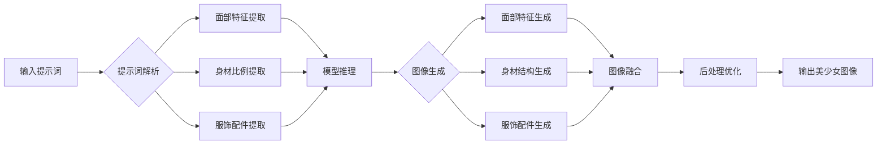

# AIGC从入门到实战：绘制美丽小姐姐的提示词写作技巧

## 1. 背景介绍
### 1.1 AIGC的兴起与发展
#### 1.1.1 AIGC的定义与内涵
#### 1.1.2 AIGC技术的发展历程
#### 1.1.3 AIGC在各领域的应用现状

### 1.2 绘制美丽小姐姐的需求分析
#### 1.2.1 二次元美少女的审美特点
#### 1.2.2 AIGC在二次元领域的应用潜力
#### 1.2.3 提示词在AIGC绘图中的重要性

## 2. 核心概念与联系
### 2.1 AIGC的核心概念
#### 2.1.1 扩散模型 Diffusion Model
#### 2.1.2 对抗生成网络 GAN
#### 2.1.3 变分自编码器 VAE 

### 2.2 提示词与AIGC的关系
#### 2.2.1 提示词在AIGC中的作用机制
#### 2.2.2 提示词与生成图像质量的关联
#### 2.2.3 提示词优化对AIGC效果的影响

### 2.3 AIGC绘制美少女的关键要素
#### 2.3.1 二次元美少女的脸部特征
#### 2.3.2 二次元美少女的身材比例
#### 2.3.3 二次元美少女的服饰与配件

## 3. 核心算法原理具体操作步骤
### 3.1 基于扩散模型的AIGC绘图流程
#### 3.1.1 数据预处理与增强
#### 3.1.2 模型训练与优化
#### 3.1.3 图像生成与后处理

### 3.2 提示词的编写技巧与优化策略  
#### 3.2.1 提示词的基本语法与格式
#### 3.2.2 提示词的关键信息提取与组织
#### 3.2.3 提示词的迭代优化与测试

### 3.3 美少女绘制的提示词实例解析
#### 3.3.1 面部特征的提示词描述
#### 3.3.2 身材比例的提示词刻画
#### 3.3.3 服饰配件的提示词表达

## 4. 数学模型和公式详细讲解举例说明
### 4.1 扩散模型的数学原理
#### 4.1.1 前向扩散过程的数学表示
$$ q(x_t|x_{t-1}) = \mathcal{N}(x_t; \sqrt{1-\beta_t} x_{t-1}, \beta_t \mathbf{I}) $$
#### 4.1.2 逆向去噪过程的数学表示  
$$ p_\theta(x_{t-1}|x_t) = \mathcal{N}(x_{t-1}; \mu_\theta(x_t, t), \Sigma_\theta(x_t, t)) $$
#### 4.1.3 损失函数的数学定义
$$ L_{vlb} = \mathbb{E}_{q(x_{0:T})} \left[ \log \frac{q(x_{1:T}|x_0)}{p_\theta(x_{0:T})} \right] $$

### 4.2 GAN的数学原理
#### 4.2.1 生成器与判别器的博弈过程
$$ \min_G \max_D V(D,G) = \mathbb{E}_{x \sim p_{data}(x)}[\log D(x)] + \mathbb{E}_{z \sim p_z(z)}[\log (1 - D(G(z)))] $$
#### 4.2.2 Wasserstein GAN的改进
$$ W(p_r,p_g) = \inf_{\gamma \in \Pi(p_r,p_g)} \mathbb{E}_{(x,y) \sim \gamma}[\| x-y \|] $$
#### 4.2.3 条件GAN的数学表示
$$ \min_G \max_D V(D,G) = \mathbb{E}_{x \sim p_{data}(x)}[\log D(x|y)] + \mathbb{E}_{z \sim p_z(z)}[\log (1 - D(G(z|y)))] $$

### 4.3 VAE的数学原理
#### 4.3.1 编码器与解码器的数学表示
$$ q_\phi(z|x) = \mathcal{N}(z; \mu_\phi(x), \sigma^2_\phi(x) \mathbf{I}) $$
$$ p_\theta(x|z) = \mathcal{N}(x; \mu_\theta(z), \sigma^2_\theta(z) \mathbf{I}) $$
#### 4.3.2 ELBO损失函数的推导
$$ \log p(x) \ge \mathbb{E}_{q_\phi(z|x)}[\log p_\theta(x|z)] - D_{KL}(q_\phi(z|x) \| p(z)) $$
#### 4.3.3 潜在变量采样的重参数化技巧
$$ z = \mu_\phi(x) + \sigma_\phi(x) \odot \epsilon, \quad \epsilon \sim \mathcal{N}(0, \mathbf{I}) $$

## 5. 项目实践：代码实例和详细解释说明
### 5.1 基于Stable Diffusion的AIGC绘图实践
#### 5.1.1 环境配置与依赖安装
```bash
pip install torch torchvision torchaudio
pip install diffusers transformers accelerate
```
#### 5.1.2 加载预训练模型
```python
from diffusers import StableDiffusionPipeline

model_id = "CompVis/stable-diffusion-v1-4"
pipe = StableDiffusionPipeline.from_pretrained(model_id, torch_dtype=torch.float16)  
pipe = pipe.to("cuda")
```
#### 5.1.3 提示词编写与图像生成
```python
prompt = "a beautiful anime girl, big eyes, long hair, cute face, school uniform, cherry blossom background, highly detailed, digital painting, artstation, concept art, smooth, sharp focus, illustration"

image = pipe(prompt, guidance_scale=7.5).images[0]  
image.save("anime_girl.png")
```

### 5.2 提示词优化与迭代实验
#### 5.2.1 面部特征的提示词优化
```python
# 初始提示词
prompt_v1 = "anime girl, big eyes, long hair" 

# 优化后的提示词
prompt_v2 = "anime girl, huge shimmering eyes, long flowing hair, delicate features, rosy cheeks, glossy lips"
```
#### 5.2.2 服饰细节的提示词丰富
```python
# 初始提示词
prompt_v1 = "anime girl, school uniform"

# 优化后的提示词  
prompt_v2 = "anime girl, wearing sailor school uniform, pleated short skirt, striped tie, cute emblem, detailed fabric texture"
```
#### 5.2.3 背景场景的提示词描述
```python
# 初始提示词
prompt_v1 = "anime girl, cherry blossom"

# 优化后的提示词
prompt_v2 = "anime girl, standing in the middle of a blooming cherry blossom garden, petals floating in the air, dreamy atmosphere, soft lighting"  
```

### 5.3 AIGC绘图提示词的通用模板
#### 5.3.1 人物描述模板
```
[人物身份], [性别], [年龄段], [身材特点], [面部特征], [发型], [表情], [肤色], [服装], [配饰], [姿势], [视角], [光线], [质感], [艺术风格]
```
#### 5.3.2 场景描述模板
```
[场景名称], [布局结构], [主要元素], [细节描述], [天气], [时间], [光照], [色调], [镜头视角], [艺术风格], [渲染质量]
```
#### 5.3.3 艺术风格模板
```
[艺术流派], [艺术家], [创作媒介], [色彩风格], [构图方式], [笔触特点], [光影处理], [细节程度], [情感表达]
```

## 6. 实际应用场景
### 6.1 游戏行业中的角色设计
#### 6.1.1 快速生成多样化的游戏角色原型
#### 6.1.2 辅助游戏美术设计师的创作灵感
#### 6.1.3 降低游戏角色设计的时间与成本

### 6.2 动漫与插画领域的创作辅助
#### 6.2.1 为动漫原画师提供创作参考
#### 6.2.2 快速生成不同风格的人物与场景
#### 6.2.3 辅助插画创作的构图与配色

### 6.3 虚拟主播与数字人行业的应用 
#### 6.3.1 快速生成虚拟主播的原型设计
#### 6.3.2 辅助数字人形象的多样化创建
#### 6.3.3 降低虚拟形象设计的门槛与成本

## 7. 工具和资源推荐
### 7.1 AIGC绘图工具
#### 7.1.1 Stable Diffusion WebUI
#### 7.1.2 NovelAI
#### 7.1.3 Midjourney

### 7.2 提示词优化工具
#### 7.2.1 Prompt Generator
#### 7.2.2 CLIP Interrogator
#### 7.2.3 Prompt Parrot

### 7.3 AIGC学习资源 
#### 7.3.1 Hugging Face Diffusers文档
#### 7.3.2 Stable Diffusion 官方教程
#### 7.3.3 AIGC论文与研究报告

## 8. 总结：未来发展趋势与挑战
### 8.1 AIGC技术的发展趋势
#### 8.1.1 模型性能的不断提升
#### 8.1.2 多模态融合的探索方向
#### 8.1.3 个性化定制的发展潜力

### 8.2 AIGC面临的挑战
#### 8.2.1 版权与伦理问题
#### 8.2.2 数据偏见与公平性
#### 8.2.3 艺术创造力的边界探讨

### 8.3 AIGC的未来展望
#### 8.3.1 与传统艺术创作的协同发展  
#### 8.3.2 赋能更广泛领域的内容生成
#### 8.3.3 推动艺术创新与文化多样性

## 9. 附录：常见问题与解答
### 9.1 提示词的撰写有哪些技巧？
### 9.2 如何提高AIGC生成图像的质量？
### 9.3 AIGC绘图对艺术创作有何影响？
### 9.4 如何平衡提示词的描述与艺术创造力？
### 9.5 AIGC生成的作品是否涉及版权问题？

作者：禅与计算机程序设计艺术 / Zen and the Art of Computer Programming

## Mermaid 流程图
下面是 AIGC 绘制美少女的核心流程图，使用 Mermaid 绘制：



以上是一篇关于 AIGC 从入门到实战，介绍如何通过编写优质的提示词来生成美丽的二次元小姐姐图像的技术博客。文章从 AIGC 的背景介绍出发，阐述了其核心概念与关键技术，并详细讲解了提示词编写的算法原理和实践案例。同时，文章还总结了 AIGC 在游戏、动漫、虚拟主播等领域的实际应用场景，并展望了其未来的发展趋势与挑战。

希望这篇文章能为读者提供 AIGC 绘图的入门指南和实用技巧，帮助大家利用先进的 AI 技术创作出精美的二次元美少女形象。让我们携手探索 AIGC 的无限可能，为二次元世界注入更多的创意和活力！