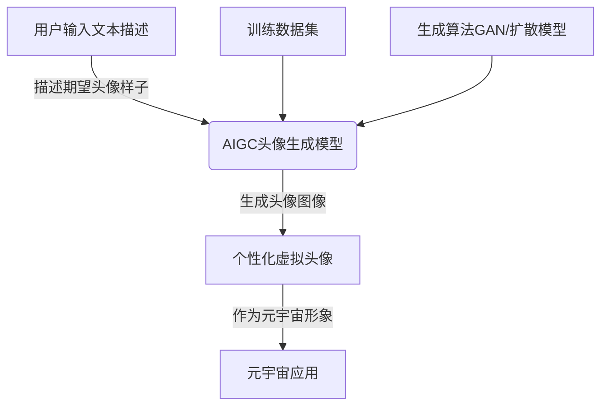
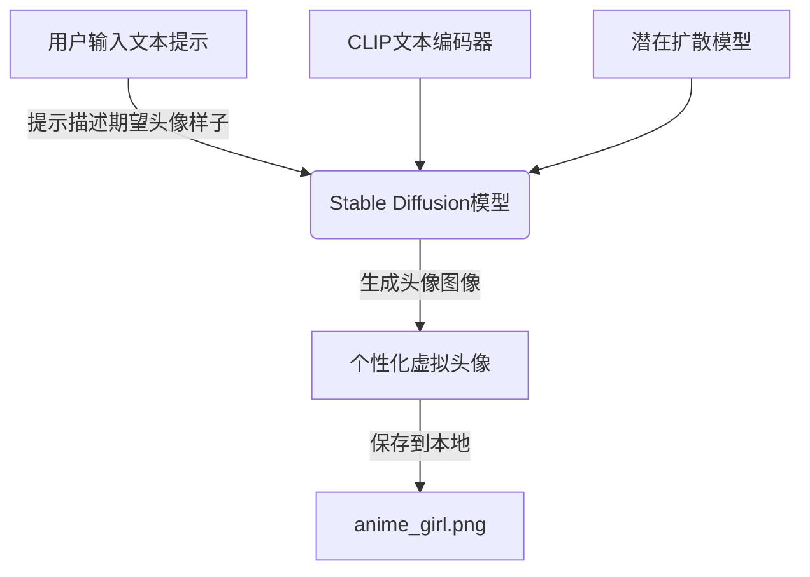

# AIGC从入门到实战：萌版头像绘制秘诀，自建你的元宇宙形象

## 1. 背景介绍

### 1.1 元宇宙的兴起

元宇宙(Metaverse)是一个集合了虚拟现实(VR)、增强现实(AR)、人工智能(AI)等多种新兴技术的虚拟世界。在这个数字化的平行宇宙中,人们可以通过自己的虚拟化身(Avatar)进行社交、工作、娱乐等多种活动。随着科技的不断发展,元宇宙正在逐渐走近我们的生活。

### 1.2 虚拟形象的重要性

在元宇宙中,每个人都需要一个独特的虚拟形象来代表自己。这个形象不仅是你在虚拟世界中的视觉呈现,也是你的数字身份和个人品牌的象征。一个吸引人且与众不同的虚拟形象,可以让你在元宇宙中脱颖而出,增强存在感和影响力。

### 1.3 AIGC技术的兴起

人工智能生成内容(AIGC)技术的兴起,为创建个性化虚拟形象提供了新的可能性。通过AIGC模型,用户可以根据自己的喜好,生成独一无二的虚拟头像,从而打造属于自己的元宇宙形象。

## 2. 核心概念与联系

### 2.1 生成式对抗网络(GAN)

生成式对抗网络(Generative Adversarial Networks, GAN)是一种深度学习模型,由两个神经网络组成:生成器(Generator)和判别器(Discriminator)。生成器的目标是生成逼真的数据样本,而判别器的目标是区分真实数据和生成器生成的数据。通过两个网络的对抗训练,GAN可以生成高质量的图像、音频等数据。

GAN是AIGC头像生成的核心技术之一,许多头像生成模型都是基于GAN的变体或改进算法。

### 2.2 扩散模型(Diffusion Models)

扩散模型是另一种用于生成图像的深度学习模型。它通过一系列扩散(噪声注入)和反扩散(去噪)步骤,从纯噪声中生成图像。与GAN相比,扩散模型在生成高质量图像方面表现更加出色,并且训练更加稳定。

目前,许多AIGC头像生成模型都采用了扩散模型或其变体,如Stable Diffusion、DALL-E 2等。

### 2.3 文本到图像生成(Text-to-Image Generation)

文本到图像生成是AIGC技术的一个重要应用场景。用户输入一段文本描述,模型就可以根据这些描述生成对应的图像。这种技术可以应用于虚拟头像生成,用户只需描述自己期望的头像样子,模型就能生成符合要求的个性化头像。

许多AIGC头像生成模型都支持文本到图像生成功能,如Stable Diffusion、DALL-E 2等。

### 2.4 Mermaid流程图



上图展示了AIGC头像生成的核心流程。用户输入文本描述期望的头像样子,AIGC头像生成模型基于训练数据集和生成算法(如GAN或扩散模型)生成符合要求的个性化虚拟头像,这个头像就可以作为用户在元宇宙应用中的虚拟形象。

## 3. 核心算法原理具体操作步骤

### 3.1 生成式对抗网络(GAN)原理

GAN由生成器(Generator)和判别器(Discriminator)两个神经网络组成。

1. 生成器的目标是生成逼真的数据样本(如图像),以欺骗判别器。
2. 判别器的目标是区分生成器生成的数据和真实数据。

生成器和判别器通过对抗训练不断提高,最终达到一种动态平衡,生成器生成的数据无法被判别器区分。

GAN训练步骤:

1. 初始化生成器和判别器的权重。
2. 从真实数据集中采样一批真实数据。
3. 生成器生成一批假数据。
4. 判别器分别对真实数据和假数据进行判别,计算损失函数。
5. 反向传播,更新判别器权重,使其能更好地区分真假数据。
6. 反向传播,更新生成器权重,使其能生成更逼真的数据。
7. 重复3-6步骤,直到达到收敛条件。

### 3.2 扩散模型(Diffusion Models)原理

扩散模型通过一系列扩散(噪声注入)和反扩散(去噪)步骤从纯噪声中生成图像。

1. 扩散(Diffusion)过程:将高斯噪声逐步注入到图像中,直到图像完全变为噪声。
2. 反扩散(Reverse Diffusion)过程:从纯噪声开始,逐步去除噪声,重建原始图像。

反扩散过程是一个条件生成任务,模型需要学习从当前去噪状态到下一个去噪状态的映射,直到生成最终图像。

扩散模型训练步骤:

1. 从训练数据集中采样一批图像。
2. 对每个图像进行扩散过程,生成不同程度的噪声图像。
3. 训练反扩散模型,输入当前噪声图像,预测下一个去噪状态。
4. 计算预测结果与真实去噪状态的损失函数。
5. 反向传播,更新模型权重,使其能更好地预测去噪状态。
6. 重复2-5步骤,直到模型收敛。

### 3.3 文本到图像生成原理

文本到图像生成模型需要将文本描述和图像数据对应起来,学习文本和图像之间的映射关系。

1. 文本编码器(Text Encoder):将输入文本编码为向量表示。
2. 图像生成器(Image Generator):基于文本向量和随机噪声,生成对应的图像。

常见的文本到图像生成模型包括:

- DALL-E: 使用Transformer编码文本,结合扩散模型生成图像。
- Stable Diffusion: 使用CLIP文本编码器,结合潜在扩散模型生成图像。
- Imagen: 谷歌提出的大型文本到图像生成模型,使用专门设计的文本视觉编码器。

## 4. 数学模型和公式详细讲解举例说明

### 4.1 GAN损失函数

GAN的训练目标是最小化生成器和判别器之间的对抗损失函数。常用的损失函数包括:

1. 最小二乘损失(Least Squares Loss):

$$\min_G \max_D V(D, G) = \mathbb{E}_{x\sim p_\text{data}(x)}\big[(D(x)-1)^2\big] + \mathbb{E}_{z\sim p_z(z)}\big[D(G(z))^2\big]$$

2. 交叉熵损失(Cross Entropy Loss):

$$\min_G \max_D V(D, G) = \mathbb{E}_{x\sim p_\text{data}(x)}\big[\log D(x)\big] + \mathbb{E}_{z\sim p_z(z)}\big[\log(1-D(G(z)))\big]$$

其中,$p_\text{data}(x)$是真实数据分布,$p_z(z)$是生成器输入噪声的分布,$G(z)$是生成器生成的假数据。

### 4.2 扩散模型损失函数

扩散模型的训练目标是最小化反扩散过程中的去噪损失函数。常用的损失函数包括:

1. 均方误差损失(Mean Squared Error Loss):

$$\mathcal{L}_\text{MSE} = \mathbb{E}_{x_0, \epsilon}\big[\|x_0 - \epsilon - \epsilon_\theta(x_t, t)\|^2\big]$$

2. 极大似然损失(Maximum Likelihood Loss):

$$\mathcal{L}_\text{ML} = -\log p_\theta(x_0|x_t)$$

其中,$x_0$是原始图像,$x_t$是扩散过程中的噪声图像,$\epsilon$是扩散过程中注入的噪声,$\epsilon_\theta(x_t, t)$是模型预测的去噪结果。

### 4.3 示例:Stable Diffusion

Stable Diffusion是一种基于扩散模型的文本到图像生成模型,它使用CLIP文本编码器将文本描述编码为向量,然后结合潜在扩散模型生成图像。

潜在扩散模型的损失函数如下:

$$\mathcal{L}_\text{simple} = \mathbb{E}_{x_0, \epsilon}\big[\|x_0 - \epsilon - \epsilon_\theta(\sqrt{\bar{\alpha}_t}x_0 + \sqrt{1-\bar{\alpha}_t}\epsilon, t)\|^2\big]$$

其中,$\bar{\alpha}_t$是扩散过程中的方差系数,$\epsilon_\theta$是模型预测的去噪结果。

通过最小化这个损失函数,模型可以学习从噪声图像中恢复原始图像。结合CLIP文本编码器,Stable Diffusion就能根据文本描述生成对应的图像。

## 5. 项目实践:代码实例和详细解释说明

### 5.1 使用Stable Diffusion生成头像

Stable Diffusion是一个开源的文本到图像生成模型,可以用于生成个性化虚拟头像。下面是使用Python和Hugging Face的Diffusers库生成头像的代码示例:

```python
from diffusers import StableDiffusionPipeline
import torch

# 加载Stable Diffusion模型
pipe = StableDiffusionPipeline.from_pretrained("runwayml/stable-diffusion-v1-5", torch_dtype=torch.float16)

# 设置生成参数
prompt = "A cute anime girl with pink hair, wearing a school uniform, smiling"
guidance_scale = 7.5
num_inference_steps = 50

# 生成图像
image = pipe(prompt, guidance_scale=guidance_scale, num_inference_steps=num_inference_steps)["sample"][0]

# 保存图像
image.save("anime_girl.png")
```

1. 首先,我们加载预训练的Stable Diffusion模型。
2. 设置生成参数,包括文本提示(prompt)、指导强度(guidance_scale)和推理步数(num_inference_steps)。
3. 调用模型的`__call__`方法,传入文本提示和生成参数,生成对应的图像。
4. 将生成的图像保存到本地文件。

通过修改文本提示,你可以生成各种风格的个性化虚拟头像。

### 5.2 使用Mermaid流程图展示生成过程



上图展示了使用Stable Diffusion生成个性化虚拟头像的流程:

1. 用户输入文本提示,描述期望的头像样子。
2. Stable Diffusion模型将文本提示输入CLIP文本编码器,编码为向量表示。
3. 潜在扩散模型基于文本向量和随机噪声,生成对应的头像图像。
4. 生成的头像图像保存到本地文件`anime_girl.png`。

## 6. 实际应用场景

### 6.1 元宇宙虚拟形象

AIGC头像生成技术最直接的应用场景就是为用户创建元宇宙虚拟形象。用户可以根据自己的喜好,通过文本描述生成独一无二的虚拟头像,作为自己在元宇宙中的数字化身。这种个性化的虚拟形象不仅能增强用户的身份认同感,也有助于提升用户在元宇宙中的存在感和影响力。

### 6.2 虚拟影视制作

在影视制作领域,AIGC头像生成技术可以用于创建虚拟角色和动画人物。通过文本描述,制作团队可以快速生成各种风格的虚拟角色头像,节省了传统手工绘制的时间和成本。这种技术还可以用于生成背景人物、群众等,为影