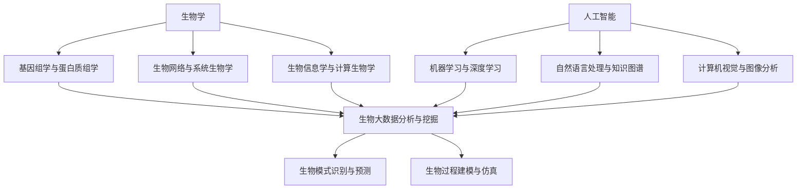

# AI与生物学交叉原理与代码实战案例讲解

## 1. 背景介绍
### 1.1 AI与生物学的交叉融合
#### 1.1.1 AI技术在生物学中的应用现状
#### 1.1.2 生物学领域为AI技术带来的新机遇与挑战
### 1.2 AI与生物学交叉研究的意义
#### 1.2.1 推动生物学基础研究的发展
#### 1.2.2 加速生物医学和健康领域的突破
#### 1.2.3 为AI技术的进步提供新思路

## 2. 核心概念与联系
### 2.1 生物学中的关键概念
#### 2.1.1 基因组学与蛋白质组学
#### 2.1.2 生物网络与系统生物学
#### 2.1.3 生物信息学与计算生物学
### 2.2 AI领域的核心技术
#### 2.2.1 机器学习与深度学习
#### 2.2.2 自然语言处理与知识图谱
#### 2.2.3 计算机视觉与图像分析
### 2.3 AI与生物学的交叉融合点
#### 2.3.1 生物大数据分析与挖掘
#### 2.3.2 生物模式识别与预测
#### 2.3.3 生物过程建模与仿真



## 3. 核心算法原理具体操作步骤
### 3.1 卷积神经网络(CNN)在生物图像分析中的应用
#### 3.1.1 CNN的基本原理与架构
#### 3.1.2 CNN在细胞图像分割中的应用步骤
#### 3.1.3 CNN在蛋白质结构预测中的应用步骤
### 3.2 循环神经网络(RNN)在生物序列分析中的应用  
#### 3.2.1 RNN的基本原理与架构
#### 3.2.2 RNN在基因表达谱分析中的应用步骤
#### 3.2.3 RNN在蛋白质功能预测中的应用步骤
### 3.3 图神经网络(GNN)在生物网络分析中的应用
#### 3.3.1 GNN的基本原理与架构
#### 3.3.2 GNN在蛋白质相互作用网络分析中的应用步骤 
#### 3.3.3 GNN在药物-靶点相互作用预测中的应用步骤

## 4. 数学模型和公式详细讲解举例说明
### 4.1 CNN中的数学模型与公式
#### 4.1.1 卷积层的数学表示与计算过程
$$ h_j^l = f(\sum_i w_{i,j}^l * h_i^{l-1} + b_j^l) $$
其中，$h_j^l$表示第$l$层第$j$个神经元的输出，$w_{i,j}^l$表示第$l-1$层第$i$个神经元到第$l$层第$j$个神经元的权重，$b_j^l$表示第$l$层第$j$个神经元的偏置，$f$表示激活函数，$*$表示卷积操作。

#### 4.1.2 池化层的数学表示与计算过程  
$$ h_j^l = \text{pooling}(h_i^{l-1}), i \in R_j $$
其中，$h_j^l$表示第$l$层第$j$个神经元的输出，$h_i^{l-1}$表示第$l-1$层第$i$个神经元的输出，$R_j$表示与第$l$层第$j$个神经元相连的第$l-1$层神经元的集合，$\text{pooling}$表示池化操作，常见的有最大池化和平均池化。

### 4.2 RNN中的数学模型与公式
#### 4.2.1 基本RNN的数学表示与计算过程
$$ h_t = f(W_{hh}h_{t-1} + W_{xh}x_t + b_h) $$
$$ y_t = W_{hy}h_t + b_y $$
其中，$h_t$表示第$t$个时间步的隐藏状态，$x_t$表示第$t$个时间步的输入，$y_t$表示第$t$个时间步的输出，$W_{hh}$、$W_{xh}$、$W_{hy}$分别表示隐藏状态到隐藏状态、输入到隐藏状态、隐藏状态到输出的权重矩阵，$b_h$和$b_y$分别表示隐藏状态和输出的偏置向量，$f$表示激活函数。

#### 4.2.2 LSTM的数学表示与计算过程
$$ f_t = \sigma(W_f \cdot [h_{t-1}, x_t] + b_f) $$
$$ i_t = \sigma(W_i \cdot [h_{t-1}, x_t] + b_i) $$  
$$ \tilde{C}_t = \tanh(W_C \cdot [h_{t-1}, x_t] + b_C) $$
$$ C_t = f_t * C_{t-1} + i_t * \tilde{C}_t $$
$$ o_t = \sigma(W_o \cdot [h_{t-1}, x_t] + b_o) $$
$$ h_t = o_t * \tanh(C_t) $$
其中，$f_t$、$i_t$、$o_t$分别表示遗忘门、输入门和输出门，$\tilde{C}_t$表示候选记忆细胞状态，$C_t$表示记忆细胞状态，$h_t$表示隐藏状态，$W_f$、$W_i$、$W_C$、$W_o$分别表示遗忘门、输入门、候选记忆细胞和输出门的权重矩阵，$b_f$、$b_i$、$b_C$、$b_o$分别表示对应的偏置向量，$\sigma$表示sigmoid激活函数，$\tanh$表示双曲正切激活函数，$*$表示逐元素相乘。

### 4.3 GNN中的数学模型与公式
#### 4.3.1 图卷积网络(GCN)的数学表示与计算过程
$$ H^{(l+1)} = \sigma(\tilde{D}^{-\frac{1}{2}} \tilde{A} \tilde{D}^{-\frac{1}{2}} H^{(l)} W^{(l)}) $$
其中，$H^{(l)}$表示第$l$层的节点特征矩阵，$\tilde{A} = A + I_N$表示加入自环的邻接矩阵，$\tilde{D}_{ii} = \sum_j \tilde{A}_{ij}$表示度矩阵，$W^{(l)}$表示第$l$层的权重矩阵，$\sigma$表示激活函数。

#### 4.3.2 图注意力网络(GAT)的数学表示与计算过程
$$ e_{ij}^{(l)} = a^T [W h_i^{(l)} || W h_j^{(l)}] $$
$$ \alpha_{ij}^{(l)} = \text{softmax}_j(e_{ij}^{(l)}) = \frac{\exp(e_{ij}^{(l)})}{\sum_{k \in \mathcal{N}_i} \exp(e_{ik}^{(l)})} $$
$$ h_i^{(l+1)} = \sigma(\sum_{j \in \mathcal{N}_i} \alpha_{ij}^{(l)} W h_j^{(l)}) $$
其中，$h_i^{(l)}$表示第$l$层第$i$个节点的特征向量，$W$表示线性变换的权重矩阵，$a$表示注意力机制的参数向量，$\mathcal{N}_i$表示节点$i$的邻居节点集合，$\alpha_{ij}^{(l)}$表示节点$i$对节点$j$的注意力权重，$\sigma$表示激活函数，$||$表示向量拼接。

## 5. 项目实践：代码实例和详细解释说明
### 5.1 使用CNN进行细胞图像分割
```python
import tensorflow as tf

# 定义CNN模型
model = tf.keras.Sequential([
    tf.keras.layers.Conv2D(32, (3, 3), activation='relu', input_shape=(256, 256, 3)),
    tf.keras.layers.MaxPooling2D((2, 2)),
    tf.keras.layers.Conv2D(64, (3, 3), activation='relu'),
    tf.keras.layers.MaxPooling2D((2, 2)),
    tf.keras.layers.Conv2D(64, (3, 3), activation='relu'),
    tf.keras.layers.Flatten(),
    tf.keras.layers.Dense(64, activation='relu'),
    tf.keras.layers.Dense(10)
])

# 编译模型
model.compile(optimizer='adam',
              loss=tf.keras.losses.SparseCategoricalCrossentropy(from_logits=True),
              metrics=['accuracy'])

# 训练模型
history = model.fit(train_images, train_labels, epochs=10, 
                    validation_data=(test_images, test_labels))

# 评估模型
test_loss, test_acc = model.evaluate(test_images,  test_labels, verbose=2)
print('\nTest accuracy:', test_acc)
```
以上代码使用TensorFlow实现了一个简单的CNN模型，用于细胞图像分割任务。模型包含三个卷积层和两个全连接层，使用ReLU激活函数和Adam优化器。通过fit方法训练模型，并在测试集上评估模型性能。

### 5.2 使用RNN进行基因表达谱分析
```python
import tensorflow as tf

# 定义RNN模型
model = tf.keras.Sequential([
    tf.keras.layers.Embedding(vocab_size, embedding_dim, input_length=max_length),
    tf.keras.layers.Bidirectional(tf.keras.layers.LSTM(64)),
    tf.keras.layers.Dense(64, activation='relu'),
    tf.keras.layers.Dense(1, activation='sigmoid')
])

# 编译模型 
model.compile(loss='binary_crossentropy',
              optimizer=tf.keras.optimizers.Adam(1e-4),
              metrics=['accuracy'])

# 训练模型
history = model.fit(train_data, train_labels,
                    epochs=10,
                    validation_data=(val_data, val_labels),
                    verbose=2)

# 评估模型
results = model.evaluate(test_data, test_labels)
print(results)
```
以上代码使用TensorFlow实现了一个双向LSTM模型，用于基因表达谱分析任务。模型包含一个嵌入层、一个双向LSTM层和两个全连接层，使用二元交叉熵损失函数和Adam优化器。通过fit方法训练模型，并在测试集上评估模型性能。

### 5.3 使用GNN进行药物-靶点相互作用预测
```python
import torch
import torch.nn.functional as F
from torch_geometric.nn import GCNConv

class GCN(torch.nn.Module):
    def __init__(self, num_features, hidden_channels, num_classes):
        super(GCN, self).__init__()
        self.conv1 = GCNConv(num_features, hidden_channels)
        self.conv2 = GCNConv(hidden_channels, num_classes)

    def forward(self, x, edge_index):
        x = self.conv1(x, edge_index)
        x = F.relu(x)
        x = F.dropout(x, training=self.training)
        x = self.conv2(x, edge_index)
        return F.log_softmax(x, dim=1)

# 加载数据    
from torch_geometric.datasets import Planetoid
dataset = Planetoid(root='/tmp/Cora', name='Cora')
data = dataset[0]

# 初始化模型
model = GCN(dataset.num_node_features, 16, dataset.num_classes)
optimizer = torch.optim.Adam(model.parameters(), lr=0.01)

# 训练模型
model.train()
for epoch in range(200):
    optimizer.zero_grad()
    out = model(data.x, data.edge_index)
    loss = F.nll_loss(out[data.train_mask], data.y[data.train_mask])
    loss.backward()
    optimizer.step()

# 评估模型    
model.eval()
_, pred = model(data.x, data.edge_index).max(dim=1)
correct = int(pred[data.test_mask].eq(data.y[data.test_mask]).sum().item())
acc = correct / int(data.test_mask.sum())
print('Accuracy: {:.4f}'.format(acc))
```
以上代码使用PyTorch Geometric实现了一个简单的GCN模型，用于药物-靶点相互作用预测任务。模型包含两个图卷积层，使用ReLU激活函数和Adam优化器。通过Planetoid数据集加载训练数据，并在测试集上评估模型性能。

## 6