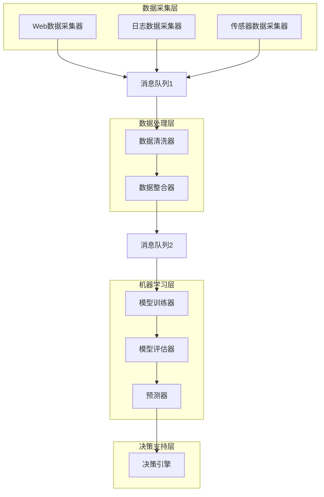

# AI人工智能 Agent：在大数据处理中的应用

## 1.背景介绍

### 1.1 大数据时代的到来

在当今时代，数据已经成为了一种新的战略资源。随着物联网、移动互联网、社交网络等新兴技术的迅猛发展,海量的数据正以前所未有的规模和速度不断涌现。这些数据不仅体现在数据量的急剧增长,更重要的是数据种类和数据形式的多样化。传统的数据处理方式已经无法满足当前对大数据的管理和分析需求。

### 1.2 大数据带来的挑战

大数据给企业带来了巨大的机遇,同时也带来了前所未有的挑战:

- **数据量大**:单个企业每天产生的数据量都达到了TB甚至PB级别,远远超出了传统数据库和数据处理系统的处理能力。
- **种类多样**:除了结构化数据外,还有大量的半结构化和非结构化数据,如文本、图像、视频等,需要新的技术来存储和处理。
- **处理速度快**:对于一些实时性要求较高的应用场景,需要在毫秒或秒级内完成数据的采集、处理和分析。
- **价值密度低**:有价值的数据只占整个数据量的一小部分,如何从海量数据中发现有价值的信息是一个巨大的挑战。

### 1.3 人工智能技术的兴起

人工智能技术,尤其是机器学习和深度学习技术的快速发展,为解决大数据带来的挑战提供了新的思路和方法。智能Agent作为人工智能技术在大数据处理领域的重要应用,正在引起越来越多的关注。

## 2.核心概念与联系

### 2.1 什么是智能Agent?

智能Agent是一种自主的软件实体,能够感知环境,并根据预定义的知识库和规则作出理性的行为,以实现特定的目标。智能Agent具有以下几个关键特征:

- **自主性(Autonomy)**: Agent可以在没有人工干预的情况下自主运行,并根据环境的变化作出相应的行为。
- **反应性(Reactivity)**: Agent能够及时感知环境的变化,并作出相应的反应。
- **主动性(Pro-activeness)**: Agent不仅被动地响应环境的变化,还能够根据自身的目标主动采取行动。
- **社会性(Social Ability)**: Agent可以与其他Agent或人类进行交互和协作,以完成更复杂的任务。

### 2.2 智能Agent在大数据处理中的作用

在大数据处理领域,智能Agent可以发挥以下几个方面的作用:

- **数据采集**:Agent可以自动地从各种异构数据源采集所需的数据,并进行初步的清洗和转换。
- **数据处理**:Agent可以根据特定的算法和规则对采集到的数据进行处理和分析,从而发现隐藏其中的知识和规律。
- **决策支持**:Agent可以根据分析结果,结合预定义的策略和目标,为决策者提供建议和支持。
- **自动化执行**:在某些场景下,Agent还可以自动执行相应的操作,实现流程的自动化和优化。

### 2.3 智能Agent与大数据处理的关系

智能Agent和大数据处理是一个相辅相成的关系。一方面,大数据为智能Agent的发展提供了广阔的应用空间和丰富的数据资源;另一方面,智能Agent技术为大数据的采集、处理和分析提供了强大的工具和方法。二者的结合,将推动人工智能和大数据技术的融合发展,催生出新的商业模式和应用场景。

## 3.核心算法原理具体操作步骤

智能Agent在大数据处理中的应用,主要涉及以下几个核心算法:

### 3.1 数据采集算法

数据采集是大数据处理的第一步,也是最为关键的一步。常用的数据采集算法包括:

1. **Web爬虫算法**:用于从互联网上采集结构化和非结构化数据,如网页、文本、图像等。
2. **日志采集算法**:用于从各种系统和应用中采集日志数据,如服务器日志、应用日志等。
3. **传感器数据采集算法**:用于从各种物联网设备中采集传感器数据,如温度、湿度、位置等。

这些算法需要根据具体的数据源和数据格式进行定制和优化,以提高采集的效率和准确性。

### 3.2 数据清洗算法

由于采集到的原始数据通常存在噪声、缺失值、重复值等问题,因此需要进行数据清洗,以提高数据质量。常用的数据清洗算法包括:

1. **缺失值处理算法**:用于填补数据中的缺失值,如均值插补、最近邻插补等。
2. **异常值检测算法**:用于检测和剔除数据中的异常值,如基于统计模型的异常值检测、基于聚类的异常值检测等。
3. **数据去重算法**:用于去除数据中的重复记录,如基于哈希的去重、基于规则的去重等。

数据清洗算法需要根据具体的数据特征和应用场景进行选择和调优,以达到最佳的清洗效果。

### 3.3 数据处理和分析算法

对清洗后的数据进行处理和分析,是智能Agent在大数据处理中的核心环节。常用的算法包括:

1. **机器学习算法**:用于从数据中发现隐藏的模式和规律,如分类算法、聚类算法、回归算法等。
2. **深度学习算法**:基于神经网络的算法,可以自动从数据中学习特征表示,在图像、语音、自然语言处理等领域表现出色。
3. **统计分析算法**:用于对数据进行描述性分析和推断性分析,如相关分析、回归分析、时间序列分析等。
4. **图算法**:用于处理和分析图结构数据,如社交网络分析、知识图谱构建等。

这些算法需要根据具体的应用场景和数据特征进行选择和优化,以获得最佳的分析效果。

## 4.数学模型和公式详细讲解举例说明

在智能Agent的大数据处理过程中,往往需要借助数学模型和公式来描述和解决实际问题。下面将以机器学习中的一些典型模型为例,详细讲解相关的数学原理和公式。

### 4.1 线性回归模型

线性回归是一种常用的监督学习算法,用于建立自变量和因变量之间的线性关系模型。其数学表达式如下:

$$y = w_0 + w_1x_1 + w_2x_2 + ... + w_nx_n + \epsilon$$

其中:
- $y$是因变量(目标变量)
- $x_1, x_2, ..., x_n$是自变量(特征变量)
- $w_0, w_1, w_2, ..., w_n$是模型参数(权重)
- $\epsilon$是随机误差项

通过最小二乘法等优化算法,可以估计出模型参数$w$,使得预测值$\hat{y}$与真实值$y$之间的误差平方和最小化:

$$\min\limits_{w} \sum\limits_{i=1}^{m}(y_i - \hat{y}_i)^2$$

其中$m$是训练样本的数量。

线性回归模型虽然简单,但在许多实际场景中都有不错的表现,如销量预测、房价预测等。

### 4.2 逻辑回归模型

逻辑回归是一种常用的分类算法,用于解决二分类问题。其数学模型如下:

$$P(Y=1|X) = \frac{1}{1 + e^{-(w_0 + w_1x_1 + w_2x_2 + ... + w_nx_n)}}$$
$$P(Y=0|X) = 1 - P(Y=1|X)$$

其中:
- $Y$是二值目标变量(0或1)
- $X$是特征变量向量$(x_1, x_2, ..., x_n)$
- $w_0, w_1, w_2, ..., w_n$是模型参数(权重)

通过最大似然估计等优化算法,可以估计出模型参数$w$,使得训练数据的似然函数最大化:

$$\max\limits_{w} \prod\limits_{i=1}^{m}P(y_i|x_i, w)$$

逻辑回归模型广泛应用于信用评分、垃圾邮件分类、疾病诊断等二分类场景。

### 4.3 决策树模型

决策树是一种常用的分类和回归算法,它通过递归地构建决策树来对样本进行预测。决策树的构建过程可以用信息增益或基尼系数等指标来衡量特征的重要性,选择最优特征进行分裂。

对于分类问题,决策树的目标是最小化节点的熵(Entropy):

$$Entropy(D) = -\sum\limits_{i=1}^{c}p_ilog_2p_i$$

其中$c$是类别数,$p_i$是第$i$类样本的概率。

对于回归问题,决策树的目标是最小化节点的方差:

$$Var(D) = \frac{1}{N}\sum\limits_{i=1}^{N}(y_i - \bar{y})^2$$

其中$N$是样本数,$y_i$是第$i$个样本的值,$\bar{y}$是样本均值。

决策树模型具有可解释性强、计算高效等优点,广泛应用于金融风控、推荐系统、计算机视觉等领域。

以上只是数学模型和公式的一个简单示例,在实际应用中,还有许多其他复杂的模型和公式需要掌握和运用。

## 5.项目实践:代码实例和详细解释说明

为了更好地理解智能Agent在大数据处理中的应用,我们将通过一个实际项目案例来进行代码实例和详细解释说明。

### 5.1 项目背景

某电商公司希望通过分析用户的历史购买行为,预测用户对新品的购买意向,从而为精准营销提供决策支持。该项目需要构建一个智能Agent系统,完成以下任务:

1. 从多个异构数据源采集用户购买数据、商品数据和营销活动数据。
2. 对采集到的原始数据进行清洗和整合,构建用户购买行为数据集。
3. 基于机器学习算法,从用户购买行为数据集中学习用户购买模型。
4. 针对新品,预测每个用户的购买概率,为营销决策提供支持。

### 5.2 系统架构

该智能Agent系统采用微服务架构,由多个服务组件组成,组件之间通过消息队列进行通信。系统架构如下所示:



该系统架构具有良好的扩展性和容错性,可以根据需求动态扩展或替换各个组件。

### 5.3 关键代码实现

下面将分别介绍数据采集、数据清洗、模型训练和预测等关键环节的代码实现。

#### 5.3.1 数据采集

使用Python的Scrapy框架实现Web数据采集器,代码如下:

```python
import scrapy

class ProductSpider(scrapy.Spider):
    name = 'product'
    start_urls = ['https://www.example.com/products']

    def parse(self, response):
        for product in response.css('div.product'):
            yield {
                'name': product.css('h2::text').get(),