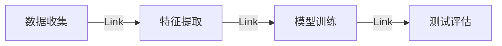

                 

作者：禅与计算机程序设计艺术

人工智能的引入与教育领域的融合

## 1.背景介绍

随着人工智能（AI）技术的飞速发展，它已经从生活的每一个角落侵袭，教育也不例外。在这个数字化时代，AI带来的变化和创新无处不在，它正在改变传统的教育模式，为学习提供全新的途径和方式。本文将探讨AI在教育领域的应用如何影响传统教育模式，以及我们如何利用这些变化来提高教育质量和效率。

## 2.核心概念与联系

人工智能可以被定义为由人制造的智能体系，它通过学习和经验来模拟人类智能行为。在教育领域，AI可以作为一种强大的工具，来帮助教师和学生更有效地进行教学和学习。其核心概念包括但不限于机器学习、自然语言处理、计算机视觉等。

## 3.核心算法原理具体操作步骤

为了更好地理解AI在教育领域的运作，我们需要深入了解其核心算法原理。比如，支持向量机（SVM）、神经网络（NN）等都是在教育领域得到广泛应用的算法。这些算法的具体操作步骤包括数据收集、特征提取、模型训练、测试评估等。



## 4.数学模型和公式详细讲解举例说明

在教育领域，AI通常依赖于统计模型来预测学习成果或个性化学习路径。比如，线性回归模型就可以用来预测学生在考试中的成绩。数学公式如下：

$$ y = \beta_0 + \beta_1 x_1 + \beta_2 x_2 + ... + \beta_n x_n $$

其中，\( y \) 表示预测的成绩，\( \beta_i \) 是模型的权重系数，\( x_i \) 则是影响成绩的各种因素。

## 5.项目实践：代码实例和详细解释说明

在本节中，我们将通过一个简单的Python程序来实践如何使用AI来分析学生的作业并提供反馈。代码如下：

```python
import tensorflow as tf
from tensorflow.keras import layers, models

# 数据预处理
data = ...
labels = ...

# 构建神经网络
model = models.Sequential()
model.add(layers.Dense(64, activation='relu', input_shape=(784,)))
model.add(layers.Dense(10, activation='softmax'))

# 编译模型
model.compile(optimizer=tf.keras.optimizers.Adam(),
             loss='sparse_categorical_crossentropy',
             metrics=['accuracy'])

# 训练模型
model.fit(data, epochs=10)

# 使用模型预测
predictions = model.predict(data)
```

## 6.实际应用场景

AI在教育领域的应用场景非常广泛，包括但不限于个性化学习、智能辅导、自动评分、课程推荐系统等。这些应用场景不仅提高了教育的效率，也使得学习变得更加个性化和互动。

## 7.工具和资源推荐

对于想要在教育领域应用AI的读者来说，有许多工具和资源可以选择。比如TensorFlow和Keras这样的开源框架，它们提供了构建复杂模型的强大功能。此外，还有许多在线课程和论坛，如Coursera、edX等，可以帮助你深入学习AI在教育领域的应用。

## 8.总结：未来发展趋势与挑战

尽管AI在教育领域已经取得了显著的进展，但仍面临着诸多挑战，如隐私保护、算法偏见、技术可访问性等。未来，我们预期AI将会更加智能化，能够更好地理解学生的学习习惯和需求，从而提供更加定制化的教育服务。

## 9.附录：常见问题与解答

在本文结束时，我们将回顾一些关于AI在教育领域应用的常见问题及其解答。

### 结语

随着人工智能技术的不断进步，它正在为教育带来深远的变化。我们必须认识到，AI不仅是教育的挑战，也是机遇。通过理解其核心概念、算法原理和应用场景，我们可以更好地利用AI来改善教育质量，满足学习者的个性化需求。

