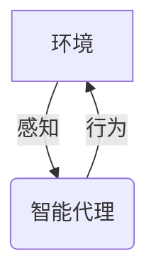
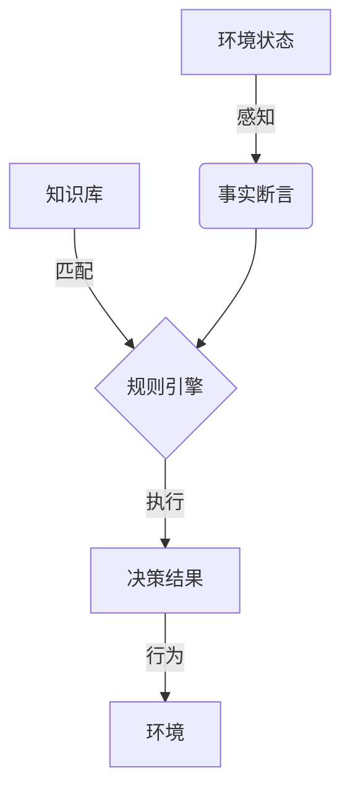
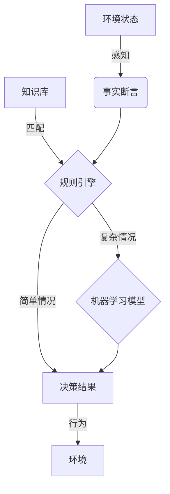

# AI人工智能 Agent：对法律和规则的挑战

## 1.背景介绍

### 1.1 人工智能的兴起

近年来,人工智能(AI)技术的快速发展,使得智能系统在各个领域得到了广泛的应用。智能代理(AI Agent)作为人工智能系统的核心组成部分,正在逐步渗透到我们生活的方方面面。从语音助手到自动驾驶汽车,从医疗诊断到金融投资决策,智能代理正在发挥着越来越重要的作用。

### 1.2 智能代理的定义

智能代理是一种自主的软件实体,能够感知环境,处理信息,并根据预定目标做出合理的行为决策。它们可以代表人类或其他系统执行各种任务,如信息搜索、决策支持、任务规划和自动化等。

### 1.3 法律和规则的挑战

随着智能代理在现实世界中的广泛应用,它们的行为和决策也面临着法律和道德规则的约束。由于智能代理的自主性和复杂性,其行为往往难以预测,可能会产生意料之外的后果。这就引发了一系列法律和伦理问题,如责任归属、隐私保护、公平性和透明度等。

## 2.核心概念与联系

### 2.1 代理与环境的交互

智能代理与环境之间存在着动态的交互过程。代理通过感知器获取环境状态,并基于内部知识库和决策机制选择行为,将行为通过执行器施加到环境中,从而影响环境的变化。这种循环交互过程构成了代理与环境之间的闭环系统。



### 2.2 代理的自主性

智能代理的自主性是指其能够独立做出决策和采取行动的能力。这种自主性源于代理的内部决策机制,如规则引擎、机器学习模型或者启发式算法等。自主性使得代理能够根据环境变化做出灵活的响应,但同时也增加了行为的不确定性和不可预测性。

### 2.3 法律和伦理规则

法律和伦理规则为智能代理的行为设置了约束和边界。这些规则涉及隐私保护、公平性、透明度、安全性等多个方面,旨在确保智能代理的行为符合社会价值观和法律法规。然而,由于智能代理的复杂性和自主性,将这些规则有效地融入代理的决策过程并非一件易事。

## 3.核心算法原理具体操作步骤

### 3.1 规则引擎

规则引擎是一种基于预定义规则的决策系统,常用于实现智能代理的决策逻辑。规则引擎的工作原理如下:

1. 知识库构建:将法律法规、伦理准则等规则形式化,存储在知识库中。
2. 事实断言:通过感知器获取环境状态,将其转化为事实断言。
3. 规则匹配:将事实断言与知识库中的规则进行匹配,找到适用的规则。
4. 规则执行:执行匹配到的规则,得到决策结果。
5. 行为执行:将决策结果转化为具体的行为,通过执行器施加到环境中。



规则引擎的优点是决策过程透明、可解释,但缺点是规则的构建和维护工作量大,难以处理复杂的情况。

### 3.2 机器学习模型

机器学习模型通过从数据中学习,获得对法律和伦理规则的隐式表示,从而实现智能决策。典型的机器学习算法包括:

1. 监督学习:利用标注的训练数据(如法律判决案例),训练分类或回归模型,对新的情况进行预测和决策。
2. 强化学习:代理通过与环境交互,获得奖励反馈,不断优化决策策略,使长期累积奖励最大化。
3. 迁移学习:利用在源领域学习到的知识,迁移到目标领域,加速法律领域模型的训练。

机器学习模型的优点是能够处理复杂的情况,但缺点是决策过程是一个黑箱,难以解释和理解。

### 3.3 混合决策系统

为了结合规则引擎和机器学习模型的优势,可以构建混合决策系统。例如,可以先使用规则引擎处理简单的情况,对于复杂的情况则交由机器学习模型决策。或者将规则引擎的结果作为机器学习模型的辅助特征,提高决策的可解释性。



混合决策系统能够平衡决策的准确性和可解释性,是一种有前景的智能决策范式。

## 4.数学模型和公式详细讲解举例说明

### 4.1 马尔可夫决策过程

马尔可夫决策过程(MDP)是一种描述智能代理与环境交互的数学模型,常用于强化学习算法的理论分析。一个MDP可以用元组 $\langle S, A, P, R, \gamma \rangle$ 来表示,其中:

- $S$ 是环境的状态集合
- $A$ 是代理可选的行为集合
- $P(s'|s,a)$ 是状态转移概率,表示在状态 $s$ 下执行行为 $a$ 后,转移到状态 $s'$ 的概率
- $R(s,a)$ 是奖励函数,表示在状态 $s$ 执行行为 $a$ 后获得的即时奖励
- $\gamma \in [0,1)$ 是折现因子,用于权衡即时奖励和长期奖励的权重

代理的目标是找到一个策略 $\pi: S \rightarrow A$,使得期望的累积折现奖励最大化:

$$
\max_\pi \mathbb{E}\left[ \sum_{t=0}^\infty \gamma^t R(s_t, a_t) \right]
$$

其中 $s_t$ 和 $a_t$ 分别表示第 $t$ 个时刻的状态和行为。

强化学习算法通过与环境不断交互,根据获得的奖励反馈,不断更新和优化策略 $\pi$,从而逐步找到最优策略。

### 4.2 多臂老虎机问题

多臂老虎机问题是一种经典的探索与利用权衡问题,常用于评估强化学习算法的性能。假设有 $K$ 个老虎机臂,每个臂 $k$ 的奖励服从未知的概率分布 $\nu_k$,目标是最大化长期的累积奖励。

令 $\mu_k$ 表示第 $k$ 个臂的期望奖励,定义累积遗憾为:

$$
R_n = \sum_{t=1}^n (\mu^* - X_{I_t})
$$

其中 $\mu^* = \max_{1 \leq k \leq K} \mu_k$ 是最优臂的期望奖励, $X_{I_t}$ 是第 $t$ 次选择的臂的奖励。我们希望最小化累积遗憾 $R_n$。

不同的策略对应不同的探索与利用权衡,例如:

- $\epsilon$-greedy 策略:以概率 $\epsilon$ 随机选择一个臂(探索),以概率 $1-\epsilon$ 选择当前看起来最优的臂(利用)。
- 上确信bound (UCB) 策略:对每个臂 $k$ 维护一个上确信区间 $\overline{\mu}_k$,选择 $\overline{\mu}_k$ 最大的臂。

不同策略在不同问题设置下,累积遗憾的上界不同,反映了它们探索与利用的权衡程度。

## 5.项目实践:代码实例和详细解释说明

为了演示如何将法律和伦理规则融入智能代理的决策过程,我们以一个简单的机器人导航场景为例,使用Python和OpenAI Gym环境进行模拟。

### 5.1 环境设置

我们考虑一个 $5 \times 5$ 的网格世界,其中有一些障碍物、一个起点和一个终点。机器人的目标是从起点出发,找到一条路径到达终点,同时避免撞击障碍物。我们引入以下规则:

1. 机器人不能穿越障碍物(物理规则)。
2. 机器人不能在同一个位置停留超过 $k$ 个时间步(防止死锁规则)。
3. 机器人的路径不能离障碍物太近(安全距离规则)。

### 5.2 规则引擎实现

我们首先使用规则引擎实现上述规则,并将其集成到强化学习代理中。

```python
import numpy as np

class RuleEngine:
    def __init__(self, env, k=3, safety_dist=1):
        self.env = env
        self.k = k
        self.safety_dist = safety_dist
        self.position_count = np.zeros_like(env.grid)

    def is_valid(self, state, action):
        next_state = self.env.next_state(state, action)
        
        # 物理规则
        if self.env.grid[next_state] == 1:
            return False
        
        # 防止死锁规则
        self.position_count[state] += 1
        if self.position_count[state] > self.k:
            return False
        
        # 安全距离规则
        for obstacle in self.env.obstacles:
            if np.sum(np.abs(np.array(next_state) - np.array(obstacle))) <= self.safety_dist:
                return False
        
        return True
```

在强化学习训练过程中,我们将规则引擎的结果作为掩码,过滤掉违反规则的行为:

```python
def train_agent(env, rule_engine):
    agent = ...  # 初始化强化学习代理
    
    for episode in range(num_episodes):
        state = env.reset()
        done = False
        
        while not done:
            action_mask = [rule_engine.is_valid(state, a) for a in range(env.nA)]
            action = agent.act(state, action_mask)
            next_state, reward, done, _ = env.step(action)
            agent.update(state, action, reward, next_state, done)
            state = next_state
```

### 5.3 机器学习模型实现

我们也可以使用机器学习模型直接学习法律和伦理规则的隐式表示。例如,我们可以构建一个二分类模型,判断给定的(状态,行为)对是否合法:

```python
import torch
import torch.nn as nn

class LegalityModel(nn.Module):
    def __init__(self, state_dim, action_dim, hidden_dim=64):
        super().__init__()
        self.fc1 = nn.Linear(state_dim + action_dim, hidden_dim)
        self.fc2 = nn.Linear(hidden_dim, 1)
        
    def forward(self, state, action):
        x = torch.cat([state, action], dim=1)
        x = torch.relu(self.fc1(x))
        x = self.fc2(x)
        return torch.sigmoid(x)
```

我们可以使用监督学习,基于模拟数据或真实数据训练该模型。在强化学习训练过程中,我们可以使用该模型的输出概率作为行为选择的掩码:

```python
def train_agent(env, legality_model):
    agent = ...  # 初始化强化学习代理
    
    for episode in range(num_episodes):
        state = env.reset()
        done = False
        
        while not done:
            action_probs = legality_model(state, torch.arange(env.nA))
            action_mask = action_probs > 0.5  # 二值化
            action = agent.act(state, action_mask)
            next_state, reward, done, _ = env.step(action)
            agent.update(state, action, reward, next_state, done)
            state = next_state
```

通过这种方式,我们可以将法律和伦理规则直接融入智能代理的决策过程中,而不需要显式地编码规则。

## 6.实际应用场景

智能代理在许多领域都有广泛的应用前景,同时也面临着法律和伦理规则的挑战。下面是一些典型的应用场景:

### 6.1 自动驾驶汽车

自动驾驶