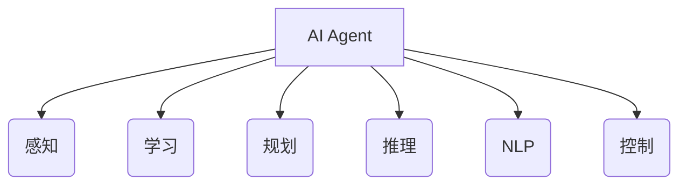

# AI人工智能 Agent：对生活的影响

## 1.背景介绍

### 1.1 人工智能的兴起

人工智能(Artificial Intelligence,AI)是当代科技发展的重要领域,近年来受到了前所未有的关注和投资。随着算力的不断提升、数据的爆炸式增长以及算法的创新,AI技术在多个领域取得了突破性进展,展现出巨大的应用潜力。

AI的发展可以追溯到20世纪50年代,当时一些科学家提出了"智能机器"的概念,并开始探索如何用计算机程序模拟人类智能。经过几十年的发展,AI已经从理论概念逐渐走向实用化,并在语音识别、图像处理、自然语言处理等领域取得了长足进展。

### 1.2 AI Agent的概念

在AI领域,Agent是一个重要的概念。AI Agent指的是一个感知环境并根据环境做出决策的智能体系统。Agent通过感知器获取环境信息,并基于内部的知识库和决策机制选择行为,从而实现特定目标。

AI Agent可以嵌入各种硬件载体中,如机器人、智能家居设备、软件系统等。它们能够自主地完成复杂任务,并在与人类或其他Agent的交互中学习和进化。AI Agent的出现标志着人工智能系统从封闭的实验室环境走向了开放的现实世界。

### 1.3 AI Agent的影响

AI Agent的发展对我们的生活产生了深远的影响。它们正在改变我们工作、生活和娱乐的方式,为人类社会带来了全新的机遇和挑战。本文将探讨AI Agent在不同领域的应用,分析其对我们生活的影响,并展望未来的发展趋势。

## 2.核心概念与联系

### 2.1 AI Agent的核心要素

要构建一个AI Agent系统,需要集成多种AI技术,包括:

- **感知(Perception)**: 通过各种传感器获取环境数据,如视觉、语音、温度等。
- **学习(Learning)**: 根据获取的数据,使用机器学习算法不断优化Agent的知识库和决策模型。
- **规划(Planning)**: 根据目标和已有知识,生成行为序列以完成任务。
- **推理(Reasoning)**: 对获取的信息进行逻辑推理,得出合理的结论。
- **自然语言处理(NLP)**: 理解和生成人类语言,实现人机交互。
- **控制(Control)**: 控制执行器(如机械手臂)执行实际操作。

这些技术相互关联、相互作用,共同构建了一个完整的AI Agent系统。

### 2.2 AI Agent与其他AI系统的关系

AI Agent是一种通用的AI系统架构,许多专门的AI应用都可以看作是Agent的特例。例如:

- 机器人可视为一种具有机械执行器的AI Agent。
- 智能助手(如Siri、Alexa)是面向语音交互的AI Agent。
- 推荐系统可视为一种专注于个性化推荐的AI Agent。
- 游戏AI也是一种在特定环境(游戏世界)中运行的Agent。

因此,研究AI Agent不仅可以推动通用AI技术的发展,也有助于促进各个垂直领域AI应用的创新。

## 3.核心算法原理具体操作步骤  

### 3.1 感知

感知是AI Agent获取环境信息的重要环节。常见的感知技术包括:

1. **计算机视觉**
   - 目标检测: 使用卷积神经网络对图像中的目标(如人、车辆等)进行检测和定位。
   - 图像分割: 将图像按像素级别分割为不同的语义对象。
   - 视觉SLAM: 同时实现环境的建图和自身位置的估计。

2. **语音识别**
   - 声学模型: 使用隐马尔可夫模型(HMM)或神经网络对语音信号建模。
   - 语言模型: 使用N-gram或神经网络语言模型估计词序列的概率。
   - 声码器模型: 直接将语音信号转换为文本序列。

3. **传感器融合**
   - 卡尔曼滤波: 融合来自多个传感器(如激光、雷达、IMU等)的数据。
   - 粒子滤波: 通过多个粒子对系统状态进行采样,实现非线性、非高斯状态估计。

感知算法的作用是从原始传感器数据中提取出对Agent决策有用的信息,为后续的学习、规划和控制过程提供支持。

### 3.2 学习

学习是AI Agent获取知识、优化决策模型的关键。常见的学习算法包括:

1. **监督学习**
   - 深度神经网络: 使用卷积神经网络(CNN)、循环神经网络(RNN)等模型对数据进行端到端的映射学习。
   - 支持向量机(SVM): 通过构造最大间隔超平面对数据进行分类。
   - 决策树、随机森林: 根据特征对数据进行递归分类或回归。

2. **无监督学习**
   - 聚类算法(K-Means、GMM): 根据相似性将数据划分为多个簇。
   - 主成分分析(PCA): 将高维数据映射到一个低维空间。
   - 自编码器: 通过重构输入数据的方式学习数据的潜在表示。

3. **强化学习**
   - Q-Learning、Sarsa: 通过不断试错,学习在各个状态下执行的最优行为策略。
   - 策略梯度: 直接对策略模型的参数进行优化,使期望回报最大化。
   - AlphaGo: 结合深度神经网络、蒙特卡罗树搜索等技术,实现人类水平的围棋AI。

通过学习,AI Agent可以逐步积累经验知识,并不断优化自身的决策模型,使其具备更强的问题解决能力。

### 3.3 规划

规划是AI Agent根据目标和已有知识生成行为序列的过程。常用的规划算法有:

1. **经典规划**
   - 状态空间搜索: 使用A*、IDA*等算法在状态空间中搜索到达目标的最优路径。
   - 启发式搜索: 设计合理的评估函数来加速搜索过程。

2. **自动规划**
   - 规划域独立构建(PDDL): 将规划问题建模为初始状态、目标状态和可执行操作。
   - 启发式搜索规划(HSP): 使用反向链接的贪心最佳优先搜索求解PDDL问题。
   - 满足规划: 在有不确定性和冲突的情况下进行规划。

3. **运动规划**
   - 采样式路径规划: 使用RRT、RRT*等算法快速探索高维空间中的可行路径。
   - 轨迹优化: CHOMP等优化算法对已有路径进行光滑和精细化。
   - 运动解耦: 将路径规划和轨迹规划分开,提高规划效率。

通过合理的规划,AI Agent能够制定出行为决策序列,从而完成特定任务。规划算法的性能直接影响了Agent的实时决策能力。

### 3.4 推理

推理是AI Agent对获取的信息进行分析和判断的过程。主要的推理方法包括:

1. **逻辑推理**
   - 命题逻辑: 使用命题连接词(与、或、非等)构造复杂命题进行推理。
   - 一阶逻辑: 在命题逻辑基础上引入个体、谓词等概念,进行更丰富的知识表示和推理。
   - 非单调推理: 能够对已有结论进行修正,处理不确定和冲突信息。

2. **概率推理**
   - 贝叶斯网络: 使用有向无环图模型表示随机变量之间的因果关系,支持证据传播。
   - 马尔可夫逻辑网络: 结合一阶逻辑和马尔可夫网络,处理关系数据的不确定性推理。
   - 粒子滤波: 通过粒子采样近似估计动态系统的状态分布。

3. **模糊推理**
   - 模糊逻辑: 使用模糊集合和模糊规则对不精确信息进行推理。
   - 模糊控制: 将专家经验表示为模糊规则,用于控制复杂系统。

推理使AI Agent能够对获取的信息进行高层次的理解和判断,从而做出合理的决策。不同推理范式适用于不同的应用场景。

### 3.5 自然语言处理

自然语言处理(NLP)是AI Agent实现人机交互的关键技术,主要包括:

1. **语言理解**
   - 分词、词性标注: 将文本流分割为单词序列,标注每个单词的词性。
   - 命名实体识别: 识别出文本中的人名、地名、机构名等实体。
   - 句法分析: 通过语法规则分析句子的句法结构树。
   - 语义分析: 理解句子的意义,建立语义表示。

2. **对话管理**
   - 对话状态跟踪: 跟踪对话的上下文信息,维护对话状态。
   - 对话策略学习: 根据对话状态选择最优的对话行为。

3. **语言生成**
   - 文本生成: 根据给定的语义表示生成自然语言文本。
   - 语音合成: 将文本转换为自然语音输出。

4. **表示学习**
   - Word2Vec: 通过词向量捕获词与词之间的语义和句法关联。
   - BERT: 通过深度双向Transformer编码器对词元序列建模。

NLP技术帮助AI Agent理解和生成人类语言,为人机自然交互提供基础。随着深度学习的发展,NLP的性能不断提高。

### 3.6 控制

控制是AI Agent根据决策指令操纵执行器(如机械手臂、机器人等)的过程。常用的控制算法有:

1. **经典控制**
   - PID控制: 根据偏差、积分、微分对执行器进行反馈控制。
   - 最优控制: 通过优化某个性能指标(如能量消耗),求解最优控制序列。

2. **智能控制**
   - 模糊控制: 将人类专家经验表示为模糊规则,对非线性系统进行控制。
   - 神经网络控制: 使用神经网络直接从数据中学习控制策略。
   - 强化学习控制: 通过在线试错,学习在各个状态下执行的最优控制行为。

3. **运动控制**
   - 逆运动学: 求解机器人关节角度使末端位于期望位置。
   - 运动规划: 为机器人规划无碰撞、平滑、动力学可行的运动轨迹。
   - 阻抗控制: 实现机器人与环境的合规交互。

控制算法的作用是将AI Agent的决策转化为可执行的物理动作,使Agent能够对现实环境产生影响和改变。控制的性能直接影响了Agent的行为效果。

## 4.数学模型和公式详细讲解举例说明

AI Agent涉及大量数学模型和公式,这些理论基础为算法提供了坚实的支撑。本节将介绍几个核心模型。

### 4.1 机器学习模型

#### 4.1.1 线性回归

线性回归是一种基础的监督学习模型,用于预测连续值目标变量。给定数据集 $\mathcal{D} = \{(x_i, y_i)\}_{i=1}^N$,线性回归试图学习一个线性函数 $f(x) = w^Tx + b$,使其能够很好地拟合训练数据。

通过最小化均方误差损失函数:

$$J(w,b) = \frac{1}{2N}\sum_{i=1}^N(f(x_i) - y_i)^2$$

可以得到模型参数 $w$和$b$的解析解或使用梯度下降法进行优化求解。

线性回归虽然简单,但在许多实际问题中表现出色,同时也是理解更复杂模型(如逻辑回归、神经网络等)的基础。

#### 4.1.2 逻辑回归

逻辑回归是一种用于分类任务的广义线性模型。对于二分类问题