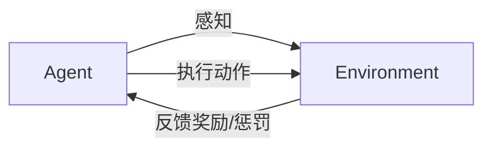

# AI人工智能 Agent：智能体与环境的交互理论

## 1. 背景介绍
### 1.1 人工智能的发展历程
### 1.2 Agent的兴起与重要性
### 1.3 Agent在人工智能领域的应用现状

## 2. 核心概念与联系
### 2.1 Agent的定义与特征
#### 2.1.1 自主性
#### 2.1.2 感知能力
#### 2.1.3 交互能力
#### 2.1.4 目标导向
### 2.2 环境的定义与分类
#### 2.2.1 确定性环境与不确定性环境
#### 2.2.2 完全可观察环境与部分可观察环境
#### 2.2.3 单Agent环境与多Agent环境
#### 2.2.4 静态环境与动态环境
### 2.3 Agent与环境的交互过程
#### 2.3.1 感知
#### 2.3.2 决策
#### 2.3.3 行动
#### 2.3.4 反馈

## 3. 核心算法原理具体操作步骤
### 3.1 基于规则的Agent
#### 3.1.1 规则表示
#### 3.1.2 规则匹配
#### 3.1.3 规则执行
### 3.2 基于搜索的Agent
#### 3.2.1 状态空间搜索
#### 3.2.2 启发式搜索
#### 3.2.3 博弈搜索
### 3.3 基于规划的Agent
#### 3.3.1 经典规划
#### 3.3.2 概率规划
#### 3.3.3 层次规划
### 3.4 基于学习的Agent
#### 3.4.1 监督学习
#### 3.4.2 无监督学习
#### 3.4.3 强化学习

## 4. 数学模型和公式详细讲解举例说明
### 4.1 马尔可夫决策过程(MDP)
#### 4.1.1 MDP的定义与组成要素
#### 4.1.2 MDP的Bellman方程
#### 4.1.3 求解MDP的值迭代与策略迭代算法
### 4.2 部分可观察马尔可夫决策过程(POMDP)  
#### 4.2.1 POMDP的定义与组成要素
#### 4.2.2 POMDP的Bellman方程
#### 4.2.3 求解POMDP的点基值迭代算法
### 4.3 博弈论模型
#### 4.3.1 博弈论基本概念
#### 4.3.2 纳什均衡与最优响应
#### 4.3.3 重复博弈与进化博弈

## 5. 项目实践：代码实例和详细解释说明
### 5.1 基于Q-Learning的迷宫寻路Agent
#### 5.1.1 问题描述
#### 5.1.2 MDP建模
#### 5.1.3 Q-Learning算法实现
#### 5.1.4 实验结果与分析
### 5.2 基于深度强化学习的Atari游戏Agent
#### 5.2.1 问题描述
#### 5.2.2 深度Q网络(DQN)算法
#### 5.2.3 DQN算法实现
#### 5.2.4 实验结果与分析
### 5.3 基于MCTS的五子棋Agent
#### 5.3.1 问题描述 
#### 5.3.2 蒙特卡洛树搜索(MCTS)算法
#### 5.3.3 MCTS算法实现
#### 5.3.4 实验结果与分析

## 6. 实际应用场景
### 6.1 智能客服系统
### 6.2 自动驾驶汽车
### 6.3 智能推荐系统
### 6.4 智能家居控制
### 6.5 金融投资决策

## 7. 工具和资源推荐
### 7.1 主流Agent开发框架
#### 7.1.1 OpenAI Gym
#### 7.1.2 DeepMind Lab
#### 7.1.3 Microsoft Malmo
### 7.2 主流深度强化学习库
#### 7.2.1 Stable Baselines
#### 7.2.2 Keras-RL
#### 7.2.3 TensorFlow Agents
### 7.3 其他实用资源
#### 7.3.1 David Silver强化学习课程
#### 7.3.2 《Reinforcement Learning: An Introduction》
#### 7.3.3 NIPS与ICML等顶会论文

## 8. 总结：未来发展趋势与挑战
### 8.1 Agent智能化水平不断提升
### 8.2 多Agent系统成为研究热点
### 8.3 Agent与人类的协同与共生
### 8.4 Agent的可解释性与安全性
### 8.5 通用人工智能的追求

## 9. 附录：常见问题与解答
### 9.1 如何选择合适的Agent算法？
### 9.2 如何评估Agent的性能？
### 9.3 如何解决Agent训练中的稀疏奖励问题？
### 9.4 如何实现Agent的迁移学习？
### 9.5 如何保证Agent系统的鲁棒性？

人工智能(Artificial Intelligence, AI)是计算机科学领域的一个重要分支,其核心目标是让机器能够像人一样进行感知、推理、决策和行动。在这个宏大目标的指引下,AI技术经历了从早期的符号主义、专家系统,到机器学习、深度学习等多个发展阶段。而今天,以深度强化学习为代表的智能Agent技术,正在成为实现通用人工智能的一个重要途径。

何谓Agent?一般而言,Agent指的是一个能够感知环境,并根据环境的反馈采取行动,从而实现特定目标的自主实体。这里的"自主"是Agent区别于一般程序的关键特征,它意味着Agent具有自己的感知、决策和行动能力,能够在没有人为直接干预的情况下,根据环境的变化做出适应性反应。

一个典型的Agent通常由感知器(Sensor)、决策器(Decision Maker)、执行器(Actuator)三大部分组成。感知器负责接收来自环境的信息,并将其转化为Agent内部的状态表征;决策器根据当前状态,结合Agent的知识、目标等,做出下一步行动的决策;执行器则负责将决策转化为实际的动作,对环境施加影响,进而引起环境状态的改变,完成"感知-决策-行动"的闭环反馈。

Agent技术的兴起,与人工智能的发展历程密切相关。上世纪50-70年代的符号主义AI,试图通过抽象的符号推理来实现智能,但很快遇到了"符号接地"等难题。80年代兴起的专家系统虽然在特定领域取得了不错的应用效果,但缺乏通用性和自主学习能力。90年代以来,以机器学习为主的连接主义AI开始崛起。通过从数据中学习,机器学习方法在模式识别、自然语言处理等方面显示出了强大的性能,尤其是近十年来深度学习的兴起,更是将AI的应用推向了一个新的高度。

但传统的机器学习方法主要关注"从数据到模型"的过程,忽视了智能系统"从模型到决策"乃至"从决策到行动"的重要环节。这导致许多机器学习模型虽然在特定任务上性能出色,但缺乏与环境交互的能力,难以应对现实世界的复杂性和不确定性。Agent范式正是为了解决这一问题而提出的。

与传统的"从数据到模型"式的机器学习不同,Agent技术强调智能系统与环境的持续交互。这种交互一方面让Agent能够主动探索环境,获取信息;另一方面也让环境状态能够反馈给Agent,指导其进行决策和优化。在这个过程中,Agent逐渐学会了如何在复杂多变的环境中生存,完成目标。这种"从模型到决策再到行动"的闭环学习范式,被视为实现通用人工智能的关键。

近年来,以深度强化学习为代表的Agent技术取得了长足的进展。从AlphaGo战胜人类围棋冠军,到OpenAI Five挑战Dota 2人类职业团队,再到Deepmind的AlphaFold在蛋白质结构预测上的重大突破,智能Agent在多个领域展现出了超越人类的潜力。同时,智能Agent在自动驾驶、智能客服、推荐系统等实际应用中也得到了广泛的应用。

然而,当前的Agent技术仍然面临诸多挑战。其一,如何在复杂环境中高效地进行探索和学习,克服稀疏奖励等难题;其二,如何实现多个Agent之间的协同与竞争,构建群体智能系统;其三,如何让Agent具备可解释性,让其决策过程透明可控;其四,如何保证Agent系统的安全性和鲁棒性,避免产生负面影响。这些都是当前Agent领域函待解决的重要问题。

展望未来,Agent技术仍大有可为。一方面,得益于深度学习、强化学习、因果推理等AI技术的不断进步,Agent的智能化水平必将持续提升,其自主学习和决策能力会变得越来越强。另一方面,多Agent系统、人机协同等前沿方向,也将成为Agent研究的重要突破口。Agent与环境、Agent与人类的交互将变得更加紧密,由此带来的智能化应用也将不断涌现。

当然,通用人工智能的实现仍然任重道远。单纯的Agent技术还不足以承载起这一宏大的目标,它还需要与知识图谱、因果推理、类脑智能等其他AI技术的融合。但可以预见的是,Agent范式必将在这个过程中扮演重要角色。站在新时代的起点,让我们拭目以待,见证智能Agent在通往AGI的道路上,书写新的辉煌篇章。

作者：禅与计算机程序设计艺术 / Zen and the Art of Computer Programming