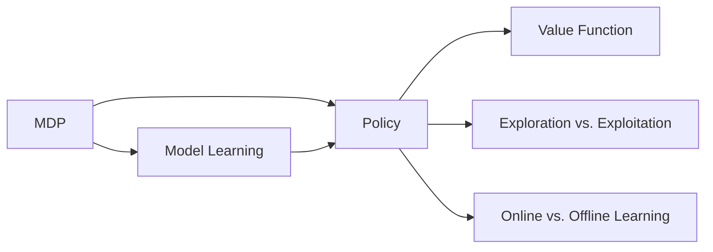

# AI人工智能 Agent：智能体的动作选择策略

## 1. 背景介绍
在人工智能(Artificial Intelligence, AI)领域中,智能体(Agent)是一个非常重要和基础的概念。智能体可以感知环境,根据感知结果选择动作,通过动作影响环境,从而实现特定的目标。在现实世界中,无处不在的智能体包括自动驾驶汽车、智能机器人、对话系统、推荐系统等。它们在复杂多变的环境中自主地做出最优决策,高效完成各种任务。

智能体的核心能力在于动作选择,即面对当前的环境状态,如何选择最优动作,使长期累积奖励最大化。这需要权衡 exploration(探索)和 exploitation(利用)。探索是尝试新的动作,获取对环境的新知识；利用是基于已有知识选择已知的最优动作,获得稳定奖励。两者需要平衡。

动作选择策略经历了从基于规则到基于学习的发展过程。早期系统采用专家系统等规则方法,但难以应对复杂环境。后来兴起的强化学习等数据驱动的学习方法,让智能体从海量数据中自主学习动作策略,取得了广泛成功。

本文将全面探讨智能体动作选择的核心算法、数学原理、代码实践和实际应用,展望其未来发展方向,并回答常见问题,让读者全面掌握这一领域的前沿知识。

## 2. 核心概念与联系
理解智能体动作选择,需要掌握以下核心概念:

### 2.1 马尔可夫决策过程(MDP)
MDP是表述智能体与环境交互的数学框架,包含状态、动作、转移概率和奖励函数四要素。目标是寻找最优策略,使累积奖励最大化。

### 2.2 策略(Policy)
策略是将状态映射到动作的函数,分为确定性策略和随机性策略。前者每个状态只对应一个动作,后者给出动作的概率分布。策略决定了智能体的行为模式。

### 2.3 价值函数(Value Function) 
价值函数表示状态或状态-动作对的长期累积奖励期望,分为状态价值函数 $v(s)$ 和动作价值函数 $q(s,a)$。前者表示状态 $s$ 上的长期价值,后者表示在状态 $s$ 下采取动作 $a$ 的长期价值。价值函数反映了策略的优劣。

### 2.4 探索与利用(Exploration vs. Exploitation)
探索是尝试新动作来获取对环境的新知识,利用是基于已有知识采取当前最优动作。两者存在矛盾,需要权衡。 $\epsilon$-greedy 等方法可平衡二者。

### 2.5 在线学习与离线学习(Online vs. Offline Learning)
在线学习一边与环境交互一边更新策略,离线学习先收集数据再优化策略。前者实时适应动态环境,后者可充分利用历史数据。二者常结合使用。

### 2.6 模型学习(Model Learning)
模型学习是通过数据估计MDP的转移概率和奖励函数。基于模型的强化学习先学习模型,再利用模型进行规划,无需反复与真实环境交互。

以上概念环环相扣,构成了智能体动作选择的基本理论。在MDP框架下,智能体通过策略与环境交互,用价值函数评估策略,平衡探索利用,结合在线离线学习不断优化策略,最终实现最优决策。下图展示了这些概念间的联系:

## 3. 核心算法原理与具体步骤

### 3.1 动态规划(Dynamic Programming)
动态规划适用于已知MDP模型的情形,包括策略评估和策略提升两个步骤:
1. 策略评估:给定策略 $\pi$,求解价值函数 $v_\pi$ 或 $q_\pi$。
2. 策略提升:利用价值函数产生新策略 $\pi'$,使其优于 $\pi$。
两步交替进行,直至策略收敛到最优。

具体而言,策略评估基于贝尔曼方程:

$$
v_\pi(s) = \sum_a \pi(a|s) \sum_{s',r} p(s',r|s,a) [r + \gamma v_\pi(s')]
$$

其中 $p(s',r|s,a)$ 为转移概率, $\gamma$ 为折扣因子。求解该方程得到 $v_\pi$。

策略提升基于贪心法则:

$$
\pi'(s) = \arg\max_a \sum_{s',r} p(s',r|s,a) [r + \gamma v_\pi(s')]
$$

选取使右式最大的动作作为新策略在状态 $s$ 上的决策。

### 3.2 蒙特卡洛方法(Monte Carlo Methods)
蒙特卡洛方法适用于未知MDP模型但可采样的情形,通过采样估计价值函数。分为首次访问型和每次访问型两种:
1. 首次访问型:在一条轨迹中,仅以状态 $s$ 首次出现后的累积回报更新 $v(s)$。
2. 每次访问型:以状态 $s$ 每次出现后的累积回报更新 $v(s)$,取平均。

两种方法都可无偏估计 $v_\pi(s)$,但首次访问型方差更小。

蒙特卡洛方法的具体步骤如下:
1. 采样:与环境交互得到轨迹 $(s_0,a_0,r_1,s_1,a_1,\cdots)$。
2. 计算回报:对每个状态 $s_t$,计算此后的累积回报 $G_t$。
3. 估计价值:用 $G_t$ 更新 $v(s_t)$,如首次访问型取首次出现后的 $G_t$。
4. 重复多轮,直至 $v(s)$ 收敛。

### 3.3 时序差分学习(Temporal Difference Learning)
时序差分学习结合了动态规划和蒙特卡洛方法的优点,适用于未知MDP模型且需在线学习的情形。其核心思想是基于TD误差更新价值估计:

$$
\delta_t = r_{t+1} + \gamma v(s_{t+1}) - v(s_t)
$$

TD误差 $\delta_t$ 度量了 $v(s_t)$ 的估计误差。若 $\delta_t>0$,表明 $v(s_t)$ 被低估,应该增大；反之应该减小。因此可用 $\delta_t$ 校正 $v(s_t)$:

$$
v(s_t) \leftarrow v(s_t) + \alpha \delta_t
$$

其中 $\alpha$ 为学习率。重复应用该更新规则,即可在线学习价值函数。

常见的时序差分算法包括Sarsa和Q-learning:
- Sarsa基于五元组 $(s,a,r,s',a')$ 更新动作价值 $q(s,a)$:
  
$$
q(s,a) \leftarrow q(s,a) + \alpha [r + \gamma q(s',a') - q(s,a)]
$$

- Q-learning基于四元组 $(s,a,r,s')$ 更新状态-动作价值 $q(s,a)$:

$$
q(s,a) \leftarrow q(s,a) + \alpha [r + \gamma \max_{a'} q(s',a') - q(s,a)]
$$

Sarsa为同策略(on-policy),学习的是当前策略的价值函数；Q-learning为异策略(off-policy),学习的是最优策略的价值函数。

### 3.4 深度强化学习(Deep Reinforcement Learning)
传统强化学习在状态和动作空间很大时难以处理。深度强化学习将深度神经网络引入强化学习,用于拟合价值函数、策略函数等,从而突破了这一限制。

以DQN(Deep Q-Network)为例,其用神经网络 $Q(s,a;\theta)$ 逼近最优动作价值函数 $q_*(s,a)$,损失函数为:

$$
L(\theta) = \mathbb{E}_{(s,a,r,s')\sim D} [(r + \gamma \max_{a'} Q(s',a';\theta^-) - Q(s,a;\theta))^2]
$$

其中 $D$ 为经验回放池, $\theta^-$ 为目标网络参数。DQN在采样过程中将 $(s,a,r,s')$ 存入 $D$,之后从 $D$ 中随机抽取小批量数据,基于TD误差更新 $\theta$,同时定期将 $\theta$ 复制给 $\theta^-$。这一系列技巧有效稳定了训练。

除DQN外,还有DDPG、A3C、PPO等多种深度强化学习算法,它们在连续动作空间、异步更新、置信域优化等方面进行了改进和创新,进一步提升了深度强化学习的性能。

## 4. 数学模型与公式详解

### 4.1 马尔可夫决策过程(MDP)
MDP定义为一个五元组 $\mathcal{M}=(\mathcal{S},\mathcal{A},\mathcal{P},\mathcal{R},\gamma)$,其中:
- $\mathcal{S}$ 为有限状态集
- $\mathcal{A}$ 为有限动作集  
- $\mathcal{P}:\mathcal{S} \times \mathcal{A} \times \mathcal{S} \to [0,1]$ 为转移概率,满足 $\sum_{s'\in\mathcal{S}} \mathcal{P}(s'|s,a)=1$
- $\mathcal{R}:\mathcal{S} \times \mathcal{A} \to \mathbb{R}$ 为奖励函数
- $\gamma \in [0,1]$ 为折扣因子

MDP的解为一个最优策略 $\pi_*$,使得从任意初始状态 $s$ 出发,采取 $\pi_*$ 能获得的期望累积奖励最大,即:

$$
\pi_* = \arg\max_\pi \mathbb{E}_{\pi} [\sum_{t=0}^{\infty} \gamma^t r_t | s_0=s], \forall s \in \mathcal{S}
$$

求解 $\pi_*$ 的经典算法为价值迭代和策略迭代。

### 4.2 贝尔曼方程(Bellman Equation)
贝尔曼方程建立了当前状态的价值与后继状态价值间的递归关系:

$$
v_\pi(s) = \sum_a \pi(a|s) \sum_{s',r} p(s',r|s,a) [r + \gamma v_\pi(s')]
$$

$$
q_\pi(s,a) = \sum_{s',r} p(s',r|s,a) [r + \gamma \sum_{a'} \pi(a'|s') q_\pi(s',a')]
$$

最优价值函数 $v_*$ 和 $q_*$ 满足最优贝尔曼方程:

$$
v_*(s) = \max_a \sum_{s',r} p(s',r|s,a) [r + \gamma v_*(s')]
$$

$$
q_*(s,a) = \sum_{s',r} p(s',r|s,a) [r + \gamma \max_{a'} q_*(s',a')]
$$

### 4.3 策略梯度定理(Policy Gradient Theorem)
策略梯度定理给出了策略期望回报 $J(\theta)$ 对策略参数 $\theta$ 的梯度:

$$
\nabla_\theta J(\theta) = \mathbb{E}_{\pi_\theta} [\nabla_\theta \log \pi_\theta(a|s) Q^{\pi_\theta}(s,a)]
$$

其中 $\pi_\theta$ 为参数化策略, $Q^{\pi_\theta}$ 为其动作价值函数。该定理说明,更新 $\theta$ 应沿着动作价值加权的对数策略梯度方向,这能增大高价值动作的概率。

### 4.4 无模型强化学习的收敛性
对于基于采样的无模型强化学习,一个核心问题是算法能否收敛到最优解。以Q-learning为例,在适当的步长条件下,Q-learning可以收敛到最优动作价值函数 $q_*$。设 $q_t$ 为 $t$ 时刻的动作价值估计,则有:

$$
\lim_{t\to\infty} q_t(s,a) = q_*(s,a), \forall (s,a) \in \mathcal{S} \times \mathcal{A}
$$

类似地,对于策略梯度算法,在适当的步长条件