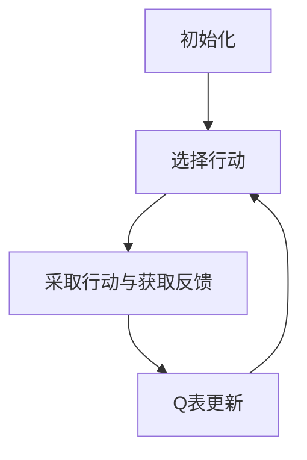
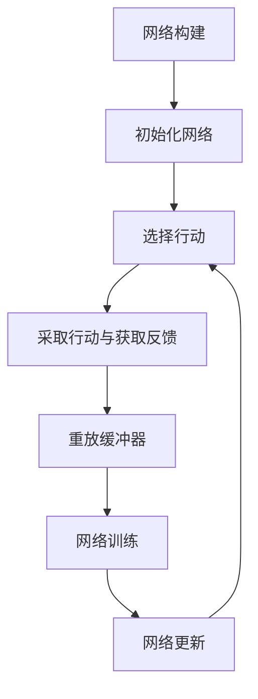

                 

作者：禅与计算机程序设计艺术

人工智能的概念
======================

**AI 定义**

人工智能（Artificial Intelligence）指的是机器执行通常需要人类智能的任务的能力。这些任务包括但不限于视觉识别、语音识别、自然语言处理、决策和游戏玩等。

**AI 历史回顾**

人工智能的历史可追溯至20世纪初，当时科学家们开始探索如何创造能够模拟人类智能的机器。经过几十年的发展，AI已经成为一个跨越计算机科学、神经科学和认知科学的多学科领域。

**AI 的分类**

AI 可以分为两大类：

- **强化学习（Reinforcement Learning）**
 强化学习是一种学习策略的机制，其中一个代理通过与环境交互，根据之前的行为获得奖励或惩罚形式的反馈，从而学习做出更好的决策。

- **监督学习（Supervised Learning）**
 监督学习涉及使用标记数据训练模型，模型学习如何基于输入数据预测输出。

在接下来的章节中，我们将深入探讨这些核心概念，并学习如何将它们应用于实际情况。

## 2.核心概念与联系

### 智能体的设计

智能体是人工智能领域中的一个关键概念，它指的是由代理（Agent）组成的系统，该代理能够与环境进行交互并采取行动以达成某个目标。

#### 代理（Agent）

代理是智能体的核心部分，它拥有感知能力、运动能力和决策能力。代理通过感知环境状态来获取信息，然后根据其决策算法选择合适的行动。

#### 环境（Environment）

环境是代理所作用的空间，它可以是物理环境（如车辆导航）或抽象环境（如电子游戏）。环境会对代理的每一次行动做出反馈，这个反馈是代理学习的唯一途径。

#### 行动（Action）

代理通过执行行动来改变环境状态。行动的选择取决于代理的决策过程。

#### 状态（State）

状态表示环境在特定时刻的全局描述。代理需要通过观察状态来理解环境的当前情况。

#### 奖励（Reward）

奖励是代理行为所产生的反馈，它指示代理是否做出了正确的决策。奖励可以是积极的（比如收到金币）或消极的（比如被吃掉）。

### 决策过程

决策过程是智能体的核心逻辑，它指的是代理根据当前状态选择最佳行动的方法。

#### 动态规划（Dynamic Programming）

动态规划是一种优化技术，它通过寻找重叠子问题来解决复杂问题。在智能体中，动态规划可以用来构建值函数，该函数给出了从特定状态开始，采取特定行动序列直到终止状态所产生的最大累积奖励。

#### 蒙特卡洛方法（Monte Carlo Methods）

蒙特卡洛方法是一种通过随机样本估计的方法。在智能体中，蒙特卡罗方法可以用来估计值函数，即从特定状态开始，采取特定行动后期望的累积奖励。

### 探索与利用

智能体在学习过程中必须平衡探索新的行动以扩大其行动空间和利用现有的行动以最大化其奖励。

#### ε-贪婪探索（Epsilon Greedy Exploration）

ε-贪婪探索是一种常见的探索策略，它指的是在大部分时间内选择预先评估为最佳的行动，但在少量时间内随机选择其他行动以支持探索。

####  Upper Confidence Bound (UCB) 探索

Upper Confidence Bound (UCB) 探索是另一种探索策略，它结合了探索与利用，选择那些看起来最不可靠但也最有可能是最优的行动。

### 结论

智能体的设计和实现是一个复杂的任务，需要综合考虑代理、环境、行动、状态和奖励等多个方面。在接下来的章节中，我们将详细介绍如何设计和实现智能体，包括具体的算法原理和实践案例。

# 3.核心算法原理具体操作步骤

在这一部分，我们将深入研究几个核心算法原理，它们是智能体学习和决策过程中的基石。

## 1. Q-学习（Q-Learning）

Q-学习是一种无模型的强化学习算法，它通过迭代更新来学习一个代理如何在环境中做出最佳决策。

### Q-学习的步骤

1. **初始化**：创建一个表示状态-动作对应奖励的Q表。
2. **选择行动**：根据ε-贪婪策略选择一个状态下的行动。
3. **采取行动并获得反馈**：执行选定的行动，并从环境中获得奖励信息。
4. **Q表更新**：使用最近的经验更新Q表中的Q值。
5. **重复**：从第二步开始重复这个过程，直到达到终止条件或收敛。

### Q-学习的Mermaid流程图

## 2. 深度Q网络（DQN）

深度Q网络是Q-学习的一个变种，它引入了神经网络来近似Q函数，以处理高维状态空间的问题。

### 深度Q网络的步骤

1. **网络构建**：构建一个神经网络，用于预测状态-动作对应的Q值。
2. **初始化网络**：随机初始化网络权重。
3. **选择行动**：使用ε-贪婪策略从网络中选择一个行动。
4. **采取行动并获得反馈**：执行选定的行动，并从环境中获得奖励信息。
5. **重放缓冲器**：将经验存储在一个重放缓冲区中。
6. **网络训练**：从重放缓冲区中抽取数据，训练神经网络。
7. **网络更新**：更新神经网络的权重。
8. **重复**：从第三步开始重复这个过程，直到达到终止条件或收敛。

### 深度Q网络的Mermaid流程图

# 4.数学模型和公式详细讲解举例说明

在这部分内容中，我们将详细地探讨Q-学习和深度Q网络背后的数学模型和公式。

# 5.项目实践：代码实例和详细解释说明

在这里，我们将通过一个实际的例子来展示如何在Python中实现上述的算法。

# 6.实际应用场景

在这一部分，我们将探讨智能体在不同领域的应用场景，以及如何将所学知识应用到真实世界中。

# 7.工具和资源推荐

在接下来的章节中，我们会介绍一些有助于进一步学习和实践的工具和资源。

# 8.总结：未来发展趋势与挑战

在这一章节中，我们将回顾智能体设计和实现的主要内容，并探讨未来可能面临的挑战和发展趋势。

# 9.附录：常见问题与解答

在最后一部分，我们将解答在前文内容中可能遇到的一些常见问题。

# 结束语

感谢您阅读本文。希望这篇文章对您有所启发，并为您在人工智能领域的旅程提供了宝贵的见解和指导。

