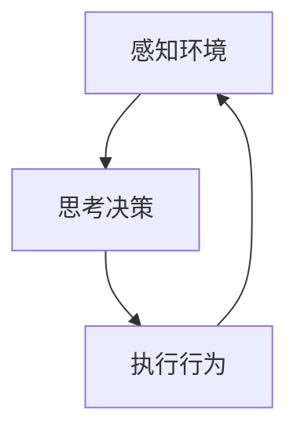
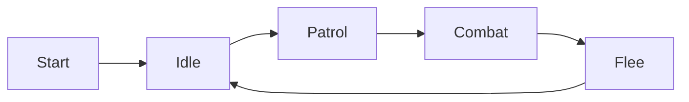
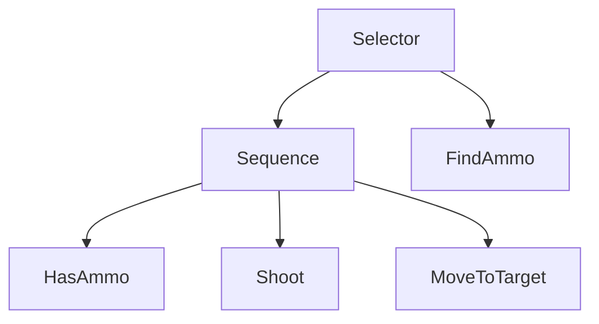

# AI人工智能 Agent：游戏中智能体的应用

## 1. 背景介绍

### 1.1 游戏智能体的重要性

在当今游戏行业中,人工智能(AI)技术的应用已经成为不可或缺的一部分。游戏中的智能体(Agent)是指能够根据环境状态做出决策并采取行动的虚拟实体。高质量的游戏智能体可以为玩家带来更加富有挑战性、身临其境和吸引人的游戏体验。

随着游戏复杂度的不断提高,传统的基于规则和脚本的方法已经无法满足现代游戏对智能体的需求。因此,采用先进的AI技术来开发游戏智能体已经成为行业内的一种趋势。

### 1.2 AI在游戏中的应用

AI技术在游戏中的应用范围非常广泛,包括但不限于:

- 非玩家角色(NPC)的行为控制
- 游戏策略和对手AI
- 过程生成内容(PCG)
- 玩家建模和个性化
- 游戏分析和数据挖掘

本文将重点探讨游戏智能体的开发,特别是NPC行为控制和对手AI方面的应用。

## 2. 核心概念与联系

### 2.1 智能体(Agent)

在人工智能领域,智能体是指能够感知环境、处理信息、做出决策并采取行动的自主系统。游戏中的智能体通常表现为NPC或对手AI,它们需要根据游戏环境的变化做出合理的行为响应。

### 2.2 智能体架构

智能体架构描述了智能体的基本组成部分及其相互关系。一种常见的架构是感知-思考-行为(Sense-Think-Act)循环:



1. **感知(Sensing)**: 智能体通过传感器从环境中获取信息,例如视野、声音、游戏状态等。
2. **思考(Thinking)**: 智能体根据感知到的信息,结合其知识库和决策机制,计算出最佳行为。
3. **行为(Acting)**: 智能体执行计算出的行为,对环境产生影响。

### 2.3 常见智能体类型

根据决策机制的不同,游戏智能体可分为以下几种类型:

- **基于规则的智能体**: 根据预定义的规则集合做出决策。
- **基于状态机的智能体**: 使用有限状态机或行为树等技术模拟复杂行为。
- **基于规划的智能体**: 通过自动规划算法寻找实现目标的行为序列。
- **基于机器学习的智能体**: 利用机器学习技术从数据中学习做出决策。

## 3. 核心算法原理具体操作步骤  

### 3.1 有限状态机(Finite State Machine, FSM)

有限状态机是一种常用的智能体决策模型,适用于模拟相对简单的行为。它将智能体的行为划分为有限个离散状态,每个状态对应特定的行为模式。状态之间通过转移条件进行切换。

FSM的核心步骤如下:

1. 定义状态集合和初始状态。
2. 为每个状态指定对应的行为。
3. 确定状态转移条件。
4. 在运行时,根据当前状态执行相应行为,并检查转移条件以切换到下一状态。



上图展示了一个简单的FSM,描述了NPC在巡逻、战斗和逃跑之间切换的行为模式。

FSM易于实现和维护,但存在状态爆炸和层次化困难的问题,难以模拟复杂行为。

### 3.2 行为树(Behavior Tree, BT)

行为树是一种更加灵活和可扩展的行为模型,常用于开发复杂的游戏AI系统。它将智能体的行为分解为可组合的任务单元,通过树状结构有条件地执行这些任务。

构建行为树的基本步骤:

1. 定义基本任务节点(动作节点)。
2. 使用组合节点(选择器、序列器等)将基本任务组织成树状结构。
3. 为每个节点指定执行条件。
4. 在运行时,从树根开始遍历并执行满足条件的节点。



上图展示了一个简单的行为树,描述了NPC在有弹药时射击目标,否则移动寻找弹药的行为。

行为树相对于FSM具有更强的模块化、可重用性和可维护性,适用于开发复杂的AI系统。

### 3.3 规划算法

规划算法旨在为智能体自动生成一系列行为,以实现特定目标。常见的规划算法包括:

- **经典搜索算法**: 如A*、IDA*等,用于在有向图中寻找最优路径。
- **启发式搜索算法**: 如爬山算法、模拟退火等,通过局部最优逼近全局最优解。
- **自动规划算法**: 如GraphPlan、FastForward等,基于PDDL(Planning Domain Definition Language)建模问题并求解。

规划算法的一般步骤:

1. 建模问题,定义初始状态、目标状态和可执行操作。
2. 根据选择的算法,在状态空间中搜索能够从初始状态达到目标状态的操作序列。
3. 执行搜索得到的操作序列。

例如,在实时策略游戏中,可以使用A*算法为单位寻找到达目标点的最短路径。

规划算法可以为智能体自动生成行为序列,但计算复杂度较高,适用于离线规划或低维状态空间的在线规划问题。

## 4. 数学模型和公式详细讲解举例说明

### 4.1 马尔可夫决策过程(Markov Decision Process, MDP)

马尔可夫决策过程是强化学习等序列决策问题的数学基础模型。MDP通常定义为一个五元组 $\langle S, A, P, R, \gamma \rangle$:

- $S$: 有限状态集合
- $A$: 有限动作集合  
- $P(s' | s, a)$: 状态转移概率,表示在状态$s$执行动作$a$后,转移到状态$s'$的概率
- $R(s, a, s')$: 奖励函数,表示在状态$s$执行动作$a$并转移到$s'$时获得的即时奖励
- $\gamma \in [0, 1)$: 折扣因子,用于权衡即时奖励和长期累计奖励

在MDP中,智能体的目标是找到一个策略$\pi: S \rightarrow A$,使得期望的长期累计奖励最大:

$$
\max_\pi \mathbb{E}\left[ \sum_{t=0}^\infty \gamma^t R(s_t, a_t, s_{t+1}) \right]
$$

其中$s_0$是初始状态,$a_t = \pi(s_t)$是在状态$s_t$执行的动作。

MDP为强化学习等序列决策问题提供了统一的数学框架,许多算法如Q-Learning、策略梯度等都是在此基础上发展而来。

### 4.2 多智能体马尔可夫游戏(Markov Game)

多智能体马尔可夫游戏是MDP在多智能体环境下的推广,常用于建模多个智能体之间的竞争或合作关系。

多智能体马尔可夫游戏通常定义为一个六元组$\langle N, S, A, P, R, \gamma \rangle$:

- $N$: 智能体数量
- $S$: 有限状态集合
- $A = A_1 \times A_2 \times \cdots \times A_N$: 联合动作空间,每个智能体$i$有一个动作集合$A_i$
- $P(s' | s, \boldsymbol{a})$: 状态转移概率,取决于当前状态$s$和所有智能体的联合动作$\boldsymbol{a} = (a_1, a_2, \cdots, a_N)$
- $R_i(s, \boldsymbol{a}, s')$: 第$i$个智能体的奖励函数
- $\gamma \in [0, 1)$: 折扣因子

在多智能体马尔可夫游戏中,每个智能体$i$都有自己的策略$\pi_i: S \rightarrow A_i$,目标是最大化自身的期望长期累计奖励:

$$
\max_{\pi_i} \mathbb{E}\left[ \sum_{t=0}^\infty \gamma^t R_i(s_t, \boldsymbol{a}_t, s_{t+1}) \right]
$$

其中$\boldsymbol{a}_t = (a_1^t, a_2^t, \cdots, a_N^t)$是所有智能体在状态$s_t$执行的联合动作。

多智能体马尔可夫游戏为建模多个智能体之间的交互提供了理论基础,在对抗性游戏AI、多智能体协作等领域有广泛应用。

## 5. 项目实践:代码实例和详细解释说明

本节将通过一个简单的游戏示例,展示如何使用Python实现基于FSM和BT的智能体系统。

### 5.1 游戏场景

我们考虑一个简单的射击游戏场景,玩家需要消灭所有敌人。敌人的行为由一个基于FSM的智能体系统控制,包括巡逻、追击玩家、射击和逃跑等行为。

### 5.2 有限状态机实现

```python
from enum import Enum

class State(Enum):
    IDLE = 0
    PATROL = 1
    CHASE = 2
    ATTACK = 3
    FLEE = 4

class Enemy:
    def __init__(self, position):
        self.position = position
        self.state = State.IDLE
        self.target = None

    def update(self, player_position):
        if self.state == State.IDLE:
            self.idle_behavior()
        elif self.state == State.PATROL:
            self.patrol_behavior()
        elif self.state == State.CHASE:
            self.chase_behavior(player_position)
        elif self.state == State.ATTACK:
            self.attack_behavior(player_position)
        elif self.state == State.FLEE:
            self.flee_behavior(player_position)

    def idle_behavior(self):
        # 切换到巡逻状态
        self.state = State.PATROL

    def patrol_behavior(self):
        # 执行巡逻逻辑
        ...
        if see_player():
            self.state = State.CHASE
            self.target = player_position

    def chase_behavior(self, player_position):
        # 追击玩家
        ...
        if in_attack_range(player_position):
            self.state = State.ATTACK
        elif health_low():
            self.state = State.FLEE

    def attack_behavior(self, player_position):
        # 射击玩家
        ...
        if player_killed():
            self.state = State.PATROL
        elif health_low():
            self.state = State.FLEE

    def flee_behavior(self, player_position):
        # 逃跑
        ...
        if health_recovered():
            self.state = State.PATROL
```

上述代码定义了一个`Enemy`类,使用枚举类型表示不同的状态。`update`方法根据当前状态执行相应的行为,并检查状态转移条件以切换到下一状态。

### 5.3 行为树实现

```python
class Node:
    def __init__(self):
        pass

    def evaluate(self, enemy, player_position):
        raise NotImplementedError()

class Sequence(Node):
    def __init__(self, children):
        self.children = children

    def evaluate(self, enemy, player_position):
        for child in self.children:
            result = child.evaluate(enemy, player_position)
            if not result:
                return False
        return True

class Selector(Node):
    def __init__(self, children):
        self.children = children

    def evaluate(self, enemy, player_position):
        for child in self.children:
            result = child.evaluate(enemy, player_position)
            if result:
                return True
        return False

class Action(Node):
    def __init__(self, action_func):
        self.action_func = action_func

    def evaluate(self, enemy, player_position):
        self.action_func(enemy, player_position)
        return True

class Condition(Node):
    def __init__(self, condition_func):
        self.condition_func = condition_func

    def evaluate(self, enemy, player_position):
        return self.condition_func(enemy, player_position)

# 构建行为树
root = Selector([
    Sequence([
        Condition(has_ammo),
        Condition(in_attack_range