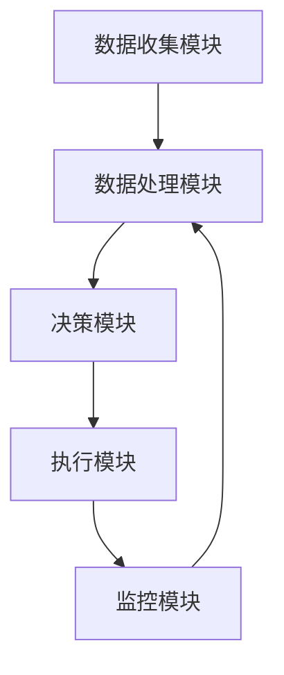

# AI人工智能代理工作流 AI Agent WorkFlow：在医疗保健中的应用

## 1. 背景介绍

### 1.1 医疗保健行业的挑战

医疗保健行业一直面临着诸多挑战,例如医疗资源分配不均、医疗费用不断上涨、人口老龄化加剧以及医疗差错等问题。这些挑战不仅影响了医疗服务的质量和可及性,也加重了医疗系统的负担。因此,迫切需要采用创新技术来优化医疗保健流程,提高效率,降低成本,并最终改善患者体验。

### 1.2 人工智能在医疗保健中的作用

人工智能(AI)技术在医疗保健领域展现出巨大的潜力。AI系统可以处理大量复杂的医疗数据,发现隐藏的模式和关联,从而支持医疗决策、优化流程和提高诊断准确性。此外,AI还可以用于个性化医疗、药物发现、医疗图像分析等多个领域,为患者和医疗机构带来诸多好处。

### 1.3 AI代理工作流概念

AI代理工作流(AI Agent Workflow)是一种将人工智能技术与业务流程相结合的方法。它利用AI代理(智能软件代理)来自动化和优化各种任务和流程,提高效率和决策质量。在医疗保健领域,AI代理工作流可以应用于多个场景,如病历管理、就诊流程优化、远程医疗等。

## 2. 核心概念与联系

### 2.1 AI代理

AI代理是一种智能软件实体,能够感知环境、处理信息、做出决策并执行相应的行为。在AI代理工作流中,AI代理扮演着关键角色,负责自动化各种任务和流程。

### 2.2 工作流

工作流是一系列有序的活动或任务,旨在实现特定的业务目标。在医疗保健领域,工作流可以包括患者就诊、病历管理、药物处方、手术安排等多个环节。

### 2.3 AI代理工作流

AI代理工作流将AI代理与工作流相结合,利用AI技术来优化和自动化工作流中的各个环节。AI代理可以执行各种任务,如数据收集、处理、分析、决策以及与人类专家的协作等。通过AI代理工作流,医疗保健流程可以变得更加高效、准确和个性化。

## 3. 核心算法原理具体操作步骤

AI代理工作流的核心算法原理包括以下几个方面:

### 3.1 环境感知

AI代理需要能够感知和理解工作流所处的环境,包括收集相关数据、识别关键信息等。常用的环境感知算法包括计算机视觉、自然语言处理等。

#### 3.1.1 计算机视觉算法

计算机视觉算法可用于分析医疗图像,如X光、CT扫描等。常见的算法包括卷积神经网络(CNN)、目标检测算法(如YOLO、Faster R-CNN)等。这些算法可以自动检测和分割图像中的异常区域,为医生诊断提供辅助。

#### 3.1.2 自然语言处理算法

自然语言处理算法可用于理解和处理医疗文本数据,如病历、诊断报告等。常见的算法包括命名实体识别(NER)、关系抽取、情感分析等。这些算法可以从文本中提取关键信息,如症状、疾病、治疗方案等,为决策提供支持。

### 3.2 数据处理与分析

AI代理需要对收集到的数据进行处理和分析,以发现隐藏的模式和关联。常用的数据处理和分析算法包括机器学习、深度学习等。

#### 3.2.1 机器学习算法

机器学习算法可用于构建预测模型,如疾病风险预测、治疗效果预测等。常见的算法包括逻辑回归、决策树、随机森林等。这些算法可以基于历史数据训练模型,并对新数据进行预测。

#### 3.2.2 深度学习算法

深度学习算法可用于处理复杂的非结构化数据,如医疗图像、基因组数据等。常见的算法包括卷积神经网络(CNN)、递归神经网络(RNN)、生成对抗网络(GAN)等。这些算法可以自动学习数据的特征表示,并进行分类、预测等任务。

### 3.3 决策与规划

AI代理需要根据数据分析结果做出决策,并规划相应的行动。常用的决策与规划算法包括规则引擎、优化算法、强化学习等。

#### 3.3.1 规则引擎

规则引擎是一种基于预定义规则的决策系统。在医疗保健领域,规则引擎可用于实现临床决策支持系统(CDSS),根据患者症状、检查结果等数据,推理出可能的诊断和治疗方案。

#### 3.3.2 优化算法

优化算法可用于解决资源分配、调度等问题。常见的算法包括线性规划、整数规划、启发式算法等。在医疗保健领域,优化算法可用于优化医疗资源分配、手术安排等任务。

#### 3.3.3 强化学习算法

强化学习算法可用于训练AI代理在复杂环境中做出最优决策。常见的算法包括Q-Learning、策略梯度等。在医疗保健领域,强化学习可用于优化治疗方案、药物剂量调整等任务。

### 3.4 执行与交互

AI代理需要能够执行决策,并与人类专家进行交互和协作。常用的执行与交互技术包括自动化流程、自然语言生成、人机交互界面等。

#### 3.4.1 自动化流程

自动化流程技术可用于自动执行各种任务,如数据输入、报告生成等。在医疗保健领域,自动化流程可以减轻医务人员的工作负担,提高效率。

#### 3.4.2 自然语言生成

自然语言生成技术可用于将AI代理的决策和分析结果转换为自然语言文本,如诊断报告、治疗建议等。这有助于人机交互和信息传递。

#### 3.4.3 人机交互界面

人机交互界面是AI代理与人类专家进行交互的重要渠道。设计良好的界面可以提高协作效率,并确保人类专家对AI决策的可解释性和可控性。

## 4. 数学模型和公式详细讲解举例说明

在AI代理工作流中,数学模型和公式扮演着重要角色。以下是一些常见的数学模型和公式,以及它们在医疗保健领域的应用示例。

### 4.1 逻辑回归模型

逻辑回归模型是一种广泛应用的机器学习模型,可用于二分类和多分类问题。在医疗保健领域,逻辑回归模型可用于疾病风险预测、治疗效果预测等任务。

假设我们有一个二分类问题,需要预测患者是否患有某种疾病。我们可以使用逻辑回归模型,其数学表达式如下:

$$
P(y=1|X) = \frac{1}{1 + e^{-(\beta_0 + \beta_1x_1 + \beta_2x_2 + \cdots + \beta_nx_n)}}
$$

其中:
- $y$ 是二元标签,表示患病与否
- $X$ 是特征向量,包含患者的年龄、性别、症状等特征
- $\beta_0$ 是偏置项
- $\beta_1, \beta_2, \cdots, \beta_n$ 是特征对应的系数

通过训练数据,我们可以学习到最优的系数$\beta$,从而得到一个预测模型。对于新的患者数据,我们可以计算$P(y=1|X)$的值,如果大于某个阈值(通常为0.5),则预测该患者患有该疾病。

### 4.2 卷积神经网络

卷积神经网络(CNN)是一种深度学习模型,广泛应用于计算机视觉任务,如图像分类、目标检测等。在医疗保健领域,CNN可用于医疗图像分析,如X光、CT扫描等。

CNN的核心思想是通过卷积操作提取图像的局部特征,然后通过池化操作降低特征维度,最后通过全连接层进行分类或回归。CNN的数学表达式如下:

$$
y_{ij}^{l} = f\left(\sum_{m}\sum_{n}w_{mn}^{l}x_{i+m,j+n}^{l-1} + b^{l}\right)
$$

其中:
- $y_{ij}^{l}$ 是第$l$层的特征图上$(i,j)$位置的输出
- $x_{i+m,j+n}^{l-1}$ 是第$l-1$层的特征图上$(i+m,j+n)$位置的输入
- $w_{mn}^{l}$ 是第$l$层的卷积核权重
- $b^{l}$ 是第$l$层的偏置项
- $f$ 是非线性激活函数,如ReLU

通过训练CNN模型,我们可以自动学习到最优的卷积核权重和偏置项,从而实现医疗图像的分类、分割等任务。

### 4.3 马尔可夫决策过程

马尔可夫决策过程(MDP)是一种强化学习模型,可用于描述序列决策问题。在医疗保健领域,MDP可用于优化治疗方案、药物剂量调整等任务。

MDP可以用一个四元组$(S, A, P, R)$来表示:

- $S$ 是状态空间,表示系统可能处于的状态
- $A$ 是行动空间,表示可以采取的行动
- $P(s'|s,a)$ 是状态转移概率,表示在状态$s$采取行动$a$后,转移到状态$s'$的概率
- $R(s,a)$ 是即时奖励函数,表示在状态$s$采取行动$a$所获得的奖励

目标是找到一个最优策略$\pi^*(s)$,使得在任意初始状态$s_0$下,期望总奖励最大化:

$$
\max_{\pi} \mathbb{E}\left[\sum_{t=0}^{\infty}\gamma^tR(s_t,\pi(s_t))|s_0\right]
$$

其中$\gamma$是折现因子,用于平衡即时奖励和长期奖励。

在医疗保健领域,我们可以将患者的健康状态建模为MDP的状态空间,将治疗行为建模为行动空间。通过强化学习算法,如Q-Learning或策略梯度,我们可以学习到一个最优的治疗策略,以最大化患者的健康结果。

## 5. 项目实践：代码实例和详细解释说明

为了更好地理解AI代理工作流在医疗保健领域的应用,我们将通过一个实际项目来进行说明。该项目旨在构建一个AI代理系统,用于优化医院的门诊就诊流程。

### 5.1 项目概述

在传统的门诊就诊流程中,患者需要先在挂号窗口排队挂号,然后在候诊区等待医生叫号,最后进行诊疗。这个流程存在一些问题,如排队时间长、资源利用率低等。我们的目标是通过AI代理工作流来优化这个流程,提高效率和患者体验。

### 5.2 系统架构

我们的AI代理工作流系统包括以下几个主要组件:

1. **数据收集模块**: 负责收集患者信息、症状数据、医生排班信息等数据。
2. **数据处理模块**: 使用自然语言处理和机器学习算法对收集到的数据进行预处理和分析。
3. **决策模块**: 使用规则引擎和优化算法,根据数据分析结果做出就诊安排和资源分配决策。
4. **执行模块**: 负责执行决策,包括自动化流程(如自动分配号源)和人机交互界面。
5. **监控模块**: 监控系统运行状态,收集反馈数据,用于模型优化和系统改进。

下面是系统架构的Mermaid流程图:

### 5.3 关键算法和代码示例

#### 5.3.1 自然语言处理: 症状提取

我们使用命名实体识