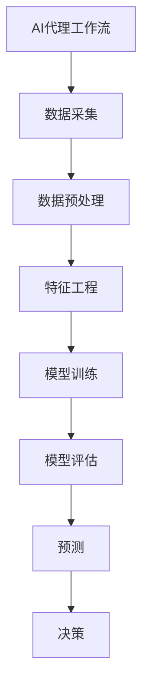

# AI人工智能代理工作流 AI Agent WorkFlow：在股票市场预测中的应用

## 1.背景介绍

### 1.1 股票市场预测的重要性

股票市场是一个复杂的动态系统,其价格波动受到多种因素的影响,包括公司基本面、宏观经济形势、投资者情绪等。准确预测股票价格走势对于投资者和金融机构来说至关重要,可以帮助他们制定有效的投资策略,规避风险,实现收益最大化。然而,由于影响股价的因素错综复杂,传统的基于统计模型和人工分析的预测方法存在局限性,难以充分捕捉市场的动态变化。

### 1.2 人工智能在股票市场预测中的应用

近年来,人工智能(AI)技术在金融领域的应用日益广泛,尤其是在股票市场预测方面展现出巨大潜力。AI系统能够从海量历史数据中学习模式,捕捉微小的价格变动信号,并基于这些信号进行预测。与传统方法相比,AI模型具有更强的数据处理能力、更高的精度和更好的适应性,可以更好地捕捉市场的动态变化。

### 1.3 AI代理工作流介绍

AI代理工作流(AI Agent Workflow)是一种将人工智能技术与工作流程管理相结合的新兴范式。它将AI模型作为智能代理嵌入到工作流程中,利用AI的数据处理和决策能力来优化和自动化流程。在股票市场预测领域,AI代理工作流可以实现自动化的数据采集、预处理、模型训练、预测和决策,大大提高了预测效率和准确性。

## 2.核心概念与联系

### 2.1 人工智能代理(AI Agent)

人工智能代理是指具有一定智能和自主性的软件实体,能够感知环境、学习知识、做出决策并执行相应的行为。在AI代理工作流中,AI代理扮演着核心角色,负责执行各种智能任务,如数据处理、模型训练、预测等。

### 2.2 工作流程(Workflow)

工作流程是指为完成特定任务而设计的一系列有序活动。在股票市场预测中,工作流程可能包括数据采集、数据预处理、特征工程、模型训练、模型评估、预测和决策等步骤。

### 2.3 AI代理工作流

AI代理工作流将人工智能代理与工作流程管理相结合,利用AI代理的智能能力来优化和自动化工作流程。在股票市场预测中,AI代理可以自动执行数据采集、预处理、模型训练、预测和决策等任务,大大提高了效率和准确性。

上图展示了AI代理工作流在股票市场预测中的典型流程。AI代理负责协调和执行各个环节,实现自动化的端到端预测过程。

## 3.核心算法原理具体操作步骤

AI代理工作流在股票市场预测中的应用涉及多种算法和技术,包括数据预处理、特征工程、机器学习模型等。下面将详细介绍其中的核心算法原理和具体操作步骤。

### 3.1 数据预处理

#### 3.1.1 缺失值处理

在实际数据中,常常存在缺失值的情况。处理缺失值的常用方法包括删除缺失值、使用均值/中位数/最频繁值填充等。具体操作步骤如下:

1. 检测数据集中是否存在缺失值
2. 对于数值型变量,可使用均值或中位数填充缺失值
3. 对于类别型变量,可使用最频繁值填充缺失值
4. 也可以使用更高级的缺失值插补算法,如K最近邻(KNN)插补

#### 3.1.2 异常值处理

异常值是指偏离数据正常分布的极端值,可能会对模型的训练和预测产生不利影响。常用的异常值处理方法包括:

1. 基于统计学原理(如3σ原则)识别并删除异常值
2. 使用分位数(如四分位数)替换异常值
3. 使用箱线图(Box Plot)可视化识别异常值

#### 3.1.3 数据标准化

由于不同特征的数值范围可能存在较大差异,这会影响模型的训练效果。因此,需要对数据进行标准化处理,常用方法包括:

1. 最小-最大标准化(Min-Max Normalization)
2. Z-Score标准化
3. 对数或其他非线性变换

### 3.2 特征工程

特征工程是机器学习中一个非常重要的环节,直接影响模型的性能。在股票市场预测中,常用的特征工程技术包括:

#### 3.2.1 技术指标特征

技术指标是基于历史价格数据计算得到的一系列指标,广泛应用于技术分析。常用的技术指标包括移动平均线(MA)、相对强弱指数(RSI)、均线汇聚背离指标(MACD)等。

#### 3.2.2 基本面特征

基本面特征反映了公司的基本情况,如财务数据、管理层变动、新产品发布等。这些特征可以从公司年报、新闻等渠道获取。

#### 3.2.3 情绪分析特征

投资者情绪对股票价格有重要影响。通过对新闻、社交媒体等渠道的文本数据进行情绪分析,可以提取情绪特征,辅助预测。

#### 3.2.4 特征选择

由于特征数量往往很多,需要进行特征选择,去除冗余和无关特征。常用的特征选择方法包括过滤式(Filter)、包裹式(Wrapper)和嵌入式(Embedded)等。

### 3.3 机器学习模型

在AI代理工作流中,机器学习模型是核心组件之一,用于从历史数据中学习模式,并对未来进行预测。在股票市场预测领域,常用的机器学习模型包括:

#### 3.3.1 线性回归模型

线性回归模型是最简单的机器学习模型之一,通过拟合数据点来建立自变量和因变量之间的线性关系。在股票预测中,线性回归可用于短期趋势预测。

#### 3.3.2 决策树模型

决策树是一种基于树形结构的监督学习模型,通过对特征进行递归分割来进行预测。决策树易于解释,但容易过拟合。常用的决策树算法包括ID3、C4.5和CART等。

#### 3.3.3 支持向量机(SVM)

支持向量机是一种有监督的非线性分类模型,通过构建最大间隔超平面来实现分类。SVM在处理高维数据时表现良好,并且具有较强的泛化能力。

#### 3.3.4 人工神经网络(ANN)

人工神经网络是一种模拟生物神经网络的机器学习模型,具有强大的非线性拟合能力。在股票预测中,常用的神经网络模型包括前馈神经网络、递归神经网络(RNN)和长短期记忆网络(LSTM)等。

#### 3.3.5 集成学习模型

集成学习是将多个弱学习器组合成一个强学习器的方法,常用的集成模型包括随机森林、Gradient Boosting等。集成模型通常具有更好的泛化能力和鲁棒性。

在实际应用中,可以根据数据特点和任务要求选择合适的机器学习模型,或者使用多种模型进行集成,以提高预测精度。

## 4.数学模型和公式详细讲解举例说明

在AI代理工作流的股票市场预测中,涉及多种数学模型和公式。下面将详细介绍其中的几个核心模型和公式。

### 4.1 线性回归模型

线性回归是最基本的机器学习模型之一,它试图通过拟合数据点来建立自变量和因变量之间的线性关系。在股票预测中,线性回归可用于短期趋势预测。

线性回归模型的数学表达式如下:

$$y = \beta_0 + \beta_1x_1 + \beta_2x_2 + ... + \beta_nx_n + \epsilon$$

其中:
- $y$是因变量(如股票价格)
- $x_1, x_2, ..., x_n$是自变量(如技术指标、基本面数据等)
- $\beta_0, \beta_1, \beta_2, ..., \beta_n$是回归系数
- $\epsilon$是随机误差项

通过最小二乘法可以估计出回归系数$\beta$,使残差平方和最小化:

$$\min_\beta \sum_{i=1}^{m}(y_i - \hat{y}_i)^2 = \min_\beta \sum_{i=1}^{m}(y_i - (\beta_0 + \beta_1x_{i1} + ... + \beta_nx_{in}))^2$$

其中$m$是样本数量。

线性回归模型虽然简单,但在一些场景下仍然有效,如短期趋势预测。但是,由于其线性假设的局限性,在处理复杂的非线性问题时,线性回归可能会表现不佳。

### 4.2 支持向量机(SVM)

支持向量机是一种有监督的非线性分类模型,通过构建最大间隔超平面来实现分类。SVM在处理高维数据时表现良好,并且具有较强的泛化能力。

对于线性可分的二分类问题,SVM试图找到一个超平面,使得两类样本点到超平面的距离之和最大。该超平面可以表示为:

$$\vec{w}^T\vec{x} + b = 0$$

其中$\vec{w}$是超平面的法向量,$b$是偏置项。

对于任意一个样本点$\vec{x}_i$,我们希望它与超平面的函数间隔(functional margin)尽可能大,即:

$$y_i(\vec{w}^T\vec{x}_i + b) \geq 1, \quad i = 1, 2, ..., m$$

其中$y_i \in \{-1, 1\}$是样本$\vec{x}_i$的类别标记。

通过最大化几何间隔(geometric margin)$\frac{1}{\|\vec{w}\|}$,可以得到SVM的优化目标:

$$\min_{\vec{w}, b} \frac{1}{2}\|\vec{w}\|^2$$
$$\text{subject to} \quad y_i(\vec{w}^T\vec{x}_i + b) \geq 1, \quad i = 1, 2, ..., m$$

对于线性不可分的情况,SVM引入了核技巧(kernel trick),将数据映射到高维特征空间,使得在高维空间中线性可分。常用的核函数包括线性核、多项式核和高斯核(RBF核)等。

SVM在股票市场预测中可用于分类任务,如判断股票是否应该买入或卖出。由于SVM具有良好的泛化能力,可以有效防止过拟合,提高预测精度。

### 4.3 长短期记忆网络(LSTM)

长短期记忆网络是一种特殊的递归神经网络,旨在解决传统RNN在处理长序列数据时存在的梯度消失和梯度爆炸问题。LSTM在股票市场预测中可以处理时序数据,捕捉长期依赖关系。

LSTM的核心思想是引入了门控机制,包括遗忘门(forget gate)、输入门(input gate)和输出门(output gate),用于控制信息的流动。LSTM单元的计算过程如下:

1. 遗忘门:
$$f_t = \sigma(W_f \cdot [h_{t-1}, x_t] + b_f)$$

2. 输入门:
$$i_t = \sigma(W_i \cdot [h_{t-1}, x_t] + b_i)$$
$$\tilde{C}_t = \tanh(W_C \cdot [h_{t-1}, x_t] + b_C)$$

3. 更新细胞状态:
$$C_t = f_t \odot C_{t-1} + i_t \odot \tilde{C}_t$$

4. 输出门:
$$o_t = \sigma(W_o \cdot [h_{t-1}, x_t] + b_o)$$
$$h_t = o_t \odot \tanh(C_t)$$

其中:
- $x_t$是当前时刻的输入
- $h_t$是当前时刻的