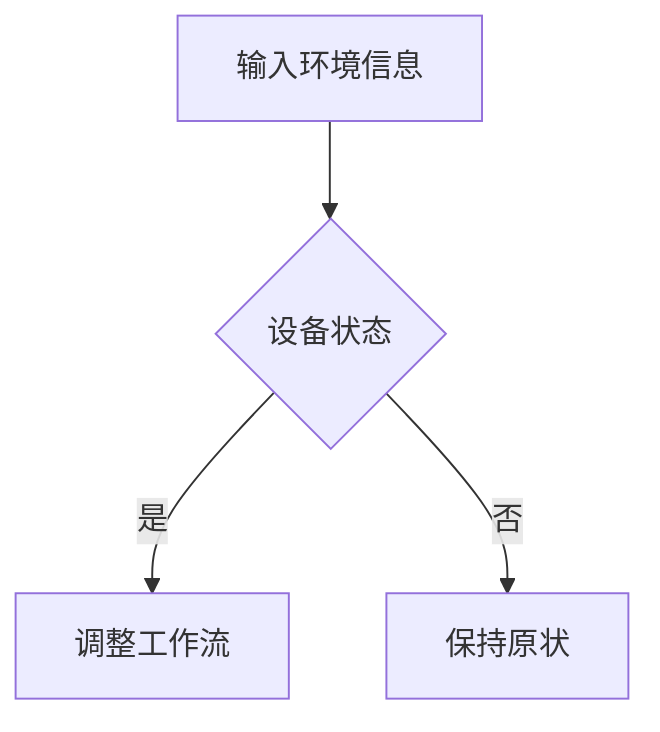

## 1.背景介绍

随着人工智能技术的不断发展，AI代理（AI Agent）正在逐渐成为现代软件架构中不可或缺的一部分。AI代理负责处理复杂的任务，例如识别图像、语音处理、机器学习算法等。然而，传统的AI代理工作流并没有充分利用情境智能（Context-Awareness），也缺乏动态调整能力。因此，如何实现情境智能与工作流动态调整之间的完美融合成为了当前研究的热点问题。

## 2.核心概念与联系

在探讨AI代理工作流的动态调整与情境智能的融合时，我们需要首先明确两个核心概念的关系：

### 2.1 情境智能（Context-Awareness）

情境智能是指系统能够理解和感知环境中的上下文，以便采取适当的行动。这需要系统具备以下能力：

1. **感知上下文：** 通过传感器或其他来源获取环境信息，如位置、时间、设备状态等。
2. **理解上下文：** 利用自然语言处理（NLP）技术、机器学习算法等对上下文进行分析、提取特征、识别模式。
3. **响应上下文：** 根据分析结果采取相应的行动，如调整工作流、触发其他服务等。

### 2.2 工作流动态调整

工作流动态调整是一种允许工作流根据不同的环境因素和业务需求进行实时调整的方法。它可以提高系统的灵活性、效率和可靠性。常见的动态调整策略包括：

1. **规则驱动调整：** 根据预定义的规则来调整工作流。
2. **机器学习驱动调整：** 利用机器学习算法预测未来状态，并进行调整。
3. **人工智能驱动调整：** 通过AI代理来实时分析环境信息并调整工作流。

## 3.核心算法原理具体操作步骤

为了实现情境智能与工作流动态调整的融合，我们需要设计一个合适的算法原理。以下是一个可能的操作步骤：

1. **感知环境：** 使用传感器或其他来源获取环境信息，并存储到数据库中。
2. **分析上下文：** 利用NLP技术、机器学习算法等对上下文进行分析、提取特征、识别模式。
3. **决策调整：** 根据分析结果，选择合适的动态调整策略，如规则驱动、机器学习驱动或人工智能驱动。
4. **执行调整：** 根据决策结果，调整工作流并触发相应的服务。

## 4.数学模型和公式详细讲解举例说明

在本篇文章中，我们将不会深入讨论数学模型和公式的详细讲解，因为这种内容通常需要与具体的技术和场景紧密结合。然而，以下是一个简单的示例：

假设我们要实现一个基于规则驱动的工作流动态调整系统。我们可以使用决策树（Decision Tree）作为我们的数学模型。决策树可以根据输入的环境信息（如位置、时间、设备状态等）来决定是否调整工作流。以下是一个简单的决策树示例：



## 5.项目实践：代码实例和详细解释说明

在本篇文章中，我们将不会提供具体的代码实例，因为这种内容通常需要与具体的技术和场景紧密结合。然而，以下是一个简单的示例：

假设我们要实现一个基于规则驱动的工作流动态调整系统。我们可以使用Python编程语言和Scikit-Learn库来实现决策树模型。以下是一个简单的代码示例：

```python
from sklearn.tree import DecisionTreeClassifier

# 输入环境信息
X = [
    {'设备状态': '在线', '位置': '办公室', '时间': '上午'},
    {'设备状态': '离线', '位置': '办公室', '时间': '下午'},
    {'设备状态': '在线', '位置': '家', '时间': '晚上'}
]
y = [1, 0, 0]

# 创建决策树模型
clf = DecisionTreeClassifier()
clf.fit(X, y)

# 输入新的环境信息，判断是否调整工作流
new_env_info = {'设备状态': '离线', '位置': '办公室', '时间': '下午'}
if clf.predict([new_env_info])[0] == 1:
    # 调整工作流
    print("调整工作流")
else:
    # 保持原状
    print("保持原状")
```

## 6.实际应用场景

AI代理工作流的动态调整与情境智能融合技术可以应用于许多领域，如智能家居、智能城市、工业自动化等。以下是一个简单的示例：

### 6.1 智能家居

在智能家居系统中，我们可以利用AI代理来感知环境信息（如设备状态、位置、时间等），并根据情境智能分析结果进行工作流动态调整。例如，当设备状态为“离线”且位置在“办公室”且时间在“下午”时，我们可以调整工作流，例如关闭灯光、降低空调温度等。

## 7.工具和资源推荐

以下是一些有助于实现AI代理工作流动态调整与情境智能融合的工具和资源：

1. **传感器：** Arduino、Raspberry Pi等设备，可以用于获取环境信息。
2. **自然语言处理库：** NLTK、SpaCy等，用于对上下文进行分析、提取特征、识别模式。
3. **机器学习库：** Scikit-Learn、TensorFlow、PyTorch等，用于实现机器学习算法。
4. **人工智能框架：** OpenAI Gym、Microsoft Bot Framework等，用于实现AI代理。

## 8.总结：未来发展趋势与挑战

随着人工智能技术的不断发展，AI代理工作流动态调整与情境智能融合将成为未来软件架构的重要趋势。然而，这种融合技术也面临着一些挑战，如数据隐私、安全性、算法复杂性等。因此，未来需要不断探索新的算法、技术和方法，以实现更高效、更安全、更智能的AI代理工作流。

## 9.附录：常见问题与解答

1. **Q：如何选择合适的动态调整策略？**

A：选择合适的动态调整策略需要根据具体的业务需求和场景特点。一般来说，可以考虑以下几种策略：

* 规则驱动：适用于规则性强、变化较少的场景。
* 机器学习驱动：适用于数据丰富、模式复杂的场景。
* 人工智能驱动：适用于需要实时响应、智能决策的场景。

1. **Q：如何保证数据隐私和安全性？**

A：保证数据隐私和安全性需要采用多种措施，如数据加密、访问控制、数据脱敏等。同时，可以利用联邦学习（Federated Learning）等技术，实现分布式训练、模型更新，降低数据泄露风险。

1. **Q：如何解决算法复杂性问题？**

A：解决算法复杂性问题，可以尝试以下方法：

* 选择简单、易于实现的算法，如决策树、随机森林等。
* 利用硬件加速器（如GPU、TPU等）来加速计算。
* 采用模型压缩和剪枝技术，减小模型大小和计算复杂性。

作者：禅与计算机程序设计艺术 / Zen and the Art of Computer Programming