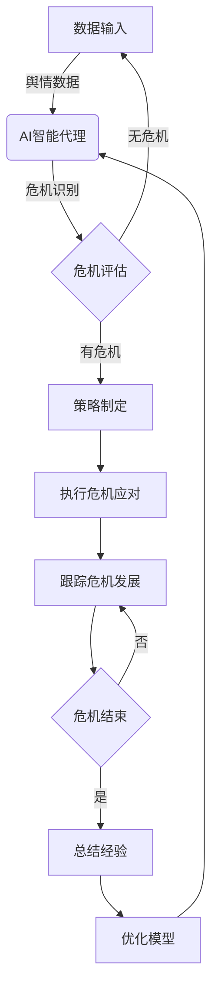
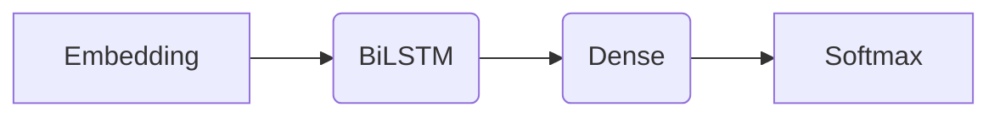

# AI人工智能代理工作流AI Agent WorkFlow：智能代理在公关危机管理系统中的应用

## 1.背景介绍

### 1.1 公关危机管理的重要性

在当今快节奏的商业环境中,公司面临着各种各样的风险和危机,无论是产品质量问题、环境污染事故还是舆论危机等,都可能对企业的声誉、业务运营和财务状况造成严重的负面影响。有效的公关危机管理对于保护企业形象、维护品牌价值和降低经济损失至关重要。

### 1.2 传统公关危机管理的挑战

传统的公关危机管理过程通常依赖于人工干预和经验判断,这种方式存在一些固有的缺陷和局限性:

- **反应滞后**:危机发生时,需要人工识别、分析和制定应对策略,这个过程往往需要一定的时间,导致反应迟缓。
- **决策缺乏一致性**:不同的人对同一危机可能会作出不同的判断和决策,缺乏一致性。
- **知识积累有限**:传统方式很难系统地积累和利用过去的危机管理经验。
- **处理能力有限**:面对大规模的舆情数据,人工处理能力往往会达到瓶颈。

### 1.3 AI智能代理在公关危机管理中的作用

人工智能(AI)技术的发展为公关危机管理带来了新的机遇。通过将AI智能代理集成到公关危机管理系统中,可以克服传统方式的局限性,提高危机响应的效率和质量。AI智能代理具有以下优势:

- **实时监控和预警**:可以持续监控各种渠道的舆情数据,及时发现潜在的危机信号。
- **智能分析和决策**:利用自然语言处理、机器学习等技术,对危机进行智能分析并提出应对策略。
- **自动化执行**:根据预先设定的规则和策略,自动执行相关的危机应对操作。
- **持续学习和优化**:通过积累历史数据,不断优化危机识别和处理模型。

通过AI智能代理的辅助,公关危机管理可以做到快速响应、高效处理和持续优化,从而最大限度地降低危机带来的负面影响。

## 2.核心概念与联系

### 2.1 AI智能代理

AI智能代理(AI Agent)是一种基于人工智能技术的软件系统,能够感知环境、分析数据、做出决策并执行相应的操作。在公关危机管理系统中,AI智能代理扮演着关键的角色,负责监控舆情数据、识别潜在危机、分析危机影响、制定应对策略并协调执行相关操作。

AI智能代理通常由以下几个核心组件构成:

1. **感知模块**:收集来自各种渠道(如社交媒体、新闻媒体、企业内部系统等)的相关数据,作为输入。
2. **分析模块**:利用自然语言处理、情感分析、主题挖掘等技术,对输入数据进行智能分析,识别潜在的危机信号。
3. **决策模块**:基于分析结果,结合预先定义的规则和策略,制定危机应对方案。
4. **执行模块**:协调各种资源(如公关团队、媒体渠道、社交媒体账号等),自动执行危机应对操作。
5. **学习模块**:持续收集和学习历史数据,优化危机识别和处理模型。

### 2.2 公关危机管理工作流程

公关危机管理工作流程通常包括以下几个关键步骤:

1. **监控**:持续监控各种渠道的舆情数据,发现潜在的危机信号。
2. **评估**:对危机的性质、影响范围和严重程度进行评估。
3. **策略制定**:根据危机评估结果,制定应对策略,包括目标、措施和资源配置等。
4. **执行**:协调各方资源,执行危机应对操作,如发布声明、开展媒体沟通、处理负面舆论等。
5. **跟踪**:持续跟踪危机发展情况,评估应对效果,并根据需要调整策略。
6. **总结**:危机结束后,总结经验教训,优化危机管理流程和模型。

AI智能代理可以深度融入到这个工作流程中,为每个步骤提供智能化的支持,提高危机管理的效率和质量。

### 2.3 AI智能代理与公关危机管理的集成

将AI智能代理集成到公关危机管理系统中,可以形成一个智能化的闭环流程,如下图所示:

在这个流程中,AI智能代理承担着核心的角色,负责持续监控舆情数据、识别潜在危机、评估危机影响、制定应对策略,并协调执行相关操作。同时,AI智能代理还会持续学习历史数据,不断优化危机识别和处理模型,形成一个自我完善的闭环。

通过这种集成,公关危机管理系统可以实现智能化、自动化和持续优化,从而提高危机响应的速度和质量,最大限度地降低危机带来的负面影响。

## 3.核心算法原理具体操作步骤

AI智能代理在公关危机管理系统中的核心算法原理和具体操作步骤如下:

### 3.1 舆情数据采集

第一步是从各种渠道(如社交媒体、新闻媒体、企业内部系统等)采集相关的舆情数据。这可以通过网络爬虫、API接口等技术实现。采集的数据包括文本内容、图像、视频等多种形式。

### 3.2 数据预处理

对采集的原始数据进行预处理,包括去重、清洗、格式化等操作,以确保数据的完整性和一致性。这个步骤通常涉及自然语言处理(NLP)技术,如分词、词性标注、命名实体识别等。

### 3.3 危机识别

利用机器学习和深度学习算法,从预处理后的数据中识别潜在的危机信号。这可以通过以下几种方式实现:

1. **基于规则的方法**:根据预定义的规则(如关键词、语句模式等)进行匹配,识别危机相关的内容。
2. **监督学习方法**:基于标注的历史数据,训练分类模型(如逻辑回归、支持向量机、深度神经网络等),对新数据进行危机与非危机的二分类。
3. **无监督学习方法**:利用聚类、主题模型等无监督算法,自动发现数据中的异常模式,作为潜在危机的信号。

### 3.4 危机评估

对识别出的潜在危机进行评估,包括危机的性质、影响范围、严重程度等方面。这可以通过以下方式实现:

1. **情感分析**:利用情感分析算法(如词典法、机器学习法、深度学习法等)分析相关内容的情感倾向,判断危机的严重程度。
2. **传播分析**:分析危机相关内容在各渠道的传播范围和速度,评估危机的影响力。
3. **主题挖掘**:通过主题模型(如LDA、BTM等)挖掘危机相关内容的主题,了解危机的具体性质和焦点。

### 3.5 策略制定

根据危机评估的结果,结合预先定义的规则和策略,制定危机应对方案。这可能涉及以下几个方面:

1. **目标设定**:明确危机应对的目标,如控制危机扩散、维护品牌形象、降低经济损失等。
2. **措施选择**:选择合适的应对措施,如发布声明、开展媒体沟通、处理负面舆论等。
3. **资源配置**:合理配置人力、财力等资源,确保措施的有效执行。
4. **时间安排**:制定危机应对的时间计划和路线图。

### 3.6 执行危机应对

协调各种资源(如公关团队、媒体渠道、社交媒体账号等),自动执行危机应对操作。这可能包括:

1. **内容生成**:根据策略,自动生成危机声明、回应文案等内容。
2. **内容发布**:通过多渠道发布相关内容,如官方网站、社交媒体平台等。
3. **互动管理**:监控各渠道的反馈,及时回应关键问题和负面舆论。
4. **流程协作**:与公关团队、相关部门进行协作,确保应对措施的顺利执行。

### 3.7 危机跟踪与模型优化

持续跟踪危机发展情况,评估应对效果,并根据需要调整策略。同时,将历史数据持续输入到AI模型中,通过机器学习算法不断优化危机识别和处理模型,提高系统的智能化水平。

这是一个循环的过程,AI智能代理会不断学习和进化,使公关危机管理系统的性能不断提升。

## 4.数学模型和公式详细讲解举例说明

在公关危机管理系统中,AI智能代理会广泛应用各种数学模型和算法,下面将详细介绍其中几个核心模型。

### 4.1 情感分析模型

情感分析是评估危机严重程度的重要手段。常用的情感分析模型包括:

1. **词典法**

词典法是一种基于情感词典的简单有效的方法。它根据文本中出现的积极词和消极词的数量,计算情感得分:

$$
\text{Score} = \frac{\sum\limits_{w \in \text{Positive}} \text{count}(w)}{\sum\limits_{w \in \text{All}} \text{count}(w)} - \frac{\sum\limits_{w \in \text{Negative}} \text{count}(w)}{\sum\limits_{w \in \text{All}} \text{count}(w)}
$$

其中,Positive表示积极词集合,Negative表示消极词集合,All表示全部词集合,count(w)表示词w在文本中出现的次数。

2. **机器学习法**

机器学习法通过训练数据建模,学习文本与情感之间的映射关系。常用的模型包括朴素贝叶斯、支持向量机、逻辑回归等。以逻辑回归为例,其模型如下:

$$
P(y=1|x) = \sigma(w^Tx + b)
$$

其中,x为文本特征向量,y为情感标签(0或1),w和b为模型参数,σ为sigmoid函数。

3. **深度学习法**

深度学习法利用神经网络自动学习文本的高阶语义特征,常用的模型包括CNN、RNN、Transformer等。以双向LSTM为例,其模型结构如下:

通过这些模型,可以较准确地判断危机相关内容的情感倾向,从而评估危机的严重程度。

### 4.2 主题模型

主题模型用于发现危机相关内容的潜在主题,了解危机的具体性质和焦点。常用的主题模型包括:

1. **LDA (Latent Dirichlet Allocation)**

LDA是一种经典的主题模型,它假设每个文档是由若干个潜在主题构成的,每个主题又由一组特征词表示。LDA的生成过程可以用如下公式描述:

$$
\begin{aligned}
\phi_k &\sim \text{Dirichlet}(\beta) \\
\theta_d &\sim \text{Dirichlet}(\alpha) \\
z_{d,n} &\sim \text{Multinomial}(\theta_d) \\
w_{d,n} &\sim \text{Multinomial}(\phi_{z_{d,n}})
\end{aligned}
$$

其中,φ表示主题-词分布,θ表示文档-主题分布,z表示主题分配,w表示观测词。通过吉布斯采样等方法可以估计出模型参数。

2. **BTM (Biterm Topic Model)**

BTM是LDA的扩展模型,它直接对词对(biterm)建