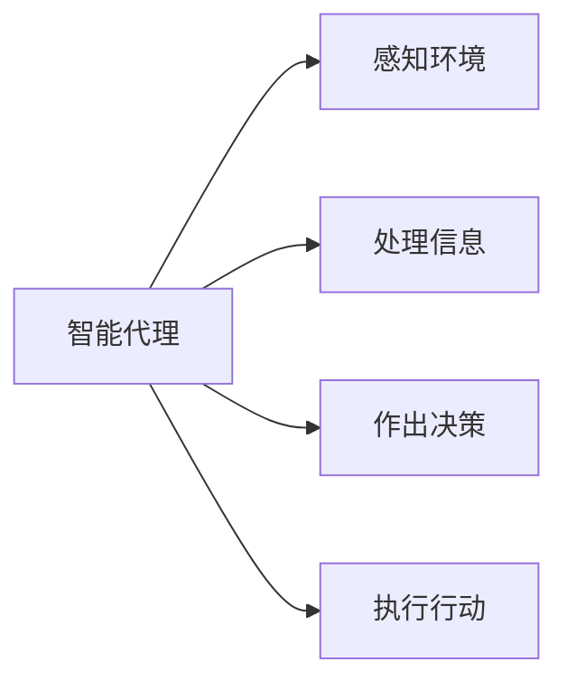

# AI人工智能代理工作流AI Agent WorkFlow：智能代理在档案管理系统中的应用

## 1. 背景介绍

在当今数字时代,信息量呈指数级增长,企业和组织面临着管理大量数字化文档和记录的挑战。传统的手动文档管理方式已经无法满足高效率和准确性的需求。因此,基于人工智能(AI)的智能代理系统应运而生,为档案管理系统带来了革命性的变革。

### 1.1 档案管理的重要性

档案管理对于企业和组织来说至关重要,它确保了信息的完整性、可追溯性和合规性。良好的档案管理有助于:

- 提高工作效率和生产力
- 满足法律法规的合规要求
- 保护知识产权和机密信息
- 支持决策过程和风险管理

### 1.2 传统档案管理的挑战

然而,传统的手动档案管理存在以下主要挑战:

- 人工分类和索引效率低下
- 检索速度缓慢且准确性有限
- 文档版本控制和追踪困难
- 安全性和访问控制难以管理

### 1.3 智能代理系统的优势

智能代理系统通过结合人工智能技术(如自然语言处理、机器学习和知识图谱等)与档案管理流程,为解决上述挑战提供了有力的解决方案。智能代理系统可以:

- 自动分类和索引文档
- 提供智能搜索和检索功能
- 实现自动化的文档版本控制
- 增强安全性和访问控制管理

## 2. 核心概念与联系

### 2.1 智能代理(Intelligent Agent)

智能代理是一种基于人工智能技术的软件实体,能够感知环境、处理信息、作出决策并执行行动。在档案管理系统中,智能代理扮演着关键角色,负责自动化处理各种文档相关任务。

### 2.2 工作流(Workflow)

工作流是一系列有序的任务活动,用于完成特定的业务目标。在档案管理系统中,智能代理通过执行预定义的工作流来自动化处理文档。

### 2.3 自然语言处理(NLP)

自然语言处理(NLP)是人工智能的一个分支,旨在使计算机能够理解、处理和生成人类语言。在档案管理系统中,NLP技术用于自动提取文档中的关键信息、分类文档以及支持智能搜索和检索。

### 2.4 机器学习(Machine Learning)

机器学习是人工智能的另一个重要分支,它使计算机系统能够基于数据自动学习和改进。在档案管理系统中,机器学习技术可用于训练模型,从而提高文档分类、索引和检索的准确性。

### 2.5 知识图谱(Knowledge Graph)

知识图谱是一种结构化的知识表示形式,它将实体、概念及其关系以图形的方式组织起来。在档案管理系统中,知识图谱可用于建立文档之间的语义关联,支持智能搜索和推理。

## 3. 核心算法原理具体操作步骤

智能代理在档案管理系统中的应用涉及多种算法和技术,下面将介绍其中几个核心算法的原理和具体操作步骤。

### 3.1 文档分类算法

文档分类是将文档自动归类到预定义的类别中,这是档案管理系统的基础功能之一。常用的文档分类算法包括:

1. **朴素贝叶斯分类器**

朴素贝叶斯分类器是一种基于贝叶斯定理的简单但有效的概率分类算法。它假设每个特征与其他特征是条件独立的,从而简化了计算过程。

算法步骤:

1) 从训练数据中计算每个类别的先验概率
2) 计算每个特征在每个类别下的条件概率
3) 对于新的文档,计算它属于每个类别的后验概率
4) 选择后验概率最大的类别作为预测结果

2. **支持向量机(SVM)**

支持向量机是一种基于结构风险最小化原理的有监督学习模型,通过构造最大间隔超平面来实现分类。

算法步骤:

1) 将训练数据映射到高维空间
2) 在高维空间中寻找最大间隔超平面
3) 将新的文档映射到同一空间
4) 根据超平面的一侧判断文档所属类别

3. **深度学习模型**

近年来,深度学习模型(如卷积神经网络和递归神经网络)在文档分类任务中表现出色。这些模型能够自动学习文档的高阶特征表示,提高分类准确性。

算法步骤:

1) 构建深度神经网络模型
2) 使用标注的训练数据对模型进行训练
3) 对新的文档进行预处理(如词向量化)
4) 将预处理后的文档输入模型,获取分类结果

### 3.2 文档索引算法

文档索引是为了加快文档检索的速度,常用的索引算法包括:

1. **倒排索引**

倒排索引是一种将文档中的词条与文档ID对应起来的数据结构,它是实现全文搜索的基础。

算法步骤:

1) 对文档进行分词和词条过滤
2) 为每个词条创建一个倒排列表
3) 在倒排列表中记录包含该词条的文档ID
4) 对倒排列表进行压缩和优化

2. **N-gram索引**

N-gram索引是基于文档中的字符N-gram(长度为N的字符串)构建的索引,常用于处理亚洲语言文档。

算法步骤:

1) 从文档中提取所有长度为N的字符N-gram
2) 为每个N-gram创建一个倒排列表
3) 在倒排列表中记录包含该N-gram的文档ID
4) 对倒排列表进行压缩和优化

3. **位置索引**

位置索引不仅记录文档ID,还记录了词条在文档中的位置信息,可用于支持短语搜索和邻近搜索。

算法步骤:

1) 对文档进行分词和词条过滤
2) 为每个词条创建一个倒排列表
3) 在倒排列表中记录包含该词条的文档ID和位置信息
4) 对倒排列表进行压缩和优化

### 3.3 文档检索算法

文档检索算法用于根据用户的查询从索引中检索相关文档。常用的检索算法包括:

1. **布尔模型**

布尔模型是最早的文档检索模型,它将查询表示为布尔表达式,并根据表达式的真值来确定文档是否相关。

算法步骤:

1) 将查询解析为布尔表达式
2) 从索引中获取每个查询词条对应的文档列表
3) 根据布尔运算规则合并文档列表
4) 返回满足布尔表达式的文档

2. **向量空间模型**

向量空间模型将文档和查询表示为向量,并根据向量之间的相似度来确定文档的相关性。

算法步骤:

1) 将文档和查询转换为词条向量
2) 计算文档向量和查询向量之间的相似度
3) 根据相似度对文档进行排序
4) 返回相似度最高的文档

3. **概率模型**

概率模型基于概率论原理,根据文档生成查询的概率来确定文档的相关性。

算法步骤:

1) 估计每个文档生成查询的概率
2) 根据概率对文档进行排序
3) 返回概率最高的文档

### 3.4 文档版本控制算法

在档案管理系统中,文档版本控制是一个重要功能,用于跟踪和管理文档的变更历史。常用的版本控制算法包括:

1. **差异编码算法**

差异编码算法通过记录文档版本之间的差异,从而节省存储空间。

算法步骤:

1) 对文档进行分块
2) 计算相邻版本之间每个块的差异
3) 仅存储差异数据和元数据
4) 根据差异数据和基线版本重构任意版本

2. **内容寻址存储算法**

内容寻址存储算法根据文档内容计算出唯一的标识符,并使用该标识符作为存储地址。

算法步骤:

1) 对文档内容计算哈希值作为内容标识符
2) 使用内容标识符作为存储地址
3) 存储新版本时,检查内容标识符是否已存在
4) 如果存在,则创建指向该内容的新版本元数据

3. **版本图算法**

版本图算法将文档版本之间的关系表示为有向无环图,可视化地管理版本历史。

算法步骤:

1) 创建初始版本节点
2) 对每个新版本,创建新节点并与上一版本连接
3) 支持分支和合并操作
4) 遍历版本图获取特定版本的内容

## 4. 数学模型和公式详细讲解举例说明

在档案管理系统中,许多算法和技术都涉及到数学模型和公式。下面将详细讲解其中几个常见的数学模型和公式。

### 4.1 文本相似度计算

在文档分类、检索和版本控制等任务中,经常需要计算两个文本之间的相似度。常用的文本相似度计算方法包括:

1. **余弦相似度**

余弦相似度是基于向量空间模型的一种相似度度量,它计算两个向量之间的夹角余弦值。

$$\text{sim}(X, Y) = \cos(\theta) = \frac{X \cdot Y}{\|X\| \|Y\|}$$

其中 $X$ 和 $Y$ 分别表示两个文本的向量表示,  $\theta$ 是它们之间的夹角。

2. **编辑距离**

编辑距离是一种字符串相似度度量,它计算将一个字符串转换为另一个字符串所需的最小编辑操作次数。

$$\text{dist}(X, Y) = \min\{\text{ins}(x, Y) + 1, \text{del}(x, Y) + 1, \text{sub}(x, y, X, Y) + 1\}$$

其中 $\text{ins}(x, Y)$ 表示在字符串 $Y$ 中插入字符 $x$ 所需的最小编辑距离,  $\text{del}(x, Y)$ 表示从字符串 $Y$ 中删除字符 $x$ 所需的最小编辑距离,  $\text{sub}(x, y, X, Y)$ 表示用字符 $y$ 替换字符 $x$ 所需的最小编辑距离。

### 4.2 文档分类模型

在文档分类任务中,常用的数学模型包括朴素贝叶斯模型和支持向量机模型。

1. **朴素贝叶斯模型**

朴素贝叶斯模型基于贝叶斯定理,计算一个文档属于某个类别的后验概率。

$$P(c_k | d) = \frac{P(c_k) P(d | c_k)}{P(d)}$$

其中 $P(c_k)$ 是类别 $c_k$ 的先验概率,  $P(d | c_k)$ 是文档 $d$ 在已知类别 $c_k$ 的条件下出现的概率,  $P(d)$ 是文档 $d$ 的边缘概率。

2. **支持向量机模型**

支持向量机模型通过构造最大间隔超平面来实现分类。

$$\begin{aligned}
\min_{\vec{w}, b} \quad & \frac{1}{2} \|\vec{w}\|^2 \\
\text{s.t.} \quad & y_i(\vec{w}^T \vec{x}_i + b) \geq 1, \quad i = 1, \ldots, n
\end{aligned}$$

其中 $\vec{w}$ 是超平面的法向量,  $b$ 是超平面的偏移量,  $\vec{x}_i$ 是第 $i$ 个训练样本,  $y_i \in \{-1, 1\}$ 是第 $i$ 