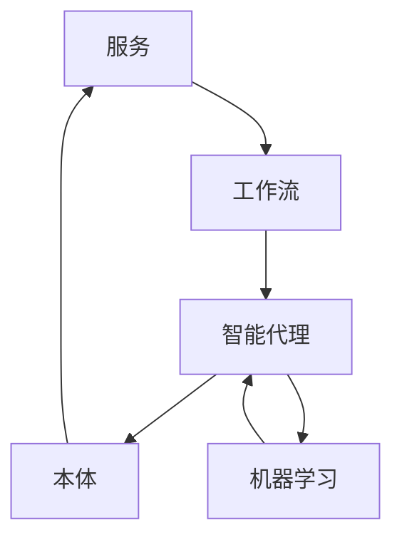

# AI人工智能代理工作流AI Agent WorkFlow：面向服务计算中的代理工作流管理

## 1. 背景介绍

### 1.1 服务计算的发展与挑战

随着互联网和云计算技术的快速发展,服务计算(Service Computing)已成为计算机科学领域的一个重要研究方向。服务计算旨在通过服务的方式提供计算资源,实现软件系统的灵活组合和动态调度,以满足不同应用场景的需求。然而,服务计算也面临着诸多挑战,例如服务的发现与组合、服务质量保证、服务的安全与隐私等问题。

### 1.2 人工智能在服务计算中的应用

近年来,人工智能技术取得了长足进步,并在各个领域得到广泛应用。将人工智能引入服务计算,可以有效解决服务计算面临的诸多挑战。例如,利用机器学习算法可以实现智能化的服务发现与组合;采用深度学习技术可以对服务质量进行预测和优化;运用区块链等技术可以保障服务的安全与隐私。因此,人工智能与服务计算的结合已成为学术界和工业界共同关注的热点。

### 1.3 代理工作流的概念与优势

在服务计算环境下,工作流(Workflow)是一种重要的服务组合模式,用于描述服务之间的调用关系和执行顺序。传统的工作流管理系统通常采用中心化的架构,由单一的工作流引擎负责工作流的调度与执行。这种架构存在单点故障、可扩展性差等问题。为了克服这些不足,研究者提出了代理工作流(Agent Workflow)的概念。

代理工作流借鉴了多智能体系统的思想,将工作流的管理与执行任务分配给多个智能代理(Intelligent Agent),通过代理间的协作与交互来完成工作流的调度与优化。与传统工作流相比,代理工作流具有以下优势:

1. 分布式架构,避免单点故障,提高系统可用性。
2. 去中心化管理,代理可自主决策,减轻中心节点负担。
3. 动态适应性强,能够根据环境变化动态调整工作流。
4. 可扩展性好,易于添加新的服务与代理。

## 2. 核心概念与联系

### 2.1 服务(Service)

服务是一种自包含、自描述、模块化的软件实体,通过标准化接口提供特定的功能。服务具有平台无关性和松耦合特征,可以被其他服务或应用程序调用。在服务计算中,一切都可以视为服务,包括计算资源、存储资源、软件组件、数据资源等。

### 2.2 工作流(Workflow)

工作流是一种抽象的业务过程建模方法,用于描述服务之间的调用关系和控制流。一个工作流由一系列活动(Activity)组成,每个活动对应一个服务。活动之间通过控制结构(如顺序、并行、选择等)来定义执行顺序。工作流的执行由工作流引擎负责,包括活动的调度、服务的调用、数据的传递等。

### 2.3 智能代理(Intelligent Agent)

智能代理是一种具有自主性、社会性、反应性、主动性等特征的软件实体。智能代理能够感知环境的变化,根据自身的知识与目标做出决策,并采取相应的行动。在多智能体系统中,代理之间通过通信与协作来共同完成复杂任务。将智能代理引入工作流管理,可以实现工作流的分布式调度与优化。

### 2.4 本体(Ontology)

本体是对特定领域知识的形式化描述,包括概念、属性、关系等。本体可以为不同系统间的知识共享与交换提供统一的语义基础。在服务计算中,本体常用于服务的语义描述与匹配。通过定义服务本体,可以实现服务的自动发现、组合与适配。本体也是实现智能代理推理与决策的重要知识源。

### 2.5 概念联系

在AI代理工作流中,服务是工作流活动的基本组成单元,工作流定义了服务之间的逻辑关系。智能代理作为工作流的管理者与执行者,根据服务的语义描述(本体)来发现和选择合适的服务,通过协商与协作来优化工作流的执行。同时,代理利用机器学习算法不断积累知识和经验,对工作流进行自适应优化。下图展示了这些概念之间的联系:

## 3. 核心算法原理具体操作步骤

### 3.1 服务发现与选择算法

服务发现是指根据工作流活动的要求,从服务注册中心找到功能匹配的候选服务集合。服务选择是指从候选服务集合中选出最优服务。服务发现与选择的核心是服务匹配算法,主要分为以下几个步骤:

1. 服务描述:使用本体语言(如OWL-S、WSMO等)对服务的功能、输入输出、前置条件、效果等进行语义描述。
2. 服务请求:工作流活动根据本体定义服务请求,包括所需功能、QoS约束等。
3. 语义匹配:计算服务描述与服务请求之间的语义相似度,常用算法有基于特征的匹配、基于概念的匹配等。
4. 服务排序:根据语义匹配度和QoS等指标对候选服务进行排序,选择最优服务。
5. 服务调用:代理调用选中的服务,并将结果返回给工作流引擎。

### 3.2 工作流动态优化算法

工作流在执行过程中,可能会受到各种内外部因素的影响,导致执行效率下降或无法满足约束条件。因此需要在线动态优化工作流,主要采用启发式搜索和强化学习等算法:

1. 工作流建模:将工作流抽象为有向无环图(DAG),节点表示活动,边表示数据依赖。
2. 约束定义:定义工作流需要满足的时间、成本、可靠性等QoS约束。
3. 搜索空间构建:将工作流中每个活动的候选服务组合形成搜索空间。
4. 搜索算法:采用启发式搜索算法(如A*、蚁群等)在搜索空间中寻找满足约束的最优服务组合。
5. 强化学习:将服务组合视为智能体的动作,以工作流的QoS为奖励,通过Q-learning等算法学习最优服务组合策略。
6. 动态调整:在工作流执行过程中,根据环境变化动态调用搜索和学习算法,对服务绑定进行实时调整。

### 3.3 跨组织工作流协同算法

在实际应用中,工作流往往跨越多个组织,不同组织间的工作流需要协同执行。跨组织工作流协同面临的主要挑战是组织间的信任与安全问题,以及全局工作流优化。可以采用以下基于区块链和博弈论的协同算法:

1. 区块链建模:将不同组织的工作流活动抽象为区块链网络中的节点,活动间的消息传递对应区块链交易。
2. 智能合约:使用智能合约定义跨组织工作流的执行规则和约束条件,并对各参与方的行为进行监管。
3. 博弈论建模:将跨组织协同问题建模为参与方之间的博弈,每个参与方根据自身效用最大化原则选择策略。
4. 纳什均衡求解:设计博弈机制,使得跨组织工作流的执行达到纳什均衡,即每个参与方无法通过单方面改变策略获得更高效用。
5. 激励机制:引入声誉、代币等激励机制,对诚实守信的参与方给予奖励,对恶意节点进行惩罚,维护协同系统的可信运行。

## 4. 数学模型和公式详细讲解举例说明

### 4.1 服务匹配的相似度计算

设服务描述为$S$,服务请求为$R$,它们都由本体概念$C_i$组成。定义$S$和$R$的语义相似度为:

$$
sim(S,R) = \frac{\sum_{i=1}^{n} w_i \cdot sim(C_i^S, C_i^R)}{\sum_{i=1}^{n} w_i}
$$

其中,$w_i$为概念$C_i$的权重,$sim(C_i^S, C_i^R)$为两个概念的相似度,可以用以下公式计算:

$$
sim(C_i^S, C_i^R) = \frac{2 \cdot depth(LCA(C_i^S, C_i^R))}{depth(C_i^S) + depth(C_i^R)}
$$

其中,$LCA(C_i^S, C_i^R)$表示两个概念在本体中最近的公共祖先概念,$depth(C)$表示概念$C$在本体中的深度。

举例来说,假设服务描述$S$和请求$R$都包含概念"酒店预订",在本体中该概念的深度为4,则它们在这个概念上的相似度为1。如果$S$还包含"信用卡支付"(深度5),而$R$包含"在线支付"(深度4),两个概念的最近公共祖先是"支付"(深度3),则相似度为:

$$
sim(信用卡支付,在线支付) = \frac{2 \times 3}{5 + 4} = 0.67
$$

### 4.2 工作流QoS聚合计算

设工作流$W$由$n$个活动$A_i$组成,每个活动绑定服务$S_i$。定义$W$的QoS向量为:

$$
\overrightarrow{QoS}(W) = [T(W), C(W), R(W), A(W)]
$$

其中,$T(W)$为工作流执行时间,$C(W)$为执行成本,$R(W)$为可靠性,$A(W)$为可用性。这些指标可以根据工作流模式进行聚合计算,例如对于顺序模式:

$$
\begin{aligned}
T(W) &= \sum_{i=1}^{n} T(S_i) \\
C(W) &= \sum_{i=1}^{n} C(S_i) \\
R(W) &= \prod_{i=1}^{n} R(S_i) \\
A(W) &= \prod_{i=1}^{n} A(S_i)
\end{aligned}
$$

而对于并行模式:

$$
\begin{aligned}
T(W) &= \max_{i=1}^{n} T(S_i) \\
C(W) &= \sum_{i=1}^{n} C(S_i) \\
R(W) &= \prod_{i=1}^{n} R(S_i) \\
A(W) &= \prod_{i=1}^{n} A(S_i)
\end{aligned}
$$

举例来说,假设一个顺序工作流包含三个活动,它们绑定的服务QoS为:

$$
\begin{aligned}
\overrightarrow{QoS}(S_1) &= [10, 50, 0.95, 0.98] \\ 
\overrightarrow{QoS}(S_2) &= [15, 60, 0.98, 0.97]\\ 
\overrightarrow{QoS}(S_3) &= [12, 45, 0.99, 0.96]
\end{aligned}
$$

则该工作流的QoS为:

$$
\begin{aligned}
T(W) &= 10 + 15 + 12 = 37 \\
C(W) &= 50 + 60 + 45 = 155 \\
R(W) &= 0.95 \times 0.98 \times 0.99 = 0.922 \\
A(W) &= 0.98 \times 0.97 \times 0.96 = 0.912
\end{aligned}
$$

### 4.3 跨组织协同博弈均衡

设有$n$个组织参与跨组织工作流协同,组织$i$的工作流为$W_i$,策略空间为$\Sigma_i$,效用函数为$u_i$。定义跨组织协同博弈为:

$$
G = \langle N, (\Sigma_i)_{i \in N}, (u_i)_{i \in N} \rangle
$$

其中,$N=\{1,2,\cdots,n\}$为参与组织的集合。博弈的纳什均衡是一个策略组合$\sigma^*