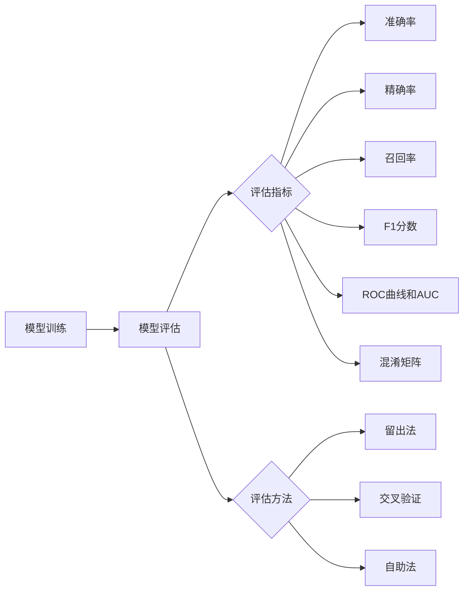

# AI人工智能核心算法原理与代码实例讲解：模型评估

## 1. 背景介绍
### 1.1 模型评估的重要性
### 1.2 模型评估在机器学习中的作用
### 1.3 模型评估与模型选择的关系

## 2. 核心概念与联系
### 2.1 模型评估指标
#### 2.1.1 准确率(Accuracy)
#### 2.1.2 精确率(Precision)
#### 2.1.3 召回率(Recall)
#### 2.1.4 F1分数(F1-Score)
#### 2.1.5 ROC曲线和AUC
#### 2.1.6 混淆矩阵(Confusion Matrix)
### 2.2 模型评估方法 
#### 2.2.1 留出法(Hold-out)
#### 2.2.2 交叉验证(Cross Validation)
#### 2.2.3 自助法(Bootstrap)
### 2.3 模型评估指标和方法之间的联系



## 3. 核心算法原理具体操作步骤
### 3.1 分类模型评估
#### 3.1.1 二分类模型评估步骤
#### 3.1.2 多分类模型评估步骤
### 3.2 回归模型评估
#### 3.2.1 均方误差(MSE)
#### 3.2.2 均方根误差(RMSE)
#### 3.2.3 平均绝对误差(MAE)
#### 3.2.4 R平方(R-Squared)
### 3.3 聚类模型评估
#### 3.3.1 轮廓系数(Silhouette Coefficient)  
#### 3.3.2 Calinski-Harabasz指数
#### 3.3.3 Davies-Bouldin指数

## 4. 数学模型和公式详细讲解举例说明
### 4.1 分类模型评估指标
#### 4.1.1 准确率
$$Accuracy = \frac{TP+TN}{TP+TN+FP+FN}$$
其中，TP为真正例，TN为真反例，FP为假正例，FN为假反例。
#### 4.1.2 精确率 
$$Precision = \frac{TP}{TP+FP}$$
#### 4.1.3 召回率
$$Recall = \frac{TP}{TP+FN}$$
#### 4.1.4 F1分数
$$F1 = 2 \cdot \frac{Precision \cdot Recall}{Precision + Recall} = \frac{2TP}{2TP+FP+FN}$$
### 4.2 回归模型评估指标
#### 4.2.1 均方误差(MSE)
$$MSE = \frac{1}{n}\sum_{i=1}^n(y_i-\hat{y}_i)^2$$
其中，$y_i$为真实值，$\hat{y}_i$为预测值，$n$为样本数。
#### 4.2.2 均方根误差(RMSE) 
$$RMSE = \sqrt{\frac{1}{n}\sum_{i=1}^n(y_i-\hat{y}_i)^2}$$
#### 4.2.3 平均绝对误差(MAE)
$$MAE = \frac{1}{n}\sum_{i=1}^n |y_i-\hat{y}_i|$$
#### 4.2.4 R平方(R-Squared)
$$R^2 = 1-\frac{\sum_{i=1}^n(y_i-\hat{y}_i)^2}{\sum_{i=1}^n(y_i-\bar{y})^2}$$
其中，$\bar{y}$为$y$的均值。

## 5. 项目实践：代码实例和详细解释说明
### 5.1 分类模型评估实例
```python
from sklearn.datasets import load_iris
from sklearn.model_selection import train_test_split
from sklearn.svm import SVC
from sklearn.metrics import accuracy_score, precision_score, recall_score, f1_score

# 加载鸢尾花数据集
iris = load_iris()
X = iris.data
y = iris.target

# 划分训练集和测试集
X_train, X_test, y_train, y_test = train_test_split(X, y, test_size=0.2, random_state=42)

# 训练SVM分类器
clf = SVC()
clf.fit(X_train, y_train)

# 在测试集上进行预测
y_pred = clf.predict(X_test)

# 计算评估指标
accuracy = accuracy_score(y_test, y_pred)
precision = precision_score(y_test, y_pred, average='macro')
recall = recall_score(y_test, y_pred, average='macro')  
f1 = f1_score(y_test, y_pred, average='macro')

print("Accuracy: {:.2f}".format(accuracy))
print("Precision: {:.2f}".format(precision))
print("Recall: {:.2f}".format(recall))
print("F1-score: {:.2f}".format(f1))
```

以上代码使用scikit-learn加载鸢尾花数据集，并将其划分为训练集和测试集。然后训练一个SVM分类器，在测试集上进行预测，并计算准确率、精确率、召回率和F1分数等评估指标。

### 5.2 回归模型评估实例
```python
from sklearn.datasets import load_boston
from sklearn.model_selection import train_test_split
from sklearn.linear_model import LinearRegression
from sklearn.metrics import mean_squared_error, mean_absolute_error, r2_score

# 加载波士顿房价数据集
boston = load_boston()
X = boston.data
y = boston.target

# 划分训练集和测试集  
X_train, X_test, y_train, y_test = train_test_split(X, y, test_size=0.2, random_state=42)

# 训练线性回归模型
reg = LinearRegression()
reg.fit(X_train, y_train)

# 在测试集上进行预测
y_pred = reg.predict(X_test)

# 计算评估指标
mse = mean_squared_error(y_test, y_pred)
rmse = mean_squared_error(y_test, y_pred, squared=False)
mae = mean_absolute_error(y_test, y_pred)
r2 = r2_score(y_test, y_pred)

print("MSE: {:.2f}".format(mse))
print("RMSE: {:.2f}".format(rmse)) 
print("MAE: {:.2f}".format(mae))
print("R-squared: {:.2f}".format(r2))
```

以上代码使用scikit-learn加载波士顿房价数据集，并将其划分为训练集和测试集。然后训练一个线性回归模型，在测试集上进行预测，并计算均方误差(MSE)、均方根误差(RMSE)、平均绝对误差(MAE)和R平方等评估指标。

## 6. 实际应用场景
### 6.1 金融风控中的模型评估
### 6.2 医疗诊断中的模型评估
### 6.3 推荐系统中的模型评估
### 6.4 自然语言处理中的模型评估

## 7. 工具和资源推荐
### 7.1 scikit-learn
### 7.2 TensorFlow
### 7.3 PyTorch
### 7.4 Keras

## 8. 总结：未来发展趋势与挑战
### 8.1 模型评估指标的选择
### 8.2 不平衡数据集的模型评估
### 8.3 模型评估与模型解释性
### 8.4 自动机器学习中的模型评估

## 9. 附录：常见问题与解答
### 9.1 如何选择合适的评估指标？
### 9.2 交叉验证的优缺点是什么？
### 9.3 如何处理样本不平衡问题？
### 9.4 模型评估与超参数调优的关系？

作者：禅与计算机程序设计艺术 / Zen and the Art of Computer Programming