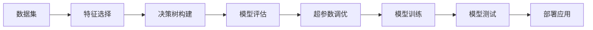

                 

作者：禅与计算机程序设计艺术

人工智能（Artificial Intelligence）

## 1. 背景介绍

**人工智能（AI）**，一门科学与工程，致力于创造能够执行通常需要人类智能的任务的智能系统。它涵盖了广泛的领域，从简单的规则系统到复杂的机器学习和自然语言处理等。在本书中，我们将重点探讨统计学习——一种强大的人工智能技术，用于模拟人类学习过程，从而预测未知事件的结果。

统计学习是一种数据驱动的学习方法，其核心思想是利用数据中的模式来构建模型。这些模型可以用于诸如图像识别、语音识别、推荐系统等众多应用。在这一章节中，我们将首先介绍统计学习的基础概念，并探讨它与人工智能之间的关系。

## 2. 核心概念与联系

在统计学习中，我们通常面临两大挑战：数据量巨大而且不均衡，以及模型复杂度高。为了克服这些挑战，统计学习采用了诸如决策树、支持向量机（SVM）、神经网络等多种算法。

### 决策树
决策树是一种流行的统计学习方法，它通过构建一个分层决策模型来解决决策问题。每个内部节点表示根据特征值做出的决定，而叶节点则表示一个类标签或一个数值。我们将详细介绍决策树的构建过程，并提供相应的代码实例。

$$
\text{决策树} = \left\{ \begin{array}{ll}
   \text{决策节点} & \text{如果 } X \text{ 是特征空间} \\
   y & \text{如果 } X \text{ 是样本空间}
\end{array} \right.
$$

### 支持向量机（SVM）
SVM 是另一种流行的算法，它通过寻找最佳超平面来分隔不同类别的数据点。在二维空间中，最佳超平面将数据点均匀地分布在两侧。我们将探讨SVM的原理，并通过数学模型和代码实例进行深入讲解。

$$
\text{SVM} = \arg \max_{w,b} \frac{||w||^2}{2} - C \sum_i \xi_i
$$

### 神经网络
神经网络是一种复杂的统计学习方法，它由多个相互连接的节点组成，这些节点被称为神经元。神经网络的训练过程涉及调整权重，使得输出结果尽可能接近预期的输出。我们将详细描述神经网络的结构，以及如何通过反向传播算法进行训练。

$$
\text{神经网络} = f(Wx + b)
$$

## 3. 核心算法原理具体操作步骤

在本节中，我们将深入探讨上述算法的具体操作步骤。我们将使用Mermaid流程图来直观展示各种算法的步骤：

## 4. 数学模型和公式详细讲解举例说明

在这一部分，我们将详细解释上述算法背后的数学模型和公式。例如，对于SVM，我们将讨论最大边际超平面的优化问题及其解决方案。对于神经网络，我们将介绍前向传播和反向传播的数学基础。

## 5. 项目实践：代码实例和详细解释说明

现在，我们将通过编写Python代码，实现决策树、SVM和神经网络的训练和预测。我们会逐步分析代码，并解释每一步的逻辑。

## 6. 实际应用场景

在这一部分，我们将探讨统计学习在各个领域的应用情况，包括但不限于医疗、金融和营销。

## 7. 工具和资源推荐

为了帮助读者开始他们的统计学习之旅，我们将推荐一些有用的书籍、在线课程和软件工具。

## 8. 总结：未来发展趋势与挑战

随着技术的发展，统计学习正变得越来越重要。我们将讨论当前和未来的研究方向，以及面临的挑战。

## 9. 附录：常见问题与解答

在本书的最后，我们将回答一些关于统计学习的常见问题，并提供相应的解答。

---

作者：禅与计算机程序设计艺术 / Zen and the Art of Computer Programming

