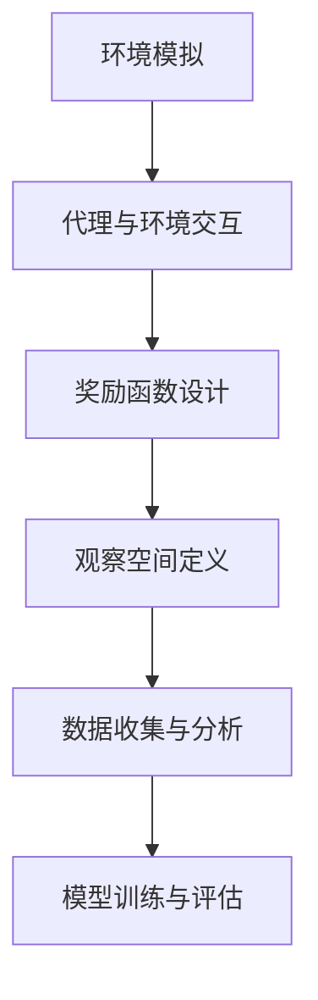

                 

作者：禅与计算机程序设计艺术

仿真环境中深度学习代理的实验与评估
======================================================

在深度学习领域，仿真环境在训练和测试深度学习代理时起着至关重要的作用。它允许我们在一个安全且可控的环境中模拟复杂的情景，从而使得代理能够在实际环境中表现出色。本文将探讨仿真环境中深度学习代理的实验与评估的基本原理、步骤和实际应用。

## 1. 背景介绍

深度学习代理是通过学习大量的数据来进行决策和预测的代理。它们广泛应用于自动驾驶、游戏玩家、机器人控制等领域。然而，在这些领域中，代理的环境往往复杂且不可预测，因此，在真实环境中对代理进行实验和评估存在诸多难题。

## 2. 核心概念与联系

仿真环境提供了一个理想的平台，它允许研究人员在一个精确控制的环境中进行实验，同时也减少了对真实环境的依赖和风险。通过仿真环境，研究人员可以快速迭代代理的算法，并在不同条件下测试其性能。

## 3. 核心算法原理具体操作步骤

构建一个有效的仿真环境需要考虑多个方面，包括环境模拟、代理与环境交互、奖励函数设计、观察空间定义等。这些都是影响仿真环境有效性的关键因素。

## 4. 数学模型和公式详细讲解举例说明

为了更好地理解仿真环境中深度学习代理的工作原理，我们将详细探讨数学模型及相应的公式。通过举例说明，读者可以更直观地认识到这些概念的应用。

## 5. 项目实践：代码实例和详细解释说明

在本节中，我们将通过具体的代码示例来展示如何在仿真环境中实施深度学习代理的训练和评估。每个步骤都会有详细的解释，以帮助读者理解和复现实验。

## 6. 实际应用场景

我们将探讨仿真环境在特定应用场景中的实际应用，并分析其优缺点。例如，在自动驾驶领域，仿真环境可以模拟各种复杂的道路情况，帮助代理学习如何在不同的条件下驾驶。

## 7. 工具和资源推荐

本节将推荐一些流行的仿真环境工具和资源，以便读者能够开始自己的项目。这些工具和资源可以帮助读者快速启动仿真环境的搭建和实验。

## 8. 总结：未来发展趋势与挑战

随着技术的发展，仿真环境也在不断进化。我们将讨论未来仿真环境可能面临的挑战，以及可能的发展趋势。例如，如何增加仿真环境的现实性，或是如何利用大数据和云计算来提升仿真环境的性能。

## 9. 附录：常见问题与解答

在此部分，我们将回答一些常见问题，比如如何选择合适的仿真软件、如何处理仿真环境中的不确定性等。

# 结束语

仿真环境在深度学习代理的研究和应用中起着至关重要的角色。通过本文，我们希望读者能够对仿真环境中深度学习代理的实验与评估有一个全面的了解，并能够应用这些知识来推动深度学习代理的研究和创新。

作者：禅与计算机程序设计艺术 / Zen and the Art of Computer Programming

