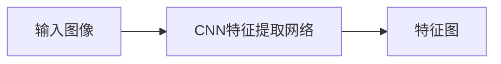
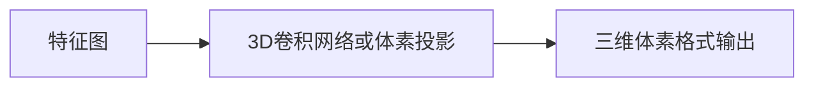
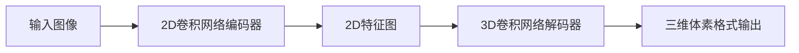
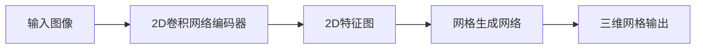
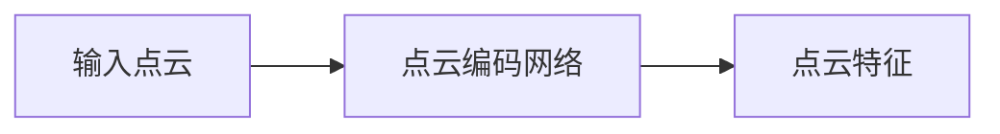
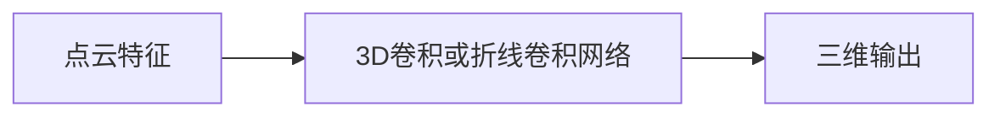
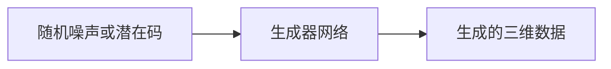
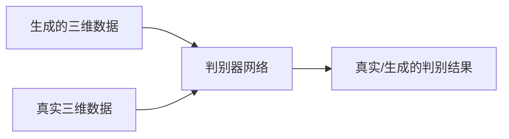
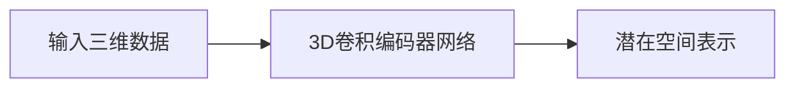
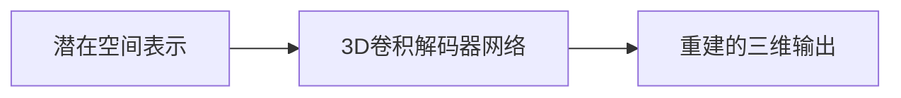

# AI人工智能深度学习算法：在三维建模中的应用

## 1.背景介绍

### 1.1 三维建模的重要性

在当今数字时代,三维建模技术已经广泛应用于各个领域,包括电影特效、游戏开发、工业设计、医疗可视化等。三维建模不仅能够创建逼真的虚拟场景,还可以模拟物理过程,预测结果,优化设计等,为现实世界提供宝贵的参考和支持。

### 1.2 三维建模的挑战

然而,传统的三维建模方法通常需要大量的人工干预,费时费力。比如,创建一个复杂的三维模型需要专业人员耗费数周甚至数月的时间。此外,手工建模的结果也容易受到主观因素的影响,难以保证一致性和准确性。

### 1.3 AI深度学习算法的优势

近年来,人工智能尤其是深度学习算法在计算机视觉、自然语言处理等领域取得了突破性进展,为三维建模带来了新的契机。深度学习算法能够从大量数据中自动学习特征,捕捉复杂的模式,从而有望实现三维建模的自动化和智能化。

## 2.核心概念与联系

### 2.1 三维重建

三维重建是指从二维图像或点云数据等输入,重建出三维物体的形状和结构。这是三维建模的基础,也是深度学习算法在该领域的主要应用场景之一。

常见的三维重建方法包括基于多视图几何的重建、基于体素的重建、基于点云的重建等。深度学习算法可以从海量图像数据中学习到三维物体的特征表示,提高重建的精度和效率。

### 2.2 形状生成

形状生成旨在直接从种子输入(如随机噪声或低维潜在码)生成目标三维形状,而无需经过三维重建的中间步骤。这种方法具有更大的灵活性,可以创建全新的形状,而不仅限于重建已有的物体。

生成对抗网络(GAN)是形状生成的一种常用框架,通过生成器和判别器的对抗训练,可以学习到目标形状的概率分布,并从中采样生成新的形状。变分自编码器(VAE)等模型也可以用于形状生成。

### 2.3 形状编辑

形状编辑的目标是对已有的三维模型进行智能化的编辑和修改,包括细化、平滑、补全、形变等操作。这对于修复损坏的三维数据、个性化定制等场景非常有用。

基于深度学习的形状编辑算法通常会学习到三维形状的潜在空间表示,并在该空间中执行编辑操作,最终将编辑后的潜在码解码为修改后的三维形状。

### 2.4 形状理解

形状理解指的是对三维形状的语义属性和结构进行理解,包括分割、分类、检测物体组件、估计形状属性等任务。这种理解对于后续的形状编辑、检索等操作至关重要。

深度学习算法可以从大量标注数据中学习到形状的特征表示,并基于此进行高层次的理解任务。例如,基于点云的深度网络可以对物体进行语义分割。

### 2.5 形状表示

上述各项任务的关键在于如何高效、紧凑地表示三维形状,使之便于深度网络进行处理。常见的形状表示方式包括体素格式、点云、网格、隐式函数等。不同的表示方式在精度、连续性、内存占用等方面有不同的权衡取舍。

深度学习算法需要针对不同的形状表示方式设计合适的网络结构和损失函数,以充分挖掘其潜力。同时,也有一些统一的框架试图同时处理多种形状表示。

## 3.核心算法原理具体操作步骤  

### 3.1 基于多视图的三维重建

基于多视图的三维重建算法利用从不同角度拍摄的二维图像,根据多视几何原理重建出三维物体的形状。这种方法具有较高的精度,但需要事先标定相机内外参数,并解决图像配准等问题。

深度学习在该领域的应用主要分为两个部分:特征提取和三维重建。

#### 3.1.1 特征提取

1. 将输入的多视图图像送入卷积神经网络(CNN),提取图像的特征表示。
2. CNN的网络结构可以采用流行的模型如VGG、ResNet等,也可以根据任务需求定制设计。
3. 特征提取网络的输出是一系列特征图,编码了图像的局部和全局特征。

#### 3.1.2 三维重建

1. 将提取到的特征图输入到三维卷积网络或体素投影层,重建出三维体素格式的输出。
2. 三维卷积网络可以学习到三维形状的特征表示,并生成相应的体素输出。
3. 体素投影层则是将多视图特征投影到三维空间,形成初始的三维体素表示。
4. 输出的三维体素格式可以进一步转换为其他格式如点云或网格,以满足不同的需求。

常见的基于多视图的三维重建网络包括3D-R2N2、LSM、MVSNet等。这些网络在公开的多视图三维重建数据集上取得了不错的性能。

### 3.2 基于单视图的三维重建

基于单视图的三维重建算法则是一个更加具有挑战性的问题。由于只有一个视角的二维图像输入,需要网络学习到如何推断出三维形状,这是一个典型的逆问题。

#### 3.2.1 基于体素的方法

1. 将输入图像送入2D卷积网络,提取图像的特征表示。
2. 将编码器输出的2D特征图输入到3D卷积解码器网络。
3. 解码器网络将2D特征图解码为3D体素格式的输出,即最终的三维重建结果。

代表性的基于体素的单视图三维重建网络有3D-R2N2、VRN等。这些网络能够从单个图像中重建出较为精确的三维形状,但受限于体素表示的内存占用和分辨率限制。

#### 3.2.2 基于网格的方法 

1. 输入图像经过2D卷积网络编码器提取特征。
2. 编码器输出的特征图被送入网格生成网络。
3. 网格生成网络将特征图解码为三维网格格式的输出,作为最终的三维重建结果。

网格表示相比体素更加紧凑高效,可以表示细节丰富的三维形状。常见的基于网格的单视图三维重建网络包括AtlasNet、Pixel2Mesh等。

### 3.3 基于点云的三维重建

点云是一种广泛使用的三维数据格式,可以直接从深度相机或激光雷达等设备获取。基于点云的三维重建算法通常将点云数据直接输入到深度网络,学习点云的特征表示,并重建出完整的三维形状。

#### 3.3.1 点云编码

1. 将原始点云数据输入到点云编码网络,例如PointNet++。
2. 点云编码网络学习点云的局部和全局特征表示。
3. 编码网络的输出是编码后的点云特征,为后续的三维重建提供特征支持。

#### 3.3.2 三维重建

1. 将编码后的点云特征输入到3D卷积网络或专门的折线卷积网络。
2. 网络对点云特征进行解码和上采样,生成密集的三维输出。
3. 输出可以是体素格式、网格格式或折线级别的点云输出。

常见的基于点云的三维重建网络包括3D-EPN、PU-Net等。这些网络能够直接从原始点云数据中学习特征,重建出高质量的三维模型。

### 3.4 基于GAN的三维形状生成

生成对抗网络(GAN)是近年来在图像、语音、三维数据生成等领域取得突破性进展的重要模型。在三维形状生成任务中,GAN也展现出了强大的能力。

#### 3.4.1 生成器

1. 生成器网络的输入可以是随机噪声,也可以是从训练数据编码得到的低维潜在码。
2. 生成器通过上采样、卷积等操作,将输入的噪声或潜在码解码为所需的三维输出格式,如体素、点云或网格。
3. 生成器网络的目标是生成逼真、多样化的三维形状数据。

#### 3.4.2 判别器

1. 判别器网络同时接收生成器生成的三维数据和真实的三维训练数据。
2. 判别器通过学习两者的特征差异,输出一个真实/生成的判别结果。
3. 判别器的目标是能够正确区分生成数据和真实数据。

#### 3.4.3 对抗训练

生成器和判别器通过下面的博弈过程进行对抗训练:

1. 固定生成器,仅训练判别器,使其能够更好地区分真实数据和生成数据。
2. 固定判别器,仅训练生成器,使其能够生成更加逼真、难以被判别器识别的数据。
3. 生成器和判别器相互对抗、不断提升,最终达到一种动态平衡。

常见的基于GAN的三维形状生成模型包括3D-GAN、l-GAN等。这些模型能够直接从随机噪声生成高质量的三维形状,避免了三维重建的中间步骤。

### 3.5 基于VAE的三维形状生成

变分自编码器(VAE)是另一种常用的生成模型,其原理是将高维输入数据编码为低维潜在空间的表示,再由解码器从潜在空间重建出原始输入。VAE在三维形状生成中也有重要应用。

#### 3.5.1 编码器

1. 将输入的三维数据(如体素、点云等)输入到3D卷积编码器网络。
2. 编码器网络学习输入数据的特征表示,并将其映射到低维的潜在空间。
3. 潜在空间通常是一个连续的向量空间,能够有效编码三维形状的结构和语义信息。

#### 3.5.2 解码器

1. 将编码得到的潜在空间表示输入到3D卷积解码器网络。
2. 解码器网络将低维潜在码解码为原始的三维输出格式,如体素、点云或网格。
3. 解码器的目标是从潜在空间中重建出与输入形状尽可能接近的三维数据。

#### 3.5.3 重参数技巧

VAE使用重参数技巧(reparameterization trick)来实现对潜在空间的有效采样,从而生成新的三维形状:

1. 从潜在