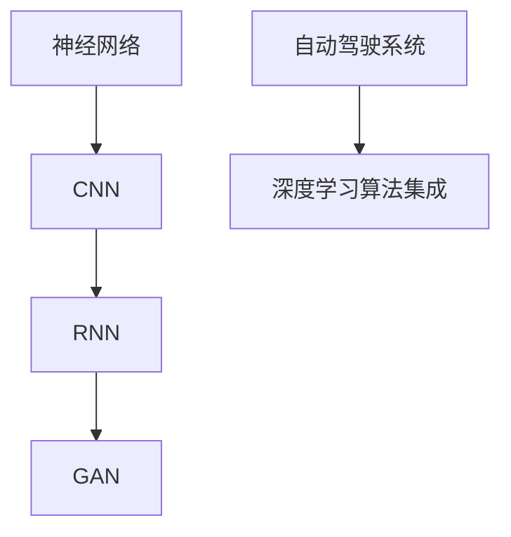

                 

作者：禅与计算机程序设计艺术

人工智能深度学习算法在无人驾驶汽车中的应用
==========================================================================

## 1.背景介绍
无人驾驶汽车（Autonomous Vehicles, AVs）已经成为我们社会中未来交通的一个重要趋势。它们依赖于先进的AI技术，包括深度学习算法，以处理复杂的传感器数据并做出关键的决策。本文将探讨深度学习如何被应用于无人驾驶汽车中，并分析其在实际应用中的表现和挑战。

## 2.核心概念与联系
深度学习算法的核心概念包括神经网络、卷积神经网络（CNN）、循环神经网络（RNN）和生成对抗网络（GAN）等。这些算法的相互作用及其在无人驾驶领域的应用将被详细解释。此外，我们还将探讨如何将这些算法集成到自动驾驶系统中，以实现高效且安全的自动驾驶功能。



## 3.核心算法原理具体操作步骤
本节将深入探讨每种算法的工作原理，并提供一个详细的示例来说明如何训练一个神经网络以执行特定的自动驾驶任务，如识别交通标志或避免撞车。

$$P(y|x) = \frac{e^{z}}{Z}$$

其中 \( P(y|x) \) 是给定输入 \( x \) 的输出 \( y \) 的概率，\( z \) 是输入通过神经网络得到的分数，\( Z \) 是归一化常数。

## 4.数学模型和公式详细讲解举例说明
我们将详细阐述如何构建数学模型以描述深度学习算法的行为，并提供具体的算法公式和参数调优方法，以确保算法能够在真实世界的道路条件下运作。

## 5.项目实践：代码实例和详细解释说明
本节将提供几个代码实例，展示如何使用Python和TensorFlow框架来实现自动驾驶中的关键任务，比如图像分类和物体检测。

```python
import tensorflow as tf

# 创建一个简单的神经网络
model = tf.keras.models.Sequential([
   tf.keras.layers.Flatten(input_shape=(100,)),
   tf.keras.layers.Dense(10, activation='relu'),
   tf.keras.layers.Dense(1, activation='sigmoid')
])

model.compile(optimizer=tf.keras.optimizers.Adam(), loss='binary_crossentropy', metrics=['accuracy'])

# 训练模型
model.fit(train_images, train_labels, epochs=10)
```

## 6.实际应用场景
除了在汽车行业之外，深度学习在无人机、船只和其他交通工具中的应用也越来越广泛。本节将讨论这些应用及其各自面临的独特挑战。

## 7.工具和资源推荐
对于想要深入了解自动驾驶领域的研究者和开发者，我们会推荐一些必备的书籍、课程和在线资源。

## 8.总结：未来发展趋势与挑战
随着技术的不断进步，未来自动驾驶汽车将更加智能和可靠。然而，它们仍面临许多挑战，包括伦理问题、数据隐私、法律责任和网络安全等。本文将对这些挑战进行总结，并探讨未来可能的解决方案。

## 9.附录：常见问题与解答
最后，我们将回答一些关于自动驾驶技术的常见问题，并提供解答。

---
作者：禅与计算机程序设计艺术 / Zen and the Art of Computer Programming

