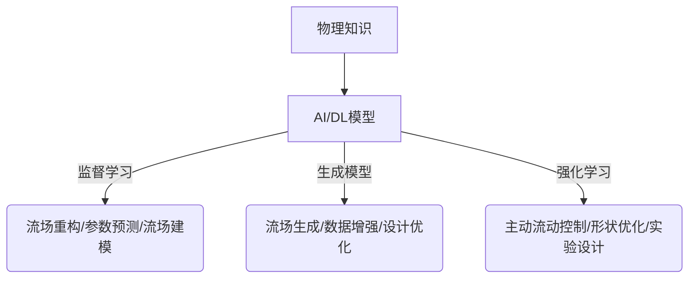

# AI人工智能深度学习算法：在流体动力学中的应用

## 1. 背景介绍

### 1.1 流体动力学的重要性

流体动力学是一门研究流体(液体和气体)运动及其相互作用的科学。它在航空航天、船舶工程、化工过程、环境科学等诸多领域扮演着关键角色。准确预测和模拟流体流动对于优化设计、提高效率、减少能耗和环境影响至关重要。

### 1.2 传统数值模拟的挑战

传统的基于物理定律的数值模拟方法,如有限元分析、有限体积法等,虽然在简单情况下表现良好,但在处理复杂流动问题时往往面临着巨大挑战。这些挑战包括:

- 复杂的几何形状和边界条件
- 湍流、相变和多相流等非线性现象
- 高维度的控制方程组
- 计算成本高昂

### 1.3 人工智能在流体动力学中的应用前景

近年来,人工智能(AI)和深度学习(DL)技术在流体动力学领域展现出巨大潜力。通过从大量数据中学习,AI/DL模型可以捕捉流动的本质特征,并提供高效、准确的流场预测和建模能力。这为解决传统方法难以应对的复杂问题开辟了新途径。

## 2. 核心概念与联系

### 2.1 监督学习与流体动力学

监督学习是机器学习的一个主要范式,旨在从标记数据中学习映射关系。在流体动力学中,监督学习可用于:

- 流场重构:基于部分观测数据(如压力、速度等)重建完整流场
- 参数预测:预测流动过程中的关键参数(如阻力系数、升力系数等)
- 流场建模:直接从数据中学习控制方程,无需显式求解

### 2.2 生成模型与流体动力学

生成模型是深度学习中一类重要的模型,能够从潜在空间中生成新的数据样本。在流体动力学中,生成模型可用于:

- 流场生成:基于少量条件(如边界条件)生成全流场解
- 数据增强:从有限数据生成更多合成数据,扩充训练集
- 设计优化:在满足约束条件下,生成优化的几何形状或工况参数

### 2.3 强化学习与流体动力学

强化学习是机器学习中模拟智能体与环境交互的范式。在流体动力学中,强化学习可应用于:

- 主动流动控制:学习最优控制策略以实现期望的流动状态
- 形状优化:通过与流动模拟器交互,优化几何形状以达到特定目标
- 实验设计:自主规划最有价值的实验点,以最小的代价获取所需数据

### 2.4 物理知识融合

尽管AI/DL模型展现出卓越的性能,但纯数据驱动的方法存在一些固有缺陷,如对极端条件和外推能力较差。将先验的物理知识融入AI/DL模型有望克服这些缺陷,提高模型的泛化能力和可解释性。

## 3. 核心算法原理具体操作步骤

### 3.1 卷积神经网络

卷积神经网络(CNN)是深度学习中一种广泛使用的网络结构,在计算机视觉、自然语言处理等领域表现出色。在流体动力学中,CNN也被成功应用于流场数据处理和建模。

CNN的核心思想是通过卷积操作提取局部特征,并通过池化操作实现平移不变性。对于三维流场数据,CNN可以自动学习流动的空间相关性和尺度不变特性。此外,CNN还具有参数高效、可并行计算等优势。

CNN在流体动力学中的典型应用包括:

1. **监督学习任务**
   - 流场重构:以部分观测数据(如壁面压力)为输入,CNN输出完整流场解
   - 参数预测:以几何形状和边界条件为输入,CNN预测关键流动参数(如阻力系数)

2. **生成模型任务**
   - 流场生成:以边界条件为条件,生成满足控制方程的全流场解
   - 设计优化:生成优化的几何形状,使得流动性能达到预期目标

3. **强化学习任务**
   - 主动流动控制:CNN作为策略网络,输出流动控制策略
   - 形状优化:CNN辅助强化学习智能体,加速形状优化过程

CNN在流体动力学中的应用步骤通常包括:

1. **数据预处理**:对流场数据进行标准化、切分等预处理
2. **网络设计**:根据任务确定CNN的结构(如卷积层数、核大小等)
3. **网络训练**:选择合适的损失函数、优化器,在训练数据上训练CNN模型
4. **模型评估**:在测试数据上评估模型性能,必要时进行超参数调整
5. **模型部署**:将训练好的CNN模型应用于实际流体动力学问题

### 3.2 循环神经网络

循环神经网络(RNN)是一种适用于序列数据的神经网络模型。由于流动问题通常涉及时间演化,RNN在流体动力学领域也有广泛应用。

RNN的核心思想是引入状态向量,捕捉序列数据中的动态信息。通过递归计算,RNN能够处理任意长度的序列输入。在流体动力学中,RNN可以学习流动的时间相关性,对非稳态流动问题建模。

RNN在流体动力学中的典型应用包括:

1. **时间序列预测**
   - 流场预测:以过去时刻的流场为输入,预测未来时刻的流场发展
   - 参数预测:预测流动参数(如升力、阻力等)的时间演化

2. **控制与优化**
   - 主动流动控制:RNN作为策略网络,输出时间序列的控制策略
   - 形状优化:结合强化学习,优化几何形状以达到理想流动状态

3. **建模与求解**
   - 控制方程建模:从数据中学习控制方程的离散形式
   - 控制方程求解:将RNN作为控制方程的近似解,端到端训练

RNN在流体动力学中的应用步骤通常包括:

1. **数据处理**:将流场数据或参数数据构建为时间序列
2. **网络设计**:选择RNN变体(如LSTM、GRU),设计网络结构
3. **网络训练**:定义损失函数,在序列数据上训练RNN模型  
4. **模型评估**:评估模型在测试集上的预测性能
5. **模型部署**:将训练好的RNN模型应用于实际流动问题

### 3.3 图神经网络

图神经网络(GNN)是一种可以直接处理图结构数据的神经网络模型。在流体动力学中,GNN可用于建模具有复杂拓扑结构的流动问题。

GNN的核心思想是在图的节点和边上进行信息传递和聚合,学习图数据的表示。对于流场数据,可以将其离散为无结构网格或有限元网格,并使用GNN直接对网格数据建模。

GNN在流体动力学中的典型应用包括:

1. **网格数据处理**
   - 流场重构:以部分观测数据为输入,重构完整网格流场
   - 参数预测:预测与网格相关的流动参数(如热流、应力等)

2. **控制方程建模**
   - 控制方程学习:从网格数据中学习控制方程的离散形式
   - 控制方程求解:将GNN作为控制方程的近似解,端到端训练

3. **多物理场耦合**
   - 多场耦合建模:同时建模流场、温度场、应力场等多个耦合场

GNN在流体动力学中的应用步骤通常包括:

1. **网格构建**:将流场数据离散为无结构网格或有限元网格
2. **网络设计**:选择合适的GNN变体(如GCN、GraphSAGE等),设计网络结构
3. **网络训练**:定义损失函数,在网格数据上训练GNN模型
4. **模型评估**:评估模型在测试集上的预测性能  
5. **模型部署**:将训练好的GNN模型应用于实际流动问题

### 3.4 生成对抗网络

生成对抗网络(GAN)是一种无监督的生成模型,能够从噪声分布中生成逼真的数据样本。在流体动力学中,GAN可用于生成满足物理约束的流场数据。

GAN由生成器和判别器两个对抗网络组成。生成器试图生成逼真的流场数据欺骗判别器,而判别器则努力区分真实数据和生成数据。通过这种对抗训练,生成器最终能够生成高质量的流场数据。

GAN在流体动力学中的典型应用包括:

1. **流场生成**
   - 条件生成:以几何形状和边界条件为条件,生成满足物理约束的流场解
   - 插值与外推:在有限训练数据的基础上,生成新的流场样本

2. **数据增强**
   - 合成数据生成:从有限的真实流场数据中生成更多合成数据,扩充训练集
   - 噪声去除:从含噪流场数据中生成去噪版本,提高数据质量

3. **设计优化**
   - 形状优化:生成优化的几何形状,使得流动性能达到预期目标
   - 多目标优化:在满足多个约束条件下,生成最优解

GAN在流体动力学中的应用步骤通常包括:

1. **数据准备**:收集真实流场数据,进行必要的预处理
2. **网络设计**:设计生成器和判别器网络结构
3. **对抗训练**:定义对抗损失函数,交替训练生成器和判别器
4. **模型评估**:评估生成数据的质量和物理一致性
5. **模型部署**:将训练好的GAN模型应用于实际流动问题

## 4. 数学模型和公式详细讲解举例说明

### 4.1 流体控制方程

流体运动遵循质量、动量和能量守恒定律,可由控制方程组描述。对于牛顿流体,这些方程包括:

连续方程:
$$
\frac{\partial \rho}{\partial t} + \nabla \cdot (\rho \mathbf{u}) = 0
$$

动量方程:
$$
\frac{\partial (\rho \mathbf{u})}{\partial t} + \nabla \cdot (\rho \mathbf{u} \otimes \mathbf{u}) = -\nabla p + \nabla \cdot \boldsymbol{\tau} + \rho \mathbf{g}
$$

其中 $\rho$ 为密度, $\mathbf{u}$ 为速度矢量, $p$ 为压强, $\boldsymbol{\tau}$ 为黏性应力张量, $\mathbf{g}$ 为重力加速度。

对于理想气体,能量方程为:
$$
\frac{\partial (\rho e_0)}{\partial t} + \nabla \cdot (\rho \mathbf{u} h_0) = \frac{\partial p}{\partial t} + \mathbf{u} \cdot \nabla p + \Phi
$$

其中 $e_0$ 为单位质量内能, $h_0$ 为单位质量焓, $\Phi$ 为耗散函数。

上述方程通常以无因次形式表示,包含若干无因次参数,如雷诺数 $Re$、马赫数 $Ma$ 等。这些控制方程在不同流动问题中会耦合不同的边界条件和初始条件。

传统数值方法通过离散化求解上述方程组,而AI/DL模型则试图从数据中直接学习这些方程的解析解或离散解。例如,CNN可以学习将边界条件映射为满足控制方程的流场解;RNN可以学习控制方程在时间维度上的离散形式。

### 4.2 湍流模型

湍流是流体运动中的一种常见现象,表现为流场的强烈混合和涡旋运动。由于