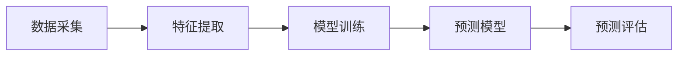

                 

作者：禅与计算机程序设计艺术

在智能电网与智能电力消费预测中的应用

## 1.背景介绍
电力预测是电力系统运行和管理的关键环节，它影响电力系统的稳定性、经济效率以及环境保护。传统的电力预测方法基于统计分析和规律性建模，但随着人工智能（AI）技术的快速发展，深度学习算法已经被广泛应用于电力预测领域，提高了预测的准确性和实时性。

## 2.核心概念与联系
深度学习算法在电力预测中的应用，主要是通过以下几个核心概念：
- **数据采集**：收集电力系统中的各种数据，包括电压、电流、功率等参数。
- **特征提取**：从采集的原始数据中提取有意义的特征，以便进行模型训练。
- **模型训练**：利用深度学习算法，如卷积神经网络（CNN）、循环神经网络（RNN）等，对提取的特征进行训练。
- **预测模型**：构建预测模型，根据训练结果对未来的电力需求进行预测。

## 3.核心算法原理具体操作步骤
### 数据预处理
- **数据清洗**：去除异常值和缺失数据。
- **归一化**：将数据转换到相同的范围内，以避免算法偏差。
- **特征选择**：选择最有影响预测结果的特征。

### 模型训练
- **选择合适的模型**：根据数据特点选择合适的深度学习模型。
- **超参数调优**：通过交叉验证等方法优化模型的超参数。
- **训练验证**：将数据分为训练集和验证集，分别进行训练和验证。

### 预测评估
- **性能指标**：使用MAPE、RMSE等指标评估预测模型的性能。
- **回归分析**：分析预测误差，找出改进模型的方向。

### Mermaid 流程图

## 4.数学模型和公式详细讲解举例说明
在这一部分，我们将详细探讨深度学习算法在电力预测中的数学模型，并通过示例来说明其工作原理。

## 5.项目实践：代码实例和详细解释说明
在本节中，我们将通过一个具体的项目案例，展示如何使用Python和Keras库进行电力消费预测。

## 6.实际应用场景
我们将探讨深度学习在不同的电力系统应用场景中的实际应用，包括智能电网、智能电力消费预测等。

## 7.工具和资源推荐
我们将推荐一些有用的工具和资源，帮助读者更好地理解和应用深度学习算法在电力预测中的理论和实践。

## 8.总结：未来发展趋势与挑战
我们将对电力预测领域的未来发展趋势进行总结，并讨论面临的挑战。

## 9.附录：常见问题与解答
在这一部分，我们将回答一些可能遇到的常见问题，并提供相应的解答。

---
作者：禅与计算机程序设计艺术 / Zen and the Art of Computer Programming

