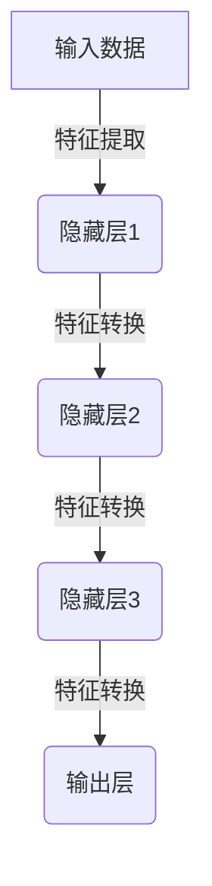
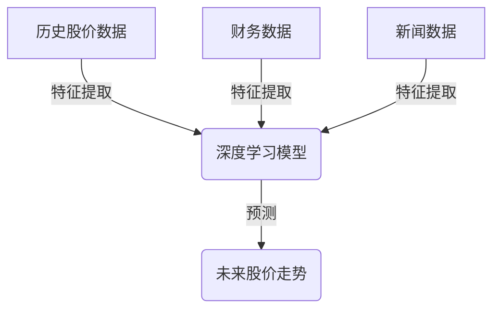

# AI人工智能深度学习算法：在股市预测中的应用

## 1.背景介绍

### 1.1 股市预测的重要性

股市预测是金融领域中一个极具挑战性的课题。准确的股市预测不仅关系到投资者的收益,也影响着整个金融市场的稳定与繁荣。传统的股市预测方法主要依赖技术分析和基本面分析,但这些方法往往存在滞后性和主观性,难以完全捕捉市场的复杂动态。

随着人工智能技术的不断发展,尤其是深度学习算法的兴起,为股市预测提供了新的解决方案。深度学习算法具有自动提取数据特征、发现隐藏模式的能力,可以有效处理大规模、高维、非线性的金融数据,为股市预测提供更加精准的预测结果。

### 1.2 深度学习在股市预测中的应用现状

近年来,越来越多的研究人员将深度学习算法应用于股市预测领域,取得了令人瞩目的成果。常见的深度学习模型包括卷积神经网络(CNN)、循环神经网络(RNN)、长短期记忆网络(LSTM)、门控循环单元(GRU)等,这些模型能够有效捕捉时间序列数据中的长期依赖关系,对股价走势进行精准预测。

与传统的机器学习算法相比,深度学习模型在股市预测任务中表现出了更加出色的性能。然而,由于金融数据的复杂性和不确定性,单一的深度学习模型往往难以完全解决股市预测问题。因此,研究人员开始探索将多种深度学习模型相结合的混合模型,以期获得更加准确的预测结果。

## 2.核心概念与联系

### 2.1 深度学习基本概念

深度学习是机器学习的一个分支,它基于一种由多个处理层组成的人工神经网络,每一层都对输入数据进行特征提取和转换,最终输出所需的结果。深度学习模型通过对大量数据进行训练,自动学习数据的内在特征和规律,从而实现对新数据的预测和分类。



### 2.2 深度学习在金融领域的应用

深度学习在金融领域有着广泛的应用前景,包括股市预测、信用评分、欺诈检测、风险管理等。其中,股市预测是深度学习在金融领域最具代表性的应用之一。深度学习模型能够从历史股价数据、财务数据、新闻数据等多源异构数据中自动提取特征,捕捉复杂的非线性关系,从而实现对未来股价走势的精准预测。



### 2.3 深度学习与传统机器学习的区别

与传统的机器学习算法相比,深度学习具有以下优势:

1. **自动特征提取**: 深度学习模型能够自动从原始数据中提取有效特征,而无需人工设计和选择特征。
2. **处理非线性数据**: 深度学习模型擅长处理非线性数据,能够捕捉数据中复杂的内在规律。
3. **处理高维数据**: 深度学习模型能够有效处理高维数据,如图像、语音、文本等。
4. **端到端学习**: 深度学习模型可以直接从原始数据中学习,无需进行复杂的预处理和特征工程。

然而,深度学习模型也存在一些缺陷,如需要大量的训练数据、训练过程耗时较长、模型解释性较差等。因此,在实际应用中,需要根据具体问题选择合适的机器学习算法或深度学习模型。

## 3.核心算法原理具体操作步骤

在股市预测任务中,常见的深度学习模型包括卷积神经网络(CNN)、循环神经网络(RNN)、长短期记忆网络(LSTM)和门控循环单元(GRU)等。下面将详细介绍这些模型的原理和具体操作步骤。

### 3.1 卷积神经网络(CNN)

卷积神经网络(CNN)是一种常用于图像处理和自然语言处理的深度学习模型。在股市预测任务中,CNN可以用于处理时间序列数据,捕捉数据中的局部模式和趋势。

CNN的核心操作包括卷积(Convolution)和池化(Pooling)。卷积操作通过滑动卷积核在输入数据上进行特征提取,池化操作则用于降低特征维度和提取关键特征。CNN通常由多个卷积层和池化层组成,最后连接全连接层输出预测结果。

CNN在股市预测中的具体操作步骤如下:

1. **数据预处理**: 将原始股价数据转换为CNN可以处理的格式,如将时间序列数据转换为二维矩阵。
2. **构建CNN模型**: 定义CNN模型的架构,包括卷积层、池化层和全连接层的数量和参数。
3. **模型训练**: 使用训练数据对CNN模型进行训练,优化模型参数。
4. **模型评估**: 在测试数据上评估模型的预测性能。
5. **模型调优**: 根据评估结果调整模型参数和架构,提高模型性能。
6. **模型部署**: 将训练好的模型应用于实际的股市预测任务。

### 3.2 循环神经网络(RNN)

循环神经网络(RNN)是一种专门设计用于处理序列数据的深度学习模型,在自然语言处理和时间序列预测任务中有着广泛的应用。RNN通过引入循环连接,能够捕捉序列数据中的长期依赖关系,适合处理股价等时间序列数据。

RNN的核心思想是在每个时间步都将当前输入与前一时间步的隐藏状态进行组合,从而捕捉序列数据中的动态模式。然而,传统的RNN存在梯度消失或梯度爆炸的问题,难以有效捕捉长期依赖关系。

为解决这个问题,研究人员提出了长短期记忆网络(LSTM)和门控循环单元(GRU)等改进版本的RNN模型。这些模型通过引入门控机制和记忆单元,能够更好地捕捉长期依赖关系,在股市预测任务中表现出色。

RNN在股市预测中的具体操作步骤如下:

1. **数据预处理**: 将原始股价数据转换为RNN可以处理的序列格式。
2. **构建RNN模型**: 定义RNN模型的架构,包括RNN层数、隐藏单元数量等参数。
3. **模型训练**: 使用训练数据对RNN模型进行训练,优化模型参数。
4. **模型评估**: 在测试数据上评估模型的预测性能。
5. **模型调优**: 根据评估结果调整模型参数和架构,提高模型性能。
6. **模型部署**: 将训练好的模型应用于实际的股市预测任务。

### 3.3 长短期记忆网络(LSTM)

长短期记忆网络(LSTM)是RNN的一种改进版本,旨在解决传统RNN存在的梯度消失或梯度爆炸问题。LSTM通过引入门控机制和记忆单元,能够更好地捕捉长期依赖关系,在处理长序列数据时表现出色。

LSTM的核心组成部分包括遗忘门(Forget Gate)、输入门(Input Gate)和输出门(Output Gate)。这些门控机制决定了记忆单元的更新和输出方式,从而实现对长期依赖关系的有效捕捉。

LSTM在股市预测中的具体操作步骤如下:

1. **数据预处理**: 将原始股价数据转换为LSTM可以处理的序列格式。
2. **构建LSTM模型**: 定义LSTM模型的架构,包括LSTM层数、隐藏单元数量、门控机制参数等。
3. **模型训练**: 使用训练数据对LSTM模型进行训练,优化模型参数。
4. **模型评估**: 在测试数据上评估模型的预测性能。
5. **模型调优**: 根据评估结果调整模型参数和架构,提高模型性能。
6. **模型部署**: 将训练好的模型应用于实际的股市预测任务。

### 3.4 门控循环单元(GRU)

门控循环单元(GRU)是另一种改进版本的RNN模型,与LSTM类似,也旨在解决传统RNN存在的梯度消失或梯度爆炸问题。GRU相比LSTM结构更加简单,计算复杂度较低,在某些任务上表现也不逊于LSTM。

GRU的核心组成部分包括重置门(Reset Gate)和更新门(Update Gate)。重置门决定了忘记前一时间步的状态,更新门决定了保留前一时间步的状态。通过这两个门控机制,GRU能够有效捕捉长期依赖关系。

GRU在股市预测中的具体操作步骤如下:

1. **数据预处理**: 将原始股价数据转换为GRU可以处理的序列格式。
2. **构建GRU模型**: 定义GRU模型的架构,包括GRU层数、隐藏单元数量、门控机制参数等。
3. **模型训练**: 使用训练数据对GRU模型进行训练,优化模型参数。
4. **模型评估**: 在测试数据上评估模型的预测性能。
5. **模型调优**: 根据评估结果调整模型参数和架构,提高模型性能。
6. **模型部署**: 将训练好的模型应用于实际的股市预测任务。

## 4.数学模型和公式详细讲解举例说明

在深度学习算法中,数学模型和公式扮演着至关重要的角色。下面将详细讲解一些核心的数学模型和公式,并通过具体示例说明其在股市预测任务中的应用。

### 4.1 卷积神经网络(CNN)

卷积神经网络(CNN)的核心操作是卷积(Convolution)和池化(Pooling)。

#### 4.1.1 卷积操作

卷积操作是CNN的基础,它通过在输入数据上滑动卷积核(Kernel)来提取局部特征。卷积操作的数学表达式如下:

$$
S(i, j) = (I * K)(i, j) = \sum_{m}\sum_{n}I(i+m, j+n)K(m, n)
$$

其中,
- $I$ 表示输入数据
- $K$ 表示卷积核
- $S$ 表示卷积操作的输出特征图
- $m$、$n$ 表示卷积核的大小

例如,对于一个 $3 \times 3$ 的卷积核 $K$ 和一个 $5 \times 5$ 的输入数据 $I$,卷积操作的过程如下:

```
输入数据 I:
 1  3  2  4  1
 5  2  1  3  2
 4  1  3  2  1
 2  3  4  1  3
 1  2  3  4  2

卷积核 K:
 1  0  1
 0  1  0
 1  0  1

卷积操作:
S(1, 1) = 1*1 + 3*0 + 2*1 + 5*0 + 2*1 + 4*0 + 1*1 + 3*0 + 2*1 = 9
S(1, 2) = 3*1 + 2*0 + 4*1 + 2*0 + 1*1 + 1*0 + 3*1 + 2*0 + 1*1 = 12
...

输出特征图 S:
 9 12  8  7  5
15 10  9  7  6
12  7  6  7  6
 8  6  9 11  8
 4  6  8  7  5
```

通过卷积操作,CNN能够自动从输入数据中提取局部特征,并且通过堆叠多个卷积层,可以逐步提取更高层次的特征。

#### 4.1.2 池化操作

池化操作是CNN中另一个重要的操作,它用于降低特征维度和提取关