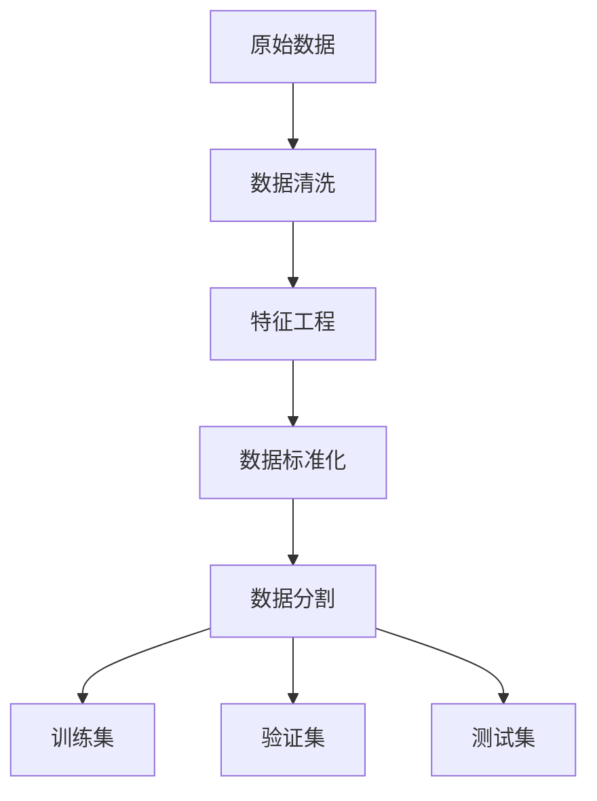
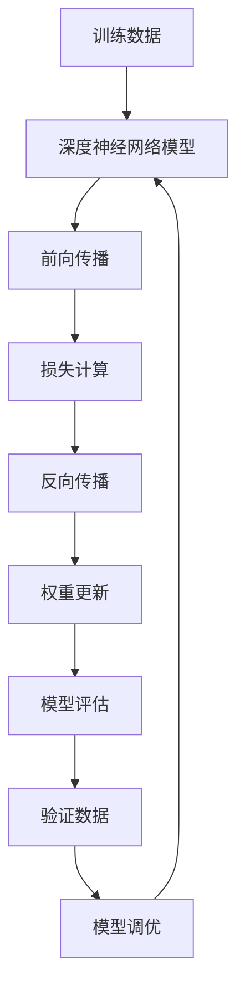
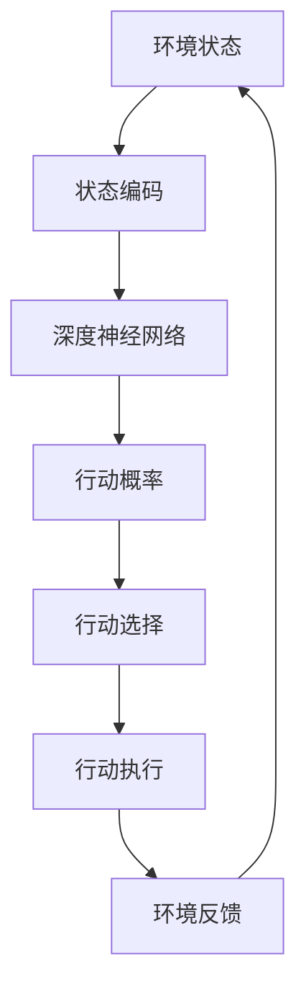

# AI人工智能深度学习算法：智能深度学习代理在供应链管理领域的创新运用

## 1.背景介绍

### 1.1 供应链管理的重要性

在当今快节奏的商业环境中，高效的供应链管理对于企业的成功至关重要。供应链管理涉及从原材料采购、生产、库存管理到产品交付的整个过程。它确保资源的优化利用、降低运营成本并提高客户满意度。然而,传统的供应链管理系统面临着许多挑战,例如数据孤岛、决策延迟和对复杂环境的适应性不足。

### 1.2 人工智能在供应链管理中的作用  

人工智能(AI)技术的兴起为解决这些挑战提供了新的机遇。通过利用机器学习、深度学习和优化算法等技术,AI可以提高供应链的智能化水平,实现更高效、更精准的决策。特别是深度学习算法,凭借其强大的数据处理和模式识别能力,在供应链优化、需求预测、异常检测等领域展现出巨大潜力。

### 1.3 智能深度学习代理的概念

智能深度学习代理(Intelligent Deep Learning Agent)是一种将深度学习技术与智能代理系统相结合的创新方法。它利用深度神经网络从历史数据中学习模式,并将获得的知识应用于实时决策过程。与传统的规则驱动系统不同,智能深度学习代理可以自主地适应动态环境,提供更加灵活和智能化的解决方案。

## 2.核心概念与联系

### 2.1 深度学习

深度学习是机器学习的一个子领域,它利用深层神经网络模型从大量数据中自动学习特征表示。与传统的机器学习算法相比,深度学习能够处理更加复杂和非结构化的数据,如图像、视频和自然语言。常见的深度学习模型包括卷积神经网络(CNN)、循环神经网络(RNN)和transformer等。

### 2.2 智能代理

智能代理是一种自主系统,能够感知环境、处理信息并采取行动以实现预定目标。智能代理通常由以下几个核心组件构成:

1. 感知器(Sensor):用于从环境中获取数据和信息。
2. 状态表示(State Representation):将感知到的数据转换为内部状态表示。
3. 决策器(Decision Maker):基于当前状态和目标,选择合适的行动。
4. 执行器(Actuator):将决策转化为实际行动,影响环境。

### 2.3 智能深度学习代理

智能深度学习代理将深度学习技术与智能代理系统相结合。它利用深度神经网络作为决策器的核心部分,从历史数据中学习状态到行动的映射关系。与传统的规则驱动或基于模型的决策系统不同,智能深度学习代理可以自主地从数据中学习,适应复杂动态环境,提供更加智能化的决策支持。

### 2.4 核心概念关系

智能深度学习代理在供应链管理中的应用,将深度学习算法、智能代理系统和供应链优化目标有机结合。深度神经网络从供应链历史数据中学习模式和规律,作为智能代理的决策器,指导代理在动态环境中做出优化决策,从而提高供应链效率、降低成本并提高客户满意度。

## 3.核心算法原理具体操作步骤 

智能深度学习代理在供应链管理中的应用,涉及多个关键步骤和算法,包括数据预处理、模型训练、在线决策等。下面将详细介绍其核心算法原理和具体操作步骤。

### 3.1 数据预处理

1. **数据清洗**:清理原始数据中的异常值、重复数据和缺失值,确保数据的完整性和一致性。
2. **特征工程**:从原始数据中提取相关特征,如订单信息、库存水平、天气数据等,构建模型的输入特征向量。
3. **数据标准化**:将特征值缩放到相似的数值范围,避免某些特征由于数值范围过大而主导模型训练过程。
4. **数据分割**:将预处理后的数据划分为训练集、验证集和测试集,用于模型训练、调参和评估。

### 3.2 模型训练

1. **构建深度神经网络模型**:根据问题的特点和数据的复杂程度,选择合适的深度学习模型架构,如卷积神经网络、循环神经网络或transformer等。
2. **前向传播**:将训练数据输入到神经网络中,计算网络的输出。
3. **损失计算**:比较网络输出与真实标签之间的差异,计算损失函数值。
4. **反向传播**:利用链式法则,计算损失函数相对于网络权重的梯度。
5. **权重更新**:使用优化算法(如随机梯度下降)根据梯度值更新网络权重。
6. **模型评估**:在验证数据集上评估模型的性能,计算相关指标如准确率、精确率、召回率等。
7. **模型调优**:根据评估结果,调整模型超参数(如学习率、正则化系数等)或网络架构,重复训练过程,直至获得满意的模型性能。

### 3.3 在线决策

1. **状态编码**:将供应链的当前状态(如库存水平、订单信息等)编码为神经网络可以处理的输入向量。
2. **深度神经网络推理**:将编码后的状态输入到训练好的深度神经网络中,获得每个可能行动的概率分布。
3. **行动选择**:根据行动概率分布,选择概率最大的行动,或使用探索/利用权衡策略(如$\epsilon$-贪婪算法)在探索和利用之间达成平衡。
4. **行动执行**:执行选定的行动,如调整生产计划、重新分配库存等。
5. **环境反馈**:观察行动执行后环境的变化,获取新的状态信息,循环执行上述步骤。

通过上述步骤,智能深度学习代理可以持续地从环境中获取数据、学习优化策略,并根据学习到的策略做出智能化的供应链决策。

## 4.数学模型和公式详细讲解举例说明

在智能深度学习代理的建模和优化过程中,涉及多种数学模型和公式。下面将详细介绍其中的几个核心模型和公式。

### 4.1 深度神经网络模型

深度神经网络是智能深度学习代理的核心部分,用于从历史数据中学习状态到行动的映射关系。常见的深度神经网络模型包括:

1. **前馈神经网络(Feedforward Neural Network, FNN)**:
   
   $$
   y = f(W^{(L)}a^{(L-1)} + b^{(L)})
   $$
   
   其中$y$为网络输出,$f$为激活函数,$W^{(L)}$和$b^{(L)}$分别为第$L$层的权重和偏置,$a^{(L-1)}$为前一层的激活值。

2. **卷积神经网络(Convolutional Neural Network, CNN)**:
   
   $$
   x_j^l = f\left(\sum_{i \in M_j} x_{i}^{l-1} * k_{ij}^l + b_j^l\right)
   $$
   
   其中$x_j^l$为第$l$层第$j$个特征图,$M_j$为与$x_j^l$相连的输入特征图集合,$k_{ij}^l$为卷积核权重,$b_j^l$为偏置。

3. **循环神经网络(Recurrent Neural Network, RNN)**:
   
   $$
   h_t = f_W(x_t, h_{t-1})
   $$
   
   其中$h_t$为时刻$t$的隐藏状态,$f_W$为参数化的递归函数,$x_t$为时刻$t$的输入,$h_{t-1}$为前一时刻的隐藏状态。

通过对这些深度神经网络模型的训练,可以学习到供应链状态到优化决策的映射关系,为智能代理提供决策支持。

### 4.2 强化学习模型

除了监督学习,智能深度学习代理还可以采用强化学习的方法,通过与环境的交互来学习最优策略。强化学习的核心思想是智能体(Agent)与环境(Environment)进行互动,根据环境的反馈(Reward)来调整策略,最终获得最大化的累积奖励。

在供应链管理场景中,可以将供应链系统建模为马尔可夫决策过程(Markov Decision Process, MDP),定义如下:

- 状态集合$\mathcal{S}$:描述供应链的所有可能状态,如库存水平、订单信息等。
- 行动集合$\mathcal{A}$:智能体可以执行的所有行动,如调整生产计划、重新分配库存等。
- 转移概率$\mathcal{P}_{ss'}^a$:在状态$s$下执行行动$a$后,转移到状态$s'$的概率。
- 奖励函数$\mathcal{R}_s^a$:在状态$s$执行行动$a$后获得的即时奖励。

智能体的目标是找到一个策略$\pi:\mathcal{S}\rightarrow\mathcal{A}$,使得期望的累积奖励最大化:

$$
\max_\pi \mathbb{E}_\pi\left[\sum_{t=0}^\infty \gamma^t r_t\right]
$$

其中$\gamma\in[0,1]$为折现因子,用于权衡即时奖励和长期奖励的重要性。

常见的强化学习算法包括Q-Learning、Deep Q-Network(DQN)、Policy Gradient等。通过这些算法,智能深度学习代理可以直接从与环境的交互中学习最优策略,而无需提前构建显式的模型。

### 4.3 多目标优化模型

在实际的供应链管理中,通常需要权衡多个目标,如降低成本、提高客户满意度、减少浪费等。这可以建模为多目标优化问题(Multi-Objective Optimization Problem, MOP):

$$
\begin{aligned}
\min\limits_{\boldsymbol{x}\in\Omega} &\quad f(\boldsymbol{x}) = \left(f_1(\boldsymbol{x}), f_2(\boldsymbol{x}), \ldots, f_m(\boldsymbol{x})\right)\\
\text{s.t.} &\quad g_i(\boldsymbol{x}) \leq 0, \quad i = 1, 2, \ldots, p\\
&\quad h_j(\boldsymbol{x}) = 0, \quad j = 1, 2, \ldots, q
\end{aligned}
$$

其中$\boldsymbol{x}$为决策变量向量,$f_i(\boldsymbol{x})$为第$i$个目标函数,$g_i(\boldsymbol{x})$和$h_j(\boldsymbol{x})$分别为不等式和等式约束条件。

由于多个目标通常是相互矛盾的,因此不存在一个单一的最优解,而是一组paretooptimal解。常见的多目标优化算法包括加权求和法、$\epsilon$-约束法、进化算法等。

智能深度学习代理可以将多目标优化问题建模为马尔可夫决策过程,并通过强化学习算法来学习paretooptimal策略,权衡不同目标之间的tradeoff。

## 5.项目实践:代码实例和详细解释说明

为了更好地理解智能深度学习代理在供应链管理中的应用,我们将提供一个基于Python和PyTorch的代码实例,模拟一个简化的供应链场景