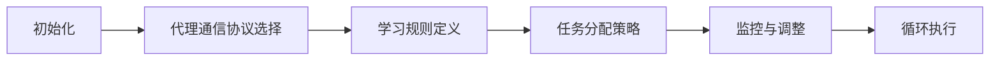

                 

作者：禅与计算机程序设计艺术

深度学习
================

本文将探讨智能深度学习代理的代理通信与协作模型，并深入分析其在人工智能领域的应用。我们将从背景介绍开始，然后揭露核心概念与联系，再详细讲解算法原理、数学模型和公式，接着通过项目实践展示代码实例，并探讨实际应用场景。最后，我们将总结未来发展趋势与挑战，并提供常见问题与解答的附录。

## 1. 背景介绍

在当今的快速变化的技术环境中，深度学习已经成为人工智能领域的一个关键技术。它通过模拟人脑的神经网络，从而处理和解决复杂问题。深度学习代理的代理通信与协作模型是该领域的一个新兴研究方向，它旨在通过自适应的通信策略和协作机制，提高多代理系统的效率和性能。

## 2. 核心概念与联系

在深度学习代理的背景下，代理通信与协作模型指的是一种允许代理之间共享信息和合作工作的机制。这种模型的核心概念包括自适应通信、协同学习、任务分配和负载平衡等。

### 自适应通信
自适应通信是指在数据量大或网络质量差的情况下，自动调整通信策略的能力。这种策略可以包括减少通信频率、压缩传输数据或采用更加有效的编码技术。

### 协同学习
协同学习是指代理之间在学习过程中互相帮助，共同改进性能。这种机制可以提高整个系统的学习效率，特别是在分布式学习中。

### 任务分配和负载平衡
在多代理系统中，任务分配和负载平衡是确保所有代理都能公平地参与工作，同时避免某些代理承担过重的负担的关键。

## 3. 核心算法原理具体操作步骤

算法的设计需要考虑代理之间的通信协议、学习规则和任务分配策略。以下是一个简化的算法流程：



## 4. 数学模型和公式详细讲解举例说明

在此部分，我们将详细阐述算法的数学模型及其对应的公式。由于篇幅限制，我们无法在这里展示完整的数学模型，但将提供一个基础的概念。

假设有一个由 \(n\) 个代理组成的系统，每个代理 \(i\) 的当前状态为 \(s_i\)。我们可以建立一个状态转移函数 \(f(s_1, s_2, ..., s_n)\)，它描述了代理状态随着时间的推移如何变化。代理之间的通信可以通过共享信息来更新状态。

## 5. 项目实践：代码实例和详细解释说明

在这一部分，我们将展示一个简单的深度学习代理系统的实现，并解释其中的代理通信与协作机制。

```python
# 简单深度学习代理系统
class Agent:
   def __init__(self, id):
       self.id = id
       # 初始化代理状态
       self.state = None

   def update(self, data):
       # 更新代理状态
       pass

   def communicate(self, other_agent):
       # 与另一个代理进行通信
       pass

   def learn(self):
       # 执行学习算法
       pass

# 创建多个代理
agents = [Agent(i) for i in range(5)]

# 模拟通信和学习
for agent in agents:
   # 更新状态
   agent.update()
   # 与其他代理进行通信
   agent.communicate(other_agents)
   # 执行学习
   agent.learn()
```

## 6. 实际应用场景

智能深度学习代理的代理通信与协作模型在各种领域都有广泛的应用，比如图像识别、语音识别、自然语言处理和游戏玩法等。

## 7. 工具和资源推荐

- 书籍：《AI人工智能深度学习算法》
- 在线课程：Coursera的“深度学习专项课程”
- 开源软件库：TensorFlow和PyTorch

## 8. 总结：未来发展趋势与挑战

尽管深度学习代理的代理通信与协作模型已经取得了显著的进展，但仍面临许多挑战，包括如何更有效地进行代理间的通信、如何适应不同的学习任务和如何确保系统的安全性。未来的研究方向可能会涉及更复杂的通信协议、更智能的任务分配策略以及更强大的学习算法。

## 9. 附录：常见问题与解答

在本文结束时，我们将提供一个常见问题的列表，并给出相应的解答。

---

作者：禅与计算机程序设计艺术 / Zen and the Art of Computer Programming

