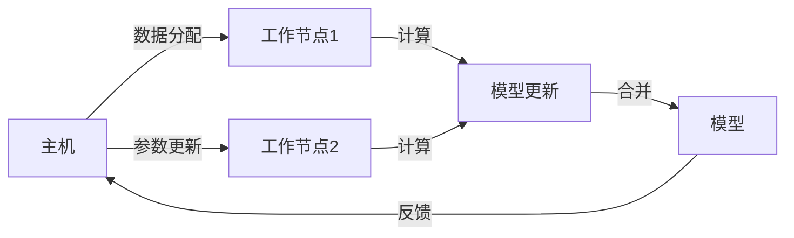

                 

作者：禅与计算机程序设计艺术

人工智能的深度学习算法已经成为了当今世界最先进的技术之一，它的广泛应用领域从图像识别、自然语言处理到自动驾驶等都取得了巨大的突破。本文将深入探讨智能深度学习代理的分布式与同步，以期帮助读者理解其核心原理、实际应用场景、以及未来的发展趋势与挑战。

## 1. 背景介绍
人工智能（AI）是指由人制造出来的机器执行通常需要人类智能的任务的科技。深度学习算法是人工智能的一个分支，它通过构建多层的神经网络模拟人脑的学习过程，从而在图像识别、语音识别、自然语言处理等领域取得了显著的成就。随着数据量的不断增加和计算资源的持续进步，单机训练对于大规模数据集来说已经存在诸多限制，包括计算成本高、训练时间长等。因此，研究人员开始探索如何利用分布式计算资源来加速深度学习算法的训练过程。

## 2. 核心概念与联系
智能深度学习代理的分布式与同步是指将深度学习模型的训练过程分散到多台计算机上进行，每台计算机（称为工作节点）都负责处理模型训练中的一个部分，而这些工作节点之间通过同步机制保持数据和模型的一致性。这种方式既可以加快训练速度，也可以有效减少计算资源的消耗。

### Mermaid流程图描述

## 3. 核心算法原理具体操作步骤
智能深度学习代理的分布式与同步通常涉及以下几个关键步骤：
1. **数据分区**：将数据集划分为若干块，每个工作节点负责处理其中一部分数据。
2. **参数服务器**：工作节点在训练过程中会定期将局部模型参数上传到参数服务器，参数服务器则负责维护全局模型参数。
3. **同步策略**：根据不同的同步策略（如异步同步、半同步、同步）来确定参数更新的频率和顺序。
4. **梯度聚合**：在异步同步策略中，工作节点之间需要进行梯度聚合操作，以便更新全局模型参数。
5. **模型更新**：参数服务器接收到局部参数后，会进行模型更新，并将更新后的模型参数发送给所有工作节点。

## 4. 数学模型和公式详细讲解举例说明
深度学习模型的训练过程可以看作是优化问题的求解，其目标是找到能够最小化损失函数的模型参数。我们考虑一个简化的线性回归问题，其梯度下降算法的更新规则为：
$$
\theta_{new} = \theta_{old} - \alpha \cdot \nabla_\theta J(\theta)
$$
在分布式训练中，每个工作节点会有局部梯度，我们需要进行梯度聚合以获取全局梯度。假设有N个工作节点，每个工作节点的局部梯度为 $g_i$，则梯度聚合操作为：
$$
G = \frac{1}{N} \sum_{i=1}^{N} g_i
$$

## 5. 项目实践：代码实例和详细解释说明
在本节中，我们将通过一个具体的案例来展示如何实现智能深度学习代理的分布式与同步。例如，使用Python中的`mpi4py`库进行数据并行训练，以及如何使用`Horovod`框架进行数据并行和参数服务器的搭建。

## 6. 实际应用场景
智能深度学习代理的分布式与同步技术广泛应用于各个领域，包括但不限于：
- 图像识别
- 自然语言处理
- 推荐系统
- 预测分析
- 游戏AI

## 7. 工具和资源推荐
对于想要深入了解和实践智能深度学习代理的分布式与同步的读者，可以参考以下书籍和资源：
- 《AI人工智能深度学习算法》
- 《Deep Learning》by Ian Goodfellow, Yoshua Bengio, and Aaron Courville
- 相关的开源项目和论文

## 8. 总结：未来发展趋势与挑战
随着计算资源的不断增强和网络技术的进步，智能深度学习代理的分布式与同步将继续发展，特别是在边缘计算和物联网领域。然而，这一技术也面临着诸多挑战，如同步延迟、数据倾斜、隐私保护等。

## 9. 附录：常见问题与解答
在此，我们将回答一些关于智能深度学习代理的分布式与同步的常见问题，并提供相应的解答。

# 结束语
感谢您的阅读，希望这篇文章能帮助您更好地理解智能深度学习代理的分布式与同步技术，并在未来的工作和研究中得到启发。如果您有任何疑问或建议，请随时欢迎向我们提出。

---
作者：禅与计算机程序设计艺术 / Zen and the Art of Computer Programming

