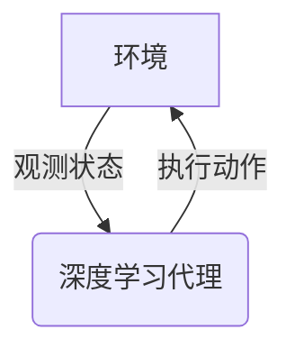
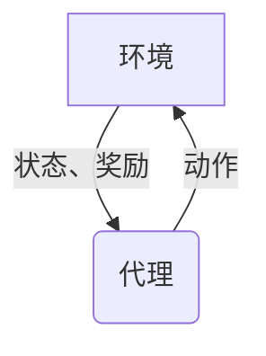
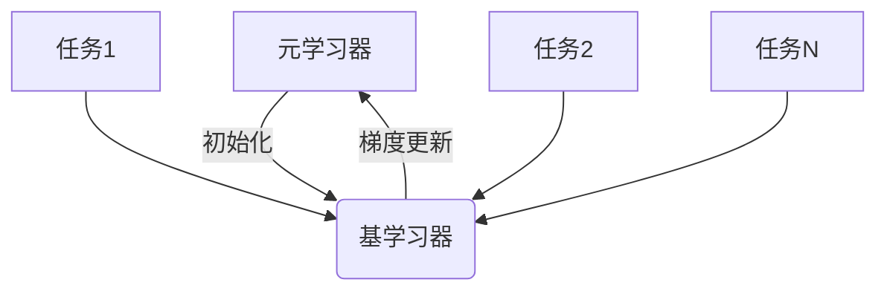
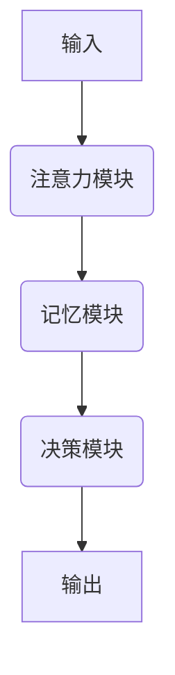
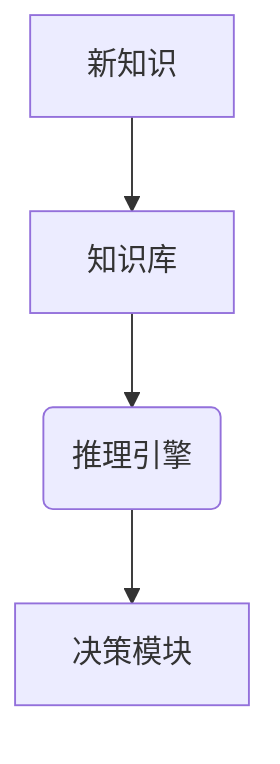

# AI人工智能深度学习算法：智能深度学习代理的动态调整与情境智能

## 1.背景介绍

### 1.1 人工智能的崛起
人工智能(AI)技术在过去几十年里取得了长足的进步,已经渗透到我们生活的方方面面。从语音助手到自动驾驶汽车,从推荐系统到医疗诊断,AI无处不在。然而,现有的AI系统大多是在特定场景下训练和部署的,缺乏动态调整和情境适应能力,这严重制约了它们在复杂动态环境中的应用。

### 1.2 智能深度学习代理的需求
为了应对不断变化的环境和任务需求,我们需要智能深度学习代理能够根据当前情境动态调整其决策和行为。这种智能代理应具备以下关键能力:

1. 情境感知:感知当前环境状态和任务需求
2. 知识表示:对领域知识和经验进行有效表示和存储
3. 推理决策:基于知识和情境做出合理的决策和规划
4. 持续学习:从新的经验中持续学习和更新知识库

### 1.3 本文概述
本文将探讨智能深度学习代理在动态环境下的调整和适应机制。我们将介绍相关的核心概念、算法原理、数学模型,并通过实例展示其实现和应用。最后,我们将总结该领域的发展趋势和挑战。

## 2.核心概念与联系

### 2.1 深度学习代理
深度学习代理(Deep Learning Agent)是指基于深度神经网络模型,能够从环境中获取信息、做出决策并执行行为的智能体系统。与传统的规则系统不同,深度学习代理通过从数据中学习,获得更强的泛化能力和适应性。

### 2.2 强化学习
强化学习(Reinforcement Learning)是深度学习代理获取决策能力的核心范式。代理通过与环境交互,获取奖励信号,并不断调整其策略,以最大化长期累积奖励。

### 2.3 元学习
元学习(Meta Learning)赋予深度学习代理快速适应新环境和任务的能力。通过从多任务中学习,代理获得一种"学习如何学习"的泛化能力,能够在新任务上快速收敛。

### 2.4 记忆与注意力机制
为了有效处理序列数据和长期依赖关系,深度学习代理通常采用记忆与注意力机制。记忆模块存储代理过去的状态和行为,注意力机制则选择性关注相关信息,提高决策效率。

### 2.5 知识表示与推理
为了支持复杂决策和规划,智能代理需要对领域知识进行结构化表示,并具备推理能力。常见的知识表示形式包括逻辑规则、因果图和结构化知识库等。

## 3.核心算法原理具体操作步骤

### 3.1 深度Q网络算法
深度Q网络(Deep Q-Network, DQN)是结合深度学习和Q学习的强化学习算法,能够直接从环境中学习最优策略。其核心思想是使用深度神经网络来近似Q函数,并通过经验回放和目标网络等技巧提高训练稳定性。

1. 初始化深度Q网络和目标Q网络,两个网络参数相同
2. 初始化经验回放池D
3. 对于每个时间步:
    - 从当前状态s采取动作a,观测奖励r和新状态s'
    - 将(s,a,r,s')存入经验回放池D
    - 从D中随机采样一批数据进行训练
    - 计算目标Q值: $y = r + \gamma \max_{a'} Q(s', a'; \theta^-)$
    - 计算当前Q值: $Q(s, a; \theta)$
    - 最小化损失: $L = \mathbb{E}_{(s,a,r,s')\sim D}\left[(y - Q(s, a; \theta))^2\right]$
    - 每隔一定步数将当前Q网络参数复制到目标Q网络

### 3.2 深度确定性策略梯度算法
深度确定性策略梯度算法(Deep Deterministic Policy Gradient, DDPG)是一种用于连续动作空间的演员-评论家算法。它同时训练一个确定性策略网络(演员)和一个Q函数近似网络(评论家)。

1. 初始化策略网络$\mu(s;\theta^\mu)$和Q网络$Q(s,a;\theta^Q)$
2. 初始化目标策略网络$\mu'$和目标Q网络$Q'$,与$\mu$和$Q$参数相同
3. 初始化经验回放池D
4. 对于每个时间步:
    - 从当前状态s采取动作$a=\mu(s;\theta^\mu)$,观测奖励r和新状态s'
    - 将(s,a,r,s')存入经验回放池D
    - 从D中随机采样一批数据进行训练
    - 更新Q网络:
        - 计算目标Q值: $y = r + \gamma Q'(s', \mu'(s';\theta^{\mu'});\theta^{Q'})$
        - 最小化损失: $L = \mathbb{E}_{(s,a,r,s')\sim D}\left[(y - Q(s, a; \theta^Q))^2\right]$
    - 更新策略网络:
        - 最大化期望Q值: $\max_{\theta^\mu} \mathbb{E}_{s\sim D}[Q(s, \mu(s;\theta^\mu);\theta^Q)]$
    - 软更新目标网络参数:
        - $\theta^{\mu'} \leftarrow \tau \theta^\mu + (1-\tau)\theta^{\mu'}$
        - $\theta^{Q'} \leftarrow \tau \theta^Q + (1-\tau)\theta^{Q'}$

### 3.3 深度递归Q网络算法
深度递归Q网络(Deep Recurrent Q-Network, DRQN)是一种结合了递归神经网络(RNN)和DQN的算法,能够处理部分可观测的马尔可夫决策过程(POMDP)问题。

1. 初始化DRQN网络,包括卷积层、RNN层和全连接层
2. 初始化目标DRQN网络,与DRQN网络参数相同
3. 初始化经验回放池D
4. 对于每个时间步:
    - 从当前状态s采取动作a,观测奖励r和新状态s'
    - 将(s,a,r,s')存入经验回放池D
    - 从D中随机采样一批序列数据进行训练
    - 计算目标Q值: $y_t = r_t + \gamma \max_{a'} Q(h_{t+1}, a'; \theta^-)$
    - 计算当前Q值序列: $Q(h_t, a_t; \theta)$
    - 最小化损失: $L = \sum_t (y_t - Q(h_t, a_t; \theta))^2$
    - 每隔一定步数将当前DRQN网络参数复制到目标DRQN网络

其中$h_t$是RNN在时间步t的隐状态,编码了过去的观测序列信息。

### 3.4 深度神经进化算法
深度神经进化(Deep Neuroevolution)是一种通过进化算法直接优化神经网络权重的方法,避免了梯度下降的局限性。常见的算法包括遗传算法(GA)、进化策略(ES)等。

1. 初始化一组神经网络个体种群$P=\{N_1, N_2, \ldots, N_n\}$
2. 评估每个个体的适应度$f(N_i)$,例如在环境中的累积奖励
3. 选择适应度高的个体作为父代
4. 通过变异(改变部分权重)和交叉(组合两个父代的权重)产生新的子代个体
5. 将子代个体加入种群,形成新一代种群$P'$
6. 重复步骤2-5,直到满足终止条件

通过这种进化方式,神经网络能够逐步适应复杂环境,找到高质量的策略。

## 4.数学模型和公式详细讲解举例说明

### 4.1 马尔可夫决策过程
马尔可夫决策过程(Markov Decision Process, MDP)是强化学习问题的数学模型,描述了智能体与环境的交互过程。一个MDP可以用元组$(S, A, P, R, \gamma)$表示:

- $S$是状态集合
- $A$是动作集合
- $P(s'|s,a)$是状态转移概率,表示在状态$s$执行动作$a$后转移到状态$s'$的概率
- $R(s,a,s')$是奖励函数,表示在状态$s$执行动作$a$后转移到$s'$获得的即时奖励
- $\gamma \in [0,1)$是折现因子,控制未来奖励的重要性

目标是找到一个策略$\pi: S \rightarrow A$,能够最大化期望的累积折现奖励:

$$J(\pi) = \mathbb{E}_\pi\left[\sum_{t=0}^\infty \gamma^t R(s_t, a_t, s_{t+1})\right]$$

其中$s_0$是初始状态,$a_t \sim \pi(s_t)$是在状态$s_t$下根据策略$\pi$选择的动作。

### 4.2 Q学习
Q学习是一种基于价值函数的强化学习算法,通过估计状态-动作对的价值函数$Q(s,a)$来获得最优策略。$Q(s,a)$定义为在状态$s$执行动作$a$后能获得的期望累积折现奖励:

$$Q(s,a) = \mathbb{E}_\pi\left[\sum_{t=0}^\infty \gamma^t R(s_t, a_t, s_{t+1}) | s_0=s, a_0=a\right]$$

Q函数满足贝尔曼方程:

$$Q(s,a) = \mathbb{E}_{s' \sim P(\cdot|s,a)}\left[R(s,a,s') + \gamma \max_{a'} Q(s',a')\right]$$

我们可以通过迭代更新逼近真实的Q函数:

$$Q(s,a) \leftarrow Q(s,a) + \alpha\left(R(s,a,s') + \gamma \max_{a'} Q(s',a') - Q(s,a)\right)$$

其中$\alpha$是学习率。当Q函数收敛后,通过$\pi(s) = \arg\max_a Q(s,a)$即可获得最优策略。

### 4.3 策略梯度算法
策略梯度算法是另一种获取最优策略的方法,它直接对策略$\pi_\theta(a|s)$进行参数化,并通过梯度上升优化策略参数$\theta$。具体来说,我们希望最大化期望的累积折现奖励$J(\theta)$:

$$\max_\theta J(\theta) = \mathbb{E}_{\pi_\theta}\left[\sum_{t=0}^\infty \gamma^t R(s_t, a_t, s_{t+1})\right]$$

根据策略梯度定理,我们可以计算$\nabla_\theta J(\theta)$并沿着梯度方向更新$\theta$:

$$\nabla_\theta J(\theta) = \mathbb{E}_{\pi_\theta}\left[\sum_{t=0}^\infty \nabla_\theta \log\pi_\theta(a_t|s_t)Q^{\pi_\theta}(s_t,a_t)\right]$$

其中$Q^{\pi_\theta}(s_t,a_t)$是在策略$\pi_\theta$下状态$s_t$执行动作$a_t$的价值函数。

### 4.4 Actor-Critic算法
Actor-Critic算法将策略梯度算法与Q学习相结合,同时学习策略$\pi_\theta(a|s)$和价值函数$Q_\phi(s,a)$。Actor(策略网络)根据策略梯度更新参数$\theta$,而Critic(价值网络)根据时序差分(TD)误差更新参数$\