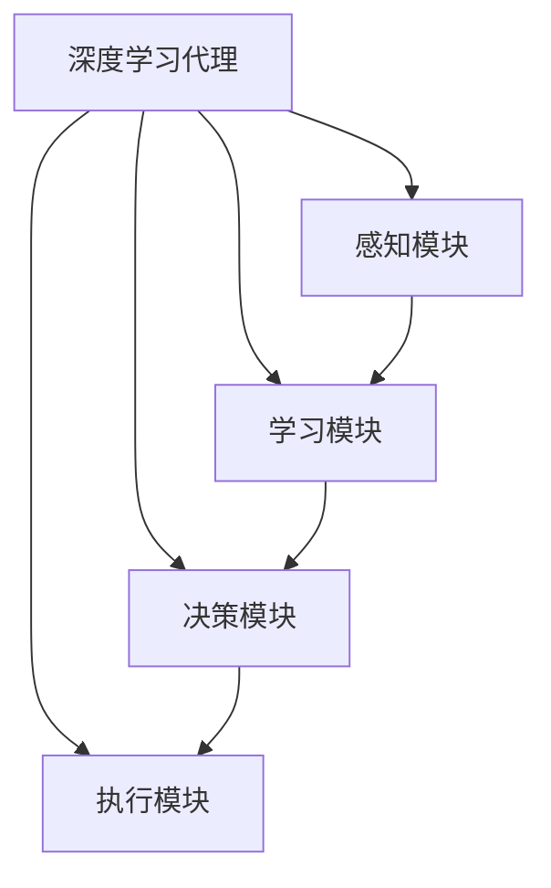

# AI人工智能深度学习算法：智能深度学习代理的异常处理与容错

## 1.背景介绍

### 1.1 人工智能的发展历程

人工智能(Artificial Intelligence,AI)是当代科技发展的热点领域之一,自20世纪50年代问世以来,经历了起起伏伏的发展历程。在过去的几十年里,人工智能经历了几次重大突破,例如专家系统、机器学习、深度学习等,极大推动了人工智能的发展。

### 1.2 深度学习的兴起

深度学习(Deep Learning)作为机器学习的一个新的研究热点,是人工智能取得突破性进展的重要力量。它通过对数据的建模,让计算机像人脑一样对数据有深层次的理解和学习能力,在图像识别、语音识别、自然语言处理等领域取得了令人瞩目的成就。

### 1.3 智能代理与异常处理的重要性

随着人工智能系统在各行各业的广泛应用,智能代理(Intelligent Agent)的概念应运而生。智能代理是一种自主的软件实体,能够感知环境、处理信息、做出决策并执行行为,以完成特定任务。然而,在复杂的实际环境中,异常情况的发生是不可避免的,如传感器故障、网络中断、意外输入等。因此,赋予智能代理有效的异常处理和容错能力,对于确保系统的稳定性和可靠性至关重要。

## 2.核心概念与联系

### 2.1 深度学习代理

深度学习代理是指基于深度学习技术构建的智能代理系统。它利用深度神经网络对环境数据进行建模和学习,从而获取对环境的理解和决策能力。



### 2.2 异常处理

异常处理是指在系统运行过程中,针对意外情况或异常事件采取相应的处理措施,以确保系统的正常运行或有序退出。异常处理通常包括异常检测、异常识别、异常响应等环节。

### 2.3 容错

容错是指系统在发生故障或异常时,仍能保持部分功能正常运行或者在一定时间内恢复到正常状态的能力。容错设计是确保系统可靠性和鲁棒性的重要手段。

## 3.核心算法原理具体操作步骤

### 3.1 异常检测

异常检测是异常处理的第一步,旨在及时发现系统运行中的异常情况。常见的异常检测方法包括:

1. **基于模型的检测**: 建立系统正常运行的模型,将实际运行状态与模型进行对比,发现偏差即判定为异常。
2. **基于规则的检测**: 预先定义一系列规则,如果系统状态违反这些规则,则判定为异常。
3. **基于统计的检测**: 收集系统的历史运行数据,利用统计学方法建立正常模式,偏离正常模式的情况即为异常。

### 3.2 异常识别

异常识别的目的是确定异常的具体类型和原因,为后续的异常响应提供依据。常见的异常识别方法包括:

1. **基于规则的识别**: 根据预定义的规则对异常进行分类和诊断。
2. **基于机器学习的识别**: 利用机器学习算法从历史数据中学习异常模式,对新的异常情况进行识别和分类。
3. **基于深度学习的识别**: 使用深度神经网络对异常数据进行特征提取和模式识别,实现更精准的异常识别。

### 3.3 异常响应

异常响应是针对已识别的异常情况采取相应的处理措施,以minimizeize异常对系统的影响。常见的异常响应策略包括:

1. **故障隔离**: 将异常情况隔离在一定范围内,防止异常蔓延。
2. **重新配置**: 根据异常情况,动态调整系统配置或资源分配。
3. **故障转移**: 将受影响的功能或服务转移到备用组件或节点。
4. **自我修复**: 系统自主诊断并尝试修复异常,恢复到正常状态。
5. **优雅降级**: 在无法完全恢复的情况下,降低服务质量以维持基本功能。
6. **系统重启**: 如果异常无法有效处理,则重新启动系统。

## 4.数学模型和公式详细讲解举例说明

在深度学习代理的异常处理过程中,常常需要借助数学模型和公式来量化和优化相关算法。以下是一些常见的数学模型和公式:

### 4.1 异常检测模型

#### 4.1.1 基于统计的异常检测模型

假设系统的正常运行状态服从某种概率分布,那么偏离该分布的数据点就可能是异常点。常用的统计异常检测模型包括:

1. **高斯分布模型**

   $$f(x) = \frac{1}{\sqrt{2\pi\sigma^2}}e^{-\frac{(x-\mu)^2}{2\sigma^2}}$$

   其中$\mu$为均值,$\sigma$为标准差。如果一个数据点$x$的概率密度$f(x)$低于某个阈值,则判定为异常。

2. **核密度估计模型**

   $$\hat{f}(x) = \frac{1}{nh}\sum_{i=1}^{n}K\left(\frac{x-x_i}{h}\right)$$

   其中$K(\cdot)$为核函数,$h$为带宽参数。该模型通过核函数对数据分布进行无参数估计,较高斯模型更具鲁棒性。

#### 4.1.2 基于深度学习的异常检测模型

利用深度神经网络对正常数据进行建模,将偏离该模型的数据视为异常。常用的网络结构包括自编码器(Autoencoder)、生成对抗网络(Generative Adversarial Network,GAN)等。

以自编码器为例,其目标函数为:

$$\min\limits_{\theta}\frac{1}{N}\sum_{i=1}^{N}L(x^{(i)},\hat{x}^{(i)})+\Omega(\theta)$$

其中$L(\cdot)$为重构损失函数,用于测量输入$x$与重构输出$\hat{x}$的差异;$\Omega(\theta)$为正则化项,防止过拟合;$\theta$为网络参数。对于正常数据,重构误差较小;对于异常数据,重构误差较大。

### 4.2 异常响应模型

#### 4.2.1 马尔可夫决策过程(MDP)

MDP常用于异常响应策略的建模和优化。定义一个MDP为$\langle S,A,P,R\rangle$:

- $S$为状态空间,表示系统可能的状态
- $A$为动作空间,表示可执行的响应动作
- $P(s'|s,a)$为状态转移概率,表示在状态$s$执行动作$a$后,转移到状态$s'$的概率
- $R(s,a)$为即时奖励函数,表示在状态$s$执行动作$a$获得的奖励

目标是找到一个策略$\pi:S\rightarrow A$,使得期望总奖励最大:

$$\max\limits_{\pi}E\left[\sum_{t=0}^{\infty}\gamma^tR(s_t,\pi(s_t))\right]$$

其中$\gamma\in[0,1]$为折现因子。

#### 4.2.2 强化学习算法

强化学习算法可用于求解上述MDP模型,获取最优异常响应策略。常用算法包括Q-Learning、策略梯度等。

以Q-Learning为例,其更新规则为:

$$Q(s_t,a_t)\leftarrow Q(s_t,a_t)+\alpha\left[r_t+\gamma\max\limits_{a}Q(s_{t+1},a)-Q(s_t,a_t)\right]$$

其中$\alpha$为学习率,$r_t$为即时奖励,$\gamma$为折现因子。通过不断更新$Q$值,最终可以收敛到最优策略$\pi^*(s)=\arg\max\limits_aQ(s,a)$。

## 5.项目实践:代码实例和详细解释说明

为了更好地理解深度学习代理的异常处理与容错,我们将通过一个具体的项目实践来加深理解。该项目基于Python和PyTorch框架,实现了一个简单的深度学习代理系统,并集成了异常检测、识别和响应功能。

### 5.1 项目概述

本项目模拟了一个自动驾驶场景,其中智能代理需要根据视觉传感器数据(图像)做出转向决策。我们将引入各种异常情况,如图像噪声、传感器故障等,并评估代理的异常处理能力。

### 5.2 代码结构

```
project/
│   main.py       # 主程序入口
│
├── agent/        # 智能代理模块
│   │   agent.py
│   │   __init __.py
│
├── env/          # 环境模拟模块
│   │   env.py
│   │   __init __.py
│
├── models/       # 深度学习模型
│   │   cnn.py
│   │   __init __.py
│
├── utils/        # 工具模块
│   │   anomaly_utils.py
│   │   __init __.py
```

### 5.3 核心代码解析

#### 5.3.1 智能代理模块

`agent/agent.py`实现了深度学习代理的核心逻辑:

```python
class DeepLearningAgent:
    def __init__(self, model):
        self.model = model
        self.anomaly_detector = AnomalyDetector()
        self.anomaly_identifier = AnomalyIdentifier()
        self.anomaly_handler = AnomalyHandler()

    def act(self, obs):
        # 异常检测
        if self.anomaly_detector.detect_anomaly(obs):
            anomaly_type = self.anomaly_identifier.identify_anomaly(obs)
            action = self.anomaly_handler.handle_anomaly(anomaly_type)
        else:
            # 正常情况下,利用深度学习模型做出决策
            action = self.model(obs)
        return action
```

其中`AnomalyDetector`、`AnomalyIdentifier`和`AnomalyHandler`分别实现了异常检测、识别和响应功能。

#### 5.3.2 异常检测模块

`utils/anomaly_utils.py`中的`AnomalyDetector`采用基于统计的高斯分布模型进行异常检测:

```python
class AnomalyDetector:
    def __init__(self, mu, sigma):
        self.mu = mu
        self.sigma = sigma

    def detect_anomaly(self, obs):
        # 计算观测数据与正常分布的马氏距离
        mahalanobis_dist = np.sqrt(np.sum((obs - self.mu)**2) / self.sigma**2)
        # 判断是否异常
        return mahalanobis_dist > ANOMALY_THRESHOLD
```

#### 5.3.3 异常响应模块

`utils/anomaly_utils.py`中的`AnomalyHandler`基于MDP模型和Q-Learning算法实现了异常响应策略:

```python
class AnomalyHandler:
    def __init__(self):
        self.q_table = {}  # Q-Learning表
        self.init_q_table()

    def init_q_table(self):
        # 初始化Q表
        for state in ALL_STATES:
            for action in ALL_ACTIONS:
                self.q_table[(state, action)] = 0

    def handle_anomaly(self, anomaly_type):
        state = anomaly_type
        # 根据Q表选择最优动作
        action = max(self.q_table[(state, a)] for a in ALL_ACTIONS)
        # 执行动作并更新Q表
        next_state, reward = execute_action(action)
        self.update_q_table(state, action, next_state, reward)
        return action

    def update_q_table(self, state, action, next_state, reward):
        # Q-Learning更新规则
        q_value = self.q_table[(state, action)]
        max_q_next = max(self.q_table[(next_state, a)] for a in ALL_ACTIONS)
        self.q_table[(state, action)] = q_value + LEARNING_RATE * (reward + DISCOUNT_FACTOR * max_q_next - q_value)
```

通过不断更新Q表,系统可以学习到最优的异常响应策略。

### 5.4 运行示例

```bash
$ python main.py
INFO: 正常运行...
INFO: 检测到异常: 图像噪声
WARNING: 异常响应: 重新获取图像数据
INFO: 正常运行...
INFO: 检测到异常: 传感器故障
WARNING: 异常响应: 切换到备用传感器
INFO