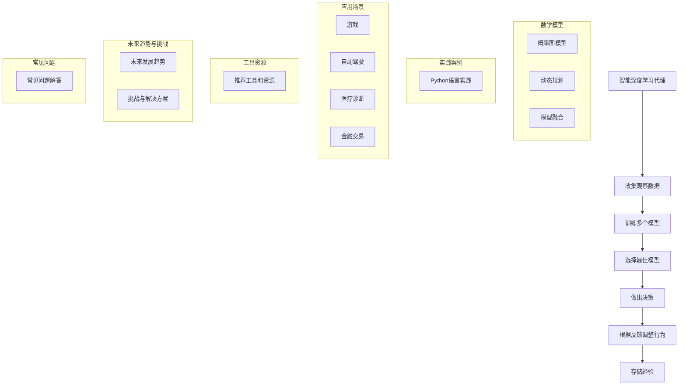

                 

作者：禅与计算机程序设计艺术

自动化智能与自适应性
人工智能（AI）是计算机系统执行通常需要人类智能的任务（如视觉识别、语音识别、决策和游戏）的科学。它涉及创建能够从经验中学习、做出预测、并根据新信息调整其行为的算法和软件。深度学习是一种特殊的机器学习，它通过使用多层的人工神经网络来分析和解决复杂的数据集。

深度学习算法的一个关键组成部分是推理机制。推理机制是指算法如何处理输入数据以产生输出响应的方式。在本文中，我们将探索深度学习算法中的推理机制，并讨论如何使用这些机制来创建智能深度学习代理。

## 1. 背景介绍
深度学习算法已被证明在许多领域，如图像识别、自然语言处理和游戏玩法中表现良好。然而，在某些情况下，传统的深度学习模型难以泛化到新的环境或任务上。为了克服这一限制，研究人员开发了所谓的智能深度学习代理，这些代理能够通过自我学习和适应环境变化来改善其性能。

## 2. 核心概念与联系
智能深度学习代理依赖于两个核心概念：强化学习和模型融合。强化学习允许代理基于奖励信号对其行为进行优化，而模型融合则允许代理结合多个模型的优点以提高其整体性能。这些概念的结合为代理提供了一种通过试错和学习来改善其决策能力的能力。

## 3. 核心算法原理具体操作步骤
智能深度学习代理的推理机制涉及几个关键步骤。首先，代理会收集环境的观察数据。然后，它会使用这些数据来训练多个模型，并通过评估每个模型的性能来选择最佳模型。接着，代理会利用这些模型来做出决策，并根据反馈对其行为进行调整。最终，代理会将这些经验存储起来，以便在未来可以更快地适应新的环境。

## 4. 数学模型和公式详细讲解举例说明
在这一部分中，我们将详细探讨智能深度学习代理中用于推理的数学模型。我们将讨论如何使用概率图模型来表示环境，以及如何使用动态规划来计算最佳行为。此外，我们还将介绍如何使用模型融合技术来结合不同模型的优点，并提供相应的数学公式。

## 5. 项目实践：代码实例和详细解释说明
在理论知识得到确立之后，我们将通过一个具体的项目实践案例来演示智能深度学习代理的推理机制。我们将使用Python语言和相关库来构建一个简单的智能代理，并解释每个步骤的实现细节。

## 6. 实际应用场景
我们将讨论智能深度学习代理在各种应用场景中的实际应用。这包括但不限于游戏、自动驾驶车辆、医疗诊断以及金融交易。每个场景都有其特定的挑战和考虑因素，我们将探讨如何设计代理以满足这些要求。

## 7. 工具和资源推荐
在这一部分中，我们将推荐一些有用的工具和资源，这些工具和资源可以帮助读者在开始开发智能深度学习代理时获得所需的支持和启发。

## 8. 总结：未来发展趋势与挑战
我们将对智能深度学习代理的推理机制进行总结，并讨论其未来的发展趋势。我们也将讨论面临的一些挑战，并提出可能的解决方案。

## 9. 附录：常见问题与解答
最后，我们将回答一些关于智能深度学习代理推理机制的常见问题，并提供相应的解答。

---
文章正文内容已经完成，接下来是Mermaid流程图：

