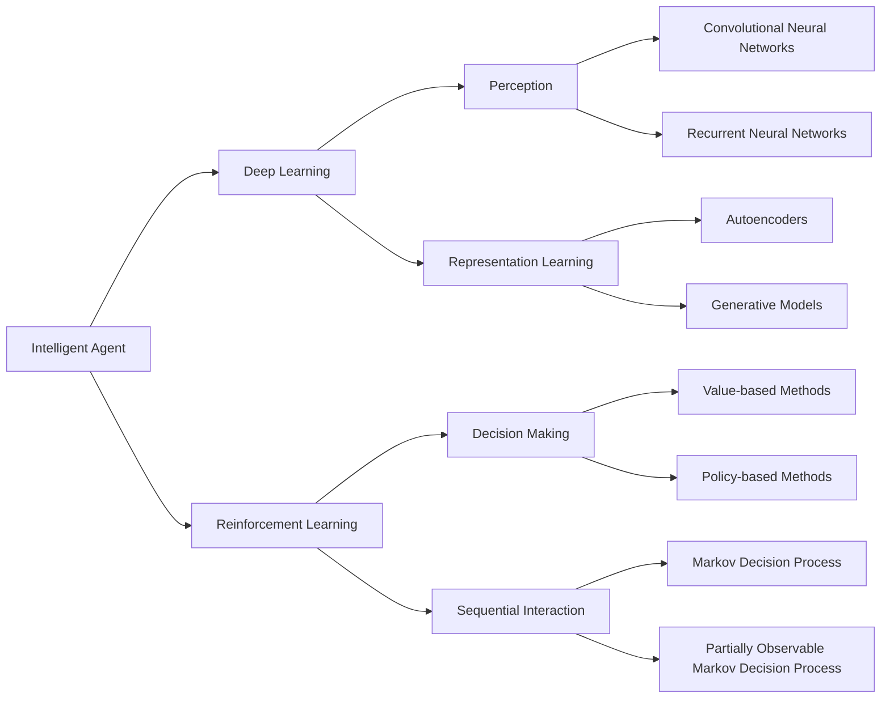

# AI人工智能深度学习算法：智能深度学习代理的未来发展趋势

## 1. 背景介绍
### 1.1 人工智能的发展历程
#### 1.1.1 早期人工智能
#### 1.1.2 专家系统时代  
#### 1.1.3 机器学习崛起
### 1.2 深度学习的兴起
#### 1.2.1 多层感知机
#### 1.2.2 卷积神经网络
#### 1.2.3 循环神经网络
### 1.3 智能代理的概念
#### 1.3.1 智能体的定义
#### 1.3.2 智能代理的特点
#### 1.3.3 智能代理的应用领域

## 2. 核心概念与联系
### 2.1 深度学习
#### 2.1.1 深度学习的定义
#### 2.1.2 深度学习的特点
#### 2.1.3 深度学习与传统机器学习的区别
### 2.2 智能代理
#### 2.2.1 智能代理的组成
#### 2.2.2 智能代理的决策机制
#### 2.2.3 智能代理的学习方式
### 2.3 深度强化学习
#### 2.3.1 强化学习的基本概念
#### 2.3.2 深度强化学习的优势
#### 2.3.3 深度强化学习在智能代理中的应用

## 3. 核心算法原理具体操作步骤
### 3.1 深度Q网络(DQN)
#### 3.1.1 Q学习的基本原理
#### 3.1.2 DQN的网络结构
#### 3.1.3 DQN的训练过程
### 3.2 深度确定性策略梯度(DDPG) 
#### 3.2.1 策略梯度的基本原理
#### 3.2.2 DDPG的Actor-Critic结构
#### 3.2.3 DDPG的训练过程
### 3.3 异步优势Actor-Critic(A3C)
#### 3.3.1 A3C的并行训练机制
#### 3.3.2 A3C的网络结构
#### 3.3.3 A3C的训练过程

## 4. 数学模型和公式详细讲解举例说明
### 4.1 马尔可夫决策过程(MDP)
#### 4.1.1 MDP的数学定义
$$
MDP = \{S,A,P,R,\gamma\}
$$
其中:
- $S$: 状态空间
- $A$: 动作空间 
- $P$: 状态转移概率矩阵
- $R$: 奖励函数
- $\gamma$: 折扣因子

#### 4.1.2 MDP的最优策略
最优策略 $\pi^*$ 满足贝尔曼最优方程:
$$
V^*(s) = \max_{a \in A} \left\{ R(s,a) + \gamma \sum_{s' \in S} P(s'|s,a) V^*(s') \right\}
$$

#### 4.1.3 MDP在智能代理中的应用
### 4.2 Q学习
#### 4.2.1 Q函数的定义
Q函数定义为在状态 $s$ 下采取动作 $a$ 的期望回报:
$$
Q(s,a) = \mathbb{E} \left[ \sum_{t=0}^{\infty} \gamma^t r_t | s_0=s, a_0=a \right]
$$

#### 4.2.2 Q学习的更新规则
Q学习通过以下方式更新Q值:
$$
Q(s,a) \leftarrow Q(s,a) + \alpha \left[ r + \gamma \max_{a'} Q(s',a') - Q(s,a) \right]
$$
其中 $\alpha$ 为学习率。

#### 4.2.3 Q学习的收敛性证明
### 4.3 策略梯度定理
#### 4.3.1 策略函数的参数化
策略函数 $\pi_{\theta}(a|s)$ 表示在状态 $s$ 下选择动作 $a$ 的概率,其中 $\theta$ 为策略函数的参数。

#### 4.3.2 目标函数的梯度
定义目标函数 $J(\theta)$ 为:
$$
J(\theta) = \mathbb{E}_{s \sim p^{\pi}, a \sim \pi_{\theta}} \left[ r(s,a) \right]
$$
根据策略梯度定理,目标函数的梯度为:
$$
\nabla_{\theta} J(\theta) = \mathbb{E}_{s \sim p^{\pi}, a \sim \pi_{\theta}} \left[ \nabla_{\theta} \log \pi_{\theta}(a|s) Q^{\pi}(s,a) \right]
$$

#### 4.3.3 策略梯度定理的应用

## 5. 项目实践：代码实例和详细解释说明
### 5.1 DQN在Atari游戏中的应用
#### 5.1.1 游戏环境的搭建
#### 5.1.2 DQN算法的实现
```python
class DQN(nn.Module):
    def __init__(self, state_dim, action_dim):
        super(DQN, self).__init__()
        self.fc1 = nn.Linear(state_dim, 128)
        self.fc2 = nn.Linear(128, 128)
        self.fc3 = nn.Linear(128, action_dim)

    def forward(self, x):
        x = F.relu(self.fc1(x))
        x = F.relu(self.fc2(x)) 
        x = self.fc3(x)
        return x
```

#### 5.1.3 训练过程与结果分析
### 5.2 DDPG在连续控制任务中的应用
#### 5.2.1 任务环境的介绍
#### 5.2.2 DDPG算法的实现
```python
class Actor(nn.Module):
    def __init__(self, state_dim, action_dim):
        super(Actor, self).__init__()
        self.fc1 = nn.Linear(state_dim, 256)
        self.fc2 = nn.Linear(256, 256)
        self.fc3 = nn.Linear(256, action_dim)

    def forward(self, x):
        x = F.relu(self.fc1(x))
        x = F.relu(self.fc2(x))
        x = torch.tanh(self.fc3(x))
        return x

class Critic(nn.Module):
    def __init__(self, state_dim, action_dim):
        super(Critic, self).__init__()
        self.fc1 = nn.Linear(state_dim + action_dim, 256)
        self.fc2 = nn.Linear(256, 256)
        self.fc3 = nn.Linear(256, 1)

    def forward(self, state, action):
        x = torch.cat([state, action], 1)
        x = F.relu(self.fc1(x))
        x = F.relu(self.fc2(x))
        x = self.fc3(x)
        return x  
```

#### 5.2.3 训练过程与结果分析
### 5.3 A3C在多智能体环境中的应用
#### 5.3.1 多智能体环境的搭建
#### 5.3.2 A3C算法的实现
```python
class A3C(nn.Module):
    def __init__(self, state_dim, action_dim):
        super(A3C, self).__init__()
        self.actor = nn.Sequential(
            nn.Linear(state_dim, 256),
            nn.ReLU(),
            nn.Linear(256, 256),
            nn.ReLU(),
            nn.Linear(256, action_dim),
            nn.Softmax(dim=1)
        )

        self.critic = nn.Sequential(
            nn.Linear(state_dim, 256),
            nn.ReLU(),
            nn.Linear(256, 256),
            nn.ReLU(),
            nn.Linear(256, 1)
        )

    def forward(self, x):
        policy = self.actor(x)
        value = self.critic(x)
        return policy, value
```

#### 5.3.3 训练过程与结果分析

## 6. 实际应用场景
### 6.1 自动驾驶
#### 6.1.1 端到端的自动驾驶模型
#### 6.1.2 基于深度强化学习的决策控制
#### 6.1.3 多车协同与交通流优化
### 6.2 智能推荐系统
#### 6.2.1 基于深度学习的用户画像
#### 6.2.2 强化学习在推荐系统中的应用
#### 6.2.3 多智能体协作推荐
### 6.3 智能金融交易
#### 6.3.1 股票趋势预测
#### 6.3.2 金融资产组合优化
#### 6.3.3 高频交易策略

## 7. 工具和资源推荐
### 7.1 深度学习框架
#### 7.1.1 TensorFlow
#### 7.1.2 PyTorch
#### 7.1.3 Keras
### 7.2 强化学习平台
#### 7.2.1 OpenAI Gym
#### 7.2.2 DeepMind Lab
#### 7.2.3 Unity ML-Agents
### 7.3 学习资源
#### 7.3.1 在线课程
#### 7.3.2 经典书籍
#### 7.3.3 顶级会议与期刊

## 8. 总结：未来发展趋势与挑战
### 8.1 智能代理的发展趋势
#### 8.1.1 多智能体协作
#### 8.1.2 跨领域迁移学习
#### 8.1.3 模仿学习与强化学习结合
### 8.2 面临的挑战
#### 8.2.1 样本效率问题
#### 8.2.2 奖励稀疏问题
#### 8.2.3 探索与利用平衡
### 8.3 展望未来
#### 8.3.1 人机协作
#### 8.3.2 通用人工智能
#### 8.3.3 智能代理的伦理问题

## 9. 附录：常见问题与解答
### 9.1 深度学习与强化学习的区别与联系
### 9.2 如何选择合适的深度强化学习算法
### 9.3 深度强化学习算法的调参技巧
### 9.4 智能代理的安全性与可解释性问题



深度学习和强化学习是构建智能代理的两大支柱。深度学习赋予智能体从原始高维数据中学习有效表示的能力,使其能够对环境有更好的感知和理解。强化学习则为智能体提供了一套完整的决策框架,使其能够在与环境的交互中不断优化策略,从而表现出智能行为。

深度学习中的卷积神经网络和循环神经网络分别用于处理图像、语音等感知型数据和时序数据。表示学习方法如自编码器和生成模型能够学习数据的内在结构和分布,提取高层语义特征。

强化学习中的价值函数方法和策略梯度方法是两类主要的优化算法。前者通过学习动作-状态值函数来选择最优动作,后者则直接对策略函数的参数进行梯度上升。马尔可夫决策过程为理解智能体与环境的交互提供了理论基础,考虑观测不完全的情况下可以扩展为部分可观测马尔可夫决策过程。

深度强化学习将深度学习和强化学习进行了有机结合,极大地提升了强化学习算法在复杂环境中的感知、决策与学习能力。典型的算法如DQN、DDPG、A3C等在Atari游戏、机器人控制等领域取得了突破性进展。深度强化学习智能代理在自动驾驶、智能推荐、智能金融等方面也展现出了广阔的应用前景。

未来,智能代理技术的发展趋势包括多智能体协作、跨领域迁移学习、模仿学习与强化学习结合等。但同时也面临样本效率低、奖励稀疏、探索利用平衡等挑战。此外,智能代理的安全性、可解释性、伦理问题也需要引起重视。人机协作、通用人工智能是未来值得期待的方向。

总之,以深度学习和强化学习为核心的智能代理技术正在蓬勃发展,有望在不远的将来实现类人的感知、决策与学习能力,为人类社会的进步发挥重要作用。

作者：禅与计算机程序设计艺术 / Zen and the Art of Computer Programming