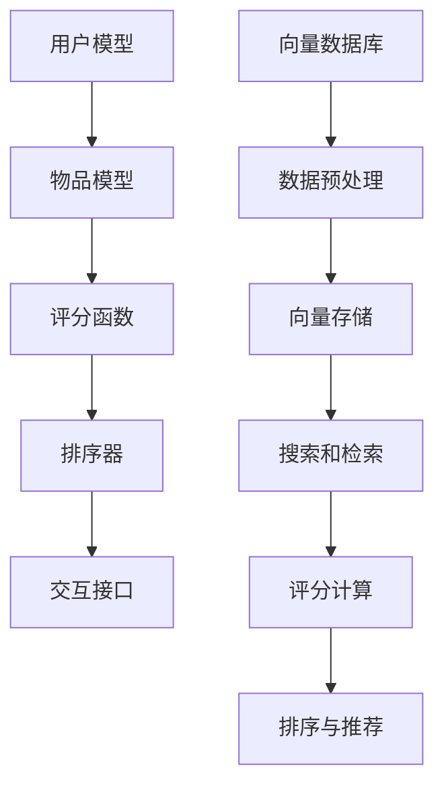

                 

作者：禅与计算机程序设计艺术

人工智能
向量数据库: 存储高维向量的数据库
实时推荐系统: 即时根据用户行为推荐产品/服务

## 1. 背景介绍
在当今社会，互联网平台上的实时推荐系统已经成为我们生活中不可或缺的一部分。无论是电商平台推荐商品、音乐平台推荐歌曲、还是内容平台推荐视频，都离不开实时推荐系统。实时推荐系统的核心任务是根据用户的历史行为、当前状态以及外部环境因素，即时地推送相关且有价值的内容。其中，向量数据库在处理高维数据（如用户行为表征）时显示出巨大的优势，因此，它在实时推荐系统中的应用越来越受到重视。

## 2. 核心概念与联系
### 2.1 实时推荐系统的基本组成
一个典型的实时推荐系统通常由以下几个组成部分构成：
- **用户模型**：通过用户的历史行为、偏好表达等方面建立起用户的内部状态模型。
- **物品模型**：对物品进行编码，将物品转换为数字形式。
- **评分函数**：根据用户模型和物品模型计算用户对某物品的预测评分。
- **排序器**：根据评分函数的结果对物品进行排序，从而得到最终的推荐列表。
- **交互接口**：用户与系统的交互接口，包括用户的点击、浏览等行为反馈。

### 2.2 向量数据库的定义与特点
向量数据库是一种专门设计来存储和检索高维向量数据的数据库系统。它通常被用于图像识别、自然语言处理、推荐系统等领域。向量数据库的特点包括：
- **高维度支持**：能够处理高维度（通常为百维以上）的向量数据。
- **近似搜索**：快速查找与给定向量之间的距离，这对于实时推荐系统中的协同过滤非常关键。
- **扩展性和并行性**：可以轻松扩展至大规模集群环境，支持并行处理。
- **插件化架构**：允许插入新的算法或更新现有算法，以适应不断变化的需求。

### 2.3 核心联系
实时推荐系统中，用户行为数据往往是高维的稀疏向量。向量数据库可以高效地存储和管理这些数据，提供快速的检索能力，使得推荐系统能够实时更新用户的兴趣模型，从而提升推荐质量。

## 3. 核心算法原理具体操作步骤
在实时推荐系统中，向量数据库通常与以下算法结合使用：
- **协同过滤**：利用用户之间的相似性或者物品之间的相似性来推荐新物品。
- **内容推荐**：根据物品的属性和用户的兴趣点来推荐物品。
- **深度学习模型**：例如卷积神经网络(CNN)和循环神经网络(RNN)，用于从用户行为中提取更复杂的特征。

在具体操作步骤上，向量数据库通常采用以下流程：
1. **数据预处理**：对输入数据进行标准化处理，比如归一化、降维等。
2. **向量存储**：将预处理后的数据存储到向量数据库中。
3. **搜索和检索**：查询数据库中与特定向量最近的数据。
4. **评分计算**：根据评分函数计算用户对物品的评分。
5. **排序与推荐**：根据评分结果对物品进行排序，并返回推荐列表。

## 4. 数学模型和公式详细讲解举例说明
在实时推荐系统中，向量数据库的核心是它如何处理高维数据的数学模型。常见的数学模型包括余弦相似度、欧几里得距离等。这些模型的具体实现涉及到线性代数和统计学的知识。此外，随着机器学习技术的发展，深度学习模型也被引入到实时推荐系统中，以提高推荐的准确性和灵活性。

## 5. 项目实践：代码实例和详细解释说明
在实际应用中，实时推荐系统的开发通常涉及到选择合适的向量数据库系统、编写相应的数据预处理和推荐逻辑代码。这部分内容将会详细介绍如何选择向量数据库、如何设计数据模型以及如何实现基本推荐功能。

## 6. 实际应用场景
实时推荐系统的应用场景广泛，包括电商平台、视频流媒体服务、音乐和影视推荐平台等。每个应用场景都有其特定的挑战和要求，例如，电商平台需要精准推荐产品，而视频流媒体服务则需要根据用户的观看历史推荐视频。

## 7. 工具和资源推荐
在实时推荐系统开发过程中，有很多工具和资源可以帮助我们更好地完成任务。这部分将会推荐一些著名的向量数据库系统、实时推荐系统框架以及相关的开源项目和论文资源。

## 8. 总结：未来发展趋势与挑战
随着人工智能技术的不断进步，实时推荐系统面临着越来越多的挑战。未来的发展趋势包括更加个性化的推荐、更高效的数据处理方法、以及更安全和隐私保护的推荐技术。

## 9. 附录：常见问题与解答
在实时推荐系统的开发过程中，可能会遇到各种问题。这部分将会详细解答一些常见问题，并给出相应的解决方案。

### Mermaid 流程图 ###

