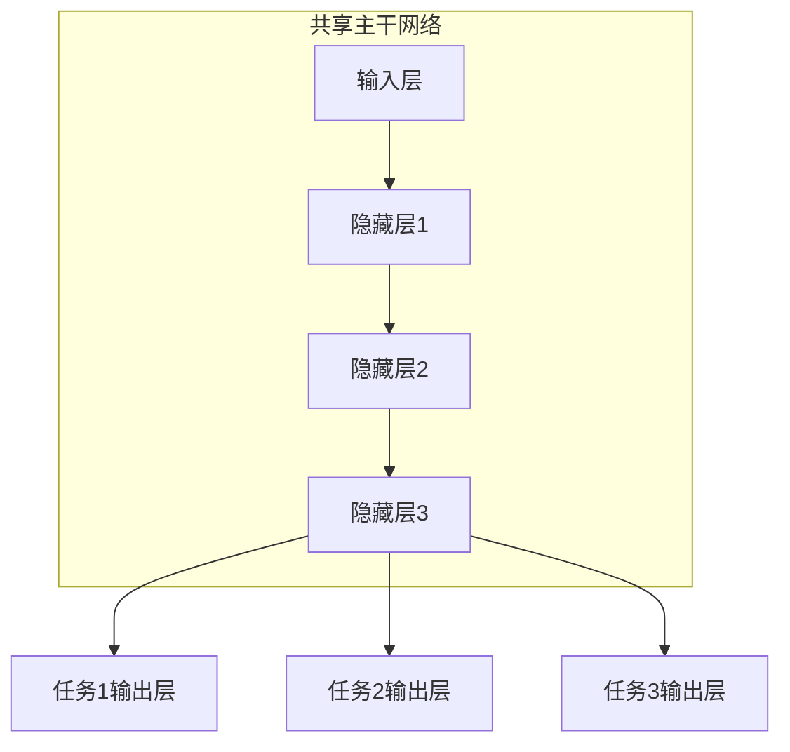
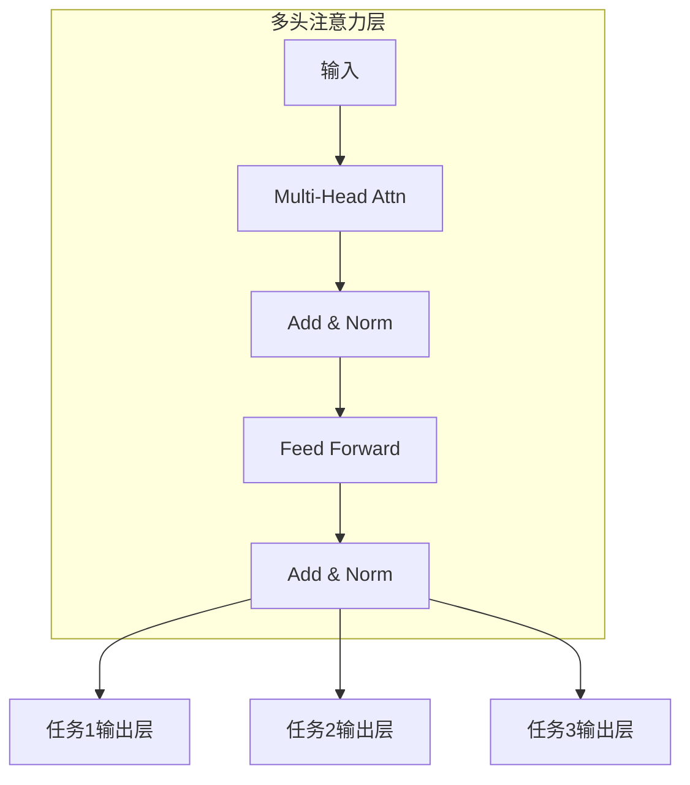
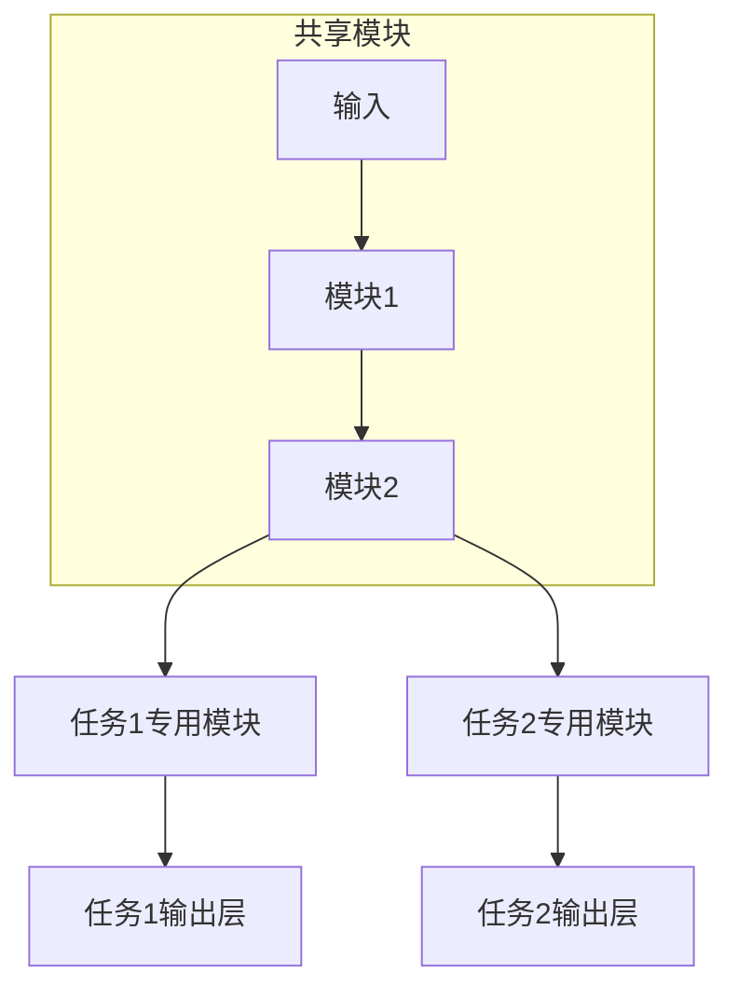

# AI大模型中的多任务学习：一石多鸟

## 1.背景介绍

### 1.1 人工智能的发展历程

人工智能(Artificial Intelligence, AI)是当代科技发展的前沿领域,近年来取得了长足的进步。从20世纪50年代诞生的第一个人工智能系统,到如今广泛应用于计算机视觉、自然语言处理、决策系统等诸多领域,AI已经渗透到我们生活的方方面面。

### 1.2 大模型的兴起

随着算力的不断提升和海量数据的积累,大规模的人工神经网络模型开始崭露头角。这些所谓的"大模型"通过在庞大的数据集上进行预训练,能够学习到丰富的知识表示,并在下游任务上表现出卓越的能力。

代表性的大模型有:

- GPT(Generative Pre-trained Transformer)系列
- BERT(Bidirectional Encoder Representations from Transformers)
- ResNet(Residual Network)
- ...

### 1.3 多任务学习的优势

传统的机器学习方法通常是为单一任务设计和训练模型。然而,在实际应用中,我们常常面临多个相关任务需要同时解决。多任务学习(Multi-Task Learning, MTL)就是在同一个模型中同时学习多个任务,使不同任务之间的信息可以相互借鉴。

相比单任务学习,多任务学习具有以下优势:

- 数据效率更高
- 模型泛化能力更强
- 减少了重复学习的代价
- 有利于知识迁移

### 1.4 大模型与多任务学习的结合

将多任务学习思想引入大模型中,可以使模型在学习多个任务的同时,获得更丰富的知识表示能力。这不仅提高了模型的效率和性能,也为解决复杂的现实问题提供了新思路。

本文将深入探讨大模型中多任务学习的原理、实现方法及应用场景,为读者提供全面的技术洞见。

## 2.核心概念与联系

### 2.1 多任务学习的形式化定义

多任务学习可以形式化定义为:给定 $m$ 个学习任务 $\mathcal{T} = \{T_1, T_2, \dots, T_m\}$,每个任务 $T_i$ 包含一个训练数据集 $\mathcal{D}_i$ 和一个学习目标(机器学习模型) $f_i$。多任务学习的目标是通过在所有任务的训练数据上共同训练,学习到一组参数 $\theta^*$,使得:

$$\theta^* = \arg\min_\theta \sum_{i=1}^m \mathcal{L}_i(f_i(\cdot;\theta),\mathcal{D}_i)$$

其中 $\mathcal{L}_i$ 是第 $i$ 个任务的损失函数。

### 2.2 多任务学习与迁移学习的关系

迁移学习(Transfer Learning)指的是将在一个领域学习到的知识应用到另一个领域的过程。多任务学习可以看作是一种特殊的迁移学习,不同任务之间相互"迁移"知识和经验。

与传统的迁移学习相比,多任务学习在模型训练阶段就融合了多个任务,无需进行显式的迁移操作。这使得模型能够自主地学习任务之间的共性,提高了泛化能力。

### 2.3 多任务学习的挑战

尽管多任务学习有诸多优势,但也面临一些挑战:

1. **任务冲突**: 不同任务可能存在一定的冲突,同时优化多个目标函数可能会导致性能下降。
2. **任务关联性**: 无关任务之间的知识迁移可能会引入噪声,影响模型性能。如何度量和利用任务关联性是一个重要问题。
3. **计算消耗**: 同时训练多个任务会增加计算开销,对硬件资源要求更高。
4. **数据不平衡**: 不同任务的数据量可能存在很大差异,如何处理数据不平衡是一个挑战。

## 3.核心算法原理具体操作步骤

### 3.1 硬参数共享

硬参数共享是多任务学习最直接的实现方式。不同任务共享主干网络的大部分参数,仅在输出层使用任务特定的参数。

这种方法简单有效,但也存在一些局限性:

- 任务之间的相关性较低时,性能可能下降
- 无法很好地处理异构输入输出(如图像和文本)
- 对于大规模模型,参数共享的优化较为困难

### 3.2 软参数共享

软参数共享通过引入正则项,使不同任务的参数值相近但不完全相同。这种方法赋予了模型一定的灵活性,可以适应不同任务的特点。

$$\min_{\theta_1,\theta_2}\mathcal{L}_1(\theta_1) + \mathcal{L}_2(\theta_2) + \lambda\Omega(\theta_1,\theta_2)$$

其中 $\Omega$ 是某种参数距离的度量函数(如L2范数),而 $\lambda$ 控制了参数共享的程度。

### 3.3 基于注意力机制的多任务学习

自注意力机制(Self-Attention)的出现使得 Transformer 模型在多个任务上表现出色。通过设计合适的注意力机制,可以自动捕获不同任务之间的相关性,并据此分配计算资源。

不同的注意力头可以专注于不同的任务,从而实现有效的多任务学习。

### 3.4 基于模块化设计的多任务学习

将模型设计为可组合的模块化结构,不同任务共享一部分模块,也拥有自己专门的模块。这种设计灵活性更高,可以根据任务的特点选择合适的模块组合。

模块化设计的关键是如何自动发现和组合高质量的共享模块,这是一个值得深入研究的课题。

### 3.5 其他多任务学习方法

除了上述几种主要方法外,还有一些其他的多任务学习算法,如:

- 基于权重不确定性的多任务学习
- 基于梯度归一化的多任务学习
- 分层多任务学习
- 多模态多任务学习
- ...

不同的算法针对不同的场景和需求,具有各自的优缺点,需要根据实际情况选择合适的方法。

## 4.数学模型和公式详细讲解举例说明

### 4.1 硬参数共享的数学模型

考虑一个有 $m$ 个任务的多任务学习问题,每个任务 $i$ 有一个独立的损失函数 $\mathcal{L}_i$。硬参数共享的目标函数为:

$$\min_\theta \sum_{i=1}^m \lambda_i \mathcal{L}_i(f_i(\cdot;\theta),\mathcal{D}_i)$$

其中 $\lambda_i$ 是第 $i$ 个任务的损失权重,用于平衡不同任务的重要性。所有任务共享同一组参数 $\theta$,通过端到端的联合训练来优化目标函数。

以一个两任务的图像分类问题为例,假设第一个任务是分类猫狗图像,第二个任务是分类汽车和卡车图像。我们可以使用一个共享的卷积神经网络作为主干网络,在最后加上两个独立的全连接层作为输出层。

对于一个输入图像 $x$,主干网络会提取出特征向量 $\phi(x;\theta)$,然后将其输入到两个输出层:

$$y_1 = f_1(\phi(x;\theta);\theta_1), \quad y_2 = f_2(\phi(x;\theta);\theta_2)$$

其中 $\theta_1$ 和 $\theta_2$ 是两个任务各自的输出层参数。

在训练时,我们需要同时最小化两个任务的损失函数之和:

$$\min_{\theta,\theta_1,\theta_2} \lambda_1\mathcal{L}_1(y_1,y_1^*) + \lambda_2\mathcal{L}_2(y_2,y_2^*)$$

这里 $y_1^*$ 和 $y_2^*$ 分别是第一个和第二个任务的标签。通过联合优化,模型可以学习到两个任务的共同特征表示,提高了泛化能力。

### 4.2 软参数共享的数学模型

软参数共享的基本思想是,为每个任务学习一组专门的参数,但同时加入一个正则项,使得不同任务的参数值相近。具体来说,目标函数为:

$$\min_{\theta_1,\theta_2}\sum_{i=1}^m \mathcal{L}_i(f_i(\cdot;\theta_i),\mathcal{D}_i) + \lambda\Omega(\theta_1,\theta_2)$$

其中 $\Omega(\theta_1,\theta_2)$ 是一个参数距离的度量函数,常用的有L2范数:

$$\Omega(\theta_1,\theta_2) = \|\theta_1 - \theta_2\|_2^2$$

或者是向量内积:

$$\Omega(\theta_1,\theta_2) = -\langle\theta_1,\theta_2\rangle$$

超参数 $\lambda$ 控制了参数共享的强度。当 $\lambda=0$ 时,等价于完全独立训练;当 $\lambda\rightarrow\infty$ 时,等价于硬参数共享。

通过引入软参数共享的正则项,模型可以根据任务的相关性自适应地分配参数。对于相关性较高的任务,参数会更加相近;而对于无关任务,参数则可以有较大差异。这种灵活性使得软参数共享在很多情况下表现更优。

### 4.3 基于注意力机制的多任务学习

Transformer 模型中的自注意力机制为多任务学习提供了新的思路。不同的注意力头可以自动学习到不同任务的相关特征,从而实现高效的多任务学习。

具体来说,假设我们有一个包含 $N$ 个注意力头的 Transformer 编码器,对于第 $i$ 个输入序列 $\mathbf{x}_i$,第 $j$ 个注意力头的计算过程为:

$$\text{head}_j(\mathbf{x}_i) = \text{Attention}(\mathbf{Q}_j\mathbf{x}_i, \mathbf{K}_j\mathbf{x}_i, \mathbf{V}_j\mathbf{x}_i)$$

其中 $\mathbf{Q}_j$、$\mathbf{K}_j$ 和 $\mathbf{V}_j$ 分别是查询、键和值的线性投影矩阵。

对于一个包含 $m$ 个任务的多任务学习问题,我们可以为每个任务分配一部分注意力头,使其专注于该任务的特征。设第 $i$ 个任务使用前 $n_i$ 个注意力头,那么该任务的输出表示为:

$$\mathbf{z}_i = \text{Concat}(\text{head}_1(\mathbf{x}_i), \dots, \text{head}_{n_i}(\mathbf{x}_i))$$

然后将 $\mathbf{z}_i$ 输入到该任务的输出层,得到最终的预测结果。在训练时,我们可以最小化所有任务的损失函数之和,使模型同时学习多个任务。

通过这种方式,不同的注意力头可以自动分配给不同的任务,捕获任务之间的相关性。与硬参数共享相比,这种方法更加灵活和高效。

## 5.项目实践:代码实例和详细解释说明

为了更好地理解多任务学