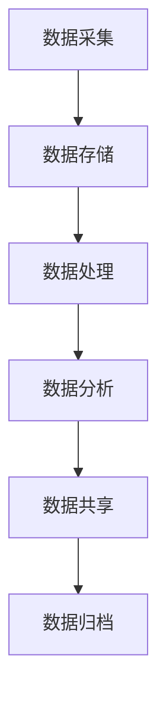

# AI数据管理原理与代码实战案例讲解

## 1. 背景介绍

### 1.1 数据的重要性

在当今时代,数据已经成为了一种新的战略资源和生产要素,对于企业和组织来说,数据是推动业务发展、提高运营效率、制定战略决策的关键支撑。随着大数据、人工智能等新兴技术的不断发展,数据的价值得到了前所未有的重视。然而,如何高效地管理和利用海量的数据资产,成为了企业和组织面临的一大挑战。

### 1.2 AI数据管理的意义

传统的数据管理方式已经难以满足现代化数据处理的需求。AI数据管理应运而生,它将人工智能技术与数据管理相结合,旨在提高数据管理的自动化水平、优化数据处理流程、提升数据质量,从而帮助企业和组织更好地利用数据资产,实现数据驱动的业务创新和智能决策。

## 2. 核心概念与联系

### 2.1 数据管理生命周期

数据管理生命周期描述了数据从产生到被利用的整个过程,包括数据采集、存储、处理、分析、共享和归档等多个环节。AI数据管理贯穿于整个生命周期,在每个环节都发挥着重要作用。

### 2.2 AI在数据管理中的应用

AI技术在数据管理生命周期的各个环节都有广泛的应用:

- **数据采集**: 利用计算机视觉、自然语言处理等技术,实现数据的自动采集和标注。
- **数据存储**: 利用智能存储优化技术,实现数据的高效存储和管理。
- **数据处理**: 利用大数据处理框架和算法,对海量数据进行清洗、转换和集成。
- **数据分析**: 利用机器学习、深度学习等技术,从数据中发现隐藏的模式和洞见。
- **数据共享**: 利用知识图谱、语义技术等,实现数据的智能检索和共享。
- **数据归档**: 利用智能归档技术,优化数据的长期保存和管理。

### 2.3 AI数据管理的核心要素

AI数据管理包含以下几个核心要素:

- **数据质量管理**: 利用AI技术提高数据的准确性、完整性和一致性。
- **元数据管理**: 利用AI技术自动提取和管理数据的元数据信息。
- **数据治理**: 利用AI技术实现数据的自动化管控和合规性检查。
- **数据安全**: 利用AI技术加强数据的隐私保护和访问控制。
- **数据集成**: 利用AI技术实现数据的智能集成和融合。

## 3. 核心算法原理具体操作步骤

### 3.1 数据质量管理算法

#### 3.1.1 数据清洗算法

数据清洗是提高数据质量的重要环节,常用的算法包括:

1. **缺失值处理算法**
   - 删除法: 删除包含缺失值的记录或特征
   - 均值/中位数/众数插补法: 用均值、中位数或众数填充缺失值
   - 机器学习算法: 利用机器学习模型预测缺失值

2. **异常值处理算法**
   - 基于统计学的异常值检测: 利用数据的统计特征(如均值、标准差等)识别异常值
   - 基于聚类的异常值检测: 利用聚类算法将异常值与正常数据点分开
   - 基于深度学习的异常值检测: 利用自编码器等深度学习模型学习数据的正常模式,将偏离正常模式的数据点识别为异常值

3. **数据规范化算法**
   - Min-Max标准化: 将数据线性映射到[0,1]区间
   - Z-Score标准化: 将数据标准化为均值为0、标准差为1的分布
   - 小数定标标准化: 将数据映射到[-1,1]区间

#### 3.1.2 数据去重算法

去除重复数据是提高数据质量的另一重要环节,常用的算法包括:

1. **基于哈希的去重算法**
   - 对每条记录计算哈希值,将哈希值相同的记录视为重复记录
   - 常用的哈希函数包括MD5、SHA-1等

2. **基于规则的去重算法**
   - 根据预定义的规则(如主键、唯一约束等)识别重复记录
   - 常用于结构化数据的去重

3. **基于相似性的去重算法**
   - 计算记录之间的相似度,将相似度高于阈值的记录视为重复记录
   - 常用的相似度度量包括编辑距离、Jaccard相似系数等

4. **基于机器学习的去重算法**
   - 利用监督或无监督机器学习模型自动学习数据模式,识别重复记录
   - 常用的模型包括决策树、聚类算法等

### 3.2 元数据管理算法

#### 3.2.1 元数据提取算法

元数据提取是元数据管理的基础,常用的算法包括:

1. **基于规则的元数据提取**
   - 根据预定义的规则从数据源中提取元数据
   - 适用于结构化数据源,如关系数据库、XML文件等

2. **基于模式的元数据提取**
   - 利用数据模式(如数据库模式)自动提取元数据
   - 常用于关系数据库和NoSQL数据库

3. **基于机器学习的元数据提取**
   - 利用监督或无监督机器学习模型从非结构化数据源(如文本、图像等)中提取元数据
   - 常用的模型包括命名实体识别、主题建模等

#### 3.2.2 元数据管理算法

提取元数据后,需要对元数据进行有效的管理和利用,常用的算法包括:

1. **元数据标准化算法**
   - 将异构元数据转换为统一的标准格式,便于集成和共享
   - 常用的标准格式包括Dublin Core、ISO 19115等

2. **元数据融合算法**
   - 将来自不同数据源的元数据进行融合,形成统一的元数据视图
   - 常用的融合算法包括基于规则的融合、基于ontology的融合等

3. **元数据查询算法**
   - 支持对元数据进行高效查询和检索
   - 常用的查询算法包括基于关键字的查询、基于语义的查询等

4. **元数据推理算法**
   - 基于现有的元数据推导出新的元数据知识
   - 常用的推理算法包括基于规则的推理、基于概率的推理等

### 3.3 数据治理算法

#### 3.3.1 数据质量评估算法

数据质量评估是数据治理的重要环节,常用的算法包括:

1. **基于规则的数据质量评估**
   - 根据预定义的规则(如完整性约束、一致性约束等)评估数据质量
   - 适用于结构化数据

2. **基于统计的数据质量评估**
   - 利用数据的统计特征(如均值、标准差、分布等)评估数据质量
   - 适用于数值型数据

3. **基于机器学习的数据质量评估**
   - 利用监督或无监督机器学习模型自动学习数据模式,评估数据质量
   - 适用于结构化和非结构化数据

#### 3.3.2 数据策略优化算法

根据数据质量评估结果,需要优化数据策略以提高数据质量,常用的算法包括:

1. **基于规则的数据策略优化**
   - 根据预定义的规则(如数据标准、最佳实践等)优化数据策略
   - 适用于结构化数据

2. **基于机器学习的数据策略优化**
   - 利用监督或强化学习算法,自动学习最优的数据策略
   - 适用于结构化和非结构化数据

3. **基于多目标优化的数据策略优化**
   - 将数据质量、成本、时间等多个目标综合考虑,求解最优的数据策略
   - 常用的优化算法包括遗传算法、粒子群优化等

### 3.4 数据安全算法

#### 3.4.1 数据脱敏算法

数据脱敏是保护数据隐私的重要手段,常用的算法包括:

1. **数据掩码算法**
   - 将敏感数据的部分字符替换为掩码字符(如*或x)
   - 适用于结构化数据,如身份证号、银行卡号等

2. **数据加密算法**
   - 利用加密算法(如AES、RSA等)对敏感数据进行加密
   - 适用于结构化和非结构化数据

3. **数据扰动算法**
   - 在保留数据统计特征的前提下,对原始数据进行扰动
   - 常用的扰动算法包括加性扰动、乘性扰动等

4. **差分隐私算法**
   - 在查询结果中引入噪声,使得难以推断出个体的隐私信息
   - 常用于统计查询和机器学习模型训练

#### 3.4.2 数据访问控制算法

数据访问控制是保护数据安全的另一重要手段,常用的算法包括:

1. **基于角色的访问控制(RBAC)**
   - 根据用户的角色分配相应的数据访问权限
   - 适用于结构化数据

2. **基于属性的访问控制(ABAC)**
   - 根据用户的属性(如部门、职位等)分配数据访问权限
   - 适用于结构化和非结构化数据

3. **基于上下文的访问控制**
   - 根据访问环境(如时间、地点等)动态调整数据访问权限
   - 适用于移动场景和物联网场景

4. **基于加密的访问控制**
   - 利用加密技术对数据进行加密,只有持有正确密钥的用户才能访问数据
   - 适用于结构化和非结构化数据

### 3.5 数据集成算法

#### 3.5.1 数据融合算法

数据融合是将来自不同数据源的数据进行整合,常用的算法包括:

1. **基于模式的数据融合**
   - 根据数据模式(如关系模式、XML模式等)对数据进行融合
   - 适用于结构化数据

2. **基于实体的数据融合**
   - 根据实体(如人、地点、组织等)对数据进行融合
   - 适用于结构化和非结构化数据

3. **基于主题的数据融合**
   - 根据主题(如新闻事件、产品等)对数据进行融合
   - 适用于结构化和非结构化数据

4. **基于知识图谱的数据融合**
   - 利用知识图谱对数据进行语义融合
   - 适用于结构化和非结构化数据

#### 3.5.2 数据清洗算法

在数据融合过程中,需要对异构数据进行清洗和转换,常用的算法包括:

1. **基于规则的数据转换**
   - 根据预定义的规则对数据进行转换
   - 适用于结构化数据

2. **基于机器学习的数据转换**
   - 利用监督或无监督机器学习模型自动学习数据模式,进行数据转换
   - 适用于结构化和非结构化数据

3. **基于本体的数据转换**
   - 利用本体对数据进行语义转换
   - 适用于结构化和非结构化数据

4. **基于知识图谱的数据转换**
   - 利用知识图谱对数据进行语义转换
   - 适用于结构化和非结构化数据

## 4. 数学模型和公式详细讲解举例说明

在AI数据管理中,数学模型和公式扮演着重要的角色,为各种算法提供了理论基础和计算支撑。下面将详细讲解几个常用的数学模型和公式。

### 4.1 相似度度量

相似度度量是衡量两个对象相似程度的一种方法,在数据去重、数据融合等场景中有广泛应用。常用的相似度度量包括:

1. **编辑距离(Edit Distance)**

编辑距离衡量两个字符串之间的差异性,定