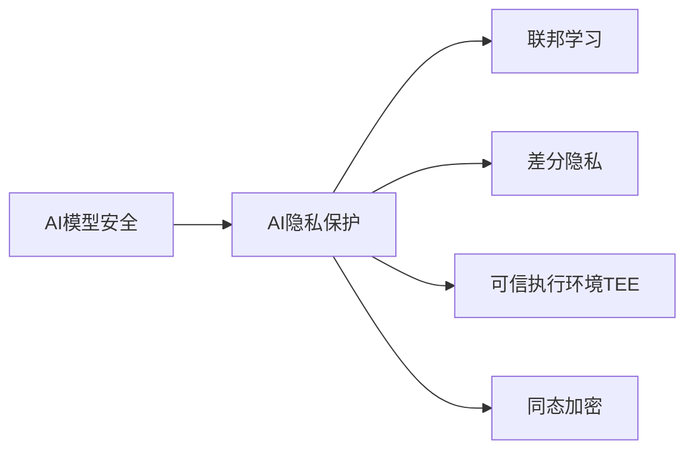

# AI模型安全与隐私保护原理与代码实战案例讲解

## 1. 背景介绍
### 1.1 AI模型安全与隐私保护的重要性
在当今大数据和人工智能飞速发展的时代,AI模型在各个领域得到广泛应用,给人们的生活和工作带来了极大的便利。然而,AI模型的广泛应用也带来了安全和隐私方面的隐患和挑战。AI模型可能存在被恶意攻击、窃取、篡改等安全风险,用户的隐私数据也有可能在训练或者使用AI模型的过程中被泄露。因此,AI模型的安全与隐私保护已经成为一个亟待解决的重要问题。

### 1.2 AI模型面临的安全威胁
AI模型面临着多种安全威胁,主要包括:
1. 数据中毒攻击:攻击者通过篡改训练数据,使得训练出的模型产生错误的输出结果。
2. 模型窃取:攻击者通过反复查询模型,从而推测出模型的参数和结构。 
3. 对抗样本攻击:攻击者构造一些特殊的对抗样本,导致模型错误分类。
4. 模型后门:在模型训练过程中嵌入后门,使得模型对某些特定输入产生错误输出。

### 1.3 AI系统隐私泄露的途径
AI系统可能导致用户隐私泄露,主要有以下几种途径:
1. 训练数据泄露:用于训练AI模型的数据集本身包含隐私信息。
2. 模型反演:通过AI模型的输入输出,反推出模型训练使用的隐私数据。
3. 推理结果泄露隐私:模型推理输出的内容包含用户隐私信息。
4. 算法泄露:机器学习算法本身存在隐私泄露的风险。

## 2. 核心概念与联系
### 2.1 AI模型安全
AI模型安全是指保护AI模型不受恶意攻击、窃取、篡改等安全威胁,确保模型按照预期方式运行,输出可靠准确的结果。它涉及数据安全、模型完整性、对抗攻击防御等多个方面。

### 2.2 AI隐私保护
AI隐私保护是指在收集、存储、使用用户数据训练AI模型以及模型部署应用的全过程中,采取各种技术和管理措施防止用户隐私数据被泄露、滥用,保障用户的数据主权和隐私权益。

### 2.3 联邦学习
联邦学习是一种分布式机器学习范式,可以在不集中用户原始数据的情况下,通过多方协作训练AI模型。它让数据在用户本地设备上保存,大大降低了隐私泄露风险。联邦学习是实现AI隐私保护的重要技术手段之一。

### 2.4 差分隐私
差分隐私是一种数学框架,通过在数据中注入随机噪声,使得攻击者无法判断某个特定个体是否在数据集中。差分隐私在AI的数据收集、模型训练、模型发布等阶段均可应用,是AI隐私保护的另一个核心技术。

### 2.5 可信执行环境(TEE)
可信执行环境是利用硬件芯片(如Intel SGX)提供的一个安全隔离区域,代码和数据在TEE中受到保护,不会被恶意窃取。在TEE中运行机器学习,可以保护模型和用户隐私数据的安全。

### 2.6 同态加密
同态加密使得AI模型能够直接在加密数据上执行计算,计算结果仍然是加密的,无需解密即可使用。同态加密让敏感数据始终处于加密状态,在保护隐私的同时还能进行机器学习。

下面是这些核心概念之间关系的Mermaid流程图:


## 3. 核心算法原理具体操作步骤
本节重点介绍几种AI隐私保护的核心算法,包括联邦学习、差分隐私、TEE中的机器学习以及同态加密。

### 3.1 联邦学习
联邦学习的基本步骤如下:
1. 每个参与方在本地用自己的数据训练机器学习模型
2. 各参与方上传本地模型的参数(如权重)到服务器,而不是上传原始数据
3. 服务器对收集的模型参数进行聚合,得到一个全局模型
4. 全局模型分发给各参与方,参与方用全局模型更新自己的本地模型
5. 重复步骤2-4,直到全局模型收敛或达到预设的迭代轮数

### 3.2 差分隐私
差分隐私的核心是在数据中加入随机噪声,常用的方法有Laplace机制和指数机制。
#### Laplace机制
1. 定义全局敏感度 $\Delta f$,即当数据集中任意一条记录改变时,查询结果f的最大变化量。
2. 根据全局敏感度和隐私预算 $\epsilon$ 生成Laplace噪声 $Lap(\Delta f/\epsilon)$
3. 将噪声加到真实的查询结果f(D)上,得到带隐私保护的结果 $f(D)+Lap(\Delta f/\epsilon)$

#### 指数机制
1. 定义效用函数 $u(D,r)$ 度量输出结果r相对于数据集D的效用值
2. 根据效用函数和全局敏感度 $\Delta u$,计算每个可能输出的指数权重 $exp(\epsilon u(D,r)/2\Delta u)$
3. 根据指数权重对所有可能输出进行加权随机采样,得到满足差分隐私的输出结果

### 3.3 TEE中的机器学习
基于TEE(如Intel SGX)的机器学习主要步骤:
1. 将训练数据加密并传输到TEE中
2. 在TEE中解密数据并进行模型训练
3. 加密训练好的模型参数,传输到普通内存中储存
4. 在TEE中加载加密的模型进行推理
5. 加密推理结果,传输到普通内存中使用

### 3.4 同态加密
全同态加密(FHE)支持对加密数据做任意次加法和乘法运算,可用于隐私保护机器学习。以基于FHE的线性回归为例:
1. 用户用公钥加密自己的数据,发送给服务器
2. 服务器直接在加密数据上训练线性回归模型
3. 模型训练时,用同态加法和乘法分别实现梯度下降的加法和数乘运算
4. 训练得到加密的模型参数
5. 用户用私钥解密,得到可用的线性回归模型

## 4. 数学模型和公式详细讲解举例说明
本节选取差分隐私中的Laplace机制和同态加密中的全同态加密进行详细说明。

### 4.1 差分隐私的Laplace机制
Laplace机制定义为:对于函数f,在其输出结果中加入Laplace噪声,得到满足 $\epsilon$-差分隐私的函数F。

$F(D)=f(D)+Lap(\Delta f/\epsilon)$

其中, $\Delta f$ 是函数f的全局敏感度:

$\Delta f=\max_{D1,D2} ||f(D1)-f(D2)||_1$

$D1$和$D2$是任意两个相邻数据集,即只相差一条记录。全局敏感度度量了单个记录变化对函数输出的最大影响。

Laplace分布的概率密度函数为:

$Lap(x|\mu,b)=\frac{1}{2b} exp(-\frac{|x-\mu|}{b})$

其中 $\mu$ 为位置参数, $b$ 为尺度参数。Laplace机制中 $\mu=0$, $b=\Delta f/\epsilon$。

例如,对于一个统计人数的函数f,全局敏感度 $\Delta f=1$,因为单个人的改变只会影响输出结果 $\pm 1$。假设隐私预算 $\epsilon=0.1$,则Laplace噪声的尺度参数 $b=10$。如果真实人数为100,加入Laplace噪声后,输出的差分隐私结果可能为105或者93。

### 4.2 全同态加密
全同态加密(FHE)包含4个多项式时间算法(KeyGen, Enc, Dec, Eval):
- KeyGen(安全参数):生成公钥pk,私钥sk
- Enc(pk, 明文m):用公钥pk加密明文m,输出密文c
- Dec(sk, 密文c):用私钥sk解密密文c,输出明文m
- Eval(pk, 电路C, 密文 $c_1,...,c_t$):用公钥pk,对加密数据 $c_1,...,c_t$ 做电路C运算,输出结果密文

FHE的正确性要求:
$\forall C, \forall m_1,...,m_t, Dec(sk, Eval(pk, C, Enc(pk,m_1),...,Enc(pk,m_t))) = C(m_1,...,m_t)$

即解密Eval的结果,等于直接对明文做电路运算。

以BGV方案为例,其KeyGen、Enc、Dec、Eval的数学描述如下:
- KeyGen(安全参数 $\lambda$):
1. 选取两个大素数 $p,q$,令 $N=pq$
2. 随机选取多项式 $f(x),g(x)$,满足 $f(x)=1 \mod p$, $f(x)=0 \mod q$
3. 公钥 $pk=(N,g(x))$,私钥 $sk=f(x)$

- Enc(pk, 明文多项式 $m(x)$):
1. 选取随机多项式 $r(x)$
2. 输出密文 $c(x)=g(x)r(x)+m(x) \mod N$

- Dec(sk, 密文多项式 $c(x)$):
1. 计算 $f(x)c(x) \mod N$
2. 对结果关于p做模运算,得到明文 $m(x)$

- Eval(pk, 算术电路C, 密文 $c_1(x),...,c_t(x)$):
1. 将C表示成加法和乘法门
2. 对加法门,密文直接相加
3. 对乘法门,密文相乘后关于 $N^2$ 做模运算
4. 输出结果密文多项式

BGV的安全性基于Ring-LWE问题的困难性。同态加法和乘法运算分别对应密文多项式的加法和乘法。通过控制噪声增长,BGV可以支持任意次同态运算。

## 5. 项目实践:代码实例和详细解释说明
本节以联邦学习和差分隐私为例,给出Python代码实现并解释说明。

### 5.1 联邦平均算法的实现
联邦平均(FedAvg)是最基础的联邦学习算法,其流程是:
1. 选择部分客户端,下发当前全局模型
2. 每个选中的客户端在本地用私有数据训练若干轮,更新本地模型
3. 服务器收集各客户端的模型更新,做加权平均,得到新的全局模型
4. 重复以上过程,直到全局模型收敛

下面是用Pytorch实现的简化版FedAvg:
```python
import torch
from torch import nn, optim

class Client:
    def __init__(self, model, data, lr):
        self.model = model
        self.data = data
        self.optimizer = optim.SGD(model.parameters(), lr=lr)
        self.criterion = nn.CrossEntropyLoss()

    def train(self, epochs):
        for _ in range(epochs):
            for x, y in self.data:
                self.optimizer.zero_grad()
                out = self.model(x)
                loss = self.criterion(out, y)
                loss.backward()
                self.optimizer.step()
                
class Server:
    def __init__(self, model):
        self.model = model
        
    def fedavg(self, client_models):
        global_dict = self.model.state_dict()
        for k in global_dict.keys():
            global_dict[k] = torch.stack([model.state_dict()[k] for model in client_models], 0).mean(0)
        self.model.load_state_dict(global_dict)
        
def federated_learning(model, client_data, lr, epochs, rounds):
    clients = [Client(model, data, lr) for data in client_data] 
    server = Server(model)
    
    for _ in range(rounds):
        for client in clients:
            client.train(epochs)
        server.fedavg([client.