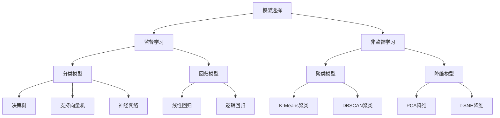
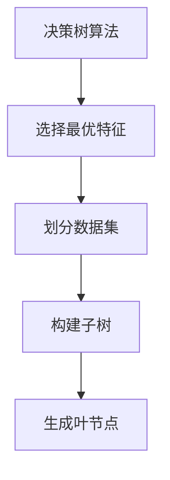
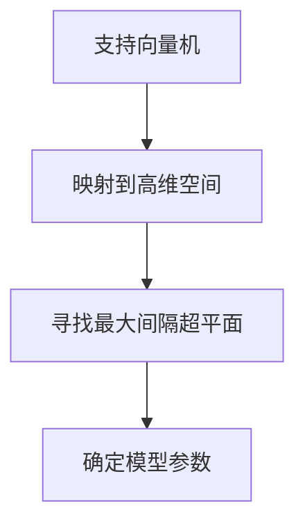
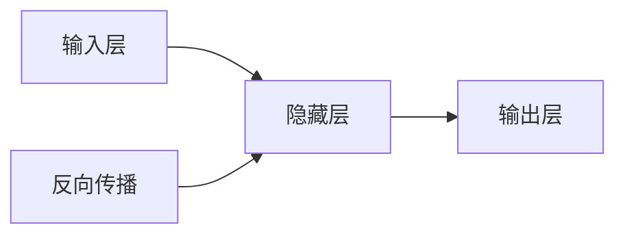
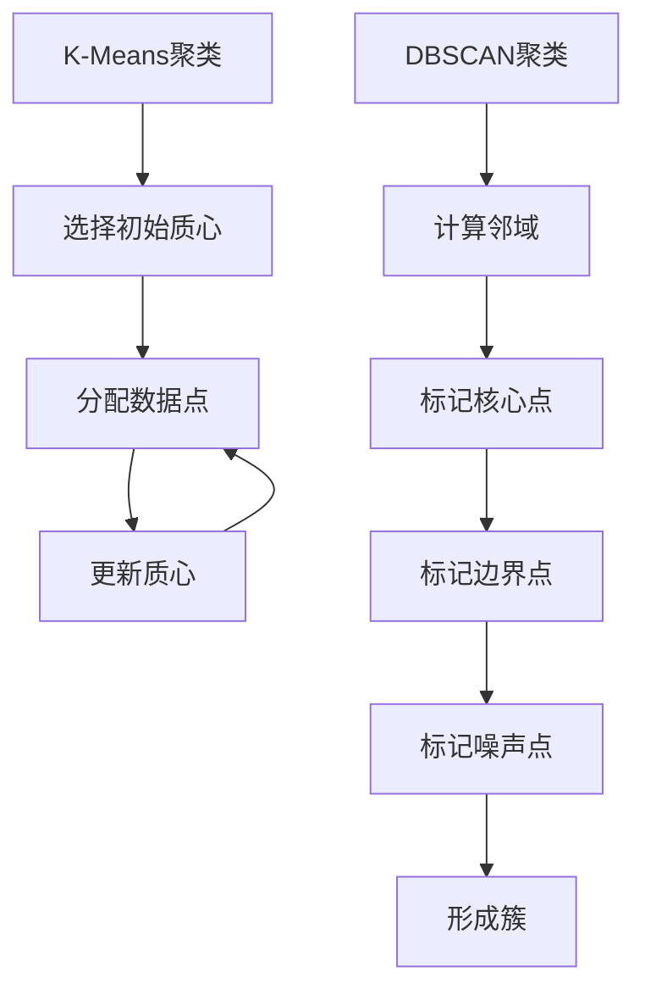

# AI模型选择原理与代码实战案例讲解

## 1. 背景介绍

在当今的数字时代,人工智能(AI)已经渗透到我们生活和工作的方方面面。从语音助手到自动驾驶汽车,从推荐系统到金融风险管理,AI技术正在彻底改变着我们的世界。然而,要真正发挥AI的威力,选择合适的AI模型至关重要。不同的问题场景需要不同的AI模型和算法,选择错误的模型可能会导致性能低下、资源浪费,甚至是灾难性的后果。

因此,了解AI模型选择的原理和实践经验就显得尤为重要。本文将深入探讨AI模型选择的关键因素、常用模型的优缺点,并通过实际案例分析,帮助读者掌握AI模型选择的技巧和最佳实践。

## 2. 核心概念与联系

在深入讨论AI模型选择之前,我们需要先了解一些核心概念和它们之间的联系。

### 2.1 监督学习与非监督学习

AI模型可以分为两大类:监督学习和非监督学习。

监督学习模型是基于已标注的训练数据进行学习的,例如图像分类、语音识别等。非监督学习模型则是从未标注的数据中自动发现隐藏的模式和结构,常用于聚类分析、降维等任务。

### 2.2 模型复杂度与偏差-方差权衡

模型复杂度是指模型对训练数据的拟合程度。复杂度过高,模型可能会过度拟合(overfitting),导致在新数据上的泛化能力差;复杂度过低,模型又可能欠拟合(underfitting),无法捕捉数据的内在规律。

偏差-方差权衡(bias-variance tradeoff)描述了模型复杂度、训练数据量和泛化能力之间的关系。一般来说,复杂模型具有较低的偏差但较高的方差,简单模型则相反。选择合适的模型复杂度是平衡偏差和方差的关键。

### 2.3 特征工程与模型选择

特征工程对于模型的性能有着重大影响。合适的特征能够提高模型的准确性和泛化能力,而不当的特征则会降低模型的效果。因此,特征工程是模型选择过程中不可或缺的一个环节。

## 3. 核心算法原理具体操作步骤

接下来,我们将介绍几种常用AI模型的核心算法原理和具体操作步骤。

### 3.1 决策树

决策树是一种常用的监督学习模型,可用于分类和回归任务。它的工作原理是通过递归地对训练数据进行划分,构建一个树状决策结构。具体步骤如下:

1. 选择最优特征,根据该特征的不同取值将数据集划分为多个子集
2. 对每个子集递归地重复上一步骤,直到满足停止条件(如子集中所有实例属于同一类别或无法进一步划分)
3. 生成决策树的叶节点,将实例分配到相应的类别或输出回归值

常用的决策树算法包括ID3、C4.5和CART等。这些算法的关键在于选择最优特征的标准,例如信息增益、信息增益比、基尼系数等。

### 3.2 支持向量机

支持向量机(SVM)是一种有监督的非线性分类模型,其核心思想是在高维空间中寻找一个超平面,将不同类别的数据分开,且与每类数据最近的实例之间的距离最大化。具体步骤如下:

1. 将数据映射到高维空间
2. 在高维空间中寻找最大间隔超平面,使其与每类数据最近的实例之间的距离最大化
3. 将超平面对应的权重向量和偏置项作为模型参数

SVM的优点是理论上有很好的解释和泛化能力,缺点是对大规模数据的计算效率较低。核函数的选择对SVM的性能也有很大影响。

### 3.3 神经网络

神经网络是一种强大的机器学习模型,具有广泛的应用场景。它的工作原理是模拟生物神经元的行为,通过层层传递和非线性变换来对输入数据进行特征提取和模式识别。具体步骤如下:

1. 初始化网络结构(输入层、隐藏层、输出层)和权重参数
2. 前向传播:输入数据经过多层非线性变换,得到输出
3. 计算损失函数,反向传播调整权重参数
4. 重复2-3步骤,直到模型收敛

常用的神经网络模型包括前馈神经网络、卷积神经网络、递归神经网络等。通过调整网络结构、激活函数、优化算法等超参数,可以提高神经网络在不同任务上的性能。

### 3.4 聚类算法

聚类是一种常用的无监督学习技术,其目标是根据数据的相似性将其划分为多个簇。下面是两种常见聚类算法的原理和步骤。

**K-Means聚类**

1. 随机选择K个初始质心
2. 将每个数据点分配到最近的质心所属的簇
3. 重新计算每个簇的质心
4. 重复2-3步骤,直到质心不再发生变化

**DBSCAN聚类**

1. 根据邻域半径ε,计算每个点的邻域
2. 将邻域点数大于minPts的点标记为核心点
3. 将与核心点相连的非核心点标记为边界点
4. 将剩余的点标记为噪声点
5. 由相连的核心点和边界点形成一个簇

聚类算法的关键在于合理设置参数(如K值、ε、minPts等)和选择合适的相似度度量方式。

## 4. 数学模型和公式详细讲解举例说明

在介绍了几种常用AI模型的算法原理之后,我们来看一下它们背后的数学模型和公式。掌握了这些公式,就能更好地理解模型的内在机理,并根据具体问题进行调优和优化。

### 4.1 线性回归

线性回归是一种常用的监督学习算法,用于预测连续型目标变量。它的数学模型如下:

$$y = w_0 + w_1x_1 + w_2x_2 + ... + w_nx_n + \epsilon$$

其中,y是目标变量,x是特征变量,w是权重系数,ε是误差项。

通过最小二乘法,可以求解出最优的权重系数w,使得残差平方和最小化:

$$\min \sum_{i=1}^{m}(y_i - (w_0 + w_1x_{i1} + ... + w_nx_{in}))^2$$

线性回归的优点是简单易解释,缺点是对于非线性数据效果不佳。

### 4.2 逻辑回归

逻辑回归是一种用于分类任务的广义线性模型。它的数学模型如下:

$$P(y=1|x) = \sigma(w_0 + w_1x_1 + ... + w_nx_n) = \frac{1}{1 + e^{-(w_0 + w_1x_1 + ... + w_nx_n)}}$$

其中,σ(z)是sigmoid函数,将线性组合的结果映射到(0,1)区间,作为预测为正例的概率。

通过最大似然估计,可以求解出最优的权重系数w,使得训练数据的似然函数最大化:

$$\max \prod_{i=1}^{m}P(y_i|x_i,w)$$

逻辑回归的优点是简单易解释,缺点是对于线性不可分的数据效果不佳。

### 4.3 决策树

决策树的核心是如何选择最优特征进行数据划分。常用的特征选择标准包括信息增益、信息增益比和基尼系数。

**信息增益**

信息增益是基于信息熵的概念,表示获得某一特征后所减少的数据不确定性。

对于离散型特征A,信息增益定义为:

$$Gain(D,A) = Ent(D) - \sum_{v=1}^{V}\frac{|D^v|}{|D|}Ent(D^v)$$

其中,D是数据集,V是特征A的取值个数,Dv是特征A取值为v的子集,Ent(D)是数据集D的信息熵。

**信息增益比**

信息增益比是对信息增益的修正,解决了信息增益对取值过多的特征的偏好。

$$Gain\_ratio(D,A) = \frac{Gain(D,A)}{IV(A)}$$

其中,IV(A)是特征A的固有值,定义为:

$$IV(A) = -\sum_{v=1}^{V}\frac{|D^v|}{|D|}\log_2\frac{|D^v|}{|D|}$$

**基尼系数**

基尼系数是另一种常用的特征选择标准,它反映了数据集的纯度。

$$Gini(D) = 1 - \sum_{k=1}^{K}p_k^2$$

其中,K是类别个数,pk是第k类的概率。

对于特征A,基尼系数为:

$$Gini\_index(D,A) = \sum_{v=1}^{V}\frac{|D^v|}{|D|}Gini(D^v)$$

### 4.4 支持向量机

支持向量机的核心思想是在高维空间中寻找一个最大间隔超平面,将不同类别的数据分开。

对于线性可分的情况,最优超平面可以通过以下公式求解:

$$\begin{align}
\min\limits_{\vec{w},b} & \frac{1}{2}\|\vec{w}\|^2\\
\text{s.t. } & y_i(\vec{w}^T\vec{x}_i + b) \geq 1, i = 1,2,...,m
\end{align}$$

其中,w是超平面的法向量,b是偏置项,m是训练样本个数。

对于线性不可分的情况,需要引入核函数K(x,y)将数据映射到高维空间,从而使其线性可分。常用的核函数包括线性核、多项式核、高斯核等。

### 4.5 K-Means聚类

K-Means聚类的目标是将n个数据点划分为K个簇,使得簇内数据点之间的平方和最小。

数学模型如下:

$$\min\limits_{S} \sum_{i=1}^{K}\sum_{x \in S_i}\|x - \mu_i\|^2$$

其中,S={S1,S2,...,SK}是数据点的簇划分,μi是第i个簇的质心。

通过迭代优化,可以求解出最优的簇划分。每一步的目标是:

$$c^{(t)} = \arg\min\limits_{c}\sum_{i=1}^{K}\sum_{x \in S_i^{(t)}}\|x - \mu_i^{(t-1)}\|^2$$

其中,c(t)是第t步的簇划分,μi(t-1)是第t-1步的第i个簇的质心。

## 5. 项目实践: 代码实例和详细解