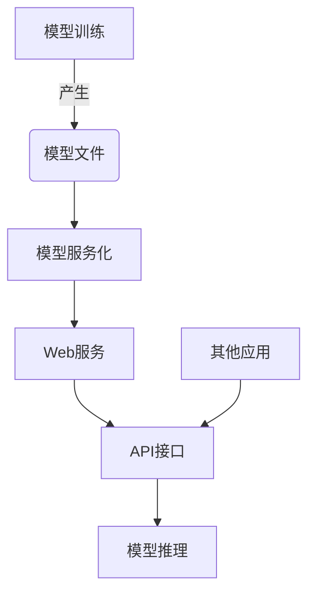

# AI模型部署到Web原理与代码实战案例讲解

## 1.背景介绍

随着人工智能技术的不断发展,越来越多的企业和组织开始将AI模型应用于实际生产环境中。然而,将训练好的AI模型成功部署到Web服务中并非一蹴而就的简单任务,它需要解决多个技术挑战。本文将全面介绍如何将AI模型部署到Web服务的原理和实践,帮助读者掌握这一重要技能。

### 1.1 AI模型部署的重要性

AI模型部署是将训练好的模型投入实际使用的关键步骤。成功的模型部署不仅可以让AI模型发挥其应有的价值,更可以帮助企业获得竞争优势。例如:

- 电子商务网站可以部署推荐系统模型,为用户提供个性化的产品推荐
- 金融机构可以部署风险评估模型,自动识别潜在的欺诈行为
- 制造业可以部署计算机视觉模型,实现自动化质检

### 1.2 AI模型部署的挑战

尽管AI模型部署的价值重大,但其过程并非易事。主要挑战包括:

- 模型格式转换:不同框架训练的模型格式不尽相同,需要转换为Web服务可接受的格式
- 资源优化:模型在Web服务环境下的计算资源消耗需要优化
- 并发处理:需要设计高效的并发策略,满足大规模请求场景
- 安全与隐私:模型部署过程中需要注意数据安全与隐私保护
- 版本管理:模型更新后如何平滑过渡至新版本

## 2.核心概念与联系

在深入讨论部署细节前,我们先了解一些核心概念及其关系。

### 2.1 模型训练与推理

AI模型的生命周期包括两个主要阶段:训练(Training)和推理(Inference)。

- 训练阶段:使用标注数据集在特定框架(如TensorFlow、PyTorch等)中训练模型,得到模型文件
- 推理阶段:使用训练好的模型文件对新数据进行预测和推理

模型部署关注的是如何将训练好的模型文件高效地部署到Web服务中,为推理阶段提供支持。

### 2.2 Web服务与API

Web服务(Web Service)是一种基于网络的软件系统,它使用标准的网络协议(如HTTP)进行数据交换。通过提供API(应用程序编程接口),其他应用可以访问Web服务提供的功能。

在AI模型部署中,我们将训练好的模型封装为Web服务,并提供API接口,使其他应用可以方便地调用模型进行推理。

### 2.3 模型服务化

模型服务化(Model Serving)是指将训练好的AI模型部署到可提供在线推理服务的系统中。它包括以下关键步骤:

1. 模型格式转换
2. 模型优化
3. 构建服务端应用
4. 部署到服务器环境
5. 提供API接口

通过模型服务化,AI模型可以高效、安全地为其他应用提供在线推理能力。

### 2.4 核心概念关系图

以下是上述核心概念的关系图:



## 3.核心算法原理具体操作步骤  

在部署AI模型到Web服务的过程中,需要完成以下核心步骤:

### 3.1 模型格式转换

由于不同深度学习框架训练的模型格式不尽相同,因此需要将模型转换为Web服务可接受的格式。常用的模型格式包括:

- ONNX (Open Neural Network Exchange)
- TensorFlow SavedModel
- TensorFlow Lite
- PyTorch TorchScript

以TensorFlow为例,可以使用以下代码将训练好的模型保存为ONNX格式:

```python
import tf2onnx

# 加载训练好的TensorFlow模型
model = ... 

# 将模型转换为ONNX格式
spec = (tf2onnx.convert.from_keras(model, opset=13))

# 保存ONNX模型文件
onnx.save_model(spec, 'model.onnx')
```

### 3.2 模型优化

为了提高模型在Web服务环境下的性能,我们需要对模型进行优化,包括:

- 模型量化(Quantization):将原始的32位浮点数模型转换为8位整数模型,减小模型大小和内存占用
- 模型剪枝(Pruning):移除模型中不重要的权重,进一步减小模型大小
- 模型融合(Fusion):将多个小操作融合为单个大操作,减少计算开销

以TensorFlow Lite为例,可以使用以下代码对模型进行优化:

```python
import tensorflow as tf

# 加载训练好的TensorFlow模型
model = ...

# 对模型进行量化
converter = tf.lite.TFLiteConverter.from_keras_model(model)
converter.optimizations = [tf.lite.Optimize.DEFAULT]
tflite_quant_model = converter.convert()

# 对模型进行剪枝
pruning_schedule = tfmot.sparsity.keras.PolynomialDecay(
    initial_sparsity=0.0, final_sparsity=0.5, begin_step=0, end_step=1000)
model_for_pruning = tfmot.sparsity.keras.prune_low_magnitude(model, pruning_schedule)

# 保存优化后的TensorFlow Lite模型
with open('optimized_model.tflite', 'wb') as f:
    f.write(tflite_quant_model)
```

### 3.3 构建服务端应用

构建服务端应用是模型部署到Web服务的核心步骤。常用的Web框架包括Flask、Django(Python)、Express(Node.js)等。

以Flask为例,我们可以构建一个简单的服务端应用:

```python
from flask import Flask, request
import onnxruntime as rt

app = Flask(__name__)

# 加载ONNX模型
sess = rt.InferenceSession('model.onnx')
input_name = sess.get_inputs()[0].name

@app.route('/predict', methods=['POST'])
def predict():
    # 获取输入数据
    input_data = request.json
    
    # 运行模型推理
    pred = sess.run(None, {input_name: input_data})[0]
    
    return {'prediction': pred.tolist()}

if __name__ == '__main__':
    app.run(host='0.0.0.0', port=5000)
```

此应用程序加载了ONNX模型,并提供了一个`/predict`端点,接收POST请求中的输入数据,运行模型推理并返回预测结果。

### 3.4 部署到服务器环境

构建好服务端应用后,我们需要将其部署到服务器环境中。常用的部署方式包括:

- 虚拟机/物理机
- 容器(Docker)
- 云服务(AWS、GCP、Azure等)

以Docker为例,我们可以创建一个Dockerfile来构建Docker镜像:

```dockerfile
FROM python:3.9

WORKDIR /app

COPY requirements.txt .
RUN pip install --no-cache-dir -r requirements.txt

COPY . .

CMD ["python", "app.py"]
```

然后使用以下命令构建并运行Docker容器:

```bash
docker build -t model-server .
docker run -p 5000:5000 model-server
```

### 3.5 提供API接口

最后一步是为Web服务提供API接口,使其他应用可以方便地访问模型推理功能。

我们可以使用API网关(如Nginx)或API管理工具(如Swagger)来管理和文档化API接口。以Swagger为例,我们可以定义API规范:

```yaml
openapi: 3.0.0
info:
  title: Model API
  version: 1.0.0

servers:
  - url: http://api.example.com/v1

paths:
  /predict:
    post:
      summary: Run model inference
      requestBody:
        required: true
        content:
          application/json:
            schema:
              $ref: '#/components/schemas/Input'
      responses:
        '200':
          description: Successful response
          content:
            application/json:
              schema:
                $ref: '#/components/schemas/Output'

components:
  schemas:
    Input:
      type: object
      properties:
        data:
          type: array
          items:
            type: number

    Output:
      type: object
      properties:
        prediction:
          type: array
          items:
            type: number
```

这个规范定义了一个`/predict`端点,接收JSON格式的输入数据,并返回JSON格式的预测结果。

通过提供标准化的API接口,其他应用可以方便地集成和调用模型推理功能。

## 4.数学模型和公式详细讲解举例说明

在AI模型部署过程中,我们通常需要对模型进行优化,以提高其在Web服务环境下的性能。常用的优化技术包括模型量化和模型剪枝。

### 4.1 模型量化

模型量化(Quantization)是将原始的32位浮点数模型转换为8位整数模型的过程。它可以显著减小模型的大小和内存占用,从而提高推理性能。

量化过程可以概括为以下步骤:

1. 计算每个张量的最小值和最大值
2. 选择合适的量化范围 $[r_{\min}, r_{\max}]$
3. 计算量化比例因子 $s = \frac{r_{\max} - r_{\min}}{2^{b} - 1}$,其中 $b$ 是量化位宽(通常为8)
4. 对每个浮点数值 $x$ 进行量化: $x_q = \mathrm{round}(\frac{x - r_{\min}}{s})$

量化后的值 $x_q$ 是一个整数,范围在 $[0, 2^{b} - 1]$ 之间。在推理时,我们需要先将 $x_q$ 反量化为浮点数,再进行计算。

反量化公式为: $x = s \times x_q + r_{\min}$

通过量化,我们可以将32位浮点数模型转换为8位整数模型,从而减小模型大小约4倍,同时保持合理的精度损失。

### 4.2 模型剪枝

模型剪枝(Pruning)是移除模型中不重要的权重的过程,它可以进一步减小模型大小,提高推理性能。

常用的剪枝方法包括:

- 权重剪枝(Weight Pruning): 移除权重绝对值较小的连接
- 神经元剪枝(Neuron Pruning): 移除输出值接近于0的神经元
- 滤波器剪枝(Filter Pruning): 移除卷积核中不重要的滤波器

以权重剪枝为例,我们可以定义一个阈值 $\theta$,将绝对值小于 $\theta$ 的权重设置为0。剪枝后的权重矩阵 $\mathbf{W}^{*}$ 可以表示为:

$$
\mathbf{W}^{*}_{i,j} = \begin{cases}
0 & \text{if } |\mathbf{W}_{i,j}| < \theta \\
\mathbf{W}_{i,j} & \text{otherwise}
\end{cases}
$$

通过剪枝,我们可以移除模型中大量冗余的权重连接,从而减小模型大小和计算开销,提高推理性能。

需要注意的是,剪枝过程可能会导致一定程度的精度损失,因此我们需要在模型大小和精度之间进行权衡。

## 5.项目实践:代码实例和详细解释说明

为了更好地理解AI模型部署到Web服务的过程,我们将通过一个实际案例进行讲解。在这个案例中,我们将部署一个图像分类模型,用于识别手写数字图像。

### 5.1 准备工作

首先,我们需要准备以下资源:

- 训练好的图像分类模型(MNIST数据集)
- Python 3.9+
- Flask Web框架
- ONNX Runtime推理引擎

我们将使用PyTorch训练一个简单的卷积神经网络模型,并将其转换为ONNX格式。你可以从 [这里](https://github.com/zhangqizhen/model-deployment-demo/blob/main/train.py) 获取训练脚本。

### 5.2 模型格式转换

使用以下代码将PyTorch模型转换为ONNX格式:

```python
import torch
import torch.onnx

# 加载PyTorch模型
model = ...

# 设置输入大小
input_shape = (1, 1, 28, 28)

# 导出ONNX模型
torch.onnx.export(
    model,
    torch.zeros(input_shape),
    "mnist.onnx",
    input_names=["input"],
    output_names=["output"],
    opset_version