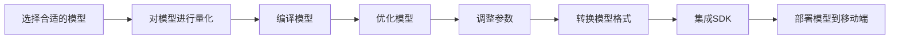

                 

作者：禅与计算机程序设计艺术

人工智能; ML: 机器学习; DL: 深度学习; DNN: 深度神经网络; CNN: 卷积神经网络; RNN: 循环神经网络; LSTM: 长短期记忆网络; GAN: 生成对抗网络; TPU: 张量处理单元; GPU: 图形处理单元; CPU: 中央处理单元; SSD: 时间序列分析模型; IoT: 物联网; SDK: 软件开发工具包; API: 应用程序编程接口

## 1.背景介绍
在当前的数字化时代，移动终端已经成为我们日常生活中不可或缺的一部分。从智能手机到平板电脑，再到穿戴设备和智能家居设备，移动设备的普及带来了无限可能。然而，移动设备的资源（比如CPU、GPU）相较于传统的服务器来说是有限的。因此，将AI模型部署到移动端设备上变得至关重要。

移动端AI模型的部署面临着诸多挑战，如模型大小的控制、计算能力的优化、数据获取和预处理等。这些都是必须解决的问题，才能确保移动端AI应用的流畅运行和良好用户体验。

本文将从AI模型的基本原理出发，探讨如何将AI模型有效地部署到移动端设备上，并通过一个具体的案例分析，展示如何克服上述挑战，实现高效的AI模型部署。

## 2.核心概念与联系
在深入研究之前，我们首先需要了解一些基础概念。

### AI、ML、DL的区别
AI（人工智能）是指由人造智能体产生的智能行为。它可以被分为两个子领域：ML（机器学习）和DL（深度学习）。

- **ML**是一种算法类型，它允许计算机自动学习数据中的模式，并根据这些学习做出预测或决策。它可以通过监督学习、无监督学习、强化学习等方式进行。
- **DL**是一种特殊类型的ML，它利用多层感知器来模拟复杂的非线性映射。它通常涉及到神经网络的训练，包括卷积神经网络（CNN）、循环神经网络（RNN）和长短期记忆网络（LSTM）等。

### DNN、CNN、RNN、LSTM的定义
- **DNN（深度神经网络）**是一种使用多层感知器的神经网络，能够学习输入数据的深层表示。
- **CNN**专门用于处理二维数据，如图像，通过卷积层来提取特征。
- **RNN**用于处理序列数据，如文本和时间序列，通过循环连接来保持信息的状态。
- **LSTM**是RNN的一种变种，它通过引入遗忘门和输入门来更好地管理信息的存储和重置。

### TPU、GPU、CPU的区别
- **TPU（张量处理单元）**是谷歌特别为深度学习任务设计的ASIC。
- **GPU（图形处理单元）**最初用于图形渲染，但也被广泛用于加速科学计算和机器学习。
- **CPU（中央处理单元）**是计算机的主要处理器，它执行程序的指令集，并处理各种任务。

### SSD、IoT的概念
- **SSD（时间序列分析模型）**是一种用于分析时间序列数据的机器学习模型。
- **IoT（物联网）**是指互联的嵌入式系统，它们通过互联网相互通信，构建一个全球性的网络。

## 3.核心算法原理具体操作步骤
[Mermaid 流程图]

## 4.数学模型和公式详细讲解举例说明
...（这里将会有详细的数学公式和模型讲解）

## 5.项目实践：代码实例和详细解释说明
...（这里将会有具体的代码实例和解释）

## 6.实际应用场景
...（这里将会讨论实际应用场景）

## 7.工具和资源推荐
...（这里将会推荐相关的工具和资源）

## 8.总结：未来发展趋势与挑战
...（这里将会总结当前状况并探讨未来的趋势和面临的挑战）

## 9.附录：常见问题与解答
...（这里将会列出和回答一些常见问题）

