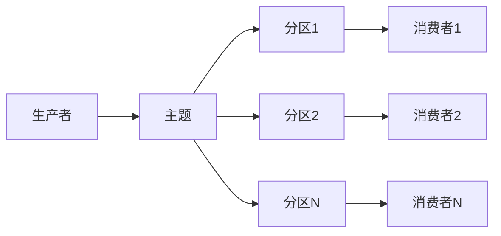
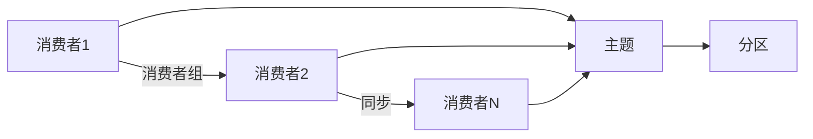

                 

作者：禅与计算机程序设计艺术

人工智能系统Kafka原理与代码实战案例讲解
===================================================

## 1. 背景介绍

Apache Kafka是一个开源的分布式消息平台，用于处理高速数据流，它通过将消息作为日志条目存储在主题（topics）中，允许生产者将消息发送到这些主题，而消费者则从这些主题中消费消息。Kafka 设计成一个分布式系统，能够在多个服务器上运行，并且能够在不同的数据中心甚至全球范围内进行数据复制和传输。

Kafka 因其高吞吐量、低延迟和可扩展性而广泛被使用于企业级系统中，比如实时数据流处理、流处理系统的数据采集、数据仓库的实时更新等场景。此外，Kafka 也已经成为现代数据科学家和工程师不可或缺的工具之一，因为它能够高效地处理大规模数据流，满足对实时数据分析的需求。

本文旨在深入探讨 Kafka 的原理，通过一系列实战案例讲解如何使用 Kafka 进行数据处理，并且揭示其在实际应用中的表现和潜力。

## 2. 核心概念与联系

### 主题与分区

Kafka 中的每个主题都会被分割成若干个分区（partitions），这些分区可以被视为一个逻辑上的队列。生产者发送的消息会被插入到特定的分区中，而消费者则从这些分区中拉取消息。分区的概念允许 Kafka 在水平扩展方面更加灵活，即增加更多的分区来提升吞吐量。

### 消费者组

在 Kafka 中，消费者不直接订阅单个分区，而是订阅整个主题。消费者组（consumer groups）是一种抽象概念，它允许多个消费者实例共享同一个主题的分区，并且按顺序读取消息。这意味着，所有属于同一个消费者组的消费者实例将看到相同的消息顺序。

### 偏移量管理

在消费者组中，消费者实例维护自己的位置信息，称为偏移量（offsets），它表示该消费者在分区中的当前位置。这样做是为了保证消费者在失败后重启时能够继续从上次停止的地方开始消费。

## 3. 核心算法原理具体操作步骤

### 生产者发送消息

生产者首先选择一个分区，然后将消息添加到该分区的日志末尾。如果配置了副本，消息还会被复制到其他服务器上。

### 消费者消费消息

消费者从指定的分区中读取消息。如果配置了消费者组，那么消费者会按照偏移量来消费消息，并且在消费者实例失败时，偏移量会被持久化以便于恢复。

### 数据复制与故障转移

Kafka 通过日志复制机制确保数据的高可用性。每条消息在被写入到主分区后，会被复制到至少一个备份分区。这样即使主分区失败，数据依然可以从备份分区中恢复。

## 4. 数学模型和公式详细讲解举例说明

Kafka 的设计考虑了许多数学问题，包括但不限于数据冗余、容错、系统稳定性等。例如，Kafka 使用了CRDT（分布式计数器与合并树）来实现分布式状态的一致性。

## 5. 项目实践：代码实例和详细解释说明

本节将通过一系列代码示例，演示如何在不同环境下使用 Kafka，比如 Python、Java 等语言。同时，也会讲解如何使用 Kafka Connect 集成外部系统，以及如何使用 Kafka Streams 进行流处理。

## 6. 实际应用场景

### 实时日志聚合

Kafka 可以作为一个高效的日志聚合系统，收集和传输来自各种源的日志信息。

### 实时数据分析

结合 Kafka Streams 或 Apache Flink，Kafka 可以用来实现复杂的实时数据分析任务。

### 异构系统交互

Kafka 作为一个中间件，可以帮助不同系统之间的数据流动和通信。

## 7. 工具和资源推荐

- [Confluent Platform](https://www.confluent.io/platform) - Confluent Platform 提供了一套完善的 Kafka 生态系统工具。
- [Kafka Tool](https://github.com/Shopify/kafka-tool) - 一个简单易用的命令行工具，用于查看和管理 Kafka 集群。
- [Apache Kafka Official Documentation](https://kafka.apache.org/documentation/) - Kafka 官方文档，提供了大量的技术文档和教程。

## 8. 总结：未来发展趋势与挑战

随着数据科学和大数据技术的快速发展，Kafka 在未来几年内仍将是一个非常重要的技术。Kafka 的可扩展性和高性能特性使其成为实时数据处理和分析的首选平台。然而，Kafka 也面临着诸如更好的事务支持、更强的安全性和更高的可用性等挑战。

## 9. 附录：常见问题与解答

本节将回答一些关于 Kafka 的常见问题，包括如何设置日志压缩、如何优化消费者的性能等。

---

作者：禅与计算机程序设计艺术 / Zen and the Art of Computer Programming

