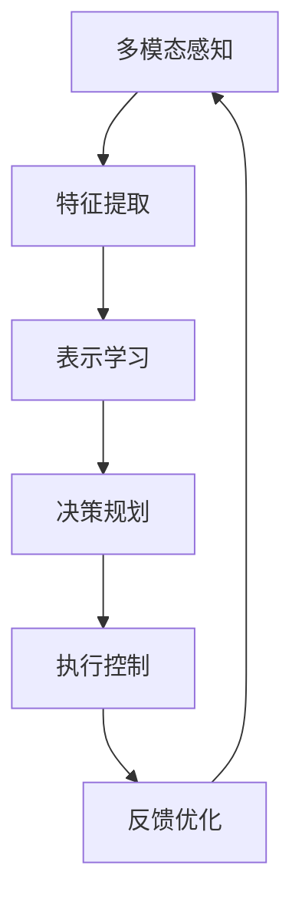

# AI系统Prometheus原理与代码实战案例讲解

## 1. 背景介绍
### 1.1 人工智能发展历程回顾
### 1.2 当前AI系统面临的机遇与挑战  
### 1.3 Prometheus系统的由来与定位

## 2. 核心概念与联系
### 2.1 Prometheus系统的核心理念
#### 2.1.1 自主学习
#### 2.1.2 持续进化 
#### 2.1.3 跨域融合
### 2.2 关键技术概览
#### 2.2.1 深度学习
#### 2.2.2 强化学习
#### 2.2.3 迁移学习
#### 2.2.4 元学习
### 2.3 技术架构设计


## 3. 核心算法原理具体操作步骤
### 3.1 自监督表示学习
#### 3.1.1 对比学习
#### 3.1.2 掩码语言建模
#### 3.1.3 自回归
### 3.2 多任务强化学习
#### 3.2.1 异步优势Actor-Critic
#### 3.2.2 分层强化学习
#### 3.2.3 好奇心驱动探索
### 3.3 持续学习
#### 3.3.1 渐进知识蒸馏
#### 3.3.2 对抗遗忘
#### 3.3.3 元持续学习
### 3.4 多智能体协作
#### 3.4.1 集中式Critic分布式Actor
#### 3.4.2 多智能体通信
#### 3.4.3 联盟学习

## 4. 数学模型和公式详细讲解举例说明
### 4.1 对比学习目标函数
$$\mathcal{L}_{contrast}=\sum_{i=1}^N-\log\frac{\exp(f_q(x_i)^\top f_k(x_i^+)/\tau)}{\sum_{j=1}^N\exp(f_q(x_i)^\top f_k(x_j)/\tau)}$$
其中$f_q$和$f_k$分别表示查询编码器和键编码器，$x_i^+$是$x_i$的正样本，$\tau$是温度超参数。该损失函数最大化了正样本对的相似度，同时最小化了负样本对的相似度。

### 4.2 异步优势Actor-Critic目标函数
$$\nabla_\theta J(\theta)=\mathbb{E}_{s_t,a_t\sim\pi_\theta}[\nabla_\theta\log\pi_\theta(a_t|s_t)A(s_t,a_t)]$$
$$A(s_t,a_t)=Q(s_t,a_t)-V(s_t)$$
其中$\pi_\theta$是参数化策略，$A(s_t,a_t)$是优势函数，$Q(s_t,a_t)$是状态-动作值函数，$V(s_t)$是状态值函数。梯度上升最大化了优势函数加权的对数似然。

### 4.3 知识蒸馏目标函数
$$\mathcal{L}_{kd}=\sum_{i=1}^N\text{KL}(p_T(y_i|x_i)||p_S(y_i|x_i))$$
其中$p_T$是教师模型的预测分布，$p_S$是学生模型的预测分布，$\text{KL}$表示KL散度。该损失函数最小化了学生模型和教师模型输出分布之间的差异。

## 5. 项目实践：代码实例和详细解释说明
### 5.1 自监督表示学习示例
```python
import torch
import torch.nn as nn

class ContrastiveLearner(nn.Module):
    def __init__(self, query_encoder, key_encoder, temperature=0.07):
        super().__init__()
        self.query_encoder = query_encoder
        self.key_encoder = key_encoder
        self.temperature = temperature
        
    def forward(self, x_q, x_k):
        q = self.query_encoder(x_q)
        k = self.key_encoder(x_k)
        logits = torch.matmul(q, k.T) / self.temperature
        labels = torch.arange(q.shape[0]).to(q.device)
        loss = nn.CrossEntropyLoss()(logits, labels)
        return loss
```
上述代码定义了一个对比学习器`ContrastiveLearner`，包含查询编码器`query_encoder`和键编码器`key_encoder`两个子模块。前向传播时，分别对查询样本`x_q`和键样本`x_k`进行编码，并计算它们的内积相似度`logits`。然后使用交叉熵损失函数比较`logits`和标签`labels`，得到对比损失。

### 5.2 异步优势Actor-Critic示例
```python
import torch
import torch.nn as nn

class A3C(nn.Module):
    def __init__(self, actor, critic):
        super().__init__()
        self.actor = actor
        self.critic = critic
        
    def forward(self, state):
        policy = self.actor(state)
        value = self.critic(state)
        return policy, value
        
    def select_action(self, state):
        policy, _ = self.forward(state)
        action = policy.sample()
        return action
    
    def compute_loss(self, state, action, reward, next_state, done):
        policy, value = self.forward(state)
        _, next_value = self.forward(next_state)
        
        log_prob = policy.log_prob(action)
        advantage = reward + (1 - done) * next_value - value
        actor_loss = -log_prob * advantage.detach()
        critic_loss = advantage.pow(2)
        
        return actor_loss + critic_loss
```
上述代码定义了一个异步优势Actor-Critic算法`A3C`，包含Actor网络`actor`和Critic网络`critic`两个子模块。`select_action`方法根据当前状态`state`采样一个动作。`compute_loss`方法计算一步的Actor-Critic损失，其中Critic损失是TD误差的平方，Actor损失是对数似然乘以优势函数。

### 5.3 知识蒸馏示例
```python
import torch
import torch.nn as nn
import torch.nn.functional as F

class KnowledgeDistiller(nn.Module):
    def __init__(self, teacher_model, student_model, temperature=1.0):
        super().__init__()
        self.teacher_model = teacher_model
        self.student_model = student_model
        self.temperature = temperature
        
    def forward(self, x):
        with torch.no_grad():
            teacher_logits = self.teacher_model(x)
        student_logits = self.student_model(x)
        
        teacher_probs = F.softmax(teacher_logits / self.temperature, dim=1)
        student_probs = F.log_softmax(student_logits / self.temperature, dim=1)
        
        loss = F.kl_div(student_probs, teacher_probs, reduction='batchmean')
        return loss
```
上述代码定义了一个知识蒸馏器`KnowledgeDistiller`，包含教师模型`teacher_model`和学生模型`student_model`两个子模块。前向传播时，首先用教师模型对输入`x`进行推理得到`teacher_logits`，然后用学生模型得到`student_logits`。接着对二者的输出施加温度缩放并计算软化的概率分布`teacher_probs`和`student_probs`，最后用KL散度度量两个分布的差异作为蒸馏损失。

## 6. 实际应用场景
### 6.1 智能助理
Prometheus可以作为智能助理，通过自主学习用户的偏好和习惯，提供个性化的服务和交互，如日程管理、信息检索、问答对话等。

### 6.2 自动驾驶
Prometheus可以应用于自动驾驶领域，通过持续学习汽车传感器数据，不断优化其感知、决策和控制能力，提高自动驾驶的安全性和鲁棒性。

### 6.3 智慧医疗
Prometheus可以辅助医疗诊断和治疗，通过学习大量医学影像、病历等数据，对疾病进行早期筛查和预测，为医生提供辅助决策支持。

### 6.4 金融风控
Prometheus可以应用于金融领域，通过分析用户的信用、交易等多维数据，构建用户画像和风险评估模型，实现智能化的信贷审批和反欺诈。

## 7. 工具和资源推荐
### 7.1 深度学习框架
- PyTorch: https://pytorch.org
- TensorFlow: https://www.tensorflow.org
- MindSpore: https://www.mindspore.cn

### 7.2 强化学习库  
- Stable Baselines3: https://github.com/DLR-RM/stable-baselines3
- RLlib: https://docs.ray.io/en/latest/rllib.html
- TianshouRL: https://github.com/thu-ml/tianshou

### 7.3 学习资源
- 《深度学习》(Goodfellow et al.) https://www.deeplearningbook.org
- 《Reinforcement Learning: An Introduction》(Sutton & Barto) http://incompleteideas.net/book/the-book.html
- CS294-112深度强化学习 http://rail.eecs.berkeley.edu/deeprlcourse  

## 8. 总结：未来发展趋势与挑战
### 8.1 探索更高效的学习范式
未来AI系统需要探索更高效、更通用的学习范式，如元学习、持续学习等，使其能够在少量数据上快速适应新任务，并在终身学习中不断积累和迁移知识。

### 8.2 提高模型的可解释性和可信性
AI系统在不断增强性能的同时，还需提高其决策过程的透明度和可解释性，让人们能够理解其内在机制，建立起对AI的信任，这对于医疗、金融等高风险应用领域尤为重要。

### 8.3 实现多智能体的协同与进化
现实世界中很多任务需要多个AI系统协同完成，因此如何实现多智能体之间的有效通信、分工与合作，并随环境变化而动态进化，是一大挑战。

### 8.4 加强AI系统的安全性和鲁棒性
AI系统在面对对抗样本攻击、数据中毒等威胁时表现出较大的脆弱性，因此需要加强AI模型的安全防御和鲁棒训练，提高其面对未知风险的适应能力。

## 9. 附录：常见问题与解答
### 9.1 Prometheus与其他AI系统的区别是什么？
Prometheus的核心特点是自主学习和持续进化，它能够通过不断与环境交互来自适应地学习新知识、优化策略，并将知识迁移到新任务中，实现从单一任务到通用智能的跨越。

### 9.2 Prometheus能否达到人类水平的智能？
目前Prometheus在特定领域的表现已经接近甚至超过人类水平，但在通用智能方面还有很大差距。未来随着算法、算力、数据等条件的进一步成熟，有望在更多任务上达到乃至超越人类智能。

### 9.3 如何权衡Prometheus的性能和效率？
Prometheus通过采用自监督学习、多任务学习、迁移学习、知识蒸馏等技术，在提高泛化性能的同时兼顾学习效率。此外还可通过模型压缩、神经架构搜索等方法进一步优化模型的速度和大小。

### 9.4 Prometheus在应用落地方面还有哪些障碍？ 
目前制约Prometheus大规模应用的因素主要包括：样本数据的获取成本高、模型训练需要大量算力、缺乏可解释性、缺少安全防御措施等。未来需在数据、算力、算法、安全等多方面持续攻关。

作者：禅与计算机程序设计艺术 / Zen and the Art of Computer Programming