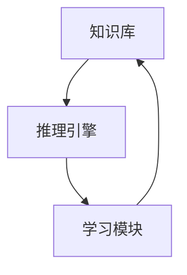

# AI系统Salt原理与代码实战案例讲解

## 1. 背景介绍
### 1.1 人工智能系统发展历史
#### 1.1.1 早期人工智能的探索
#### 1.1.2 专家系统的兴起
#### 1.1.3 机器学习的崛起
### 1.2 Salt系统的诞生
#### 1.2.1 Salt系统的起源与发展
#### 1.2.2 Salt系统的特点与优势
#### 1.2.3 Salt系统的应用前景

## 2. 核心概念与联系
### 2.1 Salt系统的核心概念
#### 2.1.1 知识表示
#### 2.1.2 推理机制
#### 2.1.3 学习算法
### 2.2 Salt系统的关键组件
#### 2.2.1 知识库
#### 2.2.2 推理引擎
#### 2.2.3 学习模块
### 2.3 Salt系统的架构设计
#### 2.3.1 分层架构
#### 2.3.2 模块化设计
#### 2.3.3 可扩展性考虑



## 3. 核心算法原理具体操作步骤
### 3.1 知识表示算法
#### 3.1.1 基于规则的知识表示
#### 3.1.2 基于框架的知识表示
#### 3.1.3 基于本体的知识表示
### 3.2 推理算法
#### 3.2.1 正向推理
#### 3.2.2 反向推理
#### 3.2.3 混合推理
### 3.3 学习算法
#### 3.3.1 监督学习
#### 3.3.2 无监督学习
#### 3.3.3 强化学习

## 4. 数学模型和公式详细讲解举例说明
### 4.1 知识表示的数学模型
#### 4.1.1 谓词逻辑表示
$$\forall x (P(x) \rightarrow Q(x))$$
#### 4.1.2 产生式规则表示 
$$IF\ condition\ THEN\ action$$
#### 4.1.3 语义网络表示
### 4.2 推理的数学模型
#### 4.2.1 基于规则的推理
$$\frac{P, P \rightarrow Q}{Q}$$
#### 4.2.2 基于概率的推理
$$P(H|E) = \frac{P(E|H)P(H)}{P(E)}$$
#### 4.2.3 基于模糊逻辑的推理
$$\mu_{A \cap B}(x) = \min(\mu_A(x), \mu_B(x))$$
### 4.3 学习的数学模型
#### 4.3.1 线性回归模型
$$y = w^Tx + b$$
#### 4.3.2 逻辑回归模型
$$P(y=1|x) = \frac{1}{1+e^{-w^Tx}}$$
#### 4.3.3 神经网络模型
$$a_j = \sigma(\sum_i w_{ij}x_i + b_j)$$

## 5. 项目实践：代码实例和详细解释说明
### 5.1 知识表示的代码实现
#### 5.1.1 规则表示的Python实现
```python
class Rule:
    def __init__(self, condition, action):
        self.condition = condition
        self.action = action
        
    def apply(self, facts):
        if self.condition(facts):
            return self.action(facts)
        else:
            return facts
```
#### 5.1.2 框架表示的Java实现
```java
class Frame {
    private String name;
    private Map<String, Object> slots;
    
    public Frame(String name) {
        this.name = name;
        this.slots = new HashMap<>();
    }
    
    public void setSlot(String slotName, Object value) {
        slots.put(slotName, value);
    }
    
    public Object getSlot(String slotName) {
        return slots.get(slotName);
    }
}
```
#### 5.1.3 本体表示的OWL示例
```xml
<owl:Class rdf:ID="Person">
  <rdfs:subClassOf rdf:resource="http://www.w3.org/2002/07/owl#Thing"/>
</owl:Class>

<owl:Class rdf:ID="Student">
  <rdfs:subClassOf rdf:resource="#Person"/>
</owl:Class>
```
### 5.2 推理的代码实现
#### 5.2.1 正向推理的Prolog实现
```prolog
fact(socrates, man).
fact(man, mortal).

rule(X, mortal) :- fact(X, man).

query(X, Property) :- fact(X, Property).
query(X, Property) :- rule(X, Property).
```
#### 5.2.2 反向推理的Lisp实现
```lisp
(defun backward-chain (goal facts rules)
  (cond ((member goal facts) t)
        (t (some #'(lambda (rule)
                     (let ((conclusion (first rule))
                           (premises (rest rule)))
                       (when (equal conclusion goal)
                         (every #'(lambda (premise)
                                    (backward-chain premise facts rules))
                                premises))))
                 rules))))
```
#### 5.2.3 模糊推理的Matlab实现
```matlab
x = 0:0.1:10;
mu_low = gaussmf(x, [2 0]);
mu_medium = gaussmf(x, [2 5]); 
mu_high = gaussmf(x, [2 10]);

input = 3;
mu_input_low = gaussmf(input, [2 0]);
mu_input_medium = gaussmf(input, [2 5]);
mu_input_high = gaussmf(input, [2 10]);

output_low = min(mu_input_low, mu_low);
output_medium = min(mu_input_medium, mu_medium);
output_high = min(mu_input_high, mu_high);

output = max(output_low, max(output_medium, output_high));
```
### 5.3 学习的代码实现 
#### 5.3.1 决策树学习的Python实现
```python
from sklearn import tree

X = [[0, 0], [1, 1]]
Y = [0, 1]
clf = tree.DecisionTreeClassifier()
clf = clf.fit(X, Y)

pred = clf.predict([[2., 2.]])
```
#### 5.3.2 支持向量机学习的Java实现
```java
import libsvm.*;

svm_problem prob = new svm_problem();
prob.l = data.length; 
prob.x = new svm_node[prob.l][];
prob.y = new double[prob.l];

for (int i = 0; i < prob.l; i++) {
    prob.x[i] = data[i];
    prob.y[i] = labels[i];
}

svm_parameter param = new svm_parameter();
param.svm_type = svm_parameter.C_SVC;
param.kernel_type = svm_parameter.RBF;
param.gamma = 0.5;
param.C = 10;

svm_model model = svm.svm_train(prob, param);
```
#### 5.3.3 深度学习的TensorFlow实现
```python
import tensorflow as tf

x = tf.placeholder(tf.float32, [None, 784])
W = tf.Variable(tf.zeros([784, 10]))
b = tf.Variable(tf.zeros([10]))
y = tf.nn.softmax(tf.matmul(x, W) + b)

y_ = tf.placeholder(tf.float32, [None, 10])
cross_entropy = tf.reduce_mean(-tf.reduce_sum(y_ * tf.log(y), reduction_indices=[1]))

train_step = tf.train.GradientDescentOptimizer(0.5).minimize(cross_entropy)

sess = tf.InteractiveSession()
tf.global_variables_initializer().run()

for _ in range(1000):
    batch_xs, batch_ys = mnist.train.next_batch(100)
    sess.run(train_step, feed_dict={x: batch_xs, y_: batch_ys})
```

## 6. 实际应用场景
### 6.1 智能问答系统
#### 6.1.1 Salt在智能客服中的应用
#### 6.1.2 Salt在知识库问答中的应用
#### 6.1.3 Salt在自然语言交互中的应用
### 6.2 专家系统
#### 6.2.1 Salt在医疗诊断系统中的应用
#### 6.2.2 Salt在故障诊断系统中的应用 
#### 6.2.3 Salt在金融决策系统中的应用
### 6.3 智能决策与规划
#### 6.3.1 Salt在智能调度系统中的应用
#### 6.3.2 Salt在自动规划系统中的应用
#### 6.3.3 Salt在博弈决策系统中的应用

## 7. 工具和资源推荐
### 7.1 Salt系统开发工具
#### 7.1.1 知识表示工具：Protégé, Fluent Editor
#### 7.1.2 推理引擎工具：Drools, Jess
#### 7.1.3 机器学习工具：Weka, Scikit-learn
### 7.2 Salt系统开源项目
#### 7.2.1 Apache Jena
#### 7.2.2 OpenCyc
#### 7.2.3 OpenKE
### 7.3 Salt系统学习资源
#### 7.3.1 相关书籍推荐
#### 7.3.2 在线课程学习
#### 7.3.3 研究论文与报告

## 8. 总结：未来发展趋势与挑战
### 8.1 Salt系统的发展趋势
#### 8.1.1 与深度学习技术的结合
#### 8.1.2 知识图谱与Salt系统的融合
#### 8.1.3 Salt系统的模块化与轻量化
### 8.2 Salt系统面临的挑战
#### 8.2.1 知识获取与管理
#### 8.2.2 推理效率与性能优化
#### 8.2.3 可解释性与可信赖性
### 8.3 Salt系统的未来展望
#### 8.3.1 人机协同智能
#### 8.3.2 跨领域知识融合
#### 8.3.3 智能系统的自主学习与进化

## 9. 附录：常见问题与解答
### 9.1 Salt系统与其他AI技术的区别？
### 9.2 如何构建Salt系统的知识库？
### 9.3 Salt系统的推理过程是怎样的？
### 9.4 Salt系统能否处理不确定性知识？
### 9.5 Salt系统的学习能力如何实现？

Salt系统作为一种经典的人工智能系统范式，融合了知识表示、推理和学习等多项关键技术，在智能问答、专家系统、智能决策等领域有广泛应用。本文从Salt系统的核心概念出发，详细阐述了其知识表示、推理和学习的原理，并结合具体算法和代码实例进行了深入讲解。此外，文章还介绍了Salt系统在实际场景中的应用案例，以及相关的开发工具和学习资源。

展望未来，Salt系统将与深度学习、知识图谱等新兴技术不断融合，进一步拓展其应用范围和性能边界。同时，Salt系统也面临着知识获取、推理效率、可解释性等方面的挑战。未来Salt系统的发展方向将是实现人机协同智能，促进跨领域知识融合，并最终实现智能系统的自主学习与进化。

作者：禅与计算机程序设计艺术 / Zen and the Art of Computer Programming