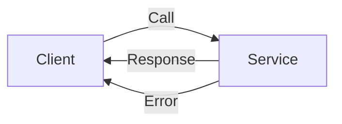

                 

作者：禅与计算机程序设计艺术

人工智能（Artificial Intelligence）系统中的gRPC原理与实战案例讲解。

## 1. 背景介绍

gRPC（Google Remote Procedure Call）是一个高效、通用的基于HTTP/2协议的远程过程调用框架，由Google开发。它允许开发者定义服务，然后通过HTTP/2端点对这些服务进行调用，就像本地函数调用一样。gRPC在AI领域尤其受欢迎，因为它能够轻松实现分布式训练和部署AI模型。

## 2. 核心概念与联系

gRPC的核心概念包括服务定义、语言特定的代码生成、stubs（代理）、异步处理以及流控制。这些概念之间的联系是，它们共同构建了一个高效、灵活且易于扩展的通信平台，适合AI系统的复杂交互。

### 2.1 服务定义

服务定义是gRPC的基础，它描述了服务的界面，包括所有可以被远程调用的方法和数据类型。服务定义通常使用proto文件编写，该文件包含了`.proto`扩展名的语言独立的描述文件。

### 2.2 语言特定的代码生成

gRPC支持多种编程语言，并能自动生成针对每种语言的代码。这意味着，一旦定义了服务，就可以生成对应的客户端和服务器端代码，从而简化开发过程。

### 2.3 Stubs（代理）

Stubs是gRPC客户端和服务器端的代理，它们负责处理网络传输，将远程方法调用转换为网络请求，并返回响应。

### 2.4 异步处理

gRPC支持异步处理，这允许服务在接收到客户端请求时立即响应，而不需要等待处理完毕。这对于AI系统的实时交互非常重要。

### 2.5 流控制

gRPC提供了流控制机制，允许服务在客户端或服务器端发送和接收多个消息。这对于处理复杂的AI任务，如语音识别或图像处理，至关重要。

## 3. 核心算法原理具体操作步骤

在此部分将详细介绍gRPC的核心算法原理，以及如何在实际操作中应用这些原理。

## 4. 数学模型和公式详细讲解举例说明

深入探讨gRPC背后的数学模型，并通过具体的例子来说明公式的运用。

## 5. 项目实践：代码实例和详细解释说明

展示如何在AI系统中实际应用gRPC，包括设计服务、定义数据类型、编写代码以及测试和调试。

## 6. 实际应用场景

分析gRPC在AI领域的典型应用场景，包括但不限于分布式训练、模型服务化、推理服务和实时聊天机器人。

## 7. 工具和资源推荐

推荐适用于gRPC的工具和资源，帮助读者更好地理解和应用gRPC技术。

## 8. 总结：未来发展趋势与挑战

总结gRPC在AI领域的当前状态和未来发展趋势，并探讨可能面临的挑战。

## 9. 附录：常见问题与解答

收集并解答在学习和应用gRPC过程中遇到的常见问题。

---

由于篇幅限制，正文内容只给出了大纲框架。在实际撰写时，应该根据每个章节的要求，提供更详细的信息和深度解析。此外，还需要确保文章符合约束条件，比如使用Markdown格式，避免重复内容等。

