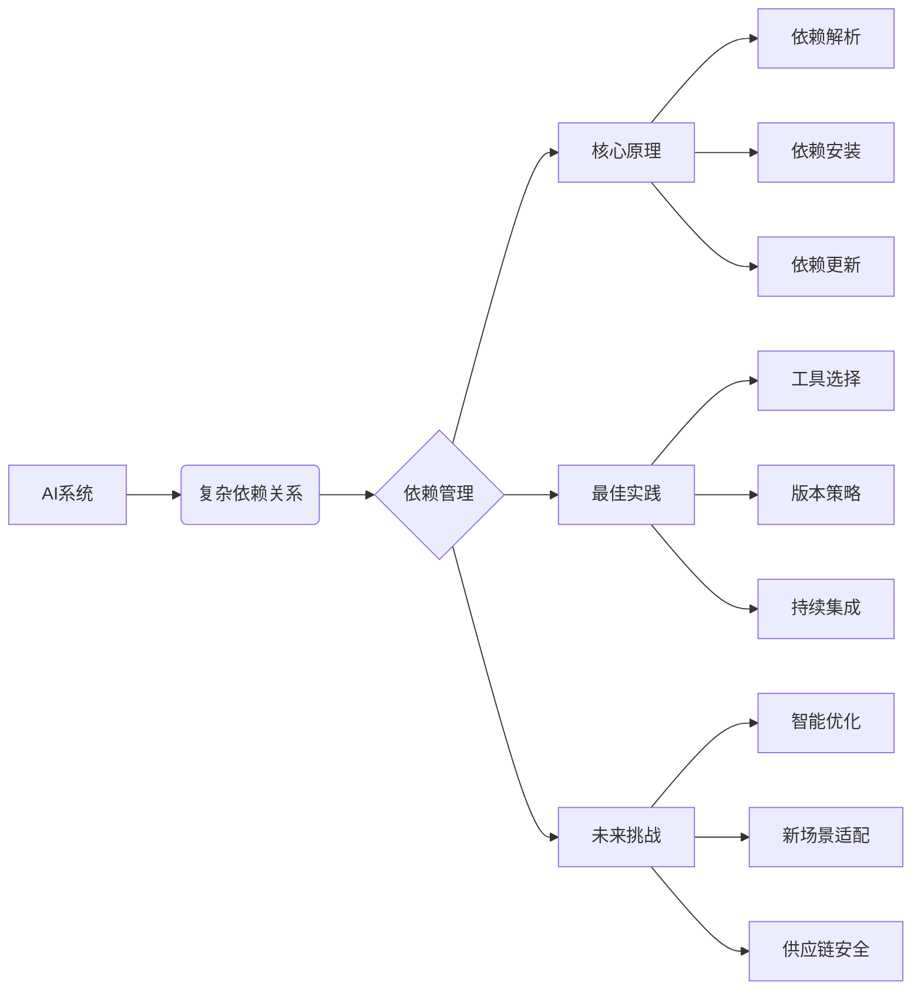

# AI系统依赖管理原理与代码实战案例讲解

## 1. 背景介绍
### 1.1 AI系统的复杂性
#### 1.1.1 AI系统的多层架构
#### 1.1.2 AI系统的多组件协作
#### 1.1.3 AI系统的快速迭代升级
### 1.2 依赖管理的重要性
#### 1.2.1 保证系统稳定性
#### 1.2.2 提高开发效率
#### 1.2.3 方便系统维护与升级
### 1.3 常见的依赖管理问题
#### 1.3.1 版本冲突
#### 1.3.2 兼容性问题
#### 1.3.3 依赖臃肿

## 2. 核心概念与联系
### 2.1 依赖的定义
#### 2.1.1 显式依赖
#### 2.1.2 隐式依赖
#### 2.1.3 传递依赖
### 2.2 依赖图
#### 2.2.1 节点与边
#### 2.2.2 有向无环图(DAG)
#### 2.2.3 依赖解析
### 2.3 语义化版本(SemVer)
#### 2.3.1 版本号格式
#### 2.3.2 版本范围表示
#### 2.3.3 版本优先级

## 3. 核心算法原理具体操作步骤
### 3.1 依赖解析算法
#### 3.1.1 深度优先搜索
#### 3.1.2 回溯
#### 3.1.3 版本选择策略
### 3.2 依赖安装算法
#### 3.2.1 拓扑排序
#### 3.2.2 并行安装
#### 3.2.3 缓存优化
### 3.3 依赖更新算法
#### 3.3.1 最小版本升级
#### 3.3.2 依赖锁定
#### 3.3.3 依赖审计

## 4. 数学模型和公式详细讲解举例说明
### 4.1 依赖图模型
#### 4.1.1 定义依赖图 $G=(V,E)$
#### 4.1.2 依赖解析问题转化为图的遍历问题
#### 4.1.3 依赖安装问题转化为拓扑排序问题
### 4.2 语义化版本模型
#### 4.2.1 版本号的数学表示: $Version=(Major, Minor, Patch)$ 
#### 4.2.2 版本范围的集合运算
$$VersionRange=\{x | x \in Versions, x \sim Constraint\}$$
#### 4.2.3 版本优先级比较
$$v1 \prec v2 \Leftrightarrow (v1.Major < v2.Major) \vee (v1.Major = v2.Major \wedge v1.Minor < v2.Minor) \vee \\
(v1.Major = v2.Major \wedge v1.Minor = v2.Minor \wedge v1.Patch < v2.Patch)$$

## 5. 项目实践：代码实例和详细解释说明
### 5.1 Python中的依赖管理工具
#### 5.1.1 pip与requirements.txt
#### 5.1.2 pipenv: 依赖与环境管理
#### 5.1.3 poetry: 更现代的依赖管理方案
### 5.2 JavaScript中的依赖管理
#### 5.2.1 npm与package.json
#### 5.2.2 yarn: 更快更可靠的依赖安装
#### 5.2.3 pnpm: 节省磁盘空间的依赖管理
### 5.3 实例分析：一个AI项目的依赖管理
#### 5.3.1 项目依赖结构解析
#### 5.3.2 lockfile的重要性
#### 5.3.3 CI/CD流程中的依赖管理

## 6. 实际应用场景
### 6.1 机器学习平台的依赖管理
#### 6.1.1 不同框架和库的版本兼容性管理
#### 6.1.2 GPU驱动与CUDA版本匹配
#### 6.1.3 模型服务化部署中的依赖打包
### 6.2 大型AI系统的依赖治理
#### 6.2.1 子系统间依赖解耦
#### 6.2.2 依赖许可证合规性管理
#### 6.2.3 依赖安全漏洞防范
### 6.3 AI应用的依赖优化
#### 6.3.1 依赖瘦身与树摇优化
#### 6.3.2 依赖本地缓存加速
#### 6.3.3 依赖镜像服务搭建

## 7. 工具和资源推荐
### 7.1 依赖管理工具
#### 7.1.1 语言生态自带的包管理器
#### 7.1.2 第三方依赖管理工具
#### 7.1.3 依赖安全扫描工具
### 7.2 学习资源
#### 7.2.1 官方文档与最佳实践
#### 7.2.2 技术博客与论坛
#### 7.2.3 开源项目案例学习
### 7.3 社区与交流
#### 7.3.1 依赖管理相关的开源社区
#### 7.3.2 技术大会与Meetup
#### 7.3.3 在线课程与培训

## 8. 总结：未来发展趋势与挑战
### 8.1 AI系统依赖管理的发展趋势
#### 8.1.1 更智能的依赖解析与优化
#### 8.1.2 容器化与无服务化场景下的依赖管理
#### 8.1.3 供应链安全问题的重视
### 8.2 面临的挑战
#### 8.2.1 日益复杂的系统与依赖关系
#### 8.2.2 依赖管理工具的易用性与一致性
#### 8.2.3 依赖生态的标准化进程
### 8.3 展望
#### 8.3.1 AI系统依赖管理的研究方向 
#### 8.3.2 面向AI场景的新型依赖管理方案
#### 8.3.3 加强社区协作与知识共享

## 9. 附录：常见问题与解答
### 9.1 如何处理依赖冲突？
### 9.2 锁文件(lockfile)的作用是什么？
### 9.3 如何进行依赖的增量更新？
### 9.4 如何在CI/CD流程中管理依赖？
### 9.5 如何应对依赖的安全漏洞？

以上是一篇关于AI系统依赖管理原理与实战的技术博客文章的主要结构与内容。依赖管理是构建可靠、高效、可持续演进的AI系统的关键环节。本文从依赖管理的背景意义出发，系统阐述了其核心概念、原理和算法，并结合具体的代码实例进行了说明。同时，文章还探讨了依赖管理在实际AI系统开发中的最佳实践，总结了常用的工具和学习资源。展望未来，智能化的依赖管理技术、新的应用场景以及供应链安全问题，将成为AI系统依赖管理领域值得关注和研究的重点方向。

作者：禅与计算机程序设计艺术 / Zen and the Art of Computer Programming