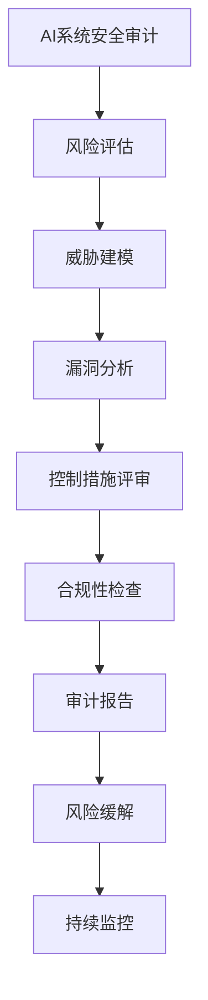

# AI系统安全审计原理与代码实战案例讲解

## 1.背景介绍

随着人工智能(AI)系统在各行业的广泛应用,确保这些系统的安全性和可靠性变得至关重要。AI系统安全审计是一种评估和验证AI系统在设计、开发和部署过程中所遵循的安全实践和控制措施的过程。它旨在识别潜在的安全漏洞、隐私风险和合规性问题,并提供改进建议。

近年来,由于AI系统的复杂性和不透明性,以及它们处理敏感数据的能力,安全审计变得更加重要。AI系统可能会受到各种威胁的影响,例如对抗性攻击、数据污染、模型提取和模型反转等。这些威胁可能会导致系统故障、数据泄露或被滥用于非法目的。

因此,AI系统安全审计不仅关注传统的网络和系统安全问题,还需要考虑AI特有的挑战,如算法偏差、数据质量、模型可解释性和伦理问题。通过全面的安全审计,组织可以评估其AI系统的整体安全状况,并采取必要的缓解措施来降低风险。

### Mermaid流程图:AI系统安全审计过程



## 2.核心概念与联系

### 2.1 AI系统安全

AI系统安全是指确保AI系统在整个生命周期中(包括设计、开发、部署和运行)的安全性和可靠性。它涉及多个方面,包括:

- **数据安全**: 保护训练数据和模型输入数据的机密性、完整性和可用性。
- **模型安全**: 防止对AI模型进行对抗性攻击、模型提取和模型反转等攻击。
- **系统安全**: 确保AI系统的基础架构(如硬件、软件和网络)的安全性。
- **隐私保护**: 保护个人数据隐私,并遵守相关的隐私法规和标准。
- **伦理和公平性**: 确保AI系统在决策过程中公平、透明和不存在偏见。

### 2.2 安全审计

安全审计是一种独立的评估过程,旨在评估组织的安全控制措施是否有效并符合相关标准和法规要求。它通常包括以下步骤:

1. **风险评估**: 识别和评估潜在的安全风险。
2. **控制评审**: 评估现有的安全控制措施是否足够和有效。
3. **合规性检查**: 验证组织是否符合相关的法律、法规和行业标准。
4. **审计报告**: 总结审计结果,提供改进建议。

### 2.3 AI系统安全审计

AI系统安全审计是将安全审计的概念和方法应用于AI系统的过程。它旨在评估AI系统在整个生命周期中所采用的安全实践和控制措施,并提供改进建议。AI系统安全审计需要考虑AI特有的安全挑战,如算法偏差、数据质量、模型可解释性和伦理问题等。

## 3.核心算法原理具体操作步骤

AI系统安全审计过程通常包括以下几个核心步骤:

### 3.1 风险评估

风险评估是安全审计的第一步,旨在识别和评估与AI系统相关的潜在安全风险。这个过程包括:

1. **资产识别**: 确定需要保护的关键资产,如训练数据、模型、基础设施等。
2. **威胁建模**: 识别可能对AI系统造成损害的威胁源,如对抗性攻击、数据污染、内部威胁等。
3. **漏洞分析**: 评估AI系统中存在的安全漏洞,如数据质量问题、算法偏差、缺乏可解释性等。
4. **风险评估**: 根据资产价值、威胁可能性和漏洞影响程度,评估每个风险的严重程度。

### 3.2 控制评审

控制评审旨在评估现有的安全控制措施是否足够和有效。这个过程包括:

1. **控制识别**: 确定与AI系统相关的安全控制措施,如数据加密、访问控制、模型监控等。
2. **控制测试**: 测试每个控制措施的有效性,确定它们是否按预期运行。
3. **缺陷识别**: 识别现有控制措施中的任何缺陷或不足之处。

### 3.3 合规性检查

合规性检查旨在确保AI系统符合相关的法律、法规和行业标准。这个过程包括:

1. **法规识别**: 确定适用于AI系统的法律、法规和标准,如隐私法、AI伦理准则等。
2. **合规性评估**: 评估AI系统是否符合这些法规和标准的要求。
3. **差距分析**: 识别任何合规性差距,并提供解决方案。

### 3.4 审计报告

审计报告是安全审计过程的最终产出,它总结了审计结果并提供改进建议。报告通常包括:

1. **执行摘要**: 概述审计范围、目标和主要发现。
2. **风险评估结果**: 详细描述识别出的安全风险及其严重程度。
3. **控制评审结果**: 列出现有控制措施的有效性和缺陷。
4. **合规性检查结果**: 描述任何合规性差距及其影响。
5. **改进建议**: 提供具体的建议,以缓解识别出的风险和缺陷。

### 3.5 风险缓解

根据审计报告中的改进建议,组织应采取适当的行动来缓解识别出的安全风险。这可能包括:

1. **实施新的控制措施**: 引入新的安全控制措施来解决发现的漏洞和缺陷。
2. **加强现有控制措施**: 改进和加强现有的安全控制措施,以提高其有效性。
3. **培训和意识提高**: 为员工提供培训,提高他们对AI系统安全风险和最佳实践的认识。

### 3.6 持续监控

安全审计是一个持续的过程,需要定期重复,以确保AI系统的安全性能够与时俱进。持续监控包括:

1. **监控控制措施**: 持续监控安全控制措施的有效性,并及时发现和解决任何新出现的问题。
2. **威胁情报**: 跟踪最新的威胁趋势和攻击技术,以更新威胁建模和风险评估。
3. **合规性更新**: 持续审查相关法律、法规和标准的变化,并相应地更新合规性要求。

## 4.数学模型和公式详细讲解举例说明

在AI系统安全审计中,数学模型和公式可用于量化和评估风险,并指导决策过程。以下是一些常见的数学模型和公式:

### 4.1 风险计算公式

风险通常被定义为威胁发生的可能性与其潜在影响的乘积。可以使用以下公式来计算风险值:

$$\text{Risk} = \text{Likelihood} \times \text{Impact}$$

其中:

- $\text{Risk}$ 表示风险值,通常在0到1之间。
- $\text{Likelihood}$ 表示威胁发生的可能性,通常在0到1之间。
- $\text{Impact}$ 表示威胁发生时的潜在影响,通常在0到1之间。

例如,如果某个威胁发生的可能性为0.3,且其潜在影响为0.8,则该威胁的风险值为:

$$\text{Risk} = 0.3 \times 0.8 = 0.24$$

### 4.2 对抗性攻击模型

对抗性攻击是指针对AI模型的输入数据进行精心设计的扰动,以误导模型做出错误的预测。一种常见的对抗性攻击模型是快速梯度符号法(Fast Gradient Sign Method, FGSM),它通过计算损失函数关于输入数据的梯度来生成对抗性扰动。

对于输入数据 $x$ 和目标模型 $f$,FGSM生成的对抗性样本 $x'$ 可以表示为:

$$x' = x + \epsilon \cdot \text{sign}(\nabla_x J(x, y_\text{true}))$$

其中:

- $\epsilon$ 是扰动的强度。
- $y_\text{true}$ 是输入数据 $x$ 的真实标签。
- $J(x, y_\text{true})$ 是模型的损失函数。
- $\nabla_x J(x, y_\text{true})$ 是损失函数关于输入数据 $x$ 的梯度。

通过将扰动添加到原始输入数据中,FGSM可以生成对抗性样本,从而欺骗模型做出错误的预测。

### 4.3 隐私保护模型

差分隐私(Differential Privacy)是一种用于保护个人隐私的数学框架,它可以量化隐私泄露的风险。在差分隐私中,隐私损失被测量为两个相邻数据集之间的最大对数似然比。

对于任意两个相邻数据集 $D$ 和 $D'$(它们只相差一个记录),以及任意算法 $\mathcal{A}$,如果满足:

$$\Pr[\mathcal{A}(D) \in S] \leq e^\epsilon \Pr[\mathcal{A}(D') \in S] + \delta$$

则算法 $\mathcal{A}$ 被称为 $(\epsilon, \delta)$-差分隐私,其中:

- $\epsilon$ 是隐私损失参数,值越小隐私保护越强。
- $\delta$ 是隐私损失的概率上界,通常设置为一个很小的值。

差分隐私可以通过添加校准噪声来实现,例如在机器学习模型的梯度更新过程中添加高斯噪声。

这些数学模型和公式为AI系统安全审计提供了量化和评估风险的工具,有助于指导决策过程并采取适当的缓解措施。

## 5.项目实践:代码实例和详细解释说明

在本节中,我们将通过一个实际的代码示例来演示如何对AI系统进行安全审计。我们将使用Python编程语言和一些常用的机器学习库,如NumPy、Scikit-learn和TensorFlow。

### 5.1 项目概述

我们将构建一个简单的图像分类模型,用于识别手写数字。然后,我们将对该模型进行安全审计,包括对抗性攻击测试、隐私泄露评估和算法偏差检测。

### 5.2 数据准备

首先,我们需要导入所需的库并加载数据集。在这个示例中,我们将使用MNIST手写数字数据集。

```python
import numpy as np
from tensorflow import keras
from tensorflow.keras.datasets import mnist

# 加载MNIST数据集
(x_train, y_train), (x_test, y_test) = mnist.load_data()

# 数据预处理
x_train = x_train.reshape(-1, 28, 28, 1) / 255.0
x_test = x_test.reshape(-1, 28, 28, 1) / 255.0
```

### 5.3 构建模型

接下来,我们将构建一个简单的卷积神经网络(CNN)模型用于图像分类。

```python
from tensorflow.keras.models import Sequential
from tensorflow.keras.layers import Conv2D, MaxPooling2D, Flatten, Dense

# 构建CNN模型
model = Sequential([
    Conv2D(32, (3, 3), activation='relu', input_shape=(28, 28, 1)),
    MaxPooling2D((2, 2)),
    Conv2D(64, (3, 3), activation='relu'),
    MaxPooling2D((2, 2)),
    Flatten(),
    Dense(64, activation='relu'),
    Dense(10, activation='softmax')
])

# 编译模型
model.compile(optimizer='adam',
              loss='sparse_categorical_crossentropy',
              metrics=['accuracy'])

# 训练模型
model.fit(x_train, y_train, epochs=5, validation_data=(x_test, y_test))
```

### 5.4 对抗性攻击测试

我们将使用FGSM算法生成对抗性样本,并评估模型在这些样本上的性能。

```python
from tensorflow.keras.losses import sparse_categorical_crossentropy
from tensorflow.keras.backend import categorical_crossentropy

# 生成对抗性样本
eps = 0.3  # 扰动强度
loss_fn = categorical_crossentropy
x_adv = x_test + eps * np.sign(np.gradient(loss_fn