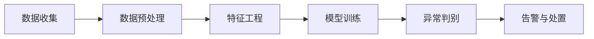

# AI系统异常检测原理与代码实战案例讲解

## 1. 背景介绍
### 1.1 AI系统异常检测的重要性
在当今高度互联和自动化的世界中,人工智能(AI)系统在各个领域发挥着越来越重要的作用。从自动驾驶汽车到智能家居设备,从医疗诊断系统到金融交易平台,AI正在深刻地改变着我们的生活和工作方式。然而,随着AI系统变得日益复杂和关键,异常检测和故障诊断也成为了一个至关重要的课题。
  
AI系统异常可能导致严重的后果,例如自动驾驶汽车的错误决策可能危及乘客和行人的生命安全,医疗诊断系统的误判可能延误病情或造成医疗事故,金融交易系统的故障可能引发市场动荡和经济损失。因此,及时准确地检测和定位AI系统的异常行为,对于保障系统的可靠性、安全性和稳定性具有重大意义。

### 1.2 异常检测的技术挑战
AI系统异常检测面临着诸多技术挑战:
1. AI系统的黑盒特性:许多AI模型,尤其是深度学习模型,其内部决策机制高度复杂和不透明,难以解释和理解,这使得异常检测和根因分析变得困难。  
2. 异常行为的多样性:AI系统的异常可能表现为各种形式,例如输出错误、响应时间延迟、资源占用异常等,需要综合考虑多个指标和维度。
3. 正常行为的变化:AI系统所处的环境是动态变化的,用户的行为模式也可能随时间演化,因此正常行为的基准也在不断变化,异常检测算法需要能够自适应。
4. 缺乏异常样本:现实中的异常情况是小概率事件,异常样本通常很稀疏,给异常检测模型的训练带来困难。
5. 实时性要求:许多AI系统需要实时检测异常并及时响应,对计算效率提出了很高的要求。

### 1.3 异常检测的主要方法
异常检测技术大致可分为以下几类:
1. 基于统计的方法:通过对系统行为的统计建模,使用概率密度估计、假设检验等方法判别异常。
2. 基于距离的方法:假设正常样本聚集在一起,异常样本与之相距较远,通过度量样本之间的距离来识别异常。
3. 基于分类的方法:将异常检测看作一个二分类问题,用正常样本训练一个分类器,将偏离分类边界的样本识别为异常。 
4. 基于聚类的方法:将数据划分为多个簇,不属于任何一个簇的样本被视为异常。
5. 基于信号处理的方法:将系统行为数据看作时间序列信号,采用信号处理的技术进行异常检测。

## 2. 核心概念与联系
### 2.1 异常的定义与分类
异常(Anomaly),也称为离群点(Outlier),是指明显偏离其他数据的个体,通常表现为罕见的、意外的、可疑的行为或测量值。按照异常的成因和表现,可以分为以下三类:
1. 点异常(Point Anomaly):单个数据实例本身偏离正常范围,与其他数据格格不入。如网络入侵、欺诈交易等。
2. 上下文异常(Contextual Anomaly):数据实例在特定上下文中显得反常,但放在其他上下文可能是正常的。如夏天的低温,节假日的高峰流量等。
3. 集合异常(Collective Anomaly):单个数据本身可能正常,但一个集合整体表现出异常性。如网络中的DDoS攻击,由大量正常请求汇聚形成。

### 2.2 异常检测的一般流程
异常检测通常包括以下几个步骤:
1. 数据收集:从系统和环境中采集各种监测数据,包括系统日志、性能指标、用户行为等。
2. 数据预处理:清洗噪声数据,处理缺失值,对数据进行归一化、标准化等转换。  
3. 特征工程:从原始数据中提取和选择最能反映系统状态和行为特点的关键特征。
4. 模型训练:选择适当的异常检测算法,用已有数据对模型进行训练,学习正常行为模式。
5. 异常判别:用训练好的模型对新的数据进行打分,根据异常分数设定阈值,超过阈值的判为异常。
6. 告警与处置:发出异常告警,提示人工介入或触发自动处置流程,进行故障诊断与恢复。

### 2.3 异常检测与其他相关概念
异常检测与其他一些概念和任务有密切联系,但又有所区别:
1. 异常检测与故障检测:异常检测更关注从数据中发现反常模式,故障检测则侧重验证系统是否满足预定的规格和属性。
2. 异常检测与新颖性检测:新颖性检测是寻找以前没见过的新事物,异常检测则着眼于找出罕见的、出人意料的反常情况。
3. 异常检测与噪声去除:噪声去除是为了数据清洗,将噪声视为无用信息去除,异常检测则把异常作为有价值的信息挖掘出来。
4. 异常检测与稀疏类检测:稀疏类检测针对的是类别分布不平衡问题,把稀疏类作为正类进行有针对性的学习,异常检测则通常只用正常数据训练。

## 3. 核心算法原理与操作步骤
本节选取基于重构误差的自编码器异常检测算法进行重点讲解。自编码器(Autoencoder)是一种无监督学习的神经网络,由编码器(Encoder)和解码器(Decoder)两部分组成。其基本思想是,用编码器将输入数据压缩到一个低维表示,再用解码器从低维表示重构出原始输入,并以重构误差作为异常分数。

### 3.1 自编码器的网络结构
自编码器的网络结构如下图所示:

- 输入层:接收原始的高维数据。
- 编码器隐藏层:通过多层非线性变换,将输入数据转换为低维表示。
- 编码器输出层:输出压缩后的低维特征向量。
- 解码器隐藏层:将低维特征还原为高维表示。
- 解码器输出层:输出重构后的数据,与原始输入形状相同。

编码器和解码器可采用对称结构,即层数和神经元数相同。隐藏层使用ReLU等非线性激活函数,输出层根据数据类型选择恰当的激活函数,如sigmoid(二值数据)或线性函数(连续数据)。

### 3.2 模型训练
自编码器的训练样本只包含正常数据。训练时,将原始数据 $x$ 输入编码器,得到特征表示 $z$,再将 $z$ 输入解码器重构出 $\hat{x}$,优化目标是最小化重构误差:

$$L(x,\hat{x}) = \frac{1}{n} \sum^n_{i=1} (x_i-\hat{x}_i)^2$$

其中 $n$ 为样本数。这实际上是在学习一个恒等映射 $f(x)=x$,但数据在中间要经过一个信息瓶颈(编码器输出的低维层),这迫使自编码器学习到数据的高阶特征和内在规律。

### 3.3 异常评分
训练好的自编码器可将数据重构误差作为异常分数,误差越大说明样本越可能是异常。对于一个输入样本 $x$,其异常分数定义为:

$$s(x) = \|x-\hat{x}\|^2 = \|x-f(x)\|^2$$

其中 $f(x)$ 表示自编码器的重构函数。异常分数反映了样本偏离正常模式的程度。

### 3.4 阈值选择与异常判别
为判定一个样本是否异常,需要设定一个异常阈值 $\theta$。给定阈值后的异常判别规则为:

$$
\begin{cases}
s(x) > \theta & \text{异常} \\
s(x) \leq \theta & \text{正常}
\end{cases}
$$

阈值的选取需要平衡异常的召回率和误报率,可采用如下启发式方法:
1. 使用验证集(或测试集)计算所有样本的异常分数。
2. 根据异常分数的分布,如假设服从高斯分布,选取 $\mu+3\sigma$ 作为阈值,其中 $\mu$ 和 $\sigma$ 分别为均值和标准差。
3. 在一定范围内网格搜索阈值,绘制异常检测的PR曲线,以AUC等指标评估,选择最优阈值。

### 3.5 算法总结
基于自编码器的异常检测算法可总结为:
1. 准备只包含正常样本的训练集。
2. 设计编码器和解码器的网络结构。
3. 训练自编码器最小化重构误差。
4. 用训练好的自编码器对新样本计算重构误差作为异常分数。
5. 选取合适的阈值,根据异常分数判别样本是否异常。

自编码器学习到正常数据的共同模式,对异常样本的重构误差较大,因此可基于重构误差有效地检测异常。

## 4. 数学模型与公式推导
本节对自编码器异常检测中的几个关键数学模型进行详细推导。

### 4.1 重构误差的概率解释
样本 $x$ 的重构误差 $\|x-\hat{x}\|^2$ 可以看作 $x$ 在自编码器定义的正常数据流形 $\mathcal{M}$ 上的投影误差。假设 $x$ 服从某个概率分布 $p^*(x)$,而自编码器学到的分布为 $p(x)$,则重构误差可以解释为这两个分布之间的差异:

$$\mathbb{E}_{x \sim p^*(x)} \|x-\hat{x}\|^2 = \mathbb{E}_{x \sim p^*(x)} \|x-f(x)\|^2 \approx \int p^*(x) \log \frac{p^*(x)}{p(x)} dx = D_{KL}(p^*\|p)$$

其中 $D_{KL}$ 表示KL散度,刻画了两个概率分布的差异。这说明最小化重构误差等价于最小化真实分布与学习分布之间的KL散度,即自编码器在学习数据的真实分布。

### 4.2 重构误差的矩阵分解解释
设输入数据矩阵为 $X \in \mathbb{R}^{m \times n}$,其中 $m$ 为样本数,$n$ 为特征数。自编码器的编码矩阵为 $W_1 \in \mathbb{R}^{n \times d}$,解码矩阵为 $W_2 \in \mathbb{R}^{d \times n}$,其中 $d$ 为压缩表示的维度,且 $d < n$。令 $Z=XW_1$ 表示编码结果,$\hat{X}=ZW_2$ 表示重构结果,则整个过程可表示为矩阵分解:

$$X \approx \hat{X} = XW_1W_2$$

其中 $W_1W_2$ 可视为 $X$ 的一个低秩近似。重构误差可改写为:

$$\|X-\hat{X}\|_F^2 = \|X-XW_1W_2\|_F^2$$

其中 $\|\cdot\|_F$ 表示矩阵的Frobenius范数。上式即为低秩矩阵分解的目标函数,说明自编码器本质上在学习数据的低秩结构。

### 4.3 重构误差的流形学习解释
从流形学习的角度,高维数据通常近似地分布在一个低维流形上。自编码器相当于学习了一个从高维到低维的编码映射 $f_{enc}$